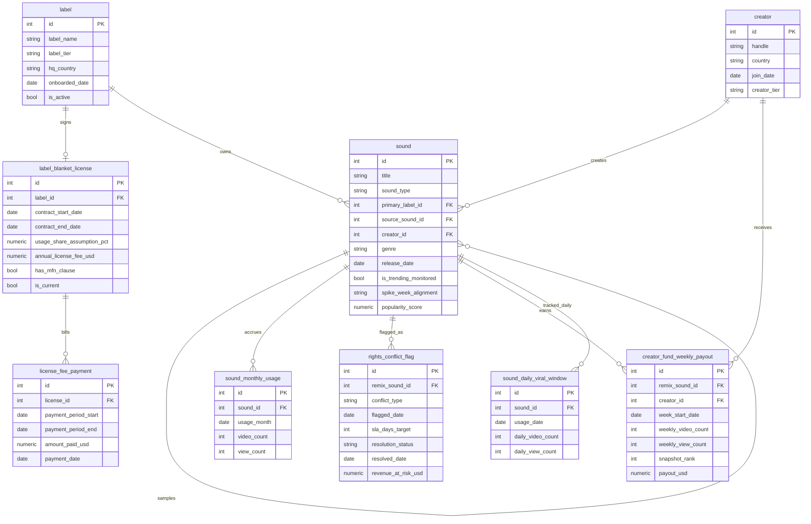

> For business context, industry background, and terminology, see `01-social_media_music_blanket_licensing_medium_business_context.md`. This document describes the data only.

# ER Document

## 1. Dataset Metadata

- **Complexity**: Medium
- **Table count**: 9 tables
- **Total rows (approx.)**: 24,900 rows
- **Foreign key relationships**: 10 FKs (including 1 self-referencing FK: `sound.source_sound_id → sound.id`)
- **Scope rules not enforceable via DDL**: see Section 5, "Data Generation Rules"
- **REFERENCE_DATE**: `2026-06-30` (consistent with the business context document and the SQL query document)

---

## 2. Mermaid ER Diagram



---

## 3. Table-by-Table Notes

### 1. label

**Business meaning**: The record labels and aggregator/distributors ReelWave has signed blanket license deals with. This is the "roster" the Rights & Licensing Compliance team maintains, and the Head of Label Relations cares about each partner's tier and active status here.

| Column | Type | Constraint | Description |
|------|------|------|------|
| id | INTEGER | PK | Label ID |
| label_name | VARCHAR(150) | NOT NULL, UNIQUE | Fictional label/aggregator name |
| label_tier | VARCHAR(20) | NOT NULL | `major` (large multinational label) / `mid_size` (mid-sized label) / `indie_aggregator` (independent aggregator/distributor) |
| hq_country | VARCHAR(20) | NOT NULL | Headquarters country: `US` or `Canada` |
| onboarded_date | DATE | NOT NULL | Date the label first became a ReelWave partner (earlier than the blanket license contract start date) |
| is_active | BOOLEAN | NOT NULL | Whether the label is still an active partner; all rows are `TRUE` in this dataset |

**Foreign keys**: none (top-level table)

**Sample data**:

| id | label_name | label_tier | hq_country | onboarded_date | is_active |
|----|------------|------------|------------|-----------------|-----------|
| 1 | Titan Sound Group | major | US | 2020-03-10 | 1 |
| 4 | Northline Aggregator | indie_aggregator | US | 2025-08-01 | 1 |
| 9 | Cascade Harmonic Group | major | Canada | 2020-11-02 | 1 |

---

### 2. creator

**Business meaning**: Ordinary creators on ReelWave who publish UGC remixes and are eligible for Creator Fund payouts. The Creator Fund Program Manager uses this table to understand the creator mix (top, mid, long tail).

| Column | Type | Constraint | Description |
|------|------|------|------|
| id | INTEGER | PK | Creator ID |
| handle | VARCHAR(50) | NOT NULL, UNIQUE | Creator account handle |
| country | VARCHAR(20) | NOT NULL | `US` or `Canada` |
| join_date | DATE | NOT NULL | Signup date |
| creator_tier | VARCHAR(20) | NOT NULL | `top` (top tier, ~10%) / `mid` (mid tier, ~30%) / `long_tail` (long tail, ~60%) |

**Foreign keys**: none (top-level table)

**Sample data**:

| id | handle | country | join_date | creator_tier |
|----|--------|---------|-----------|--------------|
| 3 | @midnight.mixes | US | 2023-02-14 | top |
| 47 | @porchlightbeats | Canada | 2024-06-30 | mid |
| 112 | @quietloopstudio | US | 2025-01-05 | long_tail |

---

### 3. label_blanket_license

**Business meaning**: The currently active blanket license contract terms for each label — the usage-share assumption, the annual fee, and whether an MFN (most-favored-nation) protection applies. This is the core table shared by **Trap 1 (catalog usage-share drift)** and **Trap 4 (MFN compliance)**.

> **Scope note**: Each label is modeled with only its **currently active** contract (`is_current = TRUE`); expired historical contract versions are not tracked.

| Column | Type | Constraint | Description |
|------|------|------|------|
| id | INTEGER | PK | Contract ID |
| label_id | INTEGER | FK → label.id, NOT NULL | Owning label |
| contract_start_date | DATE | NOT NULL | Contract effective date |
| contract_end_date | DATE | NOT NULL | Contract expiration date (2-3 years after the effective date) |
| usage_share_assumption_pct | NUMERIC(5,2) | NOT NULL | The catalog usage-share assumption agreed at signing, as a percentage (e.g., `18.50` means 18.5%) |
| annual_license_fee_usd | NUMERIC(12,2) | NOT NULL | The fixed annual fee, which does not adjust for actual usage share during the contract term |
| has_mfn_clause | BOOLEAN | NOT NULL | Whether the contract carries most-favored-nation (MFN) protection |
| is_current | BOOLEAN | NOT NULL | Whether this is the currently active contract; all rows are `TRUE` in this dataset |

**Foreign keys**: `label_id → label.id` (1:1 in the current data; conceptually 1:N, leaving room for future renewals)

**Sample data**:

| id | label_id | contract_start_date | contract_end_date | usage_share_assumption_pct | annual_license_fee_usd | has_mfn_clause |
|----|----------|----------------------|---------------------|------------------------------|---------------------------|-----------------|
| 1 | 1 (Titan Sound Group) | 2023-08-16 | 2026-07-31 | 14.98 | 11,203,962.08 | 1 |
| 11 | 4 (Northline Aggregator) | 2026-01-15 | 2027-12-31 | 1.74 | 1,392,000.00 | 0 |

---

### 4. sound

**Business meaning**: Every piece of music tracked on the ReelWave platform, including official tracks whose copyright is owned by a label (`official_track`) and user-generated remixes (`ugc_remix`). This is the most heavily connected core entity table in the dataset.

> **Scope note**: `primary_label_id` is populated only when `sound_type = 'official_track'`; `creator_id` and `source_sound_id` may be populated only when `sound_type = 'ugc_remix'`. The DDL does not enforce this rule — both the generation logic and downstream SQL must respect it. `source_sound_id` points to the official track the remix samples; a fully original remix that does not sample any official track leaves this field null. `spike_week_alignment` is populated only when `is_trending_monitored = TRUE`.

| Column | Type | Constraint | Description |
|------|------|------|------|
| id | INTEGER | PK | Sound ID |
| title | VARCHAR(200) | NOT NULL | Track/sound title |
| sound_type | VARCHAR(20) | NOT NULL | `official_track` or `ugc_remix` (user-generated remix) |
| primary_label_id | INTEGER | FK → label.id, NULL | The label that owns the copyright to this official track; populated only for official_track |
| source_sound_id | INTEGER | FK → sound.id (self-referencing), NULL | The official track this remix samples; populated only for sample-based remixes |
| creator_id | INTEGER | FK → creator.id, NULL | The creator who made this remix; populated only for ugc_remix |
| genre | VARCHAR(30) | NOT NULL | Genre (Pop / Hip-Hop / Electronic / Country / R&B / Indie Rock / Latin) |
| release_date | DATE | NOT NULL | Release date |
| is_trending_monitored | BOOLEAN | NOT NULL | Whether this sound is one of the 120 "trending candidate sounds" tracked at daily granularity |
| spike_week_alignment | VARCHAR(20) | NULL | `aligned` (the viral spike window falls entirely within one calendar week) or `split_across_weeks`; populated only when is_trending_monitored=TRUE |
| popularity_score | NUMERIC(8,4) | NOT NULL | Internal popularity score (relative value, used to allocate monthly/weekly usage); a higher score means the sound is relatively more popular than its peers |

**Foreign keys**:
- `primary_label_id → label.id` (1:N, nullable)
- `source_sound_id → sound.id` (self-referencing, 1:N, nullable)
- `creator_id → creator.id` (1:N, nullable)

**Sample data**:

| id | title | sound_type | primary_label_id | source_sound_id | creator_id | genre | release_date | is_trending_monitored | spike_week_alignment |
|----|-------|------------|-------------------|--------------------|-------------|-------|---------------|--------------------------|------------------------|
| 12 | "Golden Skyline" | official_track | 1 (Titan Sound Group) | NULL | NULL | Pop | 2022-09-14 | 0 | NULL |
| 430 | "skyline sped up" | ugc_remix | NULL | 12 | 3 | Pop | 2025-11-02 | 1 | split_across_weeks |
| 512 | "Neon Horizon" | ugc_remix | NULL | NULL | 47 | Hip-Hop | 2025-04-20 | 0 | NULL |

---

### 5. license_fee_payment

**Business meaning**: The quarterly actual payment records for each blanket license contract. The VP of Finance uses this table to reconcile actual cash outflows, and it's the basis for calculating "how much has been paid to date before the contract expires."

| Column | Type | Constraint | Description |
|------|------|------|------|
| id | INTEGER | PK | Payment record ID |
| license_id | INTEGER | FK → label_blanket_license.id, NOT NULL | Owning contract |
| payment_period_start | DATE | NOT NULL | Billing period start date |
| payment_period_end | DATE | NOT NULL | Billing period end date (roughly a 91-day period) |
| amount_paid_usd | NUMERIC(12,2) | NOT NULL | Amount actually paid for this period, roughly one quarter of the annual fee |
| payment_date | DATE | NOT NULL | Actual payment date (10-20 days after the billing period ends) |

**Foreign keys**: `license_id → label_blanket_license.id` (1:N)

**Sample data**:

| id | license_id | payment_period_start | payment_period_end | amount_paid_usd | payment_date |
|----|------------|------------------------|------------------------|--------------------|----------------|
| 1 | 1 | 2025-10-01 | 2025-12-31 | 2,806,120.00 | 2026-01-13 |
| 2 | 1 | 2026-01-01 | 2026-03-31 | 2,795,480.00 | 2026-04-14 |

---

### 6. sound_monthly_usage

**Business meaning**: Monthly video count and view count totals for each sound — the raw fact data behind calculating a label's catalog usage share (Trap 1). The Rights & Licensing Compliance Officer reruns a share calculation based on this table every quarter.

| Column | Type | Constraint | Description |
|------|------|------|------|
| id | INTEGER | PK | Record ID |
| sound_id | INTEGER | FK → sound.id, NOT NULL | Owning sound |
| usage_month | DATE | NOT NULL | Month (stored as the first day of the month, e.g. `2026-06-01`) |
| video_count | INTEGER | NOT NULL | New videos using this sound created that month |
| view_count | INTEGER | NOT NULL | Cumulative views those videos received that month |

**Foreign keys**: `sound_id → sound.id` (1:N)

**Index**: A unique index on `(sound_id, usage_month)` is recommended — each sound has only one row per month.

**Sample data**:

| id | sound_id | usage_month | video_count | view_count |
|----|----------|--------------|--------------|-------------|
| 4001 | 12 | 2025-06-01 | 8,210 | 6,340,500 |
| 4002 | 12 | 2026-05-01 | 3,120 | 2,110,800 |
| 8815 | 430 | 2025-11-01 | 41,600 | 58,220,000 |

---

### 7. rights_conflict_flag

**Business meaning**: Compliance records for UGC remixes that get escalated to a **human-review queue** over suspected unauthorized sampling, mismatched metadata, or duplicate rights claims. The vast majority of audio matches on the platform are handled automatically at upload time by fingerprint recognition; this table captures only the residual disputed cases the automated system can't confidently resolve on its own and that need human verification — which is why row counts (in the dozens) are far smaller than the platform's massive video volume. One important nuance: even when the sampled track comes from a label with a signed blanket contract, the sample can still constitute a conflict — because the blanket license covers only unaltered use of the master recording, while a remix's speed changes, chops, or mixing create a derivative work that falls into a gray zone the master-recording license doesn't cover (adaptation/derivative rights and the publishing side of rights). This is the core table for **Trap 2 (UGC unauthorized-sample compliance audit)**.

> **Scope note**: `remix_sound_id` can only point to a `sound.sound_type = 'ugc_remix'` record with a non-null `source_sound_id` — only remixes that genuinely sample an official track can be flagged for a rights conflict.

| Column | Type | Constraint | Description |
|------|------|------|------|
| id | INTEGER | PK | Flag record ID |
| remix_sound_id | INTEGER | FK → sound.id, NOT NULL | The flagged remix |
| conflict_type | VARCHAR(30) | NOT NULL | `unauthorized_sample` / `mismatched_metadata` / `duplicate_claim` |
| flagged_date | DATE | NOT NULL | Date flagged |
| sla_days_target | INTEGER | NOT NULL | The internally agreed processing time limit (in days); fixed at 30 in this dataset |
| resolution_status | VARCHAR(30) | NOT NULL | `open` / `under_review` / `cleared` / `takedown` / `licensed_retroactively` |
| resolved_date | DATE | NULL | Date resolution was completed; null while still unresolved |
| revenue_at_risk_usd | NUMERIC(10,2) | NOT NULL | Estimated ad-revenue exposure for videos associated with this remix |

**Foreign keys**: `remix_sound_id → sound.id` (1:N)

**Sample data**:

| id | remix_sound_id | conflict_type | flagged_date | sla_days_target | resolution_status | resolved_date | revenue_at_risk_usd |
|----|------------------|------------------|----------------|--------------------|------------------------|------------------|------------------------|
| 5 | 430 | unauthorized_sample | 2025-11-20 | 30 | under_review | NULL | 8,450.00 |
| 22 | 611 | duplicate_claim | 2025-08-02 | 30 | cleared | 2025-09-25 | 1,120.00 |

---

### 8. creator_fund_weekly_payout

**Business meaning**: The Creator Fund payout records calculated per calendar week (Monday through Sunday) for each UGC remix and its creator. This is the core table for **Trap 3 (viral-spike snapshot misalignment)**.

> **Calculation basis note**: `payout_usd` is derived jointly from the week's view count, a base rate, a creator-tier multiplier, and (where applicable) an alignment multiplier for the viral spike window — it is not a strict pro-rata split of a fixed fund pool by view share. This mirrors how many real-world creator fund programs work: formula-driven, with systematic biases baked in.

| Column | Type | Constraint | Description |
|------|------|------|------|
| id | INTEGER | PK | Record ID |
| remix_sound_id | INTEGER | FK → sound.id, NOT NULL | Owning remix (ugc_remix only) |
| creator_id | INTEGER | FK → creator.id, NOT NULL | Recipient creator |
| week_start_date | DATE | NOT NULL | The Monday date of the settlement week |
| weekly_video_count | INTEGER | NOT NULL | New videos using this remix created that week |
| weekly_view_count | INTEGER | NOT NULL | That week's view count |
| snapshot_rank | INTEGER | NOT NULL | That week's rank by view count among all remixes participating in the payout |
| payout_usd | NUMERIC(10,2) | NOT NULL | The payout amount calculated for that week |

**Foreign keys**:
- `remix_sound_id → sound.id` (1:N)
- `creator_id → creator.id` (1:N)

**Sample data**:

| id | remix_sound_id | creator_id | week_start_date | weekly_video_count | weekly_view_count | snapshot_rank | payout_usd |
|----|------------------|-------------|--------------------|------------------------|------------------------|------------------|---------------|
| 990 | 430 | 3 | 2025-11-17 | 18,400 | 24,100,000 | 2 | 21,590.40 |
| 991 | 430 | 3 | 2025-11-24 | 11,200 | 15,980,000 | 6 | 14,326.30 |

---

### 9. sound_daily_viral_window

**Business meaning**: Daily view-count detail for the 120 "trending candidate sounds," covering roughly a 45-day window around their viral peak. It's used in the Trap 3 analysis to see exactly which days the viral peak actually falls on, and whether it crosses a weekly settlement boundary.

> **Scope note**: `sound_id` can only point to one of the 120 sounds where `is_trending_monitored = TRUE`; the remaining 480 sounds have no daily-granularity data.

| Column | Type | Constraint | Description |
|------|------|------|------|
| id | INTEGER | PK | Record ID |
| sound_id | INTEGER | FK → sound.id, NOT NULL | Owning sound |
| usage_date | DATE | NOT NULL | Date |
| daily_video_count | INTEGER | NOT NULL | New videos using this sound created that day |
| daily_view_count | INTEGER | NOT NULL | That day's view count |

**Foreign keys**: `sound_id → sound.id` (1:N)

**Sample data**:

| id | sound_id | usage_date | daily_video_count | daily_view_count |
|----|----------|--------------|------------------------|------------------------|
| 21400 | 430 | 2025-11-27 | 1,850 | 2,610,000 |
| 21401 | 430 | 2025-11-28 | 4,920 | 7,880,000 |
| 21402 | 430 | 2025-12-01 | 5,610 | 9,015,000 |

---

## 4. Data Generation Rules

### Chronological order

- `label.onboarded_date` precedes that label's `label_blanket_license.contract_start_date`.
- `label_blanket_license.contract_end_date` = `contract_start_date` + 24 or 36 months.
- `sound.release_date`: all `official_track` rows fall before 2025-01-01 (earlier than the start of the monthly catalog usage window, ensuring a complete catalog is available for use from the start of the contract period); `ugc_remix` rows are spread between 2024-06-01 and 2026-05-15.
- The official track pointed to by `sound.source_sound_id` must have a `release_date` earlier than the remix's own `release_date`.
- `sound_monthly_usage.usage_month` spans 2025-01-01 through 2026-06-01 (18 months), and is never earlier than the month of the corresponding `sound.release_date`.
- `rights_conflict_flag.flagged_date` is at least 7 days after the corresponding remix's `release_date`, and at least 5 days before REFERENCE_DATE.
- `rights_conflict_flag.resolved_date` (when not null) is after `flagged_date`.
- `creator_fund_weekly_payout.week_start_date` spans the 52 weeks preceding REFERENCE_DATE, and is never earlier than the corresponding remix's `release_date`.
- `sound_daily_viral_window.usage_date` falls within the corresponding sound's 45-day tracking window, and is never earlier than its `release_date`.
- `license_fee_payment` covers `contract_start_date` through REFERENCE_DATE on a quarterly basis (one period per quarter from the signing date, with no cap on how far back periods go), keeping the cumulative amount paid consistent with "how long the contract has been in force" — this supports the cash-flow reconciliation in Query 14.

### Referential integrity (scope rules the DDL cannot enforce)

- `sound.primary_label_id` is populated only when `sound_type = 'official_track'`; `sound.creator_id` and `sound.source_sound_id` may be populated only when `sound_type = 'ugc_remix'`.
- `rights_conflict_flag.remix_sound_id` can only point to a `ugc_remix` with a non-null `source_sound_id` (i.e., a remix that genuinely samples an official track).
- `sound_daily_viral_window.sound_id` can only point to sounds where `is_trending_monitored = TRUE`.
- `sound.spike_week_alignment` is populated only when `is_trending_monitored = TRUE`.

### Numeric ranges

- `label_tier` distribution: 3 `major`, 7 `mid_size`, 10 `indie_aggregator` (20 labels total).
- `usage_share_assumption_pct`: randomly generated within ranges by label type, then normalized so the 20 labels' shares sum to exactly 100% (since together they cover all "attributable catalog" views); after normalization, actual magnitudes run roughly 14-15% for major, 3-7% for mid_size, and 0.8-2.6% for indie_aggregator.
- `has_mfn_clause = TRUE`: all 3 major labels plus 2 randomly chosen mid_size labels, 5 total; the remaining 15 are `FALSE`.
- `sound_type` distribution: of 600 sounds, 400 are `official_track` and 200 are `ugc_remix`.
- Among `ugc_remix` rows, 130 sample an official track (`source_sound_id` non-null), and 70 are fully original.
- `is_trending_monitored = TRUE`: the 120 highest-popularity-score remixes out of the 200.
- `creator_tier` distribution: roughly 10% top, 30% mid, 60% long_tail (150 creators).
- `sla_days_target` is fixed at 30 days.

### Computed fields

- `label_blanket_license.annual_license_fee_usd` = `usage_share_assumption_pct` × that label's effective rate (`effective_rate_per_point`, see the Trap 4 notes below); the effective rate itself is generated within a range determined by label type and MFN status, not independently randomized.
- `license_fee_payment.amount_paid_usd` ≈ `annual_license_fee_usd` / 4 ± 1% noise.
- `sound_monthly_usage.view_count` = `video_count` × that sound's average views per video (driven by `popularity_score`), not an independent random number.
- `creator_fund_weekly_payout.payout_usd` = `weekly_view_count` × base rate (`CREATOR_FUND_BASE_RATE_PER_1000_VIEWS` / 1000) × creator-tier multiplier × (if `is_trending_monitored=TRUE`) alignment multiplier.

### Distribution patterns (observed magnitudes)

- Of the 20 labels, 5 have current catalog usage share that has **risen about 1-4.5 percentage points** above their signed assumption (the "growth" group, up roughly 40%-80% relative to their own signed share); 4 have **fallen about 2-4.8 percentage points** (the "decline" group, down roughly 55%-75% relative to their own signed share); the remaining 11 (including all 3 major labels, see the Trap 1 note below) stay essentially stable, within ±1 percentage point. Major labels are deliberately excluded from the growth/decline groups because their catalogs are spread across hundreds or thousands of tracks, so they only carry a small residual share of the zero-sum adjustment.
- About 43% of `rights_conflict_flag` records are `open` or `under_review`; among resolved records, about 40% actually took longer than the 30-day SLA to process. Taken together (unresolved-and-already-overdue records plus resolved-but-processed-late records), roughly 60%-70% of all flags qualify as "overdue."
- Of the 120 trending candidate sounds, roughly 50% have `sound.spike_week_alignment = aligned` and 50% have `split_across_weeks`.
- The effective Creator Fund rate (`payout_usd` / `weekly_view_count` × 1000) for `split_across_weeks` sounds is about 28% lower than for `aligned` sounds.

### Embedded business traps

1. **Trap 1 — catalog usage-share drift (maps to Q1)**: The 5 "growth" labels have actual usage share running about 1-4.5pp above their signed assumption (up 40%-80% relative to their own signed share), meaning these labels should be earning a higher annual fee based on their current actual usage value, but are instead locked into an outdated assumption. The 4 "decline" labels show the opposite: share running about 2-4.8pp below assumption (down 55%-75% relative to their own signed share), meaning the platform may be overpaying for catalogs that no longer command the popularity they once did. The remaining 11 labels (including the 3 major labels) show essentially flat share (within ±1pp). SQL Query 1, Query 2, and Query 16 compare `usage_share_pct(label, month)` against `usage_share_assumption_pct` to surface this bias (maps to business question Q1).
2. **Trap 2 — UGC unauthorized-sample compliance audit (maps to Q2)**: Of roughly 58 `rights_conflict_flag` records, about 60%-65% qualify as SLA-overdue (combining still-unresolved-and-overdue cases with resolved-but-late cases), with a combined `revenue_at_risk_usd` exposure of roughly $210,000. The SQL queries surface the count, share, and dollar exposure of overdue records.
3. **Trap 3 — Creator Fund spike_week_alignment misalignment (maps to Q3)**: The effective payout per thousand views for `split_across_weeks` sounds is about 28%-30% lower than for `aligned` sounds, meaning creators whose viral window happens to straddle a calendar-week boundary are systematically underpaid. The SQL queries group by `spike_week_alignment` and compare effective rates between the two groups to surface this bias.
4. **Trap 4 — MFN clause compliance audit (maps to Q4)**: Label **Titan Sound Group** (`has_mfn_clause = TRUE`) currently has an effective rate (about $750,000 per share point) that is lower than **Northline Aggregator**'s (about $800,000 per share point), which has no MFN protection — this constitutes a breach of Titan's MFN clause, with an annualized shortfall exposure of roughly $780,000. The other 4 MFN labels all have effective rates higher than every non-MFN label, so they are not in breach. The SQL queries compare `effective_rate_per_point` label by label to surface this single breach case.

---

## 5. Faker Strategy

| Field pattern | Faker method | Notes |
|----------|------------|------|
| label_name | Predefined pool of fictional label/distributor names, drawn by tier | Ensures major/mid/indie naming styles are visually distinct, and guarantees Titan Sound Group and Northline Aggregator always appear to carry Trap 4 |
| sound.title | Adjective/noun/verb word lists combined into song-like short titles (e.g. `Golden Hours`, `Echoes in the Rain`); sample-based remixes use "root track name + remix suffix" (e.g. `midnight sped up`, `skyline remix`) | Mimics realistic track/remix titles, avoiding corporate-slogan-style phrases |
| creator.handle | `"@" + fake.user_name()` variants | Mimics social media account handles |
| hq_country / creator.country | Weighted sampling at 90% US / 10% Canada | Reflects a platform whose primary market is the US |
| genre | Weighted-list sampling (Pop has the highest weight) | Short-video-platform music genres are unevenly distributed |
| popularity_score | `random.paretovariate(2.5)`, normalized | Produces a long-tail distribution where a few sounds are far more popular than the rest |
| Various date fields | `datetime.timedelta` sampled uniformly or weighted within a given range | Keeps dates within the chronological order specified in Section 4 |

---

## 6. File Manifest (topological order)

| # | File name | Table | Rows (approx.) | Depends on |
|---|--------|-----|--------------|------|
| 01 | 01_label.tsv | label | 20 | none |
| 02 | 02_creator.tsv | creator | 150 | none |
| 03 | 03_label_blanket_license.tsv | label_blanket_license | 20 | label |
| 04 | 04_sound.tsv | sound | 600 | label, creator, sound (self-referencing) |
| 05 | 05_license_fee_payment.tsv | license_fee_payment | 149 | label_blanket_license |
| 06 | 06_sound_monthly_usage.tsv | sound_monthly_usage | 9,679 | sound |
| 07 | 07_rights_conflict_flag.tsv | rights_conflict_flag | 58 | sound |
| 08 | 08_creator_fund_weekly_payout.tsv | creator_fund_weekly_payout | 8,832 | sound, creator |
| 09 | 09_sound_daily_viral_window.tsv | sound_daily_viral_window | 5,400 | sound |

---

## 7. SQLite DDL

```sql
CREATE TABLE label (
    id INTEGER PRIMARY KEY AUTOINCREMENT,
    label_name VARCHAR(150) NOT NULL UNIQUE,
    label_tier VARCHAR(20) NOT NULL,
    hq_country VARCHAR(20) NOT NULL,
    onboarded_date DATE NOT NULL,
    is_active BOOLEAN NOT NULL
);

CREATE TABLE creator (
    id INTEGER PRIMARY KEY AUTOINCREMENT,
    handle VARCHAR(50) NOT NULL UNIQUE,
    country VARCHAR(20) NOT NULL,
    join_date DATE NOT NULL,
    creator_tier VARCHAR(20) NOT NULL
);

CREATE TABLE label_blanket_license (
    id INTEGER PRIMARY KEY AUTOINCREMENT,
    label_id INTEGER NOT NULL REFERENCES label(id),
    contract_start_date DATE NOT NULL,
    contract_end_date DATE NOT NULL,
    usage_share_assumption_pct NUMERIC(5, 2) NOT NULL,
    annual_license_fee_usd NUMERIC(12, 2) NOT NULL,
    has_mfn_clause BOOLEAN NOT NULL,
    is_current BOOLEAN NOT NULL
);

CREATE TABLE sound (
    id INTEGER PRIMARY KEY AUTOINCREMENT,
    title VARCHAR(200) NOT NULL,
    sound_type VARCHAR(20) NOT NULL,
    primary_label_id INTEGER REFERENCES label(id),
    source_sound_id INTEGER REFERENCES sound(id),
    creator_id INTEGER REFERENCES creator(id),
    genre VARCHAR(30) NOT NULL,
    release_date DATE NOT NULL,
    is_trending_monitored BOOLEAN NOT NULL,
    spike_week_alignment VARCHAR(20),
    popularity_score NUMERIC(8, 4) NOT NULL
);

CREATE TABLE license_fee_payment (
    id INTEGER PRIMARY KEY AUTOINCREMENT,
    license_id INTEGER NOT NULL REFERENCES label_blanket_license(id),
    payment_period_start DATE NOT NULL,
    payment_period_end DATE NOT NULL,
    amount_paid_usd NUMERIC(12, 2) NOT NULL,
    payment_date DATE NOT NULL
);

CREATE TABLE sound_monthly_usage (
    id INTEGER PRIMARY KEY AUTOINCREMENT,
    sound_id INTEGER NOT NULL REFERENCES sound(id),
    usage_month DATE NOT NULL,
    video_count INTEGER NOT NULL,
    view_count INTEGER NOT NULL
);

CREATE TABLE rights_conflict_flag (
    id INTEGER PRIMARY KEY AUTOINCREMENT,
    remix_sound_id INTEGER NOT NULL REFERENCES sound(id),
    conflict_type VARCHAR(30) NOT NULL,
    flagged_date DATE NOT NULL,
    sla_days_target INTEGER NOT NULL,
    resolution_status VARCHAR(30) NOT NULL,
    resolved_date DATE,
    revenue_at_risk_usd NUMERIC(10, 2) NOT NULL
);

CREATE TABLE creator_fund_weekly_payout (
    id INTEGER PRIMARY KEY AUTOINCREMENT,
    remix_sound_id INTEGER NOT NULL REFERENCES sound(id),
    creator_id INTEGER NOT NULL REFERENCES creator(id),
    week_start_date DATE NOT NULL,
    weekly_video_count INTEGER NOT NULL,
    weekly_view_count INTEGER NOT NULL,
    snapshot_rank INTEGER NOT NULL,
    payout_usd NUMERIC(10, 2) NOT NULL
);

CREATE TABLE sound_daily_viral_window (
    id INTEGER PRIMARY KEY AUTOINCREMENT,
    sound_id INTEGER NOT NULL REFERENCES sound(id),
    usage_date DATE NOT NULL,
    daily_video_count INTEGER NOT NULL,
    daily_view_count INTEGER NOT NULL
);

CREATE INDEX idx_sound_monthly_usage_sound_month ON sound_monthly_usage(sound_id, usage_month);
CREATE INDEX idx_rights_conflict_flag_remix ON rights_conflict_flag(remix_sound_id);
CREATE INDEX idx_creator_fund_weekly_payout_remix_week ON creator_fund_weekly_payout(remix_sound_id, week_start_date);
CREATE INDEX idx_sound_daily_viral_window_sound_date ON sound_daily_viral_window(sound_id, usage_date);
```
