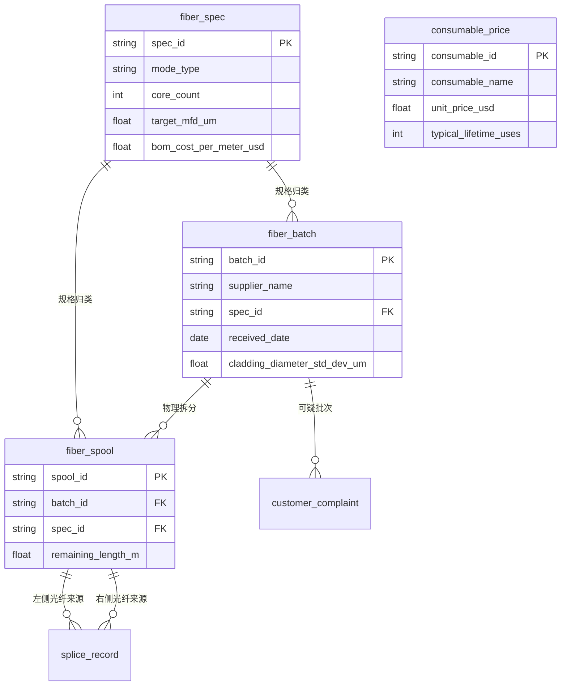
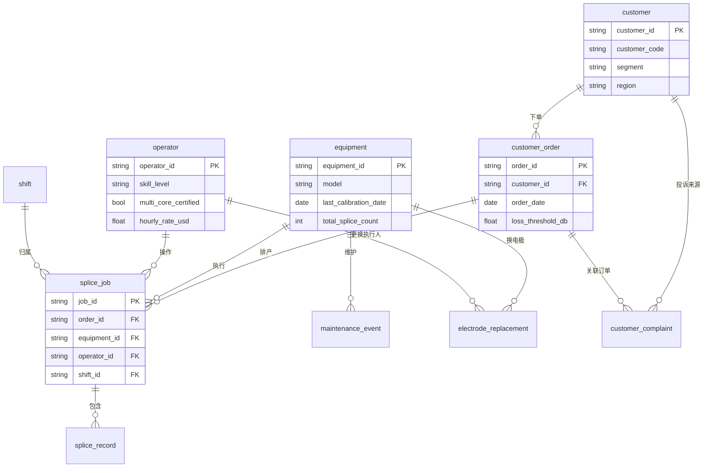
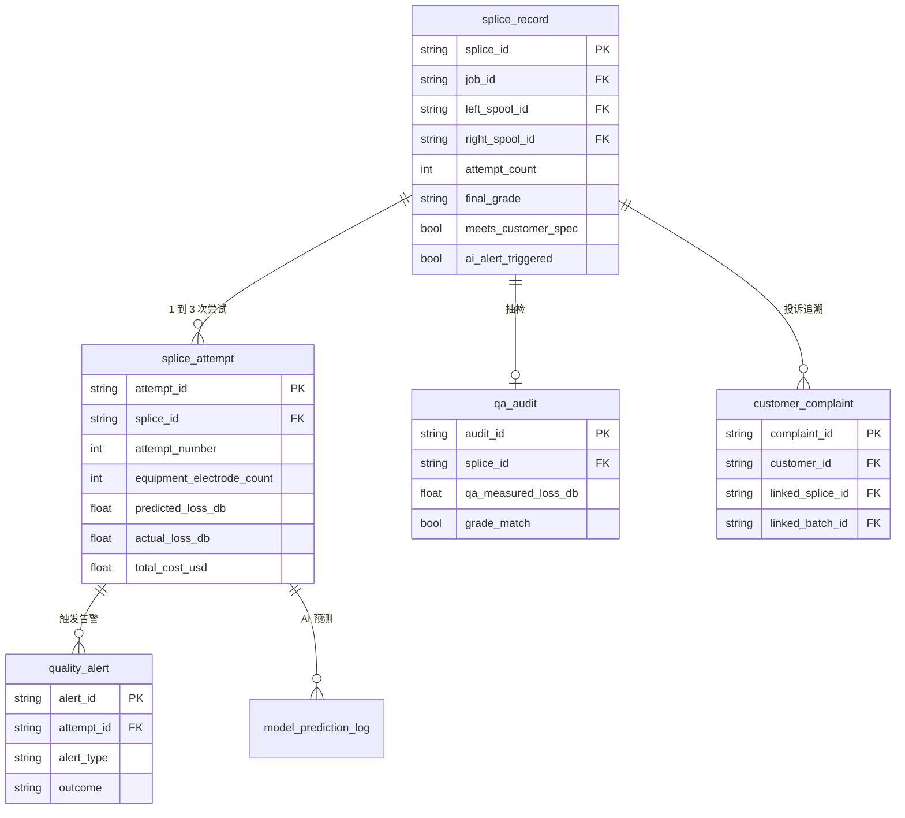

# 光纤焊接质量与成本控制数据集 ER 文档

业务背景, 行业科普, 术语表请见 `01-telecom_equipment_fiber_splicing_quality_high_business_context-cn.md`. 本文档只描述数据.

数据集元信息:

- 复杂度: High
- 表数量: 18
- 总记录数: 约 220,000 行
- 外键关系: 22 个声明式 FK, 另有 1 个非 DDL 强制的逻辑引用 (`splice_record.final_attempt_id` → `splice_attempt.attempt_id`, 因为存在循环依赖, 不在 CREATE TABLE 里声明)
- `REFERENCE_DATE` = 2026-06-15

---

## 1. 三个子领域的 ER 图

18 张表如果画一张大图会乱, 按领域拆三块. 中心实体 `splice_record` 在三张图里都会出现.

### 子图 1, 物料和参考数据



### 子图 2, 生产资源和订单



### 子图 3, 焊接事件, 质量和 AI



---

## 2. fiber_spec

光纤规格目录表. 每一行代表一种 NorthArc 采购和使用的光纤型号 (G.652.D 单模, G.657.A1 抗弯曲单模, OM4 多模, OM5 多模, 4-core 多芯). 工厂的 fiber_batch 和 fiber_spool 都挂在一个规格上, splice_record 间接通过 spool 关联到规格. VP Operations 和 Engineering 看这张表了解物料种类和单位成本, 不直接看具体批次.

| 列名 | 类型 | 约束 | 描述 |
|------|------|------|------|
| spec_id | VARCHAR(20) | PK | 规格编号, 如 `SMF-G652D`, `MCF-4C` |
| spec_name | VARCHAR(80) | NOT NULL | 完整名称 |
| mode_type | VARCHAR(20) | NOT NULL | `single`, `multi`, `multi_core` 三种 |
| core_count | INTEGER | NOT NULL | 1 (single), 1 (multi-mode), 4 或 7 (multi-core) |
| target_cladding_diameter_um | FLOAT | NOT NULL | 设计包层直径 (微米), 均为 125.0 |
| target_mfd_um | FLOAT | NOT NULL | 设计模场直径 (微米), 单模约 10.4 多模约 50 |
| applications | VARCHAR(120) | NOT NULL | 应用场景文字描述 |
| bom_cost_per_meter_usd | NUMERIC(10,4) | NOT NULL | BOM 成本, 每米美元 |

**示例数据:**

| spec_id | spec_name | mode_type | core_count | target_mfd_um | bom_cost_per_meter_usd |
|---------|-----------|-----------|------------|---------------|------------------------|
| SMF-G652D | Standard Single-Mode G.652.D | single | 1 | 10.4 | 0.18 |
| SMF-G657A1 | Bend-Insensitive Single-Mode G.657.A1 | single | 1 | 9.2 | 0.34 |
| MMF-OM4 | Multi-Mode OM4 | multi | 1 | 50.0 | 0.42 |
| MMF-OM5 | Multi-Mode OM5 Wide-Band | multi | 1 | 50.0 | 0.58 |
| MCF-4C | Multi-Core 4-Channel | multi_core | 4 | 9.6 | 4.80 |

---

## 3. fiber_batch

光纤采购批次表. 每一行是一次供应商发货. 一次发货来自一个 supplier, 包含若干 spool (10 到 30 卷), 共享同一份 QC release certificate. 当下游 splice 出现批量质量问题时, QA 工程师从 fiber_spool 反查到 fiber_batch, 再决定是不是要联系供应商或启动召回.

> 范围说明: 本数据集里有两个供应商, CorningStock 和 SumiOptics. `cladding_diameter_std_dev_um` 字段是 supplier QC release certificate 里上报的批次内方差. NorthArc 内部 QC 不重新测每根 spool 的 cladding, 默认接受 supplier 的 cert. 这条 SOP 是 Q8 召回风险的根源.

| 列名 | 类型 | 约束 | 描述 |
|------|------|------|------|
| batch_id | VARCHAR(20) | PK | 批次号, 格式 `MFG-YYYY-NNN` |
| supplier_name | VARCHAR(40) | NOT NULL | 供应商, `CorningStock` 或 `SumiOptics` |
| spec_id | VARCHAR(20) | FK → fiber_spec.spec_id | 规格 |
| received_date | DATE | NOT NULL | 入库日 |
| spool_count | INTEGER | NOT NULL | 批次内 spool 数, 10 到 30 |
| length_per_spool_m | INTEGER | NOT NULL | 每卷长度, 通常 25000 米 |
| qc_release_status | VARCHAR(20) | NOT NULL | `passed`, `conditional`, `rejected` |
| cladding_diameter_std_dev_um | FLOAT | NOT NULL | supplier 上报的批内方差, 正常 0.15 |
| unit_price_per_meter_usd | NUMERIC(10,4) | NOT NULL | 采购单价 |
| notes | VARCHAR(200) | NULL | 备注 |

**示例数据:**

| batch_id | supplier_name | spec_id | received_date | spool_count | qc_release_status | cladding_diameter_std_dev_um |
|----------|---------------|---------|---------------|-------------|-------------------|------------------------------|
| MFG-2025-001 | CorningStock | SMF-G652D | 2025-06-20 | 20 | passed | 0.14 |
| MFG-2025-015 | SumiOptics | MMF-OM4 | 2025-09-08 | 12 | passed | 0.18 |
| MFG-2024-038 | SumiOptics | SMF-G652D | 2025-11-22 | 15 | conditional | 0.62 |

注意第三行 `MFG-2024-038` 的方差是其他批次的约 4 倍, 而 supplier 仍发了 `conditional` 通过. 这是 Q8 召回风险的根因数据.

---

## 4. fiber_spool

光纤物理卷盘表. 每一行是仓库里一卷光纤, 是 NorthArc inventory 的最小单位. 工厂的 inventory clerk 用这张表追踪库存, splice operator 拿料时也用这张表. 一根 splice_record 引用两个 fiber_spool (左侧光纤来源, 右侧光纤来源).

| 列名 | 类型 | 约束 | 描述 |
|------|------|------|------|
| spool_id | VARCHAR(20) | PK | 卷盘号, 格式 `SP-YYYY-NNNNN` |
| batch_id | VARCHAR(20) | FK → fiber_batch.batch_id | 所属批次 |
| spec_id | VARCHAR(20) | FK → fiber_spec.spec_id | 规格 (冗余字段, 便于查询) |
| received_date | DATE | NOT NULL | 入库日, 与批次同 |
| remaining_length_m | FLOAT | NOT NULL | 剩余长度米, 初始 25000 |
| location | VARCHAR(20) | NOT NULL | 仓位, `WH-A1`, `WH-B2` |
| status | VARCHAR(20) | NOT NULL | `available`, `in_use`, `depleted` |

**示例数据:**

| spool_id | batch_id | spec_id | remaining_length_m | status |
|----------|----------|---------|--------------------|--------|
| SP-2025-00001 | MFG-2025-001 | SMF-G652D | 18420.0 | in_use |
| SP-2025-00237 | MFG-2024-038 | SMF-G652D | 12800.0 | in_use |
| SP-2025-00350 | MFG-2025-022 | MCF-4C | 24800.0 | available |

---

## 5. consumable_price

耗材价格表. 6 行, 列出工厂用到的所有耗材 (电极对, cleaver 刀片, 异丙醇瓶, lint-free wipe 整盒, splice protector 整包, 校准光纤). Manufacturing analyst 用这张表把 splice_attempt 的 `consumable_cost_usd` 算成 dollar.

| 列名 | 类型 | 约束 | 描述 |
|------|------|------|------|
| consumable_id | VARCHAR(20) | PK | 耗材编号 |
| consumable_name | VARCHAR(80) | NOT NULL | 耗材名称 |
| unit_price_usd | NUMERIC(10,2) | NOT NULL | 单价美元 |
| typical_lifetime_uses | INTEGER | NOT NULL | 典型寿命次数, 一对电极 2000 |
| last_updated | DATE | NOT NULL | 价格最近一次更新日期 |

**示例数据:**

| consumable_id | consumable_name | unit_price_usd | typical_lifetime_uses |
|---------------|-----------------|----------------|-----------------------|
| ELEC-FSM100 | Electrode Pair, Fujikura FSM-100P | 180.00 | 2000 |
| BLADE-CT50 | Cleaver Blade, Sumitomo CT-50 | 245.00 | 24000 |
| IPA-BTL500 | Isopropyl Alcohol 500ml | 12.50 | 800 |
| WIPE-BOX | Lint-Free Wipe, 200/box | 28.00 | 200 |
| PROT-SP60 | Splice Protector, 60mm, 100/pack | 32.00 | 100 |
| CAL-FIBER | Calibration Fiber Reference | 480.00 | 30 |

---

## 6. customer

客户主表. 12 行, 三大 segment 各 4 个客户. customer_code 是公司内部用代号, 不暴露真实客户名. VP Sales 和 Marcus 都会查这张表, 因为客户 segment 直接决定 splice 的 loss_threshold (FTTH 宽松, hyperscale 严格).

| 列名 | 类型 | 约束 | 描述 |
|------|------|------|------|
| customer_id | VARCHAR(20) | PK | 内部 ID, 格式 `CUS-NNN` |
| customer_code | VARCHAR(40) | NOT NULL | 内部代号, 如 `DC-Alpha`, `FTTH-CCom` |
| segment | VARCHAR(40) | NOT NULL | `hyperscale_datacenter`, `ftth_carrier`, `enterprise_network` |
| region | VARCHAR(20) | NOT NULL | `US-West`, `US-Central`, `US-East`, `Canada` |
| relationship_start_date | DATE | NOT NULL | 合作开始日期 |
| contract_value_annual_usd | NUMERIC(12,2) | NOT NULL | 年合同价值 |

**示例数据:**

| customer_id | customer_code | segment | region | contract_value_annual_usd |
|-------------|---------------|---------|--------|---------------------------|
| CUS-001 | DC-Alpha | hyperscale_datacenter | US-West | 12500000.00 |
| CUS-005 | FTTH-CCom | ftth_carrier | US-Central | 4200000.00 |
| CUS-009 | ENT-Helix | enterprise_network | US-East | 850000.00 |

---

## 7. shift

班次定义表. 只有 3 行, 但贯穿所有 splice 数据. Day shift 由资深主管在场, Swing shift 监督正常, Night shift 没有 senior 主管在场. 这是 Q3 夜班质量问题的组织根源.

| 列名 | 类型 | 约束 | 描述 |
|------|------|------|------|
| shift_id | VARCHAR(10) | PK | `SH-D`, `SH-S`, `SH-N` |
| shift_name | VARCHAR(20) | NOT NULL | `Day`, `Swing`, `Night` |
| start_hour | INTEGER | NOT NULL | 0 到 23 |
| end_hour | INTEGER | NOT NULL | 0 到 23 |
| supervisor_name | VARCHAR(80) | NOT NULL | 主管姓名 |
| has_senior_supervisor | BOOLEAN | NOT NULL | 是否有 senior 现场主管, 当前 Day 和 Swing 是 True, Night 是 False |

**示例数据:**

| shift_id | shift_name | start_hour | end_hour | has_senior_supervisor |
|----------|------------|------------|----------|------------------------|
| SH-D | Day | 8 | 16 | True |
| SH-S | Swing | 16 | 0 | True |
| SH-N | Night | 0 | 8 | False |

---

## 8. equipment

焊接设备表, 12 台. 字段比原始版本多了 `purchase_cost_usd` 和 `depreciation_monthly_usd`, 因为成本分析要把设备折旧摊到 splice_attempt 里. `calibration_interval_days_sop` 是 SOP 规定的校准周期 (现行 90 天). `last_calibration_date` 加上 90 天 vs REFERENCE_DATE 决定一台设备是否超期.

| 列名 | 类型 | 约束 | 描述 |
|------|------|------|------|
| equipment_id | VARCHAR(20) | PK | 设备号, `EQ-NNN` |
| model | VARCHAR(60) | NOT NULL | 型号, 如 Fujikura FSM-100P, Sumitomo T-72C |
| serial_number | VARCHAR(40) | NOT NULL | 厂家序列号 |
| purchase_date | DATE | NOT NULL | 购入日期 |
| purchase_cost_usd | NUMERIC(12,2) | NOT NULL | 购入价格 |
| depreciation_monthly_usd | NUMERIC(10,2) | NOT NULL | 月折旧, 按 5 年直线 |
| location | VARCHAR(20) | NOT NULL | 产线, `Line-A`, `Line-B`, `Line-C`, `Lab-1` |
| last_calibration_date | DATE | NOT NULL | 最近一次校准日 |
| calibration_interval_days_sop | INTEGER | NOT NULL | SOP 校准周期, 当前固定 90 |
| total_splice_count | INTEGER | NOT NULL | 累计焊接次数, 与 splice_attempt 表的实际记录数对齐 |
| status | VARCHAR(20) | NOT NULL | `active`, `maintenance`, `offline` |

**索引:**

- `idx_equipment_location` on `location`
- `idx_equipment_status` on `status`

**示例数据:**

| equipment_id | model | purchase_cost_usd | last_calibration_date | total_splice_count | status |
|--------------|-------|-------------------|-----------------------|---------------------|--------|
| EQ-001 | Fujikura FSM-100P | 38500.00 | 2026-04-08 | 4823 | active |
| EQ-007 | Sumitomo T-72C | 32000.00 | 2026-01-15 | 5104 | active |
| EQ-011 | FITEL S179A | 28800.00 | 2026-05-20 | 3892 | maintenance |

EQ-007 的 last_calibration_date 是 2026-01-15, 距 REFERENCE_DATE 已 151 天, 严重超期. 这是 Q7 数据.

---

## 9. operator

操作员表, 30 人. 关键字段是 `skill_level` (junior, intermediate, senior, expert) 和 `multi_core_certified`. 当前排班政策是: 任何 operator 都可以接 single / multi mode 工作, 但 multi-core 仅 `multi_core_certified = True` 的 operator 才允许接. 问题在于这个 cert 的标准过松, 部分 junior 也拿到了 cert, 但实际 multi-core 操作质量很差. 这是 Q4 的根因.

| 列名 | 类型 | 约束 | 描述 |
|------|------|------|------|
| operator_id | VARCHAR(20) | PK | `OP-NNN` |
| name | VARCHAR(120) | NOT NULL | 姓名 |
| skill_level | VARCHAR(20) | NOT NULL | `junior`, `intermediate`, `senior`, `expert` |
| certification_date | DATE | NOT NULL | 入厂认证通过日 |
| default_shift_id | VARCHAR(10) | FK → shift.shift_id | 主要班次 |
| hourly_rate_usd | NUMERIC(6,2) | NOT NULL | 时薪 |
| hire_date | DATE | NOT NULL | 入职日 |
| multi_core_certified | BOOLEAN | NOT NULL | 是否允许接 multi-core 焊接 |
| department | VARCHAR(40) | NOT NULL | `Production`, `R&D`, `Quality Assurance` |

**索引:**

- `idx_operator_skill` on `skill_level`
- `idx_operator_shift` on `default_shift_id`

**示例数据:**

| operator_id | name | skill_level | default_shift_id | hourly_rate_usd | multi_core_certified |
|-------------|------|-------------|-------------------|------------------|-----------------------|
| OP-003 | Diana Hoffman | expert | SH-D | 38.50 | True |
| OP-014 | Marcus Liu | junior | SH-N | 22.50 | True |
| OP-027 | Patricia Goss | senior | SH-S | 33.00 | True |

注意 OP-014 是 junior 但有 multi-core cert, 这种情况在数据里占 30% 的 junior. 这是 Q4 错配的来源.

---

## 10. customer_order

客户订单表. 250 行, 12 个月里下的 PO. 每个 PO 对应一个产品规格 (例如 12-fiber MTP trunk 3 米), 一个数量 (例如 480 根), 内部排成若干 splice_job 完成. 关键字段是 `loss_threshold_db`, 这是客户合同里写的 spec, NorthArc 内部 SOP 没有用它, 而是一刀切用 0.05. 这是 Q5 的核心矛盾.

| 列名 | 类型 | 约束 | 描述 |
|------|------|------|------|
| order_id | VARCHAR(20) | PK | `PO-YYYY-NNNN` |
| customer_id | VARCHAR(20) | FK → customer.customer_id | 客户 |
| order_date | DATE | NOT NULL | 下单日 |
| promised_delivery_date | DATE | NOT NULL | 承诺交付日 |
| product_code | VARCHAR(40) | NOT NULL | 产品代码 |
| quantity_cables | INTEGER | NOT NULL | 成品 cable 根数 |
| splices_required | INTEGER | NOT NULL | 总焊接数, 每根 cable 一般 2 splice |
| unit_price_usd | NUMERIC(10,2) | NOT NULL | 单价 |
| loss_threshold_db | FLOAT | NOT NULL | 客户合同 spec, 单位 dB. FTTH 0.30, enterprise 0.10, hyperscale 0.05 |
| status | VARCHAR(20) | NOT NULL | `open`, `in_production`, `shipped`, `closed` |

**示例数据:**

| order_id | customer_id | product_code | quantity_cables | splices_required | loss_threshold_db |
|----------|-------------|---------------|------------------|-------------------|---------------------|
| PO-2025-0014 | CUS-001 (DC-Alpha) | MTP12-OS2-3M | 1200 | 14400 | 0.05 |
| PO-2025-0089 | CUS-005 (FTTH-CCom) | LC-Drop-50M | 800 | 1600 | 0.30 |
| PO-2026-0042 | CUS-009 (ENT-Helix) | LC-Patch-2M | 200 | 400 | 0.10 |

---

## 11. splice_job

生产批次表. 800 行. 一个 job 是一个 operator 在一台设备上的一次连续作业, 通常 30 到 200 次 splice, 用时 2 到 6 小时. 一个 customer_order 拆成多个 job 完成. Production Manager 用这张表排产, 也用它做产能利用率统计.

| 列名 | 类型 | 约束 | 描述 |
|------|------|------|------|
| job_id | VARCHAR(20) | PK | `JOB-YYYY-NNNN` |
| order_id | VARCHAR(20) | FK → customer_order.order_id | 订单 |
| equipment_id | VARCHAR(20) | FK → equipment.equipment_id | 设备 |
| operator_id | VARCHAR(20) | FK → operator.operator_id | 操作员 |
| shift_id | VARCHAR(10) | FK → shift.shift_id | 班次 |
| planned_start_ts | DATETIME | NOT NULL | 计划开始 |
| planned_end_ts | DATETIME | NOT NULL | 计划结束 |
| actual_start_ts | DATETIME | NOT NULL | 实际开始 |
| actual_end_ts | DATETIME | NOT NULL | 实际结束 |
| target_splice_count | INTEGER | NOT NULL | 计划 splice 数 |
| completed_splice_count | INTEGER | NOT NULL | 实际完成数 |
| status | VARCHAR(20) | NOT NULL | `completed`, `paused`, `cancelled` |

**索引:**

- `idx_job_order` on `order_id`
- `idx_job_equipment` on `equipment_id`
- `idx_job_actual_start` on `actual_start_ts`

**示例数据:**

| job_id | order_id | equipment_id | operator_id | shift_id | completed_splice_count | status |
|--------|----------|--------------|-------------|----------|-------------------------|--------|
| JOB-2025-0042 | PO-2025-0014 | EQ-001 | OP-003 | SH-D | 142 | completed |
| JOB-2025-0186 | PO-2025-0089 | EQ-007 | OP-014 | SH-N | 78 | completed |

---

## 12. splice_record

焊接记录主表, 约 50,000 行. 每行是一根焊接接头的逻辑实体. 一根接头可能要经过 1 到 3 次 attempt (重试), 这张表记录最终结果, attempt 的细节在下一张表. 这是整个数据集最重要的事实表, 几乎所有业务分析查询都要 join 这张表.

> 范围说明: 一个 splice 引用左侧和右侧两个 fiber_spool. 左侧和右侧不允许是同一个 spool. final_attempt_id 是一个逻辑引用 (指向 splice_attempt.attempt_id), 但 DDL 里不声明 FK, 因为存在循环依赖. 生成器和 SQL 查询都假设这个引用一致.

| 列名 | 类型 | 约束 | 描述 |
|------|------|------|------|
| splice_id | VARCHAR(20) | PK | `SPL-NNNNNNN` |
| job_id | VARCHAR(20) | FK → splice_job.job_id | 所属 job |
| left_spool_id | VARCHAR(20) | FK → fiber_spool.spool_id | 左侧光纤 |
| right_spool_id | VARCHAR(20) | FK → fiber_spool.spool_id | 右侧光纤 |
| equipment_id | VARCHAR(20) | FK → equipment.equipment_id | 设备 (与 job 同) |
| operator_id | VARCHAR(20) | FK → operator.operator_id | 操作员 (与 job 同) |
| shift_id | VARCHAR(10) | FK → shift.shift_id | 班次 (与 job 同) |
| planned_position_in_job | INTEGER | NOT NULL | 在 job 内的顺序号 |
| started_ts | DATETIME | NOT NULL | 第一次 attempt 开始时间 |
| completed_ts | DATETIME | NOT NULL | 最后一次 attempt 完成时间 |
| attempt_count | INTEGER | NOT NULL | 1, 2, 或 3 |
| final_attempt_id | VARCHAR(20) | NULL | 最后被接受或被 reject 的 attempt id (逻辑引用) |
| final_loss_db | FLOAT | NOT NULL | 最终损耗值 |
| final_grade | VARCHAR(10) | NOT NULL | `A`, `B`, `C`, `Reject` |
| meets_customer_spec | BOOLEAN | NOT NULL | final_loss_db 是否 ≤ 该订单的 loss_threshold_db |
| ai_alert_triggered | BOOLEAN | NOT NULL | 是否触发了 quality_alert |
| image_path | VARCHAR(200) | NULL | 端面图路径 |

**索引:**

- `idx_splice_completed_ts` on `completed_ts`
- `idx_splice_final_grade` on `final_grade`
- `idx_splice_job` on `job_id`
- `idx_splice_equipment` on `equipment_id`
- `idx_splice_operator` on `operator_id`

**示例数据:**

| splice_id | job_id | attempt_count | final_loss_db | final_grade | meets_customer_spec |
|-----------|--------|----------------|----------------|--------------|----------------------|
| SPL-0000142 | JOB-2025-0042 | 1 | 0.018 | A | True |
| SPL-0017388 | JOB-2025-0186 | 2 | 0.062 | C | True (FTTH 0.30) |
| SPL-0024917 | JOB-2026-0042 | 3 | 0.094 | Reject | False |

注意 SPL-0017388, 内部判 C 级, 但客户是 FTTH 0.30 spec, 实际客户那边合格. 这就是 Q5 过度质量陷阱里的典型案例.

---

## 13. splice_attempt

焊接尝试细节表, 约 55,000 行. 每行是一次 splice 操作的物理尝试. 一根 splice_record 对应 1 到 3 个 splice_attempt. 第一次失败的 attempt 在这里也会留下完整记录, 包括所有几何参数, 设备参数, 环境参数, 预测损耗, 实际损耗, 以及该次 attempt 的成本. **`equipment_electrode_count` 字段记录这次 attempt 发生时, 当前电极对已经服役多少次** (从该设备上一次 electrode_replacement 开始累计). 这是 Q2 电极磨损分析的核心切分维度.

| 列名 | 类型 | 约束 | 描述 |
|------|------|------|------|
| attempt_id | VARCHAR(20) | PK | `ATT-NNNNNNN` |
| splice_id | VARCHAR(20) | FK → splice_record.splice_id | 所属 splice |
| attempt_number | INTEGER | NOT NULL | 1, 2, 或 3 |
| attempt_ts | DATETIME | NOT NULL | 本次 attempt 时间 |
| duration_seconds | INTEGER | NOT NULL | 本次 attempt 耗时秒 |
| left_core_offset_x_um | FLOAT | NOT NULL | 左侧 core X 偏移 |
| left_core_offset_y_um | FLOAT | NOT NULL | 左侧 core Y 偏移 |
| right_core_offset_x_um | FLOAT | NOT NULL | 右侧 core X 偏移 |
| right_core_offset_y_um | FLOAT | NOT NULL | 右侧 core Y 偏移 |
| core_to_core_distance_um | FLOAT | NOT NULL | core 间距 (微米), 由 X/Y 偏移计算 |
| angle_deviation_deg | FLOAT | NOT NULL | 总体角度偏差 |
| left_cleave_angle_deg | FLOAT | NOT NULL | 左端面切割角度 |
| right_cleave_angle_deg | FLOAT | NOT NULL | 右端面切割角度 |
| arc_power_mw | FLOAT | NOT NULL | 主弧功率 |
| arc_duration_ms | INTEGER | NOT NULL | 主弧时间 |
| prefusion_time_ms | INTEGER | NOT NULL | 预熔时间 |
| overlap_um | FLOAT | NOT NULL | 端面重叠量 |
| ambient_temp_c | FLOAT | NOT NULL | 环境温度 |
| humidity_percent | FLOAT | NOT NULL | 环境湿度 |
| equipment_electrode_count | INTEGER | NOT NULL | 本次 attempt 时电极对已服役次数 |
| predicted_loss_db | FLOAT | NOT NULL | AI 预测损耗 |
| actual_loss_db | FLOAT | NOT NULL | LID 算法估算的实际损耗 |
| attempt_grade | VARCHAR(10) | NOT NULL | `A`, `B`, `C`, `Reject` |
| attempt_outcome | VARCHAR(20) | NOT NULL | `accepted`, `retry`, `final_reject` |
| material_cost_usd | NUMERIC(8,4) | NOT NULL | 物料成本 (光纤损耗 + 套管) |
| labor_cost_usd | NUMERIC(8,4) | NOT NULL | 人工成本 (operator 时薪 × 工时) |
| machine_cost_usd | NUMERIC(8,4) | NOT NULL | 设备成本 (折旧 + 电费摊销) |
| consumable_cost_usd | NUMERIC(8,4) | NOT NULL | 耗材成本 (电极 + 刀片 + 异丙醇等摊销) |
| total_cost_usd | NUMERIC(8,4) | NOT NULL | 四项之和 |

**索引:**

- `idx_attempt_splice` on `splice_id`
- `idx_attempt_ts` on `attempt_ts`
- `idx_attempt_grade` on `attempt_grade`

**示例数据:**

| attempt_id | splice_id | attempt_number | equipment_electrode_count | actual_loss_db | attempt_grade | total_cost_usd |
|------------|-----------|----------------|----------------------------|------------------|----------------|------------------|
| ATT-0000142 | SPL-0000142 | 1 | 458 | 0.018 | A | 2.34 |
| ATT-0019522 | SPL-0017388 | 1 | 2180 | 0.118 | Reject | 2.41 |
| ATT-0019523 | SPL-0017388 | 2 | 2181 | 0.062 | C | 2.41 |

注意 ATT-0019522: electrode_count 2180 已经过寿命阈值 2000, 这是 Q2 电极磨损的典型样本.

---

## 14. electrode_replacement

电极更换日志, 约 700 行. 每行是一次电极更换事件. 当前 SOP 是 reactive (出告警才换), 数据上可以看到 splices_on_old_pair 大多在 1800 到 3000 之间, 远超厂家推荐的 2000.

| 列名 | 类型 | 约束 | 描述 |
|------|------|------|------|
| replacement_id | VARCHAR(20) | PK | `ER-NNNNN` |
| equipment_id | VARCHAR(20) | FK → equipment.equipment_id | 设备 |
| replacement_ts | DATETIME | NOT NULL | 更换时间 |
| splices_on_old_pair | INTEGER | NOT NULL | 旧电极完成的 splice 数 |
| reason | VARCHAR(40) | NOT NULL | `condition_warning`, `quality_drift_detected`, `scheduled`, `unplanned_failure` |
| new_pair_part_number | VARCHAR(40) | NOT NULL | 新电极型号 |
| new_pair_cost_usd | NUMERIC(8,2) | NOT NULL | 新电极成本, 通常 180.00 |
| replaced_by_operator_id | VARCHAR(20) | FK → operator.operator_id | 执行人 |

**示例数据:**

| replacement_id | equipment_id | splices_on_old_pair | reason | new_pair_cost_usd |
|----------------|---------------|----------------------|--------|---------------------|
| ER-00042 | EQ-001 | 2380 | condition_warning | 180.00 |
| ER-00128 | EQ-007 | 2950 | unplanned_failure | 180.00 |

---

## 15. maintenance_event

设备维护日志, 约 150 行. 包括 calibration, repair, preventive maintenance, cleaning 四类事件. Q7 校准超期分析的辅助数据.

| 列名 | 类型 | 约束 | 描述 |
|------|------|------|------|
| event_id | VARCHAR(20) | PK | `MAINT-NNNNN` |
| equipment_id | VARCHAR(20) | FK → equipment.equipment_id | 设备 |
| event_ts | DATETIME | NOT NULL | 事件时间 |
| event_type | VARCHAR(20) | NOT NULL | `calibration`, `repair`, `pm`, `cleaning` |
| duration_hours | FLOAT | NOT NULL | 耗时小时 |
| parts_cost_usd | NUMERIC(10,2) | NOT NULL | 物料成本 |
| labor_cost_usd | NUMERIC(10,2) | NOT NULL | 人工成本 |
| performed_by | VARCHAR(80) | NOT NULL | 执行人, 内部工程师或外部厂家工程师 |
| notes | VARCHAR(200) | NULL | 备注 |
| next_due_date | DATE | NULL | 下次预定日期 |

**示例数据:**

| event_id | equipment_id | event_type | duration_hours | parts_cost_usd | next_due_date |
|----------|---------------|------------|----------------|------------------|----------------|
| MAINT-00012 | EQ-001 | calibration | 2.5 | 480.00 | 2026-07-08 |
| MAINT-00038 | EQ-007 | repair | 8.0 | 1240.00 | NULL |

---

## 16. quality_alert

AI 质量告警表, 约 5,000 行. 当 AI 模型预测 loss > 阈值 (内部 0.05) 时触发告警. 告警挂在 splice_attempt 上 (而不是 splice_record), 因为同一根 splice 的 3 次 attempt 都可能触发告警. `outcome` 是 operator 实际处理结果, 这是 Q6 核心字段.

| 列名 | 类型 | 约束 | 描述 |
|------|------|------|------|
| alert_id | VARCHAR(20) | PK | `ALT-NNNNN` |
| attempt_id | VARCHAR(20) | FK → splice_attempt.attempt_id | 关联 attempt |
| alert_ts | DATETIME | NOT NULL | 告警时间 |
| alert_type | VARCHAR(40) | NOT NULL | `high_loss_predicted`, `angle_out_of_spec`, `equipment_drift`, `cleave_angle_exceeded`, `electrode_warning` |
| predicted_loss_db | FLOAT | NOT NULL | 触发告警时的预测值 |
| threshold_db | FLOAT | NOT NULL | 触发阈值, 当前固定 0.05 |
| recommended_action | TEXT | NOT NULL | AI 推荐动作的文字描述 |
| action_taken | VARCHAR(40) | NULL | `reclean_and_retry`, `adjust_parameters`, `equipment_check`, `fiber_replaced`, `ignored` |
| outcome | VARCHAR(20) | NULL | `resolved`, `ignored`, `escalated` |
| resolution_ts | DATETIME | NULL | 解决时间 |

**索引:**

- `idx_alert_attempt` on `attempt_id`
- `idx_alert_outcome` on `outcome`
- `idx_alert_ts` on `alert_ts`

**示例数据:**

| alert_id | attempt_id | alert_type | outcome |
|----------|-------------|------------|---------|
| ALT-00128 | ATT-0019522 | high_loss_predicted | resolved |
| ALT-00415 | ATT-0024918 | electrode_warning | ignored |

---

## 17. qa_audit

QA 抽检表, 约 2,500 行. QA 工程师每天随机抽 5% 的 splice 用 OTDR 真实测量, 跟内部 LID 估算对比. 主要用途是检测 LID 算法的系统偏差和 operator self-grading 的可靠性.

| 列名 | 类型 | 约束 | 描述 |
|------|------|------|------|
| audit_id | VARCHAR(20) | PK | `QA-NNNNN` |
| splice_id | VARCHAR(20) | FK → splice_record.splice_id | 被抽检的 splice |
| audit_ts | DATETIME | NOT NULL | 抽检时间 |
| auditor_name | VARCHAR(80) | NOT NULL | QA 工程师姓名 |
| operator_self_grade | VARCHAR(10) | NOT NULL | splice_record 里记录的等级 |
| qa_measured_loss_db | FLOAT | NOT NULL | OTDR 真实测量 loss |
| qa_grade | VARCHAR(10) | NOT NULL | QA 判定等级 |
| grade_match | BOOLEAN | NOT NULL | 两个等级是否一致 |
| variance_db | FLOAT | NOT NULL | qa_measured - splice_record.final_loss_db |

**示例数据:**

| audit_id | splice_id | operator_self_grade | qa_measured_loss_db | qa_grade | grade_match |
|----------|-----------|----------------------|----------------------|----------|---------------|
| QA-00042 | SPL-0000142 | A | 0.019 | A | True |
| QA-00318 | SPL-0024580 | B | 0.084 | Reject | False |

---

## 18. customer_complaint

客户投诉表, 30 行. 12 个月里收到的所有 customer complaint, 涵盖 RMA, field failure, audit findings. 关键字段 `linked_splice_id` 和 `linked_batch_id` 是 QA 团队事后追溯的结果, 不是所有投诉都能追溯成功. Q8 召回风险评估的核心数据.

| 列名 | 类型 | 约束 | 描述 |
|------|------|------|------|
| complaint_id | VARCHAR(20) | PK | `CMP-NNNN` |
| customer_id | VARCHAR(20) | FK → customer.customer_id | 投诉客户 |
| order_id | VARCHAR(20) | FK → customer_order.order_id (NULL allowed) | 关联订单 |
| complaint_date | DATE | NOT NULL | 投诉日期 |
| complaint_type | VARCHAR(40) | NOT NULL | `high_loss_in_field`, `connector_failure`, `audit_finding`, `early_failure`, `intermittent` |
| linked_splice_id | VARCHAR(20) | FK → splice_record.splice_id (NULL allowed) | 追溯到的 splice |
| linked_batch_id | VARCHAR(20) | FK → fiber_batch.batch_id (NULL allowed) | 追溯到的批次 |
| severity | VARCHAR(20) | NOT NULL | `low`, `medium`, `high`, `critical` |
| resolution_status | VARCHAR(20) | NOT NULL | `open`, `investigating`, `resolved`, `escalated` |
| cost_impact_usd | NUMERIC(10,2) | NOT NULL | 经济损失 (RMA + 返工 + credit memo) |

**示例数据:**

| complaint_id | customer_id | complaint_type | linked_batch_id | severity | cost_impact_usd |
|--------------|-------------|----------------|-------------------|----------|-------------------|
| CMP-0008 | CUS-005 | high_loss_in_field | MFG-2024-038 | high | 12400.00 |
| CMP-0019 | CUS-001 | audit_finding | NULL | medium | 3800.00 |

8 条 high_loss_in_field 类型的投诉里有 6 条追溯到了 MFG-2024-038 这个坏批次. 这是 Q8 的关键数据.

---

## 19. model_prediction_log

模型预测日志, 约 55,000 行 (一对一对应 splice_attempt). 记录每次 AI 模型调用的输入特征, 输出, 置信度, 特征重要性. 主要用途是模型监控和审计. 不在主要业务分析路径上, 但 Q1 总览里会用到模型版本对应的精度统计.

| 列名 | 类型 | 约束 | 描述 |
|------|------|------|------|
| prediction_id | VARCHAR(20) | PK | `PRED-NNNNNNN` |
| attempt_id | VARCHAR(20) | FK → splice_attempt.attempt_id | 关联 attempt |
| model_version | VARCHAR(20) | NOT NULL | `v1.2.0`, `v2.0.0`, `v2.1.0` 等 |
| prediction_ts | DATETIME | NOT NULL | 预测时间, 在 attempt_ts 之前几秒 |
| input_features | TEXT | NOT NULL | JSON 字符串, 模型输入特征快照 |
| predicted_loss_db | FLOAT | NOT NULL | 模型输出 |
| confidence_score | FLOAT | NOT NULL | 0.7 到 0.99 |
| feature_importance | TEXT | NOT NULL | JSON 字符串, SHAP 风格的特征重要性 |

---

## 20. 数据生成规则

下列规则是 Python 生成器和 SQL 查询的契约. 生成器实际产生的分布必须满足这些条款, 否则 SQL 查询的结论会失真.

### 时间顺序

- `customer.relationship_start_date` ≤ `customer_order.order_date` ≤ `splice_job.planned_start_ts` ≤ `splice_job.actual_start_ts` ≤ `splice_record.started_ts` ≤ `splice_record.completed_ts`.
- 同一根 splice 的多次 attempt: `splice_attempt[1].attempt_ts < splice_attempt[2].attempt_ts < splice_attempt[3].attempt_ts`, 相邻间隔 30 到 120 秒.
- `splice_record.started_ts` 等于其第一个 attempt 的 attempt_ts. `completed_ts` 等于最后一个 attempt 的 attempt_ts + duration.
- `electrode_replacement.replacement_ts` 划分该设备的电极服役周期. 任一 splice_attempt 的 `equipment_electrode_count` 等于自上一次 replacement 以来该设备 attempt 数.
- `model_prediction_log.prediction_ts` 比对应 splice_attempt.attempt_ts 早 1 到 5 秒 (预测在焊接前完成).
- `quality_alert.alert_ts` 等于对应 splice_attempt.attempt_ts (告警与焊接同时).
- `qa_audit.audit_ts` 在 splice_record.completed_ts 之后 1 到 7 天.
- `customer_complaint.complaint_date` 在关联订单的 promised_delivery_date 之后 0 到 90 天.

### 引用完整性

声明式 FK 都按上文表定义. 三条非 DDL 强制规则:

1. `splice_record.left_spool_id` ≠ `splice_record.right_spool_id` (左右光纤不能是同一卷).
2. `splice_record.final_attempt_id` 必须指向同一个 splice_id 下的某个 attempt_id.
3. `splice_attempt.attempt_number` 在同一个 splice_id 下唯一且连续 (1, 2, 3 不能跳号).

### 值范围

| 字段 | 区间 | 说明 |
|------|------|------|
| `fiber_batch.cladding_diameter_std_dev_um` | 0.10 到 0.20 (正常), 异常批次 0.55 到 0.65 | 业务陷阱 8 |
| `fiber_spec.target_cladding_diameter_um` | 125.0 (单模 / 多模), 124.5 到 125.5 (multi-core) | 行业标准 |
| `equipment.last_calibration_date` 距 REFERENCE_DATE | 0 到 180 天, 平均 95 | Q7 校准超期 |
| `equipment.calibration_interval_days_sop` | 固定 90 | 现行 SOP |
| `operator.skill_level` 分布 | junior 25%, intermediate 35%, senior 25%, expert 15% | 工厂年龄相关 |
| `operator.multi_core_certified` | 全员 70% True (含 junior 30% True, 这是 Q4 错配源) | 现行政策过松 |
| `customer.segment` 占比 | hyperscale_datacenter 33%, ftth_carrier 33%, enterprise_network 34% | 各 4 客户 |
| `customer_order.loss_threshold_db` | hyperscale 0.05, enterprise 0.10, ftth 0.30 | 客户合同 |
| `splice_attempt.angle_deviation_deg` | 0 到 2.0, 正态 σ=0.5 | 物理上限 |
| `splice_attempt.left_cleave_angle_deg`, `right_cleave_angle_deg` | 0 到 1.5, 正态 σ=0.3 | 物理上限 |
| `splice_attempt.arc_power_mw` | 11.5 到 13.5, 正态中心 12.5 | 设备 spec |
| `splice_attempt.ambient_temp_c` | 18 到 28, 正态中心 22 | 洁净室 HVAC |
| `splice_attempt.humidity_percent` | 20 到 80, 正态中心 45 | 洁净室 HVAC |
| `splice_attempt.equipment_electrode_count` | 0 到 3000, 平均 1200 | 取决于 replacement 频率 |
| `splice_attempt.actual_loss_db` | 0.001 到 0.20, 由多因素决定 | 见 "计算字段" |
| `splice_attempt.predicted_loss_db` | actual_loss_db ± 0.005 | LID 算法精度 |
| `splice_attempt.confidence_score` | 0.70 到 0.99, 与 actual_loss 反相关 | 模型行为 |

### 计算字段

- `splice_attempt.core_to_core_distance_um` = sqrt((left_x - right_x)² + (left_y - right_y)²).
- `splice_attempt.actual_loss_db` 由多因素加和构成, 基线 + alignment + angle + cleave + 电极磨损惩罚 + 批次方差惩罚 + 班次惩罚 + 操作员技能惩罚 + 环境惩罚 + 噪声. 具体公式在生成器的 calibration 常量段里, ER 文档只描述方向.
- `splice_attempt.attempt_grade` 由 actual_loss_db 决定: A ≤ 0.02, B ≤ 0.05, C ≤ 0.08, Reject > 0.08.
- `splice_attempt.attempt_outcome` 由 attempt_grade 和 attempt_number 决定. Grade A / B 永远 accepted. Grade C 在 attempt_number < 3 时为 retry, 否则 accepted (用更宽 spec 接受). Grade Reject 在 attempt_number < 3 时为 retry, 否则 final_reject.
- `splice_attempt.material_cost_usd` = (光纤 0.4 米消耗 × spool 的 spec 单价) + 套管 $0.32. 取决于规格, 约 $0.39 到 $2.40.
- `splice_attempt.labor_cost_usd` = operator.hourly_rate_usd × duration_seconds / 3600. 约 $0.60 到 $1.10.
- `splice_attempt.machine_cost_usd` = equipment.depreciation_monthly_usd 摊到每分钟. 约 $0.20.
- `splice_attempt.consumable_cost_usd` = 电极摊销 ($180 / 2000) + 刀片摊销 ($245 / 24000) + 异丙醇 + wipe 摊销. 约 $0.10.
- `splice_attempt.total_cost_usd` = 四项之和.
- `splice_record.final_loss_db` = 该 splice 最后一个 attempt 的 actual_loss_db.
- `splice_record.final_grade` = 该 splice 最后一个 attempt 的 attempt_grade.
- `splice_record.meets_customer_spec` = final_loss_db ≤ 关联 customer_order.loss_threshold_db.
- `splice_record.ai_alert_triggered` = (该 splice 任何一个 attempt 触发了 quality_alert).
- `splice_record.attempt_count` = 该 splice 实际 attempt 数.
- `equipment.total_splice_count` = 该设备所有 splice_attempt 数.

### 分布规则, 整体目标

整体 final_grade 目标分布:

- A: 约 75%
- B: 约 18%
- C: 约 4.5%
- Reject: 约 2.5%

attempt_count 目标分布:

- 1 attempt: 约 88% (First-Pass Yield)
- 2 attempts: 约 9%
- 3 attempts: 约 3%

quality_alert outcome 目标分布:

- resolved: 约 75%
- escalated: 约 10%
- ignored: 约 15%

### 业务陷阱, expected magnitude

每一个陷阱都对应一个或多个 Q, SQL queries 文档里有对应查询.

**Trap 1: 总览, 按 driver 拆解年化损失 (Q1)**
按 12 个月汇总, splice 工序的 reject + retry 总成本约 $720K (跟 CFO 的 $1.2M 削减目标一致, 留出 $480K 在其他工序里找). 各 driver 贡献的近似比例: 电极磨损 ~25%, 操作员错配 ~20%, AI 告警 ignored ~18%, 校准超期 ~15%, 班次差异 ~10%, 坏批次 MFG-2024-038 ~7%, 过度质量 (FTTH) ~5%.

**Trap 2: 电极磨损 (Q2)**
electrode_count 分桶后的 reject rate:

- 0 to 1000: ~1.2%
- 1000 to 1800: ~1.8%
- 1800 to 2200: ~4.5%
- 2200 to 2600: ~9.0%
- 2600+: ~17.0%

总体看, count > 2000 的 attempt 占约 18%, 但贡献约 45% 的 reject. SQL 查询 Q2-1, Q2-2 暴露这条偏置.

**Trap 3: 夜班质量恶化 (Q3)**
按班次的 reject rate:

- Day (SH-D): ~1.8%
- Swing (SH-S): ~2.5%
- Night (SH-N): ~4.2%

夜班产量占 25%, 但贡献约 42% 的 reject. SQL 查询 Q3-1, Q3-2.

**Trap 4: 操作员技能 × multi-core 错配 (Q4)**
按 skill_level × fiber 规格的 reject rate:

| skill / spec | single | multi | multi_core |
|---|---|---|---|
| junior | 1.5% | 2.5% | 25% |
| intermediate | 1.0% | 1.5% | 12% |
| senior | 0.8% | 1.0% | 3% |
| expert | 0.8% | 1.0% | 2% |

当前 multi-core 任务有 30% 分给了 junior + intermediate, 这部分的 reject 率 18 倍于资深操作员. SQL 查询 Q4-1, Q4-2.

**Trap 5: 过度质量, FTTH 订单的 spec 松绑机会 (Q5)**
按 customer segment 的 final_grade = Reject 比率:

- hyperscale (spec 0.05): ~3.0%
- enterprise (spec 0.10): ~2.5%
- ftth (spec 0.30): ~2.5% (内部 SOP 判)

但用客户实际 loss_threshold_db 判, FTTH 订单的 customer_spec_compliance ~99.8%. 即 FTTH 上判为 Reject 的 splice 里, 99% 在客户那里是合格的. SQL 查询 Q5-1.

**Trap 6: AI 告警 ignored 的下游影响 (Q6)**
quality_alert.outcome 对应 splice_record.final_grade:

- outcome = resolved: 下游 final_reject 比率 ~3.0%
- outcome = escalated: ~8.0%
- outcome = ignored: ~35.0%

按班次切分, 夜班的 ignored 比率约 28%, 日班约 5%. SQL 查询 Q6-1, Q6-2.

**Trap 7: 校准超期 (Q7)**
按 equipment.last_calibration_date 距 REFERENCE_DATE 天数分桶:

- ≤ 60 天: reject ~1.5%
- 60 到 90 天: ~2.0%
- 90 到 120 天: ~3.5%
- 120+ 天: ~5.5%

当前约 30% 设备校准超期 (> 90 天). SQL 查询 Q7-1.

**Trap 8: 坏批次 MFG-2024-038 (Q8)**
该批次的 cladding_diameter_std_dev_um = 0.62 (是其他批次 ~4 倍). 使用该批次光纤的 splice_record:

- 总 splice 数: 约 280
- reject 比率: ~12% (vs baseline 1.5%)
- 已交付给 FTTH-CCom: 约 50 根
- 关联 customer_complaint: 6 条 (linked_batch_id = MFG-2024-038)
- cost_impact 总额: 约 $58K

SQL 查询 Q8-1, Q8-2.

---

## 21. Faker 策略

| 字段模式 | 生成方法 | 说明 |
|---|---|---|
| operator.name | `fake.name()` | 英文姓名 |
| supplier_name | `random.choice(["CorningStock", "SumiOptics"])` | 2 个虚构供应商 |
| customer_code | 手写 12 个内部代号 | DC-Alpha 等 |
| customer.region | `random.choice(["US-West", "US-Central", "US-East", "Canada"])` | 限定北美 |
| maintenance_event.performed_by | `fake.name()` + 偶尔 `"{Model} FSE"` (厂家工程师) | 区分内外 |
| customer_complaint.complaint_type | 加权抽样, high_loss_in_field 50%, 其余 50% | 与 Trap 8 对齐 |
| 几何参数 | `random.gauss()` 加偏置 | 正态分布加 trap |
| 时间戳 | 按 job 顺序递增, 每 attempt 间 30 到 120 秒 | 模拟产线节奏 |
| 损耗值 | 物理模型加和, 见 calibration 常量 | 嵌入 trap |

---

## 22. 文件清单

按拓扑顺序加载:

| # | 文件名 | 表 | 行数 | 依赖 |
|---|--------|-----|------|------|
| 01 | 01_fiber_spec.tsv | fiber_spec | 5 | 无 |
| 02 | 02_consumable_price.tsv | consumable_price | 6 | 无 |
| 03 | 03_customer.tsv | customer | 12 | 无 |
| 04 | 04_shift.tsv | shift | 3 | 无 |
| 05 | 05_fiber_batch.tsv | fiber_batch | 60 | fiber_spec |
| 06 | 06_equipment.tsv | equipment | 12 | 无 |
| 07 | 07_operator.tsv | operator | 30 | shift |
| 08 | 08_customer_order.tsv | customer_order | 250 | customer |
| 09 | 09_fiber_spool.tsv | fiber_spool | 400 | fiber_batch, fiber_spec |
| 10 | 10_maintenance_event.tsv | maintenance_event | 150 | equipment |
| 11 | 11_splice_job.tsv | splice_job | 800 | customer_order, equipment, operator, shift |
| 12 | 12_electrode_replacement.tsv | electrode_replacement | 700 | equipment, operator |
| 13 | 13_splice_record.tsv | splice_record | 50,000 | splice_job, fiber_spool |
| 14 | 14_splice_attempt.tsv | splice_attempt | 55,000 | splice_record |
| 15 | 15_quality_alert.tsv | quality_alert | 5,000 | splice_attempt |
| 16 | 16_model_prediction_log.tsv | model_prediction_log | 55,000 | splice_attempt |
| 17 | 17_qa_audit.tsv | qa_audit | 2,500 | splice_record |
| 18 | 18_customer_complaint.tsv | customer_complaint | 30 | customer, customer_order, splice_record, fiber_batch |

总计 ~220,000 行.

---

## 23. SQLite DDL

```sql
CREATE TABLE fiber_spec (
    spec_id VARCHAR(20) PRIMARY KEY,
    spec_name VARCHAR(80) NOT NULL,
    mode_type VARCHAR(20) NOT NULL,
    core_count INTEGER NOT NULL,
    target_cladding_diameter_um FLOAT NOT NULL,
    target_mfd_um FLOAT NOT NULL,
    applications VARCHAR(120) NOT NULL,
    bom_cost_per_meter_usd NUMERIC(10,4) NOT NULL
);

CREATE TABLE consumable_price (
    consumable_id VARCHAR(20) PRIMARY KEY,
    consumable_name VARCHAR(80) NOT NULL,
    unit_price_usd NUMERIC(10,2) NOT NULL,
    typical_lifetime_uses INTEGER NOT NULL,
    last_updated DATE NOT NULL
);

CREATE TABLE customer (
    customer_id VARCHAR(20) PRIMARY KEY,
    customer_code VARCHAR(40) NOT NULL,
    segment VARCHAR(40) NOT NULL,
    region VARCHAR(20) NOT NULL,
    relationship_start_date DATE NOT NULL,
    contract_value_annual_usd NUMERIC(12,2) NOT NULL
);

CREATE TABLE shift (
    shift_id VARCHAR(10) PRIMARY KEY,
    shift_name VARCHAR(20) NOT NULL,
    start_hour INTEGER NOT NULL,
    end_hour INTEGER NOT NULL,
    supervisor_name VARCHAR(80) NOT NULL,
    has_senior_supervisor BOOLEAN NOT NULL
);

CREATE TABLE fiber_batch (
    batch_id VARCHAR(20) PRIMARY KEY,
    supplier_name VARCHAR(40) NOT NULL,
    spec_id VARCHAR(20) NOT NULL REFERENCES fiber_spec(spec_id),
    received_date DATE NOT NULL,
    spool_count INTEGER NOT NULL,
    length_per_spool_m INTEGER NOT NULL,
    qc_release_status VARCHAR(20) NOT NULL,
    cladding_diameter_std_dev_um FLOAT NOT NULL,
    unit_price_per_meter_usd NUMERIC(10,4) NOT NULL,
    notes VARCHAR(200)
);

CREATE TABLE equipment (
    equipment_id VARCHAR(20) PRIMARY KEY,
    model VARCHAR(60) NOT NULL,
    serial_number VARCHAR(40) NOT NULL,
    purchase_date DATE NOT NULL,
    purchase_cost_usd NUMERIC(12,2) NOT NULL,
    depreciation_monthly_usd NUMERIC(10,2) NOT NULL,
    location VARCHAR(20) NOT NULL,
    last_calibration_date DATE NOT NULL,
    calibration_interval_days_sop INTEGER NOT NULL,
    total_splice_count INTEGER NOT NULL,
    status VARCHAR(20) NOT NULL
);

CREATE TABLE operator (
    operator_id VARCHAR(20) PRIMARY KEY,
    name VARCHAR(120) NOT NULL,
    skill_level VARCHAR(20) NOT NULL,
    certification_date DATE NOT NULL,
    default_shift_id VARCHAR(10) NOT NULL REFERENCES shift(shift_id),
    hourly_rate_usd NUMERIC(6,2) NOT NULL,
    hire_date DATE NOT NULL,
    multi_core_certified BOOLEAN NOT NULL,
    department VARCHAR(40) NOT NULL
);

CREATE TABLE customer_order (
    order_id VARCHAR(20) PRIMARY KEY,
    customer_id VARCHAR(20) NOT NULL REFERENCES customer(customer_id),
    order_date DATE NOT NULL,
    promised_delivery_date DATE NOT NULL,
    product_code VARCHAR(40) NOT NULL,
    quantity_cables INTEGER NOT NULL,
    splices_required INTEGER NOT NULL,
    unit_price_usd NUMERIC(10,2) NOT NULL,
    loss_threshold_db FLOAT NOT NULL,
    status VARCHAR(20) NOT NULL
);

CREATE TABLE fiber_spool (
    spool_id VARCHAR(20) PRIMARY KEY,
    batch_id VARCHAR(20) NOT NULL REFERENCES fiber_batch(batch_id),
    spec_id VARCHAR(20) NOT NULL REFERENCES fiber_spec(spec_id),
    received_date DATE NOT NULL,
    remaining_length_m FLOAT NOT NULL,
    location VARCHAR(20) NOT NULL,
    status VARCHAR(20) NOT NULL
);

CREATE TABLE maintenance_event (
    event_id VARCHAR(20) PRIMARY KEY,
    equipment_id VARCHAR(20) NOT NULL REFERENCES equipment(equipment_id),
    event_ts DATETIME NOT NULL,
    event_type VARCHAR(20) NOT NULL,
    duration_hours FLOAT NOT NULL,
    parts_cost_usd NUMERIC(10,2) NOT NULL,
    labor_cost_usd NUMERIC(10,2) NOT NULL,
    performed_by VARCHAR(80) NOT NULL,
    notes VARCHAR(200),
    next_due_date DATE
);

CREATE TABLE splice_job (
    job_id VARCHAR(20) PRIMARY KEY,
    order_id VARCHAR(20) NOT NULL REFERENCES customer_order(order_id),
    equipment_id VARCHAR(20) NOT NULL REFERENCES equipment(equipment_id),
    operator_id VARCHAR(20) NOT NULL REFERENCES operator(operator_id),
    shift_id VARCHAR(10) NOT NULL REFERENCES shift(shift_id),
    planned_start_ts DATETIME NOT NULL,
    planned_end_ts DATETIME NOT NULL,
    actual_start_ts DATETIME NOT NULL,
    actual_end_ts DATETIME NOT NULL,
    target_splice_count INTEGER NOT NULL,
    completed_splice_count INTEGER NOT NULL,
    status VARCHAR(20) NOT NULL
);

CREATE TABLE electrode_replacement (
    replacement_id VARCHAR(20) PRIMARY KEY,
    equipment_id VARCHAR(20) NOT NULL REFERENCES equipment(equipment_id),
    replacement_ts DATETIME NOT NULL,
    splices_on_old_pair INTEGER NOT NULL,
    reason VARCHAR(40) NOT NULL,
    new_pair_part_number VARCHAR(40) NOT NULL,
    new_pair_cost_usd NUMERIC(8,2) NOT NULL,
    replaced_by_operator_id VARCHAR(20) NOT NULL REFERENCES operator(operator_id)
);

CREATE TABLE splice_record (
    splice_id VARCHAR(20) PRIMARY KEY,
    job_id VARCHAR(20) NOT NULL REFERENCES splice_job(job_id),
    left_spool_id VARCHAR(20) NOT NULL REFERENCES fiber_spool(spool_id),
    right_spool_id VARCHAR(20) NOT NULL REFERENCES fiber_spool(spool_id),
    equipment_id VARCHAR(20) NOT NULL REFERENCES equipment(equipment_id),
    operator_id VARCHAR(20) NOT NULL REFERENCES operator(operator_id),
    shift_id VARCHAR(10) NOT NULL REFERENCES shift(shift_id),
    planned_position_in_job INTEGER NOT NULL,
    started_ts DATETIME NOT NULL,
    completed_ts DATETIME NOT NULL,
    attempt_count INTEGER NOT NULL,
    final_attempt_id VARCHAR(20),
    final_loss_db FLOAT NOT NULL,
    final_grade VARCHAR(10) NOT NULL,
    meets_customer_spec BOOLEAN NOT NULL,
    ai_alert_triggered BOOLEAN NOT NULL,
    image_path VARCHAR(200)
);

CREATE TABLE splice_attempt (
    attempt_id VARCHAR(20) PRIMARY KEY,
    splice_id VARCHAR(20) NOT NULL REFERENCES splice_record(splice_id),
    attempt_number INTEGER NOT NULL,
    attempt_ts DATETIME NOT NULL,
    duration_seconds INTEGER NOT NULL,
    left_core_offset_x_um FLOAT NOT NULL,
    left_core_offset_y_um FLOAT NOT NULL,
    right_core_offset_x_um FLOAT NOT NULL,
    right_core_offset_y_um FLOAT NOT NULL,
    core_to_core_distance_um FLOAT NOT NULL,
    angle_deviation_deg FLOAT NOT NULL,
    left_cleave_angle_deg FLOAT NOT NULL,
    right_cleave_angle_deg FLOAT NOT NULL,
    arc_power_mw FLOAT NOT NULL,
    arc_duration_ms INTEGER NOT NULL,
    prefusion_time_ms INTEGER NOT NULL,
    overlap_um FLOAT NOT NULL,
    ambient_temp_c FLOAT NOT NULL,
    humidity_percent FLOAT NOT NULL,
    equipment_electrode_count INTEGER NOT NULL,
    predicted_loss_db FLOAT NOT NULL,
    actual_loss_db FLOAT NOT NULL,
    attempt_grade VARCHAR(10) NOT NULL,
    attempt_outcome VARCHAR(20) NOT NULL,
    material_cost_usd NUMERIC(8,4) NOT NULL,
    labor_cost_usd NUMERIC(8,4) NOT NULL,
    machine_cost_usd NUMERIC(8,4) NOT NULL,
    consumable_cost_usd NUMERIC(8,4) NOT NULL,
    total_cost_usd NUMERIC(8,4) NOT NULL
);

CREATE TABLE quality_alert (
    alert_id VARCHAR(20) PRIMARY KEY,
    attempt_id VARCHAR(20) NOT NULL REFERENCES splice_attempt(attempt_id),
    alert_ts DATETIME NOT NULL,
    alert_type VARCHAR(40) NOT NULL,
    predicted_loss_db FLOAT NOT NULL,
    threshold_db FLOAT NOT NULL,
    recommended_action TEXT NOT NULL,
    action_taken VARCHAR(40),
    outcome VARCHAR(20),
    resolution_ts DATETIME
);

CREATE TABLE model_prediction_log (
    prediction_id VARCHAR(20) PRIMARY KEY,
    attempt_id VARCHAR(20) NOT NULL REFERENCES splice_attempt(attempt_id),
    model_version VARCHAR(20) NOT NULL,
    prediction_ts DATETIME NOT NULL,
    input_features TEXT NOT NULL,
    predicted_loss_db FLOAT NOT NULL,
    confidence_score FLOAT NOT NULL,
    feature_importance TEXT NOT NULL
);

CREATE TABLE qa_audit (
    audit_id VARCHAR(20) PRIMARY KEY,
    splice_id VARCHAR(20) NOT NULL REFERENCES splice_record(splice_id),
    audit_ts DATETIME NOT NULL,
    auditor_name VARCHAR(80) NOT NULL,
    operator_self_grade VARCHAR(10) NOT NULL,
    qa_measured_loss_db FLOAT NOT NULL,
    qa_grade VARCHAR(10) NOT NULL,
    grade_match BOOLEAN NOT NULL,
    variance_db FLOAT NOT NULL
);

CREATE TABLE customer_complaint (
    complaint_id VARCHAR(20) PRIMARY KEY,
    customer_id VARCHAR(20) NOT NULL REFERENCES customer(customer_id),
    order_id VARCHAR(20) REFERENCES customer_order(order_id),
    complaint_date DATE NOT NULL,
    complaint_type VARCHAR(40) NOT NULL,
    linked_splice_id VARCHAR(20) REFERENCES splice_record(splice_id),
    linked_batch_id VARCHAR(20) REFERENCES fiber_batch(batch_id),
    severity VARCHAR(20) NOT NULL,
    resolution_status VARCHAR(20) NOT NULL,
    cost_impact_usd NUMERIC(10,2) NOT NULL
);

CREATE INDEX idx_equipment_location ON equipment(location);
CREATE INDEX idx_equipment_status ON equipment(status);
CREATE INDEX idx_operator_skill ON operator(skill_level);
CREATE INDEX idx_operator_shift ON operator(default_shift_id);
CREATE INDEX idx_job_order ON splice_job(order_id);
CREATE INDEX idx_job_equipment ON splice_job(equipment_id);
CREATE INDEX idx_job_actual_start ON splice_job(actual_start_ts);
CREATE INDEX idx_splice_completed_ts ON splice_record(completed_ts);
CREATE INDEX idx_splice_final_grade ON splice_record(final_grade);
CREATE INDEX idx_splice_job ON splice_record(job_id);
CREATE INDEX idx_splice_equipment ON splice_record(equipment_id);
CREATE INDEX idx_splice_operator ON splice_record(operator_id);
CREATE INDEX idx_attempt_splice ON splice_attempt(splice_id);
CREATE INDEX idx_attempt_ts ON splice_attempt(attempt_ts);
CREATE INDEX idx_attempt_grade ON splice_attempt(attempt_grade);
CREATE INDEX idx_alert_attempt ON quality_alert(attempt_id);
CREATE INDEX idx_alert_outcome ON quality_alert(outcome);
CREATE INDEX idx_alert_ts ON quality_alert(alert_ts);
```
