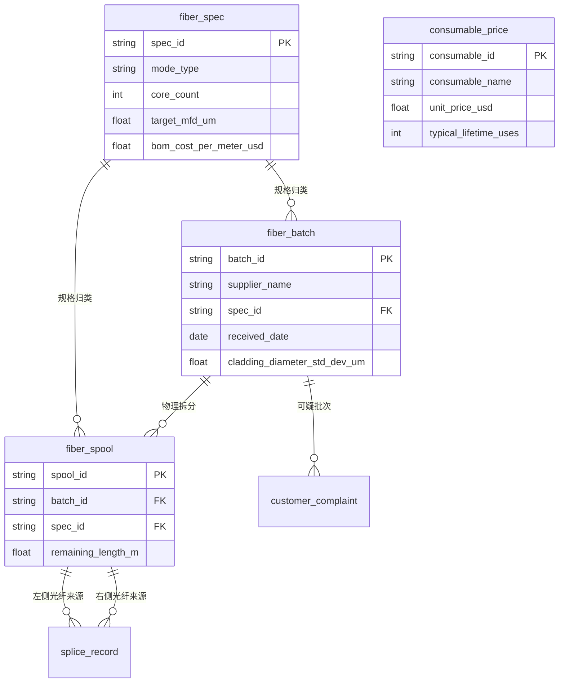
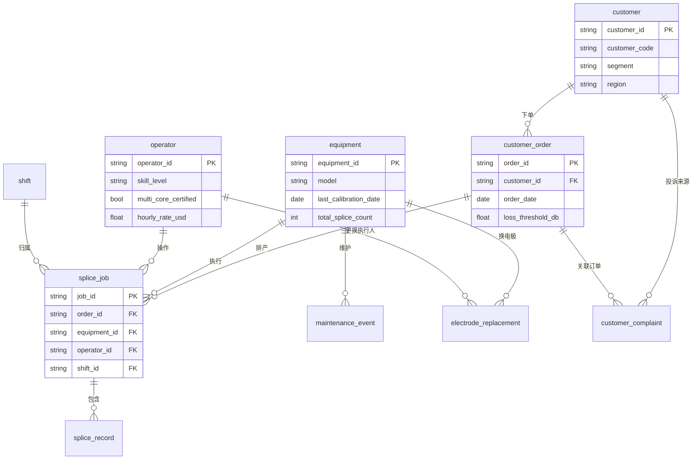
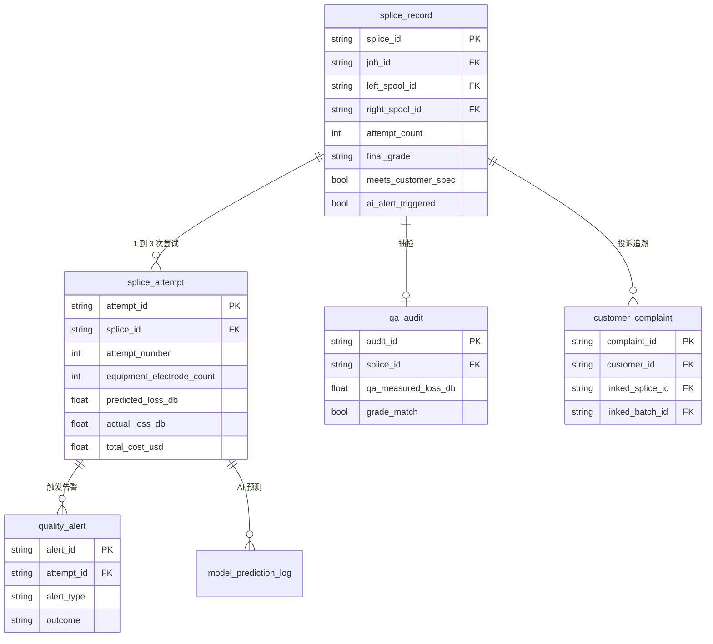

# Fiber Splicing Quality and Cost Control Dataset ER Document

For business background, industry primer, and terminology, see `01-telecom_equipment_fiber_splicing_quality_high_business_context-cn.md`. This document covers the data only.

Dataset metadata:

- Complexity: High
- Table count: 18
- Total record count: approximately 220,000 rows
- Foreign key relationships: 22 declarative FKs, plus 1 logical reference not enforced by DDL (`splice_record.final_attempt_id` → `splice_attempt.attempt_id`, not declared in CREATE TABLE because of a circular dependency)
- `REFERENCE_DATE` = 2026-06-15

---

## 1. ER Diagrams for the Three Sub-Domains

A single diagram covering all 18 tables would be unreadable, so it's split into three domains. The central entity, `splice_record`, appears in all three diagrams.

### Sub-diagram 1, Materials and Reference Data



### Sub-diagram 2, Production Resources and Orders



### Sub-diagram 3, Splicing Events, Quality, and AI



---

## 2. fiber_spec

Fiber specification catalog. Each row represents one fiber type that NorthArc purchases and uses (G.652.D single-mode, G.657.A1 bend-insensitive single-mode, OM4 multi-mode, OM5 multi-mode, 4-core multi-core). Every `fiber_batch` and `fiber_spool` in the plant is tied to a spec, and `splice_record` connects to a spec indirectly through the spool. VP Operations and Engineering use this table to understand material types and unit cost; they don't look at individual batches directly.

| Column | Type | Constraint | Description |
|------|------|------|------|
| spec_id | VARCHAR(20) | PK | Spec code, e.g. `SMF-G652D`, `MCF-4C` |
| spec_name | VARCHAR(80) | NOT NULL | Full name |
| mode_type | VARCHAR(20) | NOT NULL | One of `single`, `multi`, `multi_core` |
| core_count | INTEGER | NOT NULL | 1 (single), 1 (multi-mode), 4 or 7 (multi-core) |
| target_cladding_diameter_um | FLOAT | NOT NULL | Design cladding diameter (microns), all 125.0 |
| target_mfd_um | FLOAT | NOT NULL | Design mode field diameter (microns), about 10.4 for single-mode, about 50 for multi-mode |
| applications | VARCHAR(120) | NOT NULL | Text description of application scenario |
| bom_cost_per_meter_usd | NUMERIC(10,4) | NOT NULL | BOM cost, dollars per meter |

**Sample data:**

| spec_id | spec_name | mode_type | core_count | target_mfd_um | bom_cost_per_meter_usd |
|---------|-----------|-----------|------------|---------------|------------------------|
| SMF-G652D | Standard Single-Mode G.652.D | single | 1 | 10.4 | 0.18 |
| SMF-G657A1 | Bend-Insensitive Single-Mode G.657.A1 | single | 1 | 9.2 | 0.34 |
| MMF-OM4 | Multi-Mode OM4 | multi | 1 | 50.0 | 0.42 |
| MMF-OM5 | Multi-Mode OM5 Wide-Band | multi | 1 | 50.0 | 0.58 |
| MCF-4C | Multi-Core 4-Channel | multi_core | 4 | 9.6 | 4.80 |

---

## 3. fiber_batch

Fiber purchase batch table. Each row is one shipment from a supplier. A shipment comes from a single supplier and contains a number of spools (10 to 30), all sharing one QC release certificate. When a downstream splice shows a batch-level quality problem, the QA engineer traces from `fiber_spool` back to `fiber_batch` to decide whether to contact the supplier or launch a recall.

> Scope note: this dataset has two suppliers, CorningStock and SumiOptics. The `cladding_diameter_std_dev_um` field is the within-batch variance reported on the supplier's QC release certificate. NorthArc's internal QC does not re-measure the cladding of every spool — it accepts the supplier's certificate by default. This SOP is the root cause behind the Q8 recall risk.

| Column | Type | Constraint | Description |
|------|------|------|------|
| batch_id | VARCHAR(20) | PK | Batch number, format `MFG-YYYY-NNN` |
| supplier_name | VARCHAR(40) | NOT NULL | Supplier, `CorningStock` or `SumiOptics` |
| spec_id | VARCHAR(20) | FK → fiber_spec.spec_id | Spec |
| received_date | DATE | NOT NULL | Date received into inventory |
| spool_count | INTEGER | NOT NULL | Number of spools in the batch, 10 to 30 |
| length_per_spool_m | INTEGER | NOT NULL | Length per spool, typically 25000 meters |
| qc_release_status | VARCHAR(20) | NOT NULL | `passed`, `conditional`, `rejected` |
| cladding_diameter_std_dev_um | FLOAT | NOT NULL | Within-batch variance reported by the supplier, normally 0.15 |
| unit_price_per_meter_usd | NUMERIC(10,4) | NOT NULL | Purchase unit price |
| notes | VARCHAR(200) | NULL | Notes |

**Sample data:**

| batch_id | supplier_name | spec_id | received_date | spool_count | qc_release_status | cladding_diameter_std_dev_um |
|----------|---------------|---------|---------------|-------------|-------------------|------------------------------|
| MFG-2025-001 | CorningStock | SMF-G652D | 2025-06-20 | 20 | passed | 0.14 |
| MFG-2025-015 | SumiOptics | MMF-OM4 | 2025-09-08 | 12 | passed | 0.18 |
| MFG-2024-038 | SumiOptics | SMF-G652D | 2025-11-22 | 15 | conditional | 0.62 |

Note the third row, `MFG-2024-038`: its variance is roughly 4x every other batch, yet the supplier still shipped it as `conditional` pass. This is the root-cause data behind the Q8 recall risk.

---

## 4. fiber_spool

Physical fiber spool table. Each row is one spool of fiber sitting in the warehouse — the smallest unit of NorthArc inventory. The inventory clerk uses this table to track stock, and splice operators use it when pulling material. Each `splice_record` references two `fiber_spool` rows (the left-side fiber source and the right-side fiber source).

| Column | Type | Constraint | Description |
|------|------|------|------|
| spool_id | VARCHAR(20) | PK | Spool number, format `SP-YYYY-NNNNN` |
| batch_id | VARCHAR(20) | FK → fiber_batch.batch_id | Parent batch |
| spec_id | VARCHAR(20) | FK → fiber_spec.spec_id | Spec (redundant field, for query convenience) |
| received_date | DATE | NOT NULL | Date received, same as the batch |
| remaining_length_m | FLOAT | NOT NULL | Remaining length in meters, starts at 25000 |
| location | VARCHAR(20) | NOT NULL | Warehouse slot, `WH-A1`, `WH-B2` |
| status | VARCHAR(20) | NOT NULL | `available`, `in_use`, `depleted` |

**Sample data:**

| spool_id | batch_id | spec_id | remaining_length_m | status |
|----------|----------|---------|--------------------|--------|
| SP-2025-00001 | MFG-2025-001 | SMF-G652D | 18420.0 | in_use |
| SP-2025-00237 | MFG-2024-038 | SMF-G652D | 12800.0 | in_use |
| SP-2025-00350 | MFG-2025-022 | MCF-4C | 24800.0 | available |

---

## 5. consumable_price

Consumables price table. 6 rows, listing every consumable used on the floor (electrode pairs, cleaver blades, isopropyl alcohol bottles, boxes of lint-free wipes, packs of splice protectors, calibration fiber). The manufacturing analyst uses this table to convert `splice_attempt.consumable_cost_usd` into a dollar figure.

| Column | Type | Constraint | Description |
|------|------|------|------|
| consumable_id | VARCHAR(20) | PK | Consumable code |
| consumable_name | VARCHAR(80) | NOT NULL | Consumable name |
| unit_price_usd | NUMERIC(10,2) | NOT NULL | Unit price in dollars |
| typical_lifetime_uses | INTEGER | NOT NULL | Typical lifetime in uses, 2000 for one electrode pair |
| last_updated | DATE | NOT NULL | Date the price was last updated |

**Sample data:**

| consumable_id | consumable_name | unit_price_usd | typical_lifetime_uses |
|---------------|-----------------|----------------|-----------------------|
| ELEC-FSM100 | Electrode Pair, Fujikura FSM-100P | 180.00 | 2000 |
| BLADE-CT50 | Cleaver Blade, Sumitomo CT-50 | 245.00 | 24000 |
| IPA-BTL500 | Isopropyl Alcohol 500ml | 12.50 | 800 |
| WIPE-BOX | Lint-Free Wipe, 200/box | 28.00 | 200 |
| PROT-SP60 | Splice Protector, 60mm, 100/pack | 32.00 | 100 |
| CAL-FIBER | Calibration Fiber Reference | 480.00 | 30 |

---

## 6. customer

Customer master table. 12 rows, 4 customers in each of the three segments. `customer_code` is an internal code name and does not expose real customer names. VP Sales and Marcus both consult this table, since customer segment directly determines the splice `loss_threshold` (loose for FTTH, strict for hyperscale).

| Column | Type | Constraint | Description |
|------|------|------|------|
| customer_id | VARCHAR(20) | PK | Internal ID, format `CUS-NNN` |
| customer_code | VARCHAR(40) | NOT NULL | Internal code name, e.g. `DC-Alpha`, `FTTH-CCom` |
| segment | VARCHAR(40) | NOT NULL | `hyperscale_datacenter`, `ftth_carrier`, `enterprise_network` |
| region | VARCHAR(20) | NOT NULL | `US-West`, `US-Central`, `US-East`, `Canada` |
| relationship_start_date | DATE | NOT NULL | Date the relationship began |
| contract_value_annual_usd | NUMERIC(12,2) | NOT NULL | Annual contract value |

**Sample data:**

| customer_id | customer_code | segment | region | contract_value_annual_usd |
|-------------|---------------|---------|--------|---------------------------|
| CUS-001 | DC-Alpha | hyperscale_datacenter | US-West | 12500000.00 |
| CUS-005 | FTTH-CCom | ftth_carrier | US-Central | 4200000.00 |
| CUS-009 | ENT-Helix | enterprise_network | US-East | 850000.00 |

---

## 7. shift

Shift definition table. Only 3 rows, but it runs through all splice data. Day shift has a senior supervisor on the floor, Swing shift has normal supervision, and Night shift has no senior supervisor present. This is the organizational root cause behind the Q3 night-shift quality problem.

| Column | Type | Constraint | Description |
|------|------|------|------|
| shift_id | VARCHAR(10) | PK | `SH-D`, `SH-S`, `SH-N` |
| shift_name | VARCHAR(20) | NOT NULL | `Day`, `Swing`, `Night` |
| start_hour | INTEGER | NOT NULL | 0 to 23 |
| end_hour | INTEGER | NOT NULL | 0 to 23 |
| supervisor_name | VARCHAR(80) | NOT NULL | Supervisor name |
| has_senior_supervisor | BOOLEAN | NOT NULL | Whether a senior supervisor is present on the floor; currently True for Day and Swing, False for Night |

**Sample data:**

| shift_id | shift_name | start_hour | end_hour | has_senior_supervisor |
|----------|------------|------------|----------|------------------------|
| SH-D | Day | 8 | 16 | True |
| SH-S | Swing | 16 | 0 | True |
| SH-N | Night | 0 | 8 | False |

---

## 8. equipment

Splicing equipment table, 12 machines. It has two extra fields beyond a bare-bones version, `purchase_cost_usd` and `depreciation_monthly_usd`, because the cost analysis needs to allocate equipment depreciation down to `splice_attempt`. `calibration_interval_days_sop` is the calibration interval mandated by SOP (currently 90 days). `last_calibration_date` plus 90 days versus `REFERENCE_DATE` determines whether a machine is overdue.

| Column | Type | Constraint | Description |
|------|------|------|------|
| equipment_id | VARCHAR(20) | PK | Equipment number, `EQ-NNN` |
| model | VARCHAR(60) | NOT NULL | Model, e.g. Fujikura FSM-100P, Sumitomo T-72C |
| serial_number | VARCHAR(40) | NOT NULL | Manufacturer serial number |
| purchase_date | DATE | NOT NULL | Purchase date |
| purchase_cost_usd | NUMERIC(12,2) | NOT NULL | Purchase price |
| depreciation_monthly_usd | NUMERIC(10,2) | NOT NULL | Monthly depreciation, straight-line over 5 years |
| location | VARCHAR(20) | NOT NULL | Production line, `Line-A`, `Line-B`, `Line-C`, `Lab-1` |
| last_calibration_date | DATE | NOT NULL | Date of most recent calibration |
| calibration_interval_days_sop | INTEGER | NOT NULL | SOP calibration interval, currently fixed at 90 |
| total_splice_count | INTEGER | NOT NULL | Cumulative splice count, aligned with the actual record count in `splice_attempt` |
| status | VARCHAR(20) | NOT NULL | `active`, `maintenance`, `offline` |

**Indexes:**

- `idx_equipment_location` on `location`
- `idx_equipment_status` on `status`

**Sample data:**

| equipment_id | model | purchase_cost_usd | last_calibration_date | total_splice_count | status |
|--------------|-------|-------------------|-----------------------|---------------------|--------|
| EQ-001 | Fujikura FSM-100P | 38500.00 | 2026-04-08 | 4823 | active |
| EQ-007 | Sumitomo T-72C | 32000.00 | 2026-01-15 | 5104 | active |
| EQ-011 | FITEL S179A | 28800.00 | 2026-05-20 | 3892 | maintenance |

EQ-007's `last_calibration_date` is 2026-01-15, 151 days before `REFERENCE_DATE` — badly overdue. This is Q7 data.

---

## 9. operator

Operator table, 30 people. The key fields are `skill_level` (junior, intermediate, senior, expert) and `multi_core_certified`. Current scheduling policy: any operator can take single- or multi-mode jobs, but multi-core jobs are only allowed for operators with `multi_core_certified = True`. The problem is that the certification bar is too loose — some junior operators hold the cert too, but their actual multi-core work quality is poor. This is the root cause behind Q4.

| Column | Type | Constraint | Description |
|------|------|------|------|
| operator_id | VARCHAR(20) | PK | `OP-NNN` |
| name | VARCHAR(120) | NOT NULL | Name |
| skill_level | VARCHAR(20) | NOT NULL | `junior`, `intermediate`, `senior`, `expert` |
| certification_date | DATE | NOT NULL | Date passed onboarding certification |
| default_shift_id | VARCHAR(10) | FK → shift.shift_id | Primary shift |
| hourly_rate_usd | NUMERIC(6,2) | NOT NULL | Hourly wage |
| hire_date | DATE | NOT NULL | Hire date |
| multi_core_certified | BOOLEAN | NOT NULL | Whether allowed to take multi-core splicing jobs |
| department | VARCHAR(40) | NOT NULL | `Production`, `R&D`, `Quality Assurance` |

**Indexes:**

- `idx_operator_skill` on `skill_level`
- `idx_operator_shift` on `default_shift_id`

**Sample data:**

| operator_id | name | skill_level | default_shift_id | hourly_rate_usd | multi_core_certified |
|-------------|------|-------------|-------------------|------------------|-----------------------|
| OP-003 | Diana Hoffman | expert | SH-D | 38.50 | True |
| OP-014 | Marcus Liu | junior | SH-N | 22.50 | True |
| OP-027 | Patricia Goss | senior | SH-S | 33.00 | True |

Note OP-014 is junior but holds the multi-core cert — this situation applies to 30% of junior operators in the data. This is the source of the Q4 mismatch.

---

## 10. customer_order

Customer order table. 250 rows, POs placed over the 12-month window. Each PO maps to one product spec (e.g. a 12-fiber MTP trunk, 3 meters), one quantity (e.g. 480 cables), and is broken down internally into several `splice_job` rows to fulfill. The key field is `loss_threshold_db`, the spec written into the customer's contract. NorthArc's internal SOP doesn't use it — instead it applies a blanket 0.05 threshold to everything. This is the core conflict behind Q5.

| Column | Type | Constraint | Description |
|------|------|------|------|
| order_id | VARCHAR(20) | PK | `PO-YYYY-NNNN` |
| customer_id | VARCHAR(20) | FK → customer.customer_id | Customer |
| order_date | DATE | NOT NULL | Order date |
| promised_delivery_date | DATE | NOT NULL | Promised delivery date |
| product_code | VARCHAR(40) | NOT NULL | Product code |
| quantity_cables | INTEGER | NOT NULL | Number of finished cables |
| splices_required | INTEGER | NOT NULL | Total splices required, typically 2 per cable |
| unit_price_usd | NUMERIC(10,2) | NOT NULL | Unit price |
| loss_threshold_db | FLOAT | NOT NULL | Spec from the customer contract, in dB. FTTH 0.30, enterprise 0.10, hyperscale 0.05 |
| status | VARCHAR(20) | NOT NULL | `open`, `in_production`, `shipped`, `closed` |

**Sample data:**

| order_id | customer_id | product_code | quantity_cables | splices_required | loss_threshold_db |
|----------|-------------|---------------|------------------|-------------------|---------------------|
| PO-2025-0014 | CUS-001 (DC-Alpha) | MTP12-OS2-3M | 1200 | 14400 | 0.05 |
| PO-2025-0089 | CUS-005 (FTTH-CCom) | LC-Drop-50M | 800 | 1600 | 0.30 |
| PO-2026-0042 | CUS-009 (ENT-Helix) | LC-Patch-2M | 200 | 400 | 0.10 |

---

## 11. splice_job

Production batch table. 800 rows. A job is one continuous work session by one operator on one machine, typically 30 to 200 splices, taking 2 to 6 hours. One `customer_order` is broken into multiple jobs to complete. The Production Manager uses this table for scheduling and for capacity-utilization reporting.

| Column | Type | Constraint | Description |
|------|------|------|------|
| job_id | VARCHAR(20) | PK | `JOB-YYYY-NNNN` |
| order_id | VARCHAR(20) | FK → customer_order.order_id | Order |
| equipment_id | VARCHAR(20) | FK → equipment.equipment_id | Equipment |
| operator_id | VARCHAR(20) | FK → operator.operator_id | Operator |
| shift_id | VARCHAR(10) | FK → shift.shift_id | Shift |
| planned_start_ts | DATETIME | NOT NULL | Planned start |
| planned_end_ts | DATETIME | NOT NULL | Planned end |
| actual_start_ts | DATETIME | NOT NULL | Actual start |
| actual_end_ts | DATETIME | NOT NULL | Actual end |
| target_splice_count | INTEGER | NOT NULL | Planned splice count |
| completed_splice_count | INTEGER | NOT NULL | Actual completed count |
| status | VARCHAR(20) | NOT NULL | `completed`, `paused`, `cancelled` |

**Indexes:**

- `idx_job_order` on `order_id`
- `idx_job_equipment` on `equipment_id`
- `idx_job_actual_start` on `actual_start_ts`

**Sample data:**

| job_id | order_id | equipment_id | operator_id | shift_id | completed_splice_count | status |
|--------|----------|--------------|-------------|----------|-------------------------|--------|
| JOB-2025-0042 | PO-2025-0014 | EQ-001 | OP-003 | SH-D | 142 | completed |
| JOB-2025-0186 | PO-2025-0089 | EQ-007 | OP-014 | SH-N | 78 | completed |

---

## 12. splice_record

Main splicing record table, approximately 50,000 rows. Each row is the logical entity of one splice joint. A joint may go through 1 to 3 attempts (retries); this table records the final outcome, with attempt-level detail in the next table. This is the most important fact table in the whole dataset — nearly every business analysis query joins against it.

> Scope note: each splice references a left-side and a right-side `fiber_spool`. The left and right sides may not be the same spool. `final_attempt_id` is a logical reference (pointing to `splice_attempt.attempt_id`), but the DDL does not declare it as an FK because of a circular dependency. Both the generator and the SQL queries assume this reference is consistent.

| Column | Type | Constraint | Description |
|------|------|------|------|
| splice_id | VARCHAR(20) | PK | `SPL-NNNNNNN` |
| job_id | VARCHAR(20) | FK → splice_job.job_id | Parent job |
| left_spool_id | VARCHAR(20) | FK → fiber_spool.spool_id | Left-side fiber |
| right_spool_id | VARCHAR(20) | FK → fiber_spool.spool_id | Right-side fiber |
| equipment_id | VARCHAR(20) | FK → equipment.equipment_id | Equipment (same as job) |
| operator_id | VARCHAR(20) | FK → operator.operator_id | Operator (same as job) |
| shift_id | VARCHAR(10) | FK → shift.shift_id | Shift (same as job) |
| planned_position_in_job | INTEGER | NOT NULL | Sequence number within the job |
| started_ts | DATETIME | NOT NULL | Start time of the first attempt |
| completed_ts | DATETIME | NOT NULL | Completion time of the last attempt |
| attempt_count | INTEGER | NOT NULL | 1, 2, or 3 |
| final_attempt_id | VARCHAR(20) | NULL | ID of the attempt that was ultimately accepted or rejected (logical reference) |
| final_loss_db | FLOAT | NOT NULL | Final loss value |
| final_grade | VARCHAR(10) | NOT NULL | `A`, `B`, `C`, `Reject` |
| meets_customer_spec | BOOLEAN | NOT NULL | Whether final_loss_db is ≤ that order's loss_threshold_db |
| ai_alert_triggered | BOOLEAN | NOT NULL | Whether a quality_alert was triggered |
| image_path | VARCHAR(200) | NULL | Path to the end-face image |

**Indexes:**

- `idx_splice_completed_ts` on `completed_ts`
- `idx_splice_final_grade` on `final_grade`
- `idx_splice_job` on `job_id`
- `idx_splice_equipment` on `equipment_id`
- `idx_splice_operator` on `operator_id`

**Sample data:**

| splice_id | job_id | attempt_count | final_loss_db | final_grade | meets_customer_spec |
|-----------|--------|----------------|----------------|--------------|----------------------|
| SPL-0000142 | JOB-2025-0042 | 1 | 0.018 | A | True |
| SPL-0017388 | JOB-2025-0186 | 2 | 0.062 | C | True (FTTH 0.30) |
| SPL-0024917 | JOB-2026-0042 | 3 | 0.094 | Reject | False |

Note SPL-0017388: it's internally graded C, but since the customer's spec is FTTH 0.30, it's actually acceptable to the customer. This is the textbook case in the Q5 over-quality trap.

---

## 13. splice_attempt

Splice attempt detail table, approximately 55,000 rows. Each row is one physical attempt at a splicing operation. Each `splice_record` maps to 1 to 3 `splice_attempt` rows. Even a first attempt that fails leaves a complete record here, including all geometric parameters, equipment parameters, environmental parameters, predicted loss, actual loss, and the cost of that attempt. **The `equipment_electrode_count` field records how many times the current electrode pair had already been used at the moment this attempt happened** (counted since that machine's last `electrode_replacement`). This is the core breakdown dimension for the Q2 electrode-wear analysis.

| Column | Type | Constraint | Description |
|------|------|------|------|
| attempt_id | VARCHAR(20) | PK | `ATT-NNNNNNN` |
| splice_id | VARCHAR(20) | FK → splice_record.splice_id | Parent splice |
| attempt_number | INTEGER | NOT NULL | 1, 2, or 3 |
| attempt_ts | DATETIME | NOT NULL | Time of this attempt |
| duration_seconds | INTEGER | NOT NULL | Duration of this attempt in seconds |
| left_core_offset_x_um | FLOAT | NOT NULL | Left-side core X offset |
| left_core_offset_y_um | FLOAT | NOT NULL | Left-side core Y offset |
| right_core_offset_x_um | FLOAT | NOT NULL | Right-side core X offset |
| right_core_offset_y_um | FLOAT | NOT NULL | Right-side core Y offset |
| core_to_core_distance_um | FLOAT | NOT NULL | Core-to-core distance (microns), computed from X/Y offsets |
| angle_deviation_deg | FLOAT | NOT NULL | Overall angle deviation |
| left_cleave_angle_deg | FLOAT | NOT NULL | Left end-face cleave angle |
| right_cleave_angle_deg | FLOAT | NOT NULL | Right end-face cleave angle |
| arc_power_mw | FLOAT | NOT NULL | Main arc power |
| arc_duration_ms | INTEGER | NOT NULL | Main arc duration |
| prefusion_time_ms | INTEGER | NOT NULL | Prefusion time |
| overlap_um | FLOAT | NOT NULL | End-face overlap amount |
| ambient_temp_c | FLOAT | NOT NULL | Ambient temperature |
| humidity_percent | FLOAT | NOT NULL | Ambient humidity |
| equipment_electrode_count | INTEGER | NOT NULL | Number of times the electrode pair had been used as of this attempt |
| predicted_loss_db | FLOAT | NOT NULL | AI-predicted loss |
| actual_loss_db | FLOAT | NOT NULL | Actual loss estimated by the LID algorithm |
| attempt_grade | VARCHAR(10) | NOT NULL | `A`, `B`, `C`, `Reject` |
| attempt_outcome | VARCHAR(20) | NOT NULL | `accepted`, `retry`, `final_reject` |
| material_cost_usd | NUMERIC(8,4) | NOT NULL | Material cost (fiber loss + protective sleeve) |
| labor_cost_usd | NUMERIC(8,4) | NOT NULL | Labor cost (operator hourly rate × time spent) |
| machine_cost_usd | NUMERIC(8,4) | NOT NULL | Machine cost (depreciation + amortized power) |
| consumable_cost_usd | NUMERIC(8,4) | NOT NULL | Consumables cost (amortized electrode + blade + isopropyl alcohol, etc.) |
| total_cost_usd | NUMERIC(8,4) | NOT NULL | Sum of the four cost components |

**Indexes:**

- `idx_attempt_splice` on `splice_id`
- `idx_attempt_ts` on `attempt_ts`
- `idx_attempt_grade` on `attempt_grade`

**Sample data:**

| attempt_id | splice_id | attempt_number | equipment_electrode_count | actual_loss_db | attempt_grade | total_cost_usd |
|------------|-----------|----------------|----------------------------|------------------|----------------|------------------|
| ATT-0000142 | SPL-0000142 | 1 | 458 | 0.018 | A | 2.34 |
| ATT-0019522 | SPL-0017388 | 1 | 2180 | 0.118 | Reject | 2.41 |
| ATT-0019523 | SPL-0017388 | 2 | 2181 | 0.062 | C | 2.41 |

Note ATT-0019522: electrode_count is 2180, already past the 2000-use lifetime threshold. This is the textbook sample of Q2 electrode wear.

---

## 14. electrode_replacement

Electrode replacement log, approximately 700 rows. Each row is one electrode-replacement event. The current SOP is reactive (replace only after a warning fires), and the data shows `splices_on_old_pair` mostly falling between 1800 and 3000, well past the manufacturer-recommended 2000.

| Column | Type | Constraint | Description |
|------|------|------|------|
| replacement_id | VARCHAR(20) | PK | `ER-NNNNN` |
| equipment_id | VARCHAR(20) | FK → equipment.equipment_id | Equipment |
| replacement_ts | DATETIME | NOT NULL | Replacement time |
| splices_on_old_pair | INTEGER | NOT NULL | Splice count completed by the old electrode pair |
| reason | VARCHAR(40) | NOT NULL | `condition_warning`, `quality_drift_detected`, `scheduled`, `unplanned_failure` |
| new_pair_part_number | VARCHAR(40) | NOT NULL | New electrode part number |
| new_pair_cost_usd | NUMERIC(8,2) | NOT NULL | New electrode cost, typically 180.00 |
| replaced_by_operator_id | VARCHAR(20) | FK → operator.operator_id | Who performed the replacement |

**Sample data:**

| replacement_id | equipment_id | splices_on_old_pair | reason | new_pair_cost_usd |
|----------------|---------------|----------------------|--------|---------------------|
| ER-00042 | EQ-001 | 2380 | condition_warning | 180.00 |
| ER-00128 | EQ-007 | 2950 | unplanned_failure | 180.00 |

---

## 15. maintenance_event

Equipment maintenance log, approximately 150 rows. Covers four event types: calibration, repair, preventive maintenance, and cleaning. Supporting data for the Q7 calibration-overdue analysis.

| Column | Type | Constraint | Description |
|------|------|------|------|
| event_id | VARCHAR(20) | PK | `MAINT-NNNNN` |
| equipment_id | VARCHAR(20) | FK → equipment.equipment_id | Equipment |
| event_ts | DATETIME | NOT NULL | Event time |
| event_type | VARCHAR(20) | NOT NULL | `calibration`, `repair`, `pm`, `cleaning` |
| duration_hours | FLOAT | NOT NULL | Duration in hours |
| parts_cost_usd | NUMERIC(10,2) | NOT NULL | Parts cost |
| labor_cost_usd | NUMERIC(10,2) | NOT NULL | Labor cost |
| performed_by | VARCHAR(80) | NOT NULL | Who performed it, an internal engineer or an outside field service engineer |
| notes | VARCHAR(200) | NULL | Notes |
| next_due_date | DATE | NULL | Next scheduled date |

**Sample data:**

| event_id | equipment_id | event_type | duration_hours | parts_cost_usd | next_due_date |
|----------|---------------|------------|----------------|------------------|----------------|
| MAINT-00012 | EQ-001 | calibration | 2.5 | 480.00 | 2026-07-08 |
| MAINT-00038 | EQ-007 | repair | 8.0 | 1240.00 | NULL |

---

## 16. quality_alert

AI quality alert table, approximately 5,000 rows. Fires when the AI model predicts a loss above the threshold (internally 0.05). Alerts hang off `splice_attempt` (not `splice_record`), because all 3 attempts on the same splice can each trigger their own alert. `outcome` is what the operator actually did about it, and it's the core field for Q6.

| Column | Type | Constraint | Description |
|------|------|------|------|
| alert_id | VARCHAR(20) | PK | `ALT-NNNNN` |
| attempt_id | VARCHAR(20) | FK → splice_attempt.attempt_id | Associated attempt |
| alert_ts | DATETIME | NOT NULL | Alert time |
| alert_type | VARCHAR(40) | NOT NULL | `high_loss_predicted`, `angle_out_of_spec`, `equipment_drift`, `cleave_angle_exceeded`, `electrode_warning` |
| predicted_loss_db | FLOAT | NOT NULL | Predicted value at the moment the alert fired |
| threshold_db | FLOAT | NOT NULL | Trigger threshold, currently fixed at 0.05 |
| recommended_action | TEXT | NOT NULL | Text description of the AI's recommended action |
| action_taken | VARCHAR(40) | NULL | `reclean_and_retry`, `adjust_parameters`, `equipment_check`, `fiber_replaced`, `ignored` |
| outcome | VARCHAR(20) | NULL | `resolved`, `ignored`, `escalated` |
| resolution_ts | DATETIME | NULL | Resolution time |

**Indexes:**

- `idx_alert_attempt` on `attempt_id`
- `idx_alert_outcome` on `outcome`
- `idx_alert_ts` on `alert_ts`

**Sample data:**

| alert_id | attempt_id | alert_type | outcome |
|----------|-------------|------------|---------|
| ALT-00128 | ATT-0019522 | high_loss_predicted | resolved |
| ALT-00415 | ATT-0024918 | electrode_warning | ignored |

---

## 17. qa_audit

QA spot-check table, approximately 2,500 rows. Every day, QA engineers randomly sample 5% of splices for a real OTDR measurement and compare it against the internal LID estimate. The main purpose is to detect systematic bias in the LID algorithm and to check how reliable operator self-grading is.

| Column | Type | Constraint | Description |
|------|------|------|------|
| audit_id | VARCHAR(20) | PK | `QA-NNNNN` |
| splice_id | VARCHAR(20) | FK → splice_record.splice_id | Splice that was sampled |
| audit_ts | DATETIME | NOT NULL | Time of the audit |
| auditor_name | VARCHAR(80) | NOT NULL | QA engineer's name |
| operator_self_grade | VARCHAR(10) | NOT NULL | Grade as recorded in splice_record |
| qa_measured_loss_db | FLOAT | NOT NULL | Real loss measured via OTDR |
| qa_grade | VARCHAR(10) | NOT NULL | Grade as determined by QA |
| grade_match | BOOLEAN | NOT NULL | Whether the two grades agree |
| variance_db | FLOAT | NOT NULL | qa_measured_loss_db minus splice_record.final_loss_db |

**Sample data:**

| audit_id | splice_id | operator_self_grade | qa_measured_loss_db | qa_grade | grade_match |
|----------|-----------|----------------------|----------------------|----------|---------------|
| QA-00042 | SPL-0000142 | A | 0.019 | A | True |
| QA-00318 | SPL-0024580 | B | 0.084 | Reject | False |

---

## 18. customer_complaint

Customer complaint table, 30 rows. Every customer complaint received over the 12-month window, covering RMAs, field failures, and audit findings. The key fields `linked_splice_id` and `linked_batch_id` are results of after-the-fact tracing done by the QA team — not every complaint can be traced successfully. This is the core data for the Q8 recall-risk assessment.

| Column | Type | Constraint | Description |
|------|------|------|------|
| complaint_id | VARCHAR(20) | PK | `CMP-NNNN` |
| customer_id | VARCHAR(20) | FK → customer.customer_id | Complaining customer |
| order_id | VARCHAR(20) | FK → customer_order.order_id (NULL allowed) | Associated order |
| complaint_date | DATE | NOT NULL | Complaint date |
| complaint_type | VARCHAR(40) | NOT NULL | `high_loss_in_field`, `connector_failure`, `audit_finding`, `early_failure`, `intermittent` |
| linked_splice_id | VARCHAR(20) | FK → splice_record.splice_id (NULL allowed) | Splice traced to this complaint |
| linked_batch_id | VARCHAR(20) | FK → fiber_batch.batch_id (NULL allowed) | Batch traced to this complaint |
| severity | VARCHAR(20) | NOT NULL | `low`, `medium`, `high`, `critical` |
| resolution_status | VARCHAR(20) | NOT NULL | `open`, `investigating`, `resolved`, `escalated` |
| cost_impact_usd | NUMERIC(10,2) | NOT NULL | Financial loss (RMA + rework + credit memo) |

**Sample data:**

| complaint_id | customer_id | complaint_type | linked_batch_id | severity | cost_impact_usd |
|--------------|-------------|----------------|-------------------|----------|-------------------|
| CMP-0008 | CUS-005 | high_loss_in_field | MFG-2024-038 | high | 12400.00 |
| CMP-0019 | CUS-001 | audit_finding | NULL | medium | 3800.00 |

Of the 8 complaints of type `high_loss_in_field`, 6 trace back to the bad batch `MFG-2024-038`. This is key data for Q8.

---

## 19. model_prediction_log

Model prediction log, approximately 55,000 rows (one-to-one with `splice_attempt`). Records the input features, output, confidence score, and feature importance for every AI model call. Its main purpose is model monitoring and audit. It isn't on the primary business-analysis path, but the Q1 overview does use model-version accuracy statistics from it.

| Column | Type | Constraint | Description |
|------|------|------|------|
| prediction_id | VARCHAR(20) | PK | `PRED-NNNNNNN` |
| attempt_id | VARCHAR(20) | FK → splice_attempt.attempt_id | Associated attempt |
| model_version | VARCHAR(20) | NOT NULL | `v1.2.0`, `v2.0.0`, `v2.1.0`, etc. |
| prediction_ts | DATETIME | NOT NULL | Prediction time, a few seconds before attempt_ts |
| input_features | TEXT | NOT NULL | JSON string, snapshot of the model's input features |
| predicted_loss_db | FLOAT | NOT NULL | Model output |
| confidence_score | FLOAT | NOT NULL | 0.7 to 0.99 |
| feature_importance | TEXT | NOT NULL | JSON string, SHAP-style feature importance |

---

## 20. Data Generation Rules

The rules below form the contract between the Python generator and the SQL queries. The distributions actually produced by the generator must satisfy these clauses, or the conclusions in the SQL queries will be distorted.

### Chronological order

- `customer.relationship_start_date` ≤ `customer_order.order_date` ≤ `splice_job.planned_start_ts` ≤ `splice_job.actual_start_ts` ≤ `splice_record.started_ts` ≤ `splice_record.completed_ts`.
- For multiple attempts on the same splice: `splice_attempt[1].attempt_ts < splice_attempt[2].attempt_ts < splice_attempt[3].attempt_ts`, with adjacent gaps of 30 to 120 seconds.
- `splice_record.started_ts` equals the attempt_ts of its first attempt. `completed_ts` equals the attempt_ts of the last attempt plus its duration.
- `electrode_replacement.replacement_ts` divides that machine's electrode service cycles. Any `splice_attempt.equipment_electrode_count` equals the number of attempts on that machine since the last replacement.
- `model_prediction_log.prediction_ts` is 1 to 5 seconds earlier than the corresponding `splice_attempt.attempt_ts` (the prediction completes before the splice).
- `quality_alert.alert_ts` equals the corresponding `splice_attempt.attempt_ts` (the alert fires at the same time as the splice).
- `qa_audit.audit_ts` is 1 to 7 days after `splice_record.completed_ts`.
- `customer_complaint.complaint_date` is 0 to 90 days after the associated order's promised_delivery_date.

### Referential integrity

Declarative FKs follow the table definitions above. Three rules are enforced but not declared in DDL:

1. `splice_record.left_spool_id` ≠ `splice_record.right_spool_id` (the left and right fiber cannot be the same spool).
2. `splice_record.final_attempt_id` must point to an attempt_id under the same splice_id.
3. `splice_attempt.attempt_number` is unique and sequential within a given splice_id (1, 2, 3 — no gaps allowed).

### Value ranges

| Field | Range | Note |
|------|------|------|
| `fiber_batch.cladding_diameter_std_dev_um` | 0.10 to 0.20 (normal), 0.55 to 0.65 (anomalous batch) | Business trap 8 |
| `fiber_spec.target_cladding_diameter_um` | 125.0 (single-mode / multi-mode), 124.5 to 125.5 (multi-core) | Industry standard |
| `equipment.last_calibration_date` days before REFERENCE_DATE | 0 to 180 days, average 95 | Q7 calibration overdue |
| `equipment.calibration_interval_days_sop` | fixed at 90 | Current SOP |
| `operator.skill_level` distribution | junior 25%, intermediate 35%, senior 25%, expert 15% | Correlated with plant tenure |
| `operator.multi_core_certified` | 70% True across all staff (including 30% True among juniors, the source of the Q4 mismatch) | Current policy too loose |
| `customer.segment` split | hyperscale_datacenter 33%, ftth_carrier 33%, enterprise_network 34% | 4 customers each |
| `customer_order.loss_threshold_db` | hyperscale 0.05, enterprise 0.10, ftth 0.30 | Per customer contract |
| `splice_attempt.angle_deviation_deg` | 0 to 2.0, normal σ=0.5 | Physical upper bound |
| `splice_attempt.left_cleave_angle_deg`, `right_cleave_angle_deg` | 0 to 1.5, normal σ=0.3 | Physical upper bound |
| `splice_attempt.arc_power_mw` | 11.5 to 13.5, normal center 12.5 | Equipment spec |
| `splice_attempt.ambient_temp_c` | 18 to 28, normal center 22 | Cleanroom HVAC |
| `splice_attempt.humidity_percent` | 20 to 80, normal center 45 | Cleanroom HVAC |
| `splice_attempt.equipment_electrode_count` | 0 to 3000, average 1200 | Depends on replacement frequency |
| `splice_attempt.actual_loss_db` | 0.001 to 0.20, driven by multiple factors | See "Computed fields" |
| `splice_attempt.predicted_loss_db` | actual_loss_db ± 0.005 | LID algorithm precision |
| `splice_attempt.confidence_score` | 0.70 to 0.99, inversely correlated with actual_loss | Model behavior |

### Computed fields

- `splice_attempt.core_to_core_distance_um` = sqrt((left_x - right_x)² + (left_y - right_y)²).
- `splice_attempt.actual_loss_db` is a sum of multiple factors: baseline + alignment + angle + cleave + electrode-wear penalty + batch-variance penalty + shift penalty + operator-skill penalty + environmental penalty + noise. The exact formula lives in the generator's calibration constants section; this ER document only describes the direction of each effect.
- `splice_attempt.attempt_grade` is determined by actual_loss_db: A ≤ 0.02, B ≤ 0.05, C ≤ 0.08, Reject > 0.08.
- `splice_attempt.attempt_outcome` is determined by attempt_grade and attempt_number. Grade A / B is always `accepted`. Grade C is `retry` when attempt_number < 3, otherwise `accepted` (accepted under a looser spec on the final try). Grade Reject is `retry` when attempt_number < 3, otherwise `final_reject`.
- `splice_attempt.material_cost_usd` = (0.4 meters of fiber consumed × the spool's spec unit price) + $0.32 for the protective sleeve. Depends on spec, roughly $0.39 to $2.40.
- `splice_attempt.labor_cost_usd` = operator.hourly_rate_usd × duration_seconds / 3600. Roughly $0.60 to $1.10.
- `splice_attempt.machine_cost_usd` = equipment.depreciation_monthly_usd amortized per minute. Roughly $0.20.
- `splice_attempt.consumable_cost_usd` = electrode amortization ($180 / 2000) + blade amortization ($245 / 24000) + amortized isopropyl alcohol + wipes. Roughly $0.10.
- `splice_attempt.total_cost_usd` = sum of the four cost components.
- `splice_record.final_loss_db` = actual_loss_db of that splice's last attempt.
- `splice_record.final_grade` = attempt_grade of that splice's last attempt.
- `splice_record.meets_customer_spec` = final_loss_db ≤ the associated customer_order.loss_threshold_db.
- `splice_record.ai_alert_triggered` = (whether any attempt on that splice triggered a quality_alert).
- `splice_record.attempt_count` = actual number of attempts on that splice.
- `equipment.total_splice_count` = total number of splice_attempt rows for that machine.

### Distribution rules, overall targets

Overall final_grade target distribution:

- A: approximately 75%
- B: approximately 18%
- C: approximately 4.5%
- Reject: approximately 2.5%

attempt_count target distribution:

- 1 attempt: approximately 88% (First-Pass Yield)
- 2 attempts: approximately 9%
- 3 attempts: approximately 3%

quality_alert outcome target distribution:

- resolved: approximately 75%
- escalated: approximately 10%
- ignored: approximately 15%

### Business traps, expected magnitude

Each trap maps to one or more Qs, and the SQL queries document contains the corresponding queries.

**Trap 1: Overview, annualized loss broken down by driver (Q1)**
Summed over 12 months, the splice process's total reject + retry cost is approximately $720K (consistent with the CFO's $1.2M reduction target, leaving $480K to be found in other processes). Approximate contribution shares by driver: electrode wear ~25%, operator mismatch ~20%, ignored AI alerts ~18%, calibration overdue ~15%, shift variation ~10%, bad batch MFG-2024-038 ~7%, over-quality (FTTH) ~5%.

**Trap 2: Electrode wear (Q2)**
Reject rate bucketed by electrode_count:

- 0 to 1000: ~1.2%
- 1000 to 1800: ~1.8%
- 1800 to 2200: ~4.5%
- 2200 to 2600: ~9.0%
- 2600+: ~17.0%

Overall, attempts with count > 2000 make up about 18% of volume but contribute about 45% of rejects. SQL queries Q2-1, Q2-2 expose this bias.

**Trap 3: Night-shift quality degradation (Q3)**
Reject rate by shift:

- Day (SH-D): ~1.8%
- Swing (SH-S): ~2.5%
- Night (SH-N): ~4.2%

Night shift accounts for 25% of volume but contributes about 42% of rejects. SQL queries Q3-1, Q3-2.

**Trap 4: Operator skill × multi-core mismatch (Q4)**
Reject rate by skill_level × fiber spec:

| skill / spec | single | multi | multi_core |
|---|---|---|---|
| junior | 1.5% | 2.5% | 25% |
| intermediate | 1.0% | 1.5% | 12% |
| senior | 0.8% | 1.0% | 3% |
| expert | 0.8% | 1.0% | 2% |

Currently 30% of multi-core jobs are assigned to junior + intermediate operators, and their reject rate is 18x that of senior operators. SQL queries Q4-1, Q4-2.

**Trap 5: Over-quality, spec-relaxation opportunity on FTTH orders (Q5)**
final_grade = Reject rate by customer segment:

- hyperscale (spec 0.05): ~3.0%
- enterprise (spec 0.10): ~2.5%
- ftth (spec 0.30): ~2.5% (as judged by internal SOP)

But judged against the customer's actual loss_threshold_db, FTTH orders' customer_spec_compliance is ~99.8%. In other words, of the splices graded Reject on FTTH orders, 99% are actually acceptable to the customer. SQL query Q5-1.

**Trap 6: Downstream impact of ignored AI alerts (Q6)**
`quality_alert.outcome` versus `splice_record.final_grade`:

- outcome = resolved: downstream final_reject rate ~3.0%
- outcome = escalated: ~8.0%
- outcome = ignored: ~35.0%

Broken down by shift, the night shift's ignored rate is about 28%, versus about 5% on day shift. SQL queries Q6-1, Q6-2.

**Trap 7: Calibration overdue (Q7)**
Reject rate bucketed by days between equipment.last_calibration_date and REFERENCE_DATE:

- ≤ 60 days: reject ~1.5%
- 60 to 90 days: ~2.0%
- 90 to 120 days: ~3.5%
- 120+ days: ~5.5%

Currently about 30% of equipment is overdue for calibration (> 90 days). SQL query Q7-1.

**Trap 8: Bad batch MFG-2024-038 (Q8)**
This batch's cladding_diameter_std_dev_um = 0.62 (about 4x every other batch). For splice_record rows using fiber from this batch:

- Total splice count: approximately 280
- Reject rate: ~12% (vs. baseline 1.5%)
- Delivered to FTTH-CCom: approximately 50 cables
- Associated customer_complaint rows: 6 (linked_batch_id = MFG-2024-038)
- Total cost_impact: approximately $58K

SQL queries Q8-1, Q8-2.

---

## 21. Faker Strategy

| Field pattern | Generation method | Note |
|---|---|---|
| operator.name | `fake.name()` | English names |
| supplier_name | `random.choice(["CorningStock", "SumiOptics"])` | 2 fictional suppliers |
| customer_code | 12 hand-written internal code names | e.g. DC-Alpha |
| customer.region | `random.choice(["US-West", "US-Central", "US-East", "Canada"])` | North America only |
| maintenance_event.performed_by | `fake.name()` plus occasionally `"{Model} FSE"` (manufacturer field service engineer) | Distinguishes internal vs. external |
| customer_complaint.complaint_type | Weighted sampling, high_loss_in_field 50%, remaining 50% split among others | Aligned with Trap 8 |
| Geometric parameters | `random.gauss()` with an added bias | Normal distribution plus trap |
| Timestamps | Increasing in job order, 30 to 120 seconds between attempts | Simulates line pacing |
| Loss values | Sum of a physical model | Traps embedded |

---

## 22. File Manifest

Load in topological order:

| # | Filename | Table | Rows | Depends on |
|---|--------|-----|------|------|
| 01 | 01_fiber_spec.tsv | fiber_spec | 5 | none |
| 02 | 02_consumable_price.tsv | consumable_price | 6 | none |
| 03 | 03_customer.tsv | customer | 12 | none |
| 04 | 04_shift.tsv | shift | 3 | none |
| 05 | 05_fiber_batch.tsv | fiber_batch | 60 | fiber_spec |
| 06 | 06_equipment.tsv | equipment | 12 | none |
| 07 | 07_operator.tsv | operator | 30 | shift |
| 08 | 08_customer_order.tsv | customer_order | 250 | customer |
| 09 | 09_fiber_spool.tsv | fiber_spool | 400 | fiber_batch, fiber_spec |
| 10 | 10_maintenance_event.tsv | maintenance_event | 150 | equipment |
| 11 | 11_splice_job.tsv | splice_job | 800 | customer_order, equipment, operator, shift |
| 12 | 12_electrode_replacement.tsv | electrode_replacement | 700 | equipment, operator |
| 13 | 13_splice_record.tsv | splice_record | 50,000 | splice_job, fiber_spool |
| 14 | 14_splice_attempt.tsv | splice_attempt | 55,000 | splice_record |
| 15 | 15_quality_alert.tsv | quality_alert | 5,000 | splice_attempt |
| 16 | 16_model_prediction_log.tsv | model_prediction_log | 55,000 | splice_attempt |
| 17 | 17_qa_audit.tsv | qa_audit | 2,500 | splice_record |
| 18 | 18_customer_complaint.tsv | customer_complaint | 30 | customer, customer_order, splice_record, fiber_batch |

Total ~220,000 rows.

---

## 23. SQLite DDL

```sql
CREATE TABLE fiber_spec (
    spec_id VARCHAR(20) PRIMARY KEY,
    spec_name VARCHAR(80) NOT NULL,
    mode_type VARCHAR(20) NOT NULL,
    core_count INTEGER NOT NULL,
    target_cladding_diameter_um FLOAT NOT NULL,
    target_mfd_um FLOAT NOT NULL,
    applications VARCHAR(120) NOT NULL,
    bom_cost_per_meter_usd NUMERIC(10,4) NOT NULL
);

CREATE TABLE consumable_price (
    consumable_id VARCHAR(20) PRIMARY KEY,
    consumable_name VARCHAR(80) NOT NULL,
    unit_price_usd NUMERIC(10,2) NOT NULL,
    typical_lifetime_uses INTEGER NOT NULL,
    last_updated DATE NOT NULL
);

CREATE TABLE customer (
    customer_id VARCHAR(20) PRIMARY KEY,
    customer_code VARCHAR(40) NOT NULL,
    segment VARCHAR(40) NOT NULL,
    region VARCHAR(20) NOT NULL,
    relationship_start_date DATE NOT NULL,
    contract_value_annual_usd NUMERIC(12,2) NOT NULL
);

CREATE TABLE shift (
    shift_id VARCHAR(10) PRIMARY KEY,
    shift_name VARCHAR(20) NOT NULL,
    start_hour INTEGER NOT NULL,
    end_hour INTEGER NOT NULL,
    supervisor_name VARCHAR(80) NOT NULL,
    has_senior_supervisor BOOLEAN NOT NULL
);

CREATE TABLE fiber_batch (
    batch_id VARCHAR(20) PRIMARY KEY,
    supplier_name VARCHAR(40) NOT NULL,
    spec_id VARCHAR(20) NOT NULL REFERENCES fiber_spec(spec_id),
    received_date DATE NOT NULL,
    spool_count INTEGER NOT NULL,
    length_per_spool_m INTEGER NOT NULL,
    qc_release_status VARCHAR(20) NOT NULL,
    cladding_diameter_std_dev_um FLOAT NOT NULL,
    unit_price_per_meter_usd NUMERIC(10,4) NOT NULL,
    notes VARCHAR(200)
);

CREATE TABLE equipment (
    equipment_id VARCHAR(20) PRIMARY KEY,
    model VARCHAR(60) NOT NULL,
    serial_number VARCHAR(40) NOT NULL,
    purchase_date DATE NOT NULL,
    purchase_cost_usd NUMERIC(12,2) NOT NULL,
    depreciation_monthly_usd NUMERIC(10,2) NOT NULL,
    location VARCHAR(20) NOT NULL,
    last_calibration_date DATE NOT NULL,
    calibration_interval_days_sop INTEGER NOT NULL,
    total_splice_count INTEGER NOT NULL,
    status VARCHAR(20) NOT NULL
);

CREATE TABLE operator (
    operator_id VARCHAR(20) PRIMARY KEY,
    name VARCHAR(120) NOT NULL,
    skill_level VARCHAR(20) NOT NULL,
    certification_date DATE NOT NULL,
    default_shift_id VARCHAR(10) NOT NULL REFERENCES shift(shift_id),
    hourly_rate_usd NUMERIC(6,2) NOT NULL,
    hire_date DATE NOT NULL,
    multi_core_certified BOOLEAN NOT NULL,
    department VARCHAR(40) NOT NULL
);

CREATE TABLE customer_order (
    order_id VARCHAR(20) PRIMARY KEY,
    customer_id VARCHAR(20) NOT NULL REFERENCES customer(customer_id),
    order_date DATE NOT NULL,
    promised_delivery_date DATE NOT NULL,
    product_code VARCHAR(40) NOT NULL,
    quantity_cables INTEGER NOT NULL,
    splices_required INTEGER NOT NULL,
    unit_price_usd NUMERIC(10,2) NOT NULL,
    loss_threshold_db FLOAT NOT NULL,
    status VARCHAR(20) NOT NULL
);

CREATE TABLE fiber_spool (
    spool_id VARCHAR(20) PRIMARY KEY,
    batch_id VARCHAR(20) NOT NULL REFERENCES fiber_batch(batch_id),
    spec_id VARCHAR(20) NOT NULL REFERENCES fiber_spec(spec_id),
    received_date DATE NOT NULL,
    remaining_length_m FLOAT NOT NULL,
    location VARCHAR(20) NOT NULL,
    status VARCHAR(20) NOT NULL
);

CREATE TABLE maintenance_event (
    event_id VARCHAR(20) PRIMARY KEY,
    equipment_id VARCHAR(20) NOT NULL REFERENCES equipment(equipment_id),
    event_ts DATETIME NOT NULL,
    event_type VARCHAR(20) NOT NULL,
    duration_hours FLOAT NOT NULL,
    parts_cost_usd NUMERIC(10,2) NOT NULL,
    labor_cost_usd NUMERIC(10,2) NOT NULL,
    performed_by VARCHAR(80) NOT NULL,
    notes VARCHAR(200),
    next_due_date DATE
);

CREATE TABLE splice_job (
    job_id VARCHAR(20) PRIMARY KEY,
    order_id VARCHAR(20) NOT NULL REFERENCES customer_order(order_id),
    equipment_id VARCHAR(20) NOT NULL REFERENCES equipment(equipment_id),
    operator_id VARCHAR(20) NOT NULL REFERENCES operator(operator_id),
    shift_id VARCHAR(10) NOT NULL REFERENCES shift(shift_id),
    planned_start_ts DATETIME NOT NULL,
    planned_end_ts DATETIME NOT NULL,
    actual_start_ts DATETIME NOT NULL,
    actual_end_ts DATETIME NOT NULL,
    target_splice_count INTEGER NOT NULL,
    completed_splice_count INTEGER NOT NULL,
    status VARCHAR(20) NOT NULL
);

CREATE TABLE electrode_replacement (
    replacement_id VARCHAR(20) PRIMARY KEY,
    equipment_id VARCHAR(20) NOT NULL REFERENCES equipment(equipment_id),
    replacement_ts DATETIME NOT NULL,
    splices_on_old_pair INTEGER NOT NULL,
    reason VARCHAR(40) NOT NULL,
    new_pair_part_number VARCHAR(40) NOT NULL,
    new_pair_cost_usd NUMERIC(8,2) NOT NULL,
    replaced_by_operator_id VARCHAR(20) NOT NULL REFERENCES operator(operator_id)
);

CREATE TABLE splice_record (
    splice_id VARCHAR(20) PRIMARY KEY,
    job_id VARCHAR(20) NOT NULL REFERENCES splice_job(job_id),
    left_spool_id VARCHAR(20) NOT NULL REFERENCES fiber_spool(spool_id),
    right_spool_id VARCHAR(20) NOT NULL REFERENCES fiber_spool(spool_id),
    equipment_id VARCHAR(20) NOT NULL REFERENCES equipment(equipment_id),
    operator_id VARCHAR(20) NOT NULL REFERENCES operator(operator_id),
    shift_id VARCHAR(10) NOT NULL REFERENCES shift(shift_id),
    planned_position_in_job INTEGER NOT NULL,
    started_ts DATETIME NOT NULL,
    completed_ts DATETIME NOT NULL,
    attempt_count INTEGER NOT NULL,
    final_attempt_id VARCHAR(20),
    final_loss_db FLOAT NOT NULL,
    final_grade VARCHAR(10) NOT NULL,
    meets_customer_spec BOOLEAN NOT NULL,
    ai_alert_triggered BOOLEAN NOT NULL,
    image_path VARCHAR(200)
);

CREATE TABLE splice_attempt (
    attempt_id VARCHAR(20) PRIMARY KEY,
    splice_id VARCHAR(20) NOT NULL REFERENCES splice_record(splice_id),
    attempt_number INTEGER NOT NULL,
    attempt_ts DATETIME NOT NULL,
    duration_seconds INTEGER NOT NULL,
    left_core_offset_x_um FLOAT NOT NULL,
    left_core_offset_y_um FLOAT NOT NULL,
    right_core_offset_x_um FLOAT NOT NULL,
    right_core_offset_y_um FLOAT NOT NULL,
    core_to_core_distance_um FLOAT NOT NULL,
    angle_deviation_deg FLOAT NOT NULL,
    left_cleave_angle_deg FLOAT NOT NULL,
    right_cleave_angle_deg FLOAT NOT NULL,
    arc_power_mw FLOAT NOT NULL,
    arc_duration_ms INTEGER NOT NULL,
    prefusion_time_ms INTEGER NOT NULL,
    overlap_um FLOAT NOT NULL,
    ambient_temp_c FLOAT NOT NULL,
    humidity_percent FLOAT NOT NULL,
    equipment_electrode_count INTEGER NOT NULL,
    predicted_loss_db FLOAT NOT NULL,
    actual_loss_db FLOAT NOT NULL,
    attempt_grade VARCHAR(10) NOT NULL,
    attempt_outcome VARCHAR(20) NOT NULL,
    material_cost_usd NUMERIC(8,4) NOT NULL,
    labor_cost_usd NUMERIC(8,4) NOT NULL,
    machine_cost_usd NUMERIC(8,4) NOT NULL,
    consumable_cost_usd NUMERIC(8,4) NOT NULL,
    total_cost_usd NUMERIC(8,4) NOT NULL
);

CREATE TABLE quality_alert (
    alert_id VARCHAR(20) PRIMARY KEY,
    attempt_id VARCHAR(20) NOT NULL REFERENCES splice_attempt(attempt_id),
    alert_ts DATETIME NOT NULL,
    alert_type VARCHAR(40) NOT NULL,
    predicted_loss_db FLOAT NOT NULL,
    threshold_db FLOAT NOT NULL,
    recommended_action TEXT NOT NULL,
    action_taken VARCHAR(40),
    outcome VARCHAR(20),
    resolution_ts DATETIME
);

CREATE TABLE model_prediction_log (
    prediction_id VARCHAR(20) PRIMARY KEY,
    attempt_id VARCHAR(20) NOT NULL REFERENCES splice_attempt(attempt_id),
    model_version VARCHAR(20) NOT NULL,
    prediction_ts DATETIME NOT NULL,
    input_features TEXT NOT NULL,
    predicted_loss_db FLOAT NOT NULL,
    confidence_score FLOAT NOT NULL,
    feature_importance TEXT NOT NULL
);

CREATE TABLE qa_audit (
    audit_id VARCHAR(20) PRIMARY KEY,
    splice_id VARCHAR(20) NOT NULL REFERENCES splice_record(splice_id),
    audit_ts DATETIME NOT NULL,
    auditor_name VARCHAR(80) NOT NULL,
    operator_self_grade VARCHAR(10) NOT NULL,
    qa_measured_loss_db FLOAT NOT NULL,
    qa_grade VARCHAR(10) NOT NULL,
    grade_match BOOLEAN NOT NULL,
    variance_db FLOAT NOT NULL
);

CREATE TABLE customer_complaint (
    complaint_id VARCHAR(20) PRIMARY KEY,
    customer_id VARCHAR(20) NOT NULL REFERENCES customer(customer_id),
    order_id VARCHAR(20) REFERENCES customer_order(order_id),
    complaint_date DATE NOT NULL,
    complaint_type VARCHAR(40) NOT NULL,
    linked_splice_id VARCHAR(20) REFERENCES splice_record(splice_id),
    linked_batch_id VARCHAR(20) REFERENCES fiber_batch(batch_id),
    severity VARCHAR(20) NOT NULL,
    resolution_status VARCHAR(20) NOT NULL,
    cost_impact_usd NUMERIC(10,2) NOT NULL
);

CREATE INDEX idx_equipment_location ON equipment(location);
CREATE INDEX idx_equipment_status ON equipment(status);
CREATE INDEX idx_operator_skill ON operator(skill_level);
CREATE INDEX idx_operator_shift ON operator(default_shift_id);
CREATE INDEX idx_job_order ON splice_job(order_id);
CREATE INDEX idx_job_equipment ON splice_job(equipment_id);
CREATE INDEX idx_job_actual_start ON splice_job(actual_start_ts);
CREATE INDEX idx_splice_completed_ts ON splice_record(completed_ts);
CREATE INDEX idx_splice_final_grade ON splice_record(final_grade);
CREATE INDEX idx_splice_job ON splice_record(job_id);
CREATE INDEX idx_splice_equipment ON splice_record(equipment_id);
CREATE INDEX idx_splice_operator ON splice_record(operator_id);
CREATE INDEX idx_attempt_splice ON splice_attempt(splice_id);
CREATE INDEX idx_attempt_ts ON splice_attempt(attempt_ts);
CREATE INDEX idx_attempt_grade ON splice_attempt(attempt_grade);
CREATE INDEX idx_alert_attempt ON quality_alert(attempt_id);
CREATE INDEX idx_alert_outcome ON quality_alert(outcome);
CREATE INDEX idx_alert_ts ON quality_alert(alert_ts);
```
