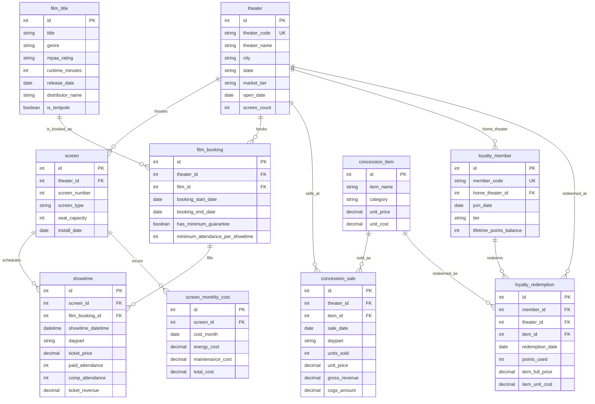

# 传统媒体 — 院线场次与卖品盈利分析 实体关系文档

> 业务背景, 行业科普, 术语表请见 `01-traditional_media_cinema_exhibition_yield_management_medium_business_context-cn.md`. 本文档只描述数据.

## 数据集元数据

- **复杂度等级:** Medium
- **表数量:** 10 张表
- **总记录数:** 约 96,600 行
- **外键关系:** 12 个外键关系,全部为一对多(1:N),另含 2 条 DDL 无法强制约束的跨表范围规则(见下文"参照完整性"一节)
- **参考日(REFERENCE_DATE):** `2026-06-30` —— 数据窗口为 2026 年第二季度(2026-04-01 至 2026-06-30,共 91 天)。生成器使用这个常量(而非系统当前时间)保证多次运行结果一致;SQL 查询里凡是需要日期边界的地方,都用字面量日期而非 `DATE('now')`。

---

## 实体关系图



---

## 逐表说明

### 1. theater

**业务用途。** 每一行是 Lakeshore Cinemas 旗下一家实体影院。院线运营、排片、卖品和会员计划都以"影院"为基本管理单元,区域运营经理按影院看日常运营,CFO 按影院看利润贡献。`market_tier` 是本数据集最关键的一个维度,把 18 家影院分成 Primary(一线市场,通常是芝加哥都会区及周边大城市)和 Secondary(二线市场,如皮奥里亚、韦恩堡这类中小城市),这个分层直接决定了自然客流量水平,也是 Q2(高端银幕盈亏)陷阱的地理来源。

**列。**

| 列名 | 类型 | 约束 | 说明 |
|------|------|------|------|
| id | int | PK, autoincrement | 影院内部主键 |
| theater_code | string | UK, NOT NULL | 影院编码,如 `LC-CHI-01` |
| theater_name | string | NOT NULL | 影院名称,如 "Lakeshore Cinemas Lincoln Square" |
| city | string | NOT NULL | 所在城市 |
| state | string | NOT NULL | 所在州(IL/WI/IN/OH/MI) |
| market_tier | string | NOT NULL | `Primary` 或 `Secondary` |
| open_date | date | NOT NULL | 影院开业日期(早于 REFERENCE_DATE 数年) |
| screen_count | int | NOT NULL | 该影院银幕数量(由 `screen` 表汇总而来的冗余字段) |

**样例数据。**

| id | theater_code | theater_name | city | state | market_tier | screen_count |
|----|--------------|--------------|------|-------|-------------|--------------|
| 1 | LC-CHI-01 | Lakeshore Cinemas Lincoln Square | Chicago | IL | Primary | 8 |
| 13 | LC-PEO-01 | Lakeshore Cinemas Peoria Landmark | Peoria | IL | Secondary | 4 |

---

### 2. screen

**业务用途。** 每一行是一块具体的银幕(影厅)。银幕类型(`screen_type`)决定票价档位,也决定每月固定成本档位——IMAX 银幕的设备授权与激光光源维保费用远高于标准厅,这一列是 Q2 陷阱的直接载体。

> **范围说明:** IMAX 银幕并非均匀分布——18 家影院里只有 10 家配有 1 块 IMAX 银幕(7 家 Primary、3 家 Secondary),其余影院没有 IMAX。

**列。**

| 列名 | 类型 | 约束 | 说明 |
|------|------|------|------|
| id | int | PK, autoincrement | 银幕内部主键 |
| theater_id | int | FK -> theater.id, NOT NULL | 所属影院 |
| screen_number | int | NOT NULL | 影院内的银幕编号(1, 2, 3...) |
| screen_type | string | NOT NULL | `Standard` / `Premium` / `IMAX` |
| seat_capacity | int | NOT NULL | 座位数,Standard 约 120-160,Premium 约 90-120(躺椅占地大),IMAX 约 250-350 |
| install_date | date | NOT NULL | 该银幕(或其最近一次设备升级)的安装日期 |

**外键。** `screen.theater_id -> theater.id`,1:N,ON DELETE CASCADE。

**样例数据。**

| id | theater_id | screen_number | screen_type | seat_capacity |
|----|------------|---------------|-------------|----------------|
| 8 | 1 | 8 | IMAX | 344 |
| 74 | 13 | 4 | IMAX | 308 |

---

### 3. film_title

**业务用途。** 每一行是一部在本季度上映或仍在放映的电影。`is_tentpole` 标记该片是否属于发行商重点押注的"事件型大片"——这类电影在排片合约里更容易被附加"最低开场人数条款"(见 `film_booking`),是 Q3 陷阱的源头。

**列。**

| 列名 | 类型 | 约束 | 说明 |
|------|------|------|------|
| id | int | PK, autoincrement | 影片内部主键 |
| title | string | NOT NULL | 片名 |
| genre | string | NOT NULL | 类型(Action、Comedy、Drama、Animation、Horror、Sci-Fi 等) |
| mpaa_rating | string | NOT NULL | MPAA 分级(G/PG/PG-13/R) |
| runtime_minutes | int | NOT NULL | 片长(分钟) |
| release_date | date | NOT NULL | 全国院线首映日期 |
| distributor_name | string | NOT NULL | 虚构发行商名称 |
| is_tentpole | boolean | NOT NULL, default false | 是否为事件型大片;约 70 部影片中有 8 部为 tentpole |

**样例数据。**

| id | title | genre | is_tentpole | distributor_name |
|----|-------|-------|-------------|--------------------|
| 1 | Velvet Current | Action | true | Harborview Pictures |
| 9 | The Hidden Voyage | Horror | false | Prairie Peak Studios |

---

### 4. film_booking

**业务用途。** 每一行是"某影院在某个时间窗口内放映某部电影"的排片合约。这是发行商与院线之间真实存在的商业约束——它决定了哪块银幕能放哪部片,也是"最低开场人数条款"(`has_minimum_guarantee` / `minimum_attendance_per_showtime`)落地的地方。这条条款原本是发行商用来保证票房曝光的正常商业条款,但当自然客流不足以达标时,就会诱使影院用"买回票"凑数——这正是 Q3 要挖出来的行为。

> **范围说明:** 只有 `film_title.is_tentpole = true` 的影片,其排片合约才可能带 `has_minimum_guarantee = true`(约 85% 的 tentpole 排片合约带此条款);非 tentpole 影片的排片合约永远不带这条条款。DDL 不强制这条规则,生成器和分析都需要遵守。

**列。**

| 列名 | 类型 | 约束 | 说明 |
|------|------|------|------|
| id | int | PK, autoincrement | 排片合约内部主键 |
| theater_id | int | FK -> theater.id, NOT NULL | 签约影院 |
| film_id | int | FK -> film_title.id, NOT NULL | 排片的影片 |
| booking_start_date | date | NOT NULL | 该影院开始放映此片的日期 |
| booking_end_date | date | NOT NULL | 该影院结束放映此片的日期 |
| has_minimum_guarantee | boolean | NOT NULL, default false | 是否带最低开场人数条款 |
| minimum_attendance_per_showtime | int | nullable | 条款要求的每场最低到场人数,固定为 20;`has_minimum_guarantee = false` 时为 NULL |

**外键。** `film_booking.theater_id -> theater.id`(1:N);`film_booking.film_id -> film_title.id`(1:N)。

**样例数据。**

| id | theater_id | film_id | has_minimum_guarantee | minimum_attendance_per_showtime |
|----|------------|---------|------------------------|-----------------------------------|
| 2 | 2 | 1 | true | 20 |
| 145 | 15 | 9 | false | NULL |

---

### 5. showtime

**业务用途。** 数据集里最核心的事实表,每一行是一块银幕在某个具体时间点放映的一场电影。`paid_attendance`(真实付费观众)和 `comp_attendance`(赠票/买回票人数)是 Q3 陷阱的直接载体;`ticket_price` 和 `paid_attendance` 结合银幕类型是 Q2(高端银幕盈亏)分析的输入;`daypart` 是 Q5(场次与卖品匹配)分析的核心维度。

> **范围说明:** `comp_attendance` 在绝大多数场次里只是一个很小的促销/员工赠票基线(约 2% of paid_attendance)。但当 `daypart = 'late_night'` 且该场次对应的 `film_booking.has_minimum_guarantee = true` 时,`comp_attendance` 会被显著推高,目的是把 `paid_attendance + comp_attendance` 凑到 `minimum_attendance_per_showtime` 附近——这就是影院"自己买票充场"的行为模式。

**列。**

| 列名 | 类型 | 约束 | 说明 |
|------|------|------|------|
| id | int | PK, autoincrement | 场次内部主键 |
| screen_id | int | FK -> screen.id, NOT NULL | 放映银幕 |
| film_booking_id | int | FK -> film_booking.id, NOT NULL | 对应的排片合约(隐含影片和影院) |
| showtime_datetime | datetime | NOT NULL | 场次开场时间 |
| daypart | string | NOT NULL | `matinee`(10-15 点开场)/ `prime`(16-22 点开场)/ `late_night`(23 点及以后开场) |
| ticket_price | decimal(6,2) | NOT NULL | 该场次票价,按银幕类型定价,周五/周六再乘 1.15 |
| paid_attendance | int | NOT NULL | 真实付费观众数 |
| comp_attendance | int | NOT NULL, default 0 | 赠票/买回票人数(不产生票房收入) |
| ticket_revenue | decimal(10,2) | NOT NULL | 计算字段 = `paid_attendance × ticket_price`(comp 观众不计收入) |

**外键。** `showtime.screen_id -> screen.id`(1:N);`showtime.film_booking_id -> film_booking.id`(1:N)。

> **范围说明(DDL 无法强制):** 一个 `showtime.screen_id` 对应的影院,必须与其 `film_booking_id` 对应的 `film_booking.theater_id` 一致——一块银幕只能放映本影院自己签约的影片。

**样例数据。**

| id | screen_id | daypart | ticket_price | paid_attendance | comp_attendance | ticket_revenue |
|----|-----------|---------|---------------|-------------------|--------------------|------------------|
| 853 | 3 | prime | 12.50 | 55 | 1 | 687.50 |
| 120 | 1 | late_night | 14.37 | 8 | 14 | 114.96 |

上面第二行就是 Q3 陷阱的典型样子:`paid_attendance = 8` 远低于最低开场人数 20,`comp_attendance = 14` 把总到场人数凑到 22,但真实票房收入只按 8 个付费观众计算。

---

### 6. concession_item

**业务用途。** 卖品 SKU 主数据,爆米花、饮料、糖果、组合套餐等。`unit_price` 与 `unit_cost` 的差,是院线最主要的利润来源。

**列。**

| 列名 | 类型 | 约束 | 说明 |
|------|------|------|------|
| id | int | PK, autoincrement | 卖品内部主键 |
| item_name | string | NOT NULL | 商品名称 |
| category | string | NOT NULL | `Popcorn` / `Beverage` / `Candy` / `Combo` |
| unit_price | decimal(6,2) | NOT NULL | 单价 |
| unit_cost | decimal(6,2) | NOT NULL | 单件原材料成本(COGS) |

**样例数据。**

| id | item_name | category | unit_price | unit_cost |
|----|-----------|----------|------------|-----------|
| 2 | Medium Popcorn | Popcorn | 7.50 | 2.25 |
| 16 | Popcorn + Drink Combo (Medium) | Combo | 12.50 | 3.20 |

---

### 7. concession_sale

**业务用途。** 卖品的**正常付费销售**汇总,粒度是"某影院 × 某天 × 某场次时段 × 某 SKU"。之所以不做逐笔交易级别的记录,是因为院线的 POS 系统本身也是按日按时段汇总上报给财务系统的,这个粒度既保留了足够的分析细节(可以按 daypart、按 SKU 切),又避免了不必要的数据膨胀。

> **范围说明:** 这张表只包含**正常付费**销售,不包含会员积分兑换——兑换记录在 `loyalty_redemption` 表里单独建模,这样才能清楚地区分"真实收到现金的收入"和"兑换掉的商品"。

**列。**

| 列名 | 类型 | 约束 | 说明 |
|------|------|------|------|
| id | int | PK, autoincrement | 内部主键 |
| theater_id | int | FK -> theater.id, NOT NULL | 销售发生的影院 |
| item_id | int | FK -> concession_item.id, NOT NULL | 售出的 SKU |
| sale_date | date | NOT NULL | 销售日期 |
| daypart | string | NOT NULL | `matinee` / `prime` / `late_night`,与该时段的场次对应 |
| units_sold | int | NOT NULL | 该 SKU 当天当时段售出的件数 |
| unit_price | decimal(6,2) | NOT NULL | 当时的单价快照(等于 `concession_item.unit_price`) |
| gross_revenue | decimal(10,2) | NOT NULL | 计算字段 = `units_sold × unit_price` |
| cogs_amount | decimal(10,2) | NOT NULL | 计算字段 = `units_sold × concession_item.unit_cost` |

**外键。** `concession_sale.theater_id -> theater.id`(1:N);`concession_sale.item_id -> concession_item.id`(1:N)。

**样例数据。**

| id | theater_id | item_id | daypart | units_sold | gross_revenue | cogs_amount |
|----|------------|---------|---------|------------|-----------------|---------------|
| 1 | 4 | 8 | matinee | 5 | 22.50 | 4.50 |

---

### 8. loyalty_member

**业务用途。** Lakeshore Rewards 会员。会员分三档(`tier`),档位越高通常消费越频繁、兑换也越多。这张表本身不含消费金额——消费行为体现在 `loyalty_redemption`(兑换)里;会员的正常付费消费混在 `concession_sale` 和 `showtime` 的匿名汇总里,不做会员级别的付费交易归因(现实中大多数院线 POS 系统也是如此——只有兑换环节需要扫会员卡验证身份)。

> **范围说明:** 本数据集只包含 2026 Q2 内有过至少一次兑换或到访记录的**活跃会员**(约 7,500 人),不包含从未使用过积分的注册"僵尸账户"。

**列。**

| 列名 | 类型 | 约束 | 说明 |
|------|------|------|------|
| id | int | PK, autoincrement | 会员内部主键 |
| member_code | string | UK, NOT NULL | 会员卡号 |
| home_theater_id | int | FK -> theater.id, NOT NULL | 注册时选择的主场影院 |
| join_date | date | NOT NULL | 注册日期 |
| tier | string | NOT NULL | `Standard`(约 60%)/ `Silver`(约 30%)/ `Gold`(约 10%) |
| lifetime_points_balance | int | NOT NULL | 截至 REFERENCE_DATE 的累计积分余额 |

**外键。** `loyalty_member.home_theater_id -> theater.id`(1:N)。

---

### 9. loyalty_redemption

**业务用途。** 会员用积分兑换卖品的记录,是 **Q1 陷阱的直接载体**。每一行是一次兑换:会员消耗积分,拿走一件卖品,公司产生了真实的 `item_unit_cost` 成本,但没有收到任何现金。`item_full_price` 这一列刻意保留"如果按全价售出应该值多少钱"这个数字——因为这正是账面系统错误地拿来当"收入"确认的那个数字。

> **范围说明:** `loyalty_redemption.theater_id` 大多数情况下等于该会员的 `home_theater_id`,但约 15% 的兑换发生在会员的非主场影院(出差、跨市观影等真实场景),DDL 不强制这条关联。

**列。**

| 列名 | 类型 | 约束 | 说明 |
|------|------|------|------|
| id | int | PK, autoincrement | 兑换记录内部主键 |
| member_id | int | FK -> loyalty_member.id, NOT NULL | 兑换会员 |
| theater_id | int | FK -> theater.id, NOT NULL | 兑换发生的影院 |
| item_id | int | FK -> concession_item.id, NOT NULL | 兑换的 SKU |
| redemption_date | date | NOT NULL | 兑换日期 |
| points_used | int | NOT NULL | 消耗的积分数 |
| item_full_price | decimal(6,2) | NOT NULL | 该 SKU 当时的全价快照——账面系统错误地把这个数字记为"收入"的来源 |
| item_unit_cost | decimal(6,2) | NOT NULL | 该 SKU 当时的单件成本快照——真实产生的现金成本 |

**外键。** `loyalty_redemption.member_id -> loyalty_member.id`(1:N);`loyalty_redemption.theater_id -> theater.id`(1:N);`loyalty_redemption.item_id -> concession_item.id`(1:N)。

**样例数据。**

| id | member_id | item_id | points_used | item_full_price | item_unit_cost |
|----|-----------|---------|--------------|-------------------|-------------------|
| 1 | 1 | 3 | 950 | 9.50 | 2.75 |

---

### 10. screen_monthly_cost

**业务用途。** 每块银幕每月的能耗(`energy_cost`)与维保(`maintenance_cost`)开支。这是一笔**固定成本**——不随场次多少或上座率线性变化。IMAX 银幕的维保开支里含设备授权费和激光光源保养合同,数量级远高于 Standard/Premium,是 **Q2 陷阱的成本侧输入**。

**列。**

| 列名 | 类型 | 约束 | 说明 |
|------|------|------|------|
| id | int | PK, autoincrement | 内部主键 |
| screen_id | int | FK -> screen.id, NOT NULL | 银幕 |
| cost_month | date | NOT NULL | 成本所属月份(当月第一天) |
| energy_cost | decimal(8,2) | NOT NULL | 当月能耗开支 |
| maintenance_cost | decimal(8,2) | NOT NULL | 当月维保开支(含 IMAX 设备授权/镜头保养) |
| total_cost | decimal(8,2) | NOT NULL | 计算字段 = `energy_cost + maintenance_cost` |

**外键。** `screen_monthly_cost.screen_id -> screen.id`(1:N)。

**样例数据。**

| id | screen_id | cost_month | energy_cost | maintenance_cost | total_cost |
|----|-----------|------------|--------------|---------------------|-------------|
| 22 | 8 | 2026-04-01 | 3,547.65 | 7,146.59 | 10,694.24 |
| 23 | 8 | 2026-05-01 | 3,581.40 | 7,047.86 | 10,629.26 |

---

## 数据生成规则

### 时间顺序

- `theater.open_date` 早于 2026-04-01 至少 2 年。
- `screen.install_date` 晚于其所属 `theater.open_date`,早于 2026-04-01。
- `film_title.release_date` 落在 2026 年 1 月到 6 月之间(部分是本季度新片,部分是上季度延续放映的热映片)。
- `film_booking.booking_start_date >= film_title.release_date`,`booking_end_date <= 2026-06-30`,且 `booking_end_date > booking_start_date`。
- `showtime.showtime_datetime` 落在其所属 `film_booking` 的 `[booking_start_date, booking_end_date]` 区间内,且落在 `[2026-04-01, 2026-06-30]` 内。
- `loyalty_member.join_date` 早于或等于其在本季度内的首次兑换/到访日期。
- `loyalty_redemption.redemption_date`、`concession_sale.sale_date` 均落在 `[2026-04-01, 2026-06-30]` 内。
- `screen_monthly_cost.cost_month` 取值仅限 `2026-04-01`、`2026-05-01`、`2026-06-01` 三个月份。

### 参照完整性

- DDL 强制的外键见上文各表的"外键"小节,全部为 1:N,ON DELETE CASCADE。
- DDL 不强制、但生成器和分析都需遵守的范围规则:
  1. `showtime.screen_id` 所属影院必须等于其 `film_booking_id` 对应的 `film_booking.theater_id`。
  2. `film_booking.has_minimum_guarantee = true` 只出现在 `film_title.is_tentpole = true` 的影片上。

### 数值范围与分布

- **影院与市场分层:** 18 家影院,其中 12 家 `Primary`、6 家 `Secondary`。
- **银幕:** 92 块银幕,`Standard` 65 块(约 71%)、`Premium` 17 块(约 18%)、`IMAX` 10 块(约 11%)。10 块 IMAX 银幕中,7 块在 Primary 影院、3 块在 Secondary 影院。
- **票价:** 工作日基准价 `Standard` $12.50、`Premium` $15.00、`IMAX` $18.50;周五/周六场次乘以 1.15。
- **场次密度:** `Standard`/`Premium` 银幕每天约 5 场,`IMAX` 银幕每天约 3 场(大画幅场次通常排得更稀疏)。
- **付费观众均值(prime 时段基准,按银幕类型 × 市场分层):**

  | screen_type | Primary | Secondary |
  |-------------|---------|-----------|
  | Standard | 45 | 26 |
  | Premium | 62 | 34 |
  | IMAX | 85 | 15 |

  `matinee` 时段乘以约 0.55,`late_night` 时段乘以约 0.35(不含最低开场人数条款触发的买回票)。**周末(周五/周六)场次的自然客流,在上述均值基础上再乘约 1.25**——这也是 Query 7"周末上座反而高于工作日"这一结论的数据来源。
- **赠票/买回票基线:** 正常场次 `comp_attendance` 约为 `paid_attendance` 的 2%(促销赠票、员工福利票)。
- **卖品:** 24 个 SKU,单价区间 $4.50 - $14.50,综合毛利率约 71%-73%。全季度正常付费卖品约 49.9 万件(人均卖品消费约 $2.7,卖品收入约为票房的 19%,符合北美中端区域院线量级),会员兑换约 2.8 万件(约占总件数的 5.4%)。
- **会员:** 约 7,500 名活跃会员,`Standard` 约 60%、`Silver` 约 30%、`Gold` 约 10%;`Gold` 会员的季度兑换次数约为 `Standard` 会员的 3.6 倍。
- **银幕月度固定成本:**

  | screen_type | 能耗 | 维保 | 合计/月 |
  |-------------|------|------|----------|
  | Standard | $900 | $600 | $1,500 |
  | Premium | $1,600 | $1,000 | $2,600 |
  | IMAX | $3,500 | $7,000 | $10,500 |

### 计算字段

- `theater.screen_count` = `COUNT(screen WHERE screen.theater_id = theater.id)`。
- `showtime.ticket_revenue` = `paid_attendance × ticket_price`(comp 观众不产生收入)。
- `concession_sale.gross_revenue` = `units_sold × unit_price`;`concession_sale.cogs_amount` = `units_sold × concession_item.unit_cost`。
- `loyalty_redemption.item_full_price` / `item_unit_cost` 直接取自兑换当时 `concession_item` 的 `unit_price` / `unit_cost`。
- `screen_monthly_cost.total_cost` = `energy_cost + maintenance_cost`。

### 业务陷阱清单

> 说明:下面每个陷阱标题里的 **Q1/Q2/Q3** 指的是业务背景文档第 5 节的**业务问题编号**;结尾的 **"对应 SQL 查询 Query N"** 指的是 SQL 查询文档里的**查询序号**,两套编号不要混淆(查询与业务问题的完整映射见 SQL 文档末尾的"业务问题对应表")。

1. **Q1 卖品现金毛利被账面高估(Concession Margin Overstatement)。** 会员兑换的卖品按全价计入"账面收入"(`recognized concession revenue`),但真实现金收入(`cash concession revenue`)不含这部分。实测数据里,`redemption_share`(兑换件数占总件数比例)约 **5.4%**,账面毛利率(约 72.6%)与现金调整后毛利率(约 71.1%)之间的差距(`margin_gap`)约 **1.5 个百分点**。这个缺口看似不大,但它发生在毛利率高达 70% 以上、几乎全额留存的卖品线上,而且会随会员兑换规模逐季累积——正是财务口径需要被纠正、CFO 需要盯住的隐性侵蚀。对应 SQL 查询 Query 1、Query 2、Query 3。
2. **Q2 二线市场 IMAX 银幕持续亏损,被组合整体盈利掩盖(Hidden Loss on Secondary-Market IMAX Screens)。** 7 块 Primary 市场的 IMAX 银幕单银幕季度净贡献(票价溢价收入 − 能耗维保成本)平均约为 **+$53,500**;3 块 Secondary 市场的 IMAX 银幕单银幕季度净贡献平均约为 **-$13,100**。IMAX 银幕组合整体净贡献仍为正(数十万美元量级),完全掩盖了这 3 块银幕的持续亏损。对应 SQL 查询 Query 4、Query 5、Query 6、Query 10。
3. **Q3 深夜场"保底票"充场(Late-Night Minimum-Guarantee Buyback)。** 正常场次的 `comp_attendance` 占比基线约 0.6%-2%。但 `daypart = 'late_night'` 且对应 `film_booking.has_minimum_guarantee = true`(且影片为 tentpole)的场次,`comp_attendance` 占比会被推高到约 **60%**,是基线的三十倍以上。对应 SQL 查询 Query 8、Query 9。

---

## Faker 策略

| 字段模式 | Faker 方法 / 抽样策略 | 说明 |
|----------|--------------------------|------|
| theater_name / city | `random.choice` 预设的中西部城市与影院命名列表 | 限定在 IL/WI/IN/OH/MI 五州,贴合公司地域设定 |
| film title | `fake.catch_phrase()` 改写 + 预设词库拼接 | 生成听起来像电影片名但不撞真实电影的标题 |
| distributor_name | `random.choice` 预设虚构发行商列表(6 家) | 避免使用真实发行商名称 |
| member_code | 格式化字符串 `f"LR-{id:06d}"` | 保证唯一且可读 |
| screen_type / market_tier / tier / daypart | 按权重字典 `random.choices(..., weights=...)` | 保证分布命中第 4 节的目标比例 |
| paid_attendance / comp_attendance | `numpy`/`random` 正态或泊松抽样,均值取自校准常量 | 保证场次层面的自然波动同时命中总体均值 |
| ticket_price / unit_price / unit_cost | 校准常量字典按 `screen_type` / `item` 查表 | 保证价格体系与陷阱数值一致 |

## 文件清单

| # | 文件名 | 表 | 约行数 | 依赖 |
|---|--------|-----|--------|------|
| 01 | 01_theater.tsv | theater | 18 | 无 |
| 02 | 02_screen.tsv | screen | 92 | theater |
| 03 | 03_film_title.tsv | film_title | 70 | 无 |
| 04 | 04_film_booking.tsv | film_booking | 约 490 | theater, film_title |
| 05 | 05_showtime.tsv | showtime | 约 38,400 | screen, film_booking |
| 06 | 06_concession_item.tsv | concession_item | 24 | 无 |
| 07 | 07_concession_sale.tsv | concession_sale | 约 21,300 | theater, concession_item |
| 08 | 08_loyalty_member.tsv | loyalty_member | 7,500 | theater |
| 09 | 09_loyalty_redemption.tsv | loyalty_redemption | 约 28,500 | loyalty_member, theater, concession_item |
| 10 | 10_screen_monthly_cost.tsv | screen_monthly_cost | 276 | screen |

---

## SQLite DDL

```sql
CREATE TABLE theater (
    id INTEGER PRIMARY KEY AUTOINCREMENT,
    theater_code VARCHAR(20) NOT NULL UNIQUE,
    theater_name VARCHAR(120) NOT NULL,
    city VARCHAR(80) NOT NULL,
    state VARCHAR(2) NOT NULL,
    market_tier VARCHAR(20) NOT NULL,
    open_date DATE NOT NULL,
    screen_count INTEGER NOT NULL
);

CREATE TABLE screen (
    id INTEGER PRIMARY KEY AUTOINCREMENT,
    theater_id INTEGER NOT NULL REFERENCES theater(id) ON DELETE CASCADE,
    screen_number INTEGER NOT NULL,
    screen_type VARCHAR(20) NOT NULL,
    seat_capacity INTEGER NOT NULL,
    install_date DATE NOT NULL
);
CREATE INDEX idx_screen_theater ON screen(theater_id);

CREATE TABLE film_title (
    id INTEGER PRIMARY KEY AUTOINCREMENT,
    title VARCHAR(160) NOT NULL,
    genre VARCHAR(40) NOT NULL,
    mpaa_rating VARCHAR(10) NOT NULL,
    runtime_minutes INTEGER NOT NULL,
    release_date DATE NOT NULL,
    distributor_name VARCHAR(120) NOT NULL,
    is_tentpole BOOLEAN NOT NULL DEFAULT 0
);

CREATE TABLE film_booking (
    id INTEGER PRIMARY KEY AUTOINCREMENT,
    theater_id INTEGER NOT NULL REFERENCES theater(id) ON DELETE CASCADE,
    film_id INTEGER NOT NULL REFERENCES film_title(id) ON DELETE CASCADE,
    booking_start_date DATE NOT NULL,
    booking_end_date DATE NOT NULL,
    has_minimum_guarantee BOOLEAN NOT NULL DEFAULT 0,
    minimum_attendance_per_showtime INTEGER
);
CREATE INDEX idx_film_booking_theater ON film_booking(theater_id);
CREATE INDEX idx_film_booking_film ON film_booking(film_id);

CREATE TABLE showtime (
    id INTEGER PRIMARY KEY AUTOINCREMENT,
    screen_id INTEGER NOT NULL REFERENCES screen(id) ON DELETE CASCADE,
    film_booking_id INTEGER NOT NULL REFERENCES film_booking(id) ON DELETE CASCADE,
    showtime_datetime DATETIME NOT NULL,
    daypart VARCHAR(20) NOT NULL,
    ticket_price NUMERIC(6, 2) NOT NULL,
    paid_attendance INTEGER NOT NULL,
    comp_attendance INTEGER NOT NULL DEFAULT 0,
    ticket_revenue NUMERIC(10, 2) NOT NULL
);
CREATE INDEX idx_showtime_screen ON showtime(screen_id);
CREATE INDEX idx_showtime_booking ON showtime(film_booking_id);
CREATE INDEX idx_showtime_datetime ON showtime(showtime_datetime);

CREATE TABLE concession_item (
    id INTEGER PRIMARY KEY AUTOINCREMENT,
    item_name VARCHAR(80) NOT NULL,
    category VARCHAR(20) NOT NULL,
    unit_price NUMERIC(6, 2) NOT NULL,
    unit_cost NUMERIC(6, 2) NOT NULL
);

CREATE TABLE concession_sale (
    id INTEGER PRIMARY KEY AUTOINCREMENT,
    theater_id INTEGER NOT NULL REFERENCES theater(id) ON DELETE CASCADE,
    item_id INTEGER NOT NULL REFERENCES concession_item(id) ON DELETE CASCADE,
    sale_date DATE NOT NULL,
    daypart VARCHAR(20) NOT NULL,
    units_sold INTEGER NOT NULL,
    unit_price NUMERIC(6, 2) NOT NULL,
    gross_revenue NUMERIC(10, 2) NOT NULL,
    cogs_amount NUMERIC(10, 2) NOT NULL
);
CREATE INDEX idx_concession_sale_theater ON concession_sale(theater_id);
CREATE INDEX idx_concession_sale_item ON concession_sale(item_id);
CREATE INDEX idx_concession_sale_date ON concession_sale(sale_date);

CREATE TABLE loyalty_member (
    id INTEGER PRIMARY KEY AUTOINCREMENT,
    member_code VARCHAR(20) NOT NULL UNIQUE,
    home_theater_id INTEGER NOT NULL REFERENCES theater(id) ON DELETE CASCADE,
    join_date DATE NOT NULL,
    tier VARCHAR(20) NOT NULL,
    lifetime_points_balance INTEGER NOT NULL
);
CREATE INDEX idx_loyalty_member_theater ON loyalty_member(home_theater_id);

CREATE TABLE loyalty_redemption (
    id INTEGER PRIMARY KEY AUTOINCREMENT,
    member_id INTEGER NOT NULL REFERENCES loyalty_member(id) ON DELETE CASCADE,
    theater_id INTEGER NOT NULL REFERENCES theater(id) ON DELETE CASCADE,
    item_id INTEGER NOT NULL REFERENCES concession_item(id) ON DELETE CASCADE,
    redemption_date DATE NOT NULL,
    points_used INTEGER NOT NULL,
    item_full_price NUMERIC(6, 2) NOT NULL,
    item_unit_cost NUMERIC(6, 2) NOT NULL
);
CREATE INDEX idx_loyalty_redemption_member ON loyalty_redemption(member_id);
CREATE INDEX idx_loyalty_redemption_theater ON loyalty_redemption(theater_id);
CREATE INDEX idx_loyalty_redemption_date ON loyalty_redemption(redemption_date);

CREATE TABLE screen_monthly_cost (
    id INTEGER PRIMARY KEY AUTOINCREMENT,
    screen_id INTEGER NOT NULL REFERENCES screen(id) ON DELETE CASCADE,
    cost_month DATE NOT NULL,
    energy_cost NUMERIC(8, 2) NOT NULL,
    maintenance_cost NUMERIC(8, 2) NOT NULL,
    total_cost NUMERIC(8, 2) NOT NULL
);
CREATE INDEX idx_screen_monthly_cost_screen ON screen_monthly_cost(screen_id);
```
