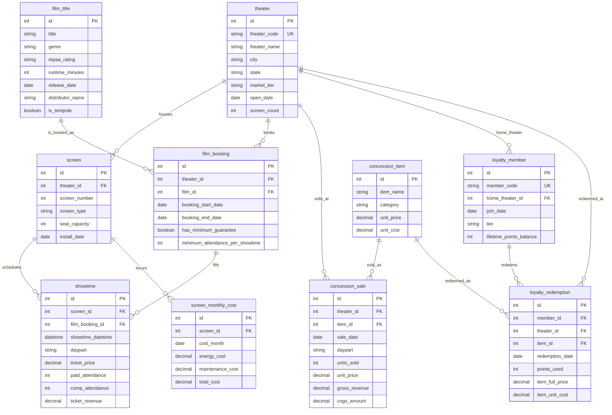

# Traditional Media — Cinema Showtime & Concession Profitability Analysis Entity-Relationship Document

> For business background, industry primer, and glossary, see `01-traditional_media_cinema_exhibition_yield_management_medium_business_context.md`. This document covers data structure only.

## Dataset Metadata

- **Complexity level:** Medium
- **Table count:** 10 tables
- **Total records:** approximately 96,600 rows
- **Foreign key relationships:** 12 foreign key relationships, all one-to-many (1:N), plus 2 cross-table scope rules that DDL cannot enforce (see the "Referential Integrity" section below)
- **Reference date (REFERENCE_DATE):** `2026-06-30` — the data window is Q2 2026 (2026-04-01 to 2026-06-30, 91 days total). The generator uses this constant, rather than the system's current time, to guarantee consistent results across runs; anywhere a SQL query needs a date boundary, it uses a literal date rather than `DATE('now')`.

---

## Entity-Relationship Diagram



---

## Table-by-Table Notes

### 1. theater

**Business purpose.** Each row is a physical Lakeshore Cinemas location. Exhibition operations, film booking, concessions, and the loyalty program are all managed at the theater level — Regional Operations Managers look at day-to-day operations by theater, and the CFO looks at profit contribution by theater. `market_tier` is the most important dimension in this dataset: it splits the 18 theaters into Primary (major markets — typically the Chicago metro area and other large surrounding cities) and Secondary (smaller markets like Peoria or Fort Wayne). This split directly determines the level of organic foot traffic and is the geographic root of the Q2 (premium-screen profitability) trap.

**Columns.**

| Column | Type | Constraints | Description |
|------|------|------|------|
| id | int | PK, autoincrement | Internal theater primary key |
| theater_code | string | UK, NOT NULL | Theater code, e.g. `LC-CHI-01` |
| theater_name | string | NOT NULL | Theater name, e.g. "Lakeshore Cinemas Lincoln Square" |
| city | string | NOT NULL | City |
| state | string | NOT NULL | State (IL/WI/IN/OH/MI) |
| market_tier | string | NOT NULL | `Primary` or `Secondary` |
| open_date | date | NOT NULL | Theater opening date (several years before REFERENCE_DATE) |
| screen_count | int | NOT NULL | Number of screens at this theater (a redundant field aggregated from the `screen` table) |

**Sample data.**

| id | theater_code | theater_name | city | state | market_tier | screen_count |
|----|--------------|--------------|------|-------|-------------|--------------|
| 1 | LC-CHI-01 | Lakeshore Cinemas Lincoln Square | Chicago | IL | Primary | 8 |
| 13 | LC-PEO-01 | Lakeshore Cinemas Peoria Landmark | Peoria | IL | Secondary | 4 |

---

### 2. screen

**Business purpose.** Each row is a specific screen (auditorium). `screen_type` determines the ticket price tier and also the monthly fixed-cost tier — IMAX screens carry far higher equipment licensing and laser-projector maintenance costs than standard auditoriums, and this column is the direct vehicle for the Q2 trap.

> **Scope note:** IMAX screens are not evenly distributed — of the 18 theaters, only 10 have a single IMAX screen (7 Primary, 3 Secondary); the rest have none.

**Columns.**

| Column | Type | Constraints | Description |
|------|------|------|------|
| id | int | PK, autoincrement | Internal screen primary key |
| theater_id | int | FK -> theater.id, NOT NULL | Parent theater |
| screen_number | int | NOT NULL | Screen number within the theater (1, 2, 3...) |
| screen_type | string | NOT NULL | `Standard` / `Premium` / `IMAX` |
| seat_capacity | int | NOT NULL | Seat count — roughly 120-160 for Standard, 90-120 for Premium (recliners take up more floor space), 250-350 for IMAX |
| install_date | date | NOT NULL | Installation date of this screen (or its most recent equipment upgrade) |

**Foreign key.** `screen.theater_id -> theater.id`, 1:N, ON DELETE CASCADE.

**Sample data.**

| id | theater_id | screen_number | screen_type | seat_capacity |
|----|------------|---------------|-------------|----------------|
| 8 | 1 | 8 | IMAX | 344 |
| 74 | 13 | 4 | IMAX | 308 |

---

### 3. film_title

**Business purpose.** Each row is a film released in this quarter, or one still in release from a prior quarter. `is_tentpole` flags whether the title is one of the distributor's key event releases — these films are more likely to carry a "minimum attendance clause" in their booking contract (see `film_booking`), which is the source of the Q3 trap.

**Columns.**

| Column | Type | Constraints | Description |
|------|------|------|------|
| id | int | PK, autoincrement | Internal film primary key |
| title | string | NOT NULL | Film title |
| genre | string | NOT NULL | Genre (Action, Comedy, Drama, Animation, Horror, Sci-Fi, etc.) |
| mpaa_rating | string | NOT NULL | MPAA rating (G/PG/PG-13/R) |
| runtime_minutes | int | NOT NULL | Runtime in minutes |
| release_date | date | NOT NULL | Nationwide theatrical release date |
| distributor_name | string | NOT NULL | Fictional distributor name |
| is_tentpole | boolean | NOT NULL, default false | Whether this is a tentpole film; about 8 of roughly 70 titles are tentpoles |

**Sample data.**

| id | title | genre | is_tentpole | distributor_name |
|----|-------|-------|-------------|--------------------|
| 1 | Velvet Current | Action | true | Harborview Pictures |
| 9 | The Hidden Voyage | Horror | false | Prairie Peak Studios |

---

### 4. film_booking

**Business purpose.** Each row is a booking contract for "this theater screens this film during this window." This models a real commercial constraint between distributors and exhibitors — it determines which screen can play which film, and it's also where the "minimum attendance clause" (`has_minimum_guarantee` / `minimum_attendance_per_showtime`) is implemented. This clause is normally just a standard commercial term distributors use to guarantee box office exposure, but when organic turnout falls short, it can tempt a theater to use "buyback tickets" to pad attendance — exactly the behavior Q3 is designed to surface.

> **Scope note:** Only films with `film_title.is_tentpole = true` can carry `has_minimum_guarantee = true` in their booking contract (about 85% of tentpole bookings carry this clause); non-tentpole booking contracts never carry it. The DDL does not enforce this rule — both the generator and any analysis must respect it.

**Columns.**

| Column | Type | Constraints | Description |
|------|------|------|------|
| id | int | PK, autoincrement | Internal booking primary key |
| theater_id | int | FK -> theater.id, NOT NULL | Contracting theater |
| film_id | int | FK -> film_title.id, NOT NULL | Booked film |
| booking_start_date | date | NOT NULL | Date this theater starts screening the film |
| booking_end_date | date | NOT NULL | Date this theater stops screening the film |
| has_minimum_guarantee | boolean | NOT NULL, default false | Whether a minimum attendance clause applies |
| minimum_attendance_per_showtime | int | nullable | Minimum required attendance per showtime under the clause, fixed at 20; NULL when `has_minimum_guarantee = false` |

**Foreign keys.** `film_booking.theater_id -> theater.id` (1:N); `film_booking.film_id -> film_title.id` (1:N).

**Sample data.**

| id | theater_id | film_id | has_minimum_guarantee | minimum_attendance_per_showtime |
|----|------------|---------|------------------------|-----------------------------------|
| 2 | 2 | 1 | true | 20 |
| 145 | 15 | 9 | false | NULL |

---

### 5. showtime

**Business purpose.** The core fact table in the dataset — each row is a single film screening on a specific screen at a specific time. `paid_attendance` (genuine paying attendees) and `comp_attendance` (comp/buyback attendees) are the direct vehicle for the Q3 trap; `ticket_price` combined with `paid_attendance` and screen type feeds the Q2 (premium-screen profitability) analysis; `daypart` is the core dimension for the Q5 (showtime-versus-concession matching) analysis.

> **Scope note:** In the vast majority of showtimes, `comp_attendance` is just a small baseline of promotional or employee comp tickets (about 2% of paid_attendance). But when `daypart = 'late_night'` and the corresponding showtime's `film_booking.has_minimum_guarantee = true`, `comp_attendance` is pushed significantly higher — the goal being to pad `paid_attendance + comp_attendance` up near `minimum_attendance_per_showtime`. That's the "theater buys its own tickets to pad the count" behavior pattern.

**Columns.**

| Column | Type | Constraints | Description |
|------|------|------|------|
| id | int | PK, autoincrement | Internal showtime primary key |
| screen_id | int | FK -> screen.id, NOT NULL | Screen where the film plays |
| film_booking_id | int | FK -> film_booking.id, NOT NULL | Corresponding booking contract (implies film and theater) |
| showtime_datetime | datetime | NOT NULL | Showtime start time |
| daypart | string | NOT NULL | `matinee` (10am-3pm start) / `prime` (4pm-10pm start) / `late_night` (11pm or later start) |
| ticket_price | decimal(6,2) | NOT NULL | Ticket price for this showtime, priced by screen type, multiplied by 1.15 on Friday/Saturday |
| paid_attendance | int | NOT NULL | Genuine paying attendee count |
| comp_attendance | int | NOT NULL, default 0 | Comp/buyback attendee count (generates no box office revenue) |
| ticket_revenue | decimal(10,2) | NOT NULL | Calculated field = `paid_attendance × ticket_price` (comp attendees don't count toward revenue) |

**Foreign keys.** `showtime.screen_id -> screen.id` (1:N); `showtime.film_booking_id -> film_booking.id` (1:N).

> **Scope note (not enforceable by DDL):** The theater implied by a `showtime.screen_id` must match the `film_booking.theater_id` of its corresponding `film_booking_id` — a screen can only show films booked by its own theater.

**Sample data.**

| id | screen_id | daypart | ticket_price | paid_attendance | comp_attendance | ticket_revenue |
|----|-----------|---------|---------------|-------------------|--------------------|------------------|
| 853 | 3 | prime | 12.50 | 55 | 1 | 687.50 |
| 120 | 1 | late_night | 14.37 | 8 | 14 | 114.96 |

The second row above is a textbook example of the Q3 trap: `paid_attendance = 8` is far below the minimum attendance requirement of 20, and `comp_attendance = 14` pads total attendance up to 22 — but real box office revenue is calculated on only the 8 paying attendees.

---

### 6. concession_item

**Business purpose.** Concession SKU master data — popcorn, drinks, candy, combo packages, and so on. The spread between `unit_price` and `unit_cost` is the exhibition chain's single most important source of profit.

**Columns.**

| Column | Type | Constraints | Description |
|------|------|------|------|
| id | int | PK, autoincrement | Internal item primary key |
| item_name | string | NOT NULL | Product name |
| category | string | NOT NULL | `Popcorn` / `Beverage` / `Candy` / `Combo` |
| unit_price | decimal(6,2) | NOT NULL | Unit price |
| unit_cost | decimal(6,2) | NOT NULL | Per-unit raw material cost (COGS) |

**Sample data.**

| id | item_name | category | unit_price | unit_cost |
|----|-----------|----------|------------|-----------|
| 2 | Medium Popcorn | Popcorn | 7.50 | 2.25 |
| 16 | Popcorn + Drink Combo (Medium) | Combo | 12.50 | 3.20 |

---

### 7. concession_sale

**Business purpose.** A summary of **normal paid** concession sales, at the grain of "theater x day x showtime daypart x SKU." This isn't captured at the individual-transaction level because a real exhibitor's POS system also rolls up to finance on a daily/daypart basis — this grain preserves enough analytical detail (sliceable by daypart or by SKU) while avoiding unnecessary data bloat.

> **Scope note:** This table contains only **normal paid** sales — it does not include loyalty point redemptions. Redemptions are modeled separately in the `loyalty_redemption` table, so that "revenue actually collected in cash" can be cleanly distinguished from "merchandise given away in exchange for points."

**Columns.**

| Column | Type | Constraints | Description |
|------|------|------|------|
| id | int | PK, autoincrement | Internal primary key |
| theater_id | int | FK -> theater.id, NOT NULL | Theater where the sale occurred |
| item_id | int | FK -> concession_item.id, NOT NULL | SKU sold |
| sale_date | date | NOT NULL | Sale date |
| daypart | string | NOT NULL | `matinee` / `prime` / `late_night`, aligned with the corresponding showtime daypart |
| units_sold | int | NOT NULL | Units of this SKU sold that day and daypart |
| unit_price | decimal(6,2) | NOT NULL | Price-at-time-of-sale snapshot (equal to `concession_item.unit_price`) |
| gross_revenue | decimal(10,2) | NOT NULL | Calculated field = `units_sold × unit_price` |
| cogs_amount | decimal(10,2) | NOT NULL | Calculated field = `units_sold × concession_item.unit_cost` |

**Foreign keys.** `concession_sale.theater_id -> theater.id` (1:N); `concession_sale.item_id -> concession_item.id` (1:N).

**Sample data.**

| id | theater_id | item_id | daypart | units_sold | gross_revenue | cogs_amount |
|----|------------|---------|---------|------------|-----------------|---------------|
| 1 | 4 | 8 | matinee | 5 | 22.50 | 4.50 |

---

### 8. loyalty_member

**Business purpose.** Lakeshore Rewards members. Members are split into three tiers (`tier`); higher tiers generally correspond to more frequent purchases and more redemptions. This table itself holds no dollar amounts — spending behavior shows up in `loyalty_redemption` (redemptions), while members' normal paid purchases are mixed anonymously into the aggregates in `concession_sale` and `showtime` with no member-level attribution of paid transactions (this mirrors reality, where most exhibitor POS systems only require a loyalty card scan to verify identity during a redemption).

> **Scope note:** This dataset includes only **active members** who had at least one redemption or visit recorded during Q2 2026 (roughly 7,500 people) — it excludes registered "dormant" accounts that never used their points.

**Columns.**

| Column | Type | Constraints | Description |
|------|------|------|------|
| id | int | PK, autoincrement | Internal member primary key |
| member_code | string | UK, NOT NULL | Member card number |
| home_theater_id | int | FK -> theater.id, NOT NULL | Home theater selected at signup |
| join_date | date | NOT NULL | Enrollment date |
| tier | string | NOT NULL | `Standard` (about 60%) / `Silver` (about 30%) / `Gold` (about 10%) |
| lifetime_points_balance | int | NOT NULL | Cumulative points balance as of REFERENCE_DATE |

**Foreign key.** `loyalty_member.home_theater_id -> theater.id` (1:N).

---

### 9. loyalty_redemption

**Business purpose.** Records of members redeeming points for concessions — the **direct vehicle for the Q1 trap**. Each row is one redemption: the member spends points and walks away with a concession item, the company incurs a real `item_unit_cost`, and no cash is collected. The `item_full_price` column deliberately preserves "what this would have been worth if sold at full price" — because that's precisely the number the books incorrectly recognize as "revenue."

> **Scope note:** `loyalty_redemption.theater_id` usually equals the member's `home_theater_id`, but about 15% of redemptions happen at a member's non-home theater (business travel, visiting another city, and similar real-world scenarios). The DDL does not enforce this relationship.

**Columns.**

| Column | Type | Constraints | Description |
|------|------|------|------|
| id | int | PK, autoincrement | Internal redemption primary key |
| member_id | int | FK -> loyalty_member.id, NOT NULL | Redeeming member |
| theater_id | int | FK -> theater.id, NOT NULL | Theater where the redemption occurred |
| item_id | int | FK -> concession_item.id, NOT NULL | Redeemed SKU |
| redemption_date | date | NOT NULL | Redemption date |
| points_used | int | NOT NULL | Points spent |
| item_full_price | decimal(6,2) | NOT NULL | Full-price-at-time-of-redemption snapshot for this SKU — the source of the number the books mistakenly record as "revenue" |
| item_unit_cost | decimal(6,2) | NOT NULL | Per-unit cost-at-time-of-redemption snapshot for this SKU — the real cash cost incurred |

**Foreign keys.** `loyalty_redemption.member_id -> loyalty_member.id` (1:N); `loyalty_redemption.theater_id -> theater.id` (1:N); `loyalty_redemption.item_id -> concession_item.id` (1:N).

**Sample data.**

| id | member_id | item_id | points_used | item_full_price | item_unit_cost |
|----|-----------|---------|--------------|-------------------|-------------------|
| 1 | 1 | 3 | 950 | 9.50 | 2.75 |

---

### 10. screen_monthly_cost

**Business purpose.** Monthly energy (`energy_cost`) and maintenance (`maintenance_cost`) spend per screen. This is a **fixed cost** — it does not scale linearly with showtime count or occupancy rate. IMAX screen maintenance spend includes equipment licensing fees and laser-light-source maintenance contracts, an order of magnitude higher than Standard/Premium, making this the **cost-side input to the Q2 trap**.

**Columns.**

| Column | Type | Constraints | Description |
|------|------|------|------|
| id | int | PK, autoincrement | Internal primary key |
| screen_id | int | FK -> screen.id, NOT NULL | Screen |
| cost_month | date | NOT NULL | Month this cost belongs to (first day of the month) |
| energy_cost | decimal(8,2) | NOT NULL | Energy spend for the month |
| maintenance_cost | decimal(8,2) | NOT NULL | Maintenance spend for the month (includes IMAX equipment licensing/lens maintenance) |
| total_cost | decimal(8,2) | NOT NULL | Calculated field = `energy_cost + maintenance_cost` |

**Foreign key.** `screen_monthly_cost.screen_id -> screen.id` (1:N).

**Sample data.**

| id | screen_id | cost_month | energy_cost | maintenance_cost | total_cost |
|----|-----------|------------|--------------|---------------------|-------------|
| 22 | 8 | 2026-04-01 | 3,547.65 | 7,146.59 | 10,694.24 |
| 23 | 8 | 2026-05-01 | 3,581.40 | 7,047.86 | 10,629.26 |

---

## Data Generation Rules

### Chronological Order

- `theater.open_date` is at least 2 years before 2026-04-01.
- `screen.install_date` is after the parent `theater.open_date` and before 2026-04-01.
- `film_title.release_date` falls between January and June 2026 (some are new releases this quarter, others are hits carrying over from the prior quarter).
- `film_booking.booking_start_date >= film_title.release_date`, `booking_end_date <= 2026-06-30`, and `booking_end_date > booking_start_date`.
- `showtime.showtime_datetime` falls within its parent `film_booking`'s `[booking_start_date, booking_end_date]` window, and within `[2026-04-01, 2026-06-30]`.
- `loyalty_member.join_date` is on or before the member's first redemption or visit date within the quarter.
- `loyalty_redemption.redemption_date` and `concession_sale.sale_date` both fall within `[2026-04-01, 2026-06-30]`.
- `screen_monthly_cost.cost_month` takes only the values `2026-04-01`, `2026-05-01`, or `2026-06-01`.

### Referential Integrity

- DDL-enforced foreign keys are listed in the "Foreign key(s)" subsection of each table above, all 1:N, ON DELETE CASCADE.
- Scope rules not enforced by DDL, but that the generator and any analysis must respect:
  1. The theater implied by `showtime.screen_id` must equal the `film_booking.theater_id` of its corresponding `film_booking_id`.
  2. `film_booking.has_minimum_guarantee = true` only occurs on films where `film_title.is_tentpole = true`.

### Value Ranges and Distributions

- **Theaters and market tiers:** 18 theaters, 12 `Primary` and 6 `Secondary`.
- **Screens:** 92 screens total — 65 `Standard` (about 71%), 17 `Premium` (about 18%), 10 `IMAX` (about 11%). Of the 10 IMAX screens, 7 are at Primary theaters and 3 are at Secondary theaters.
- **Ticket prices:** Weekday base prices are `Standard` $12.50, `Premium` $15.00, `IMAX` $18.50; Friday/Saturday showtimes are multiplied by 1.15.
- **Showtime density:** `Standard`/`Premium` screens run about 5 showtimes a day; `IMAX` screens run about 3 (large-format showtimes are typically scheduled more sparsely).
- **Mean paid attendance (prime daypart baseline, by screen type x market tier):**

  | screen_type | Primary | Secondary |
  |-------------|---------|-----------|
  | Standard | 45 | 26 |
  | Premium | 62 | 34 |
  | IMAX | 85 | 15 |

  `matinee` daypart is multiplied by about 0.55, `late_night` by about 0.35 (excluding buyback tickets triggered by the minimum attendance clause). **Weekend (Friday/Saturday) organic attendance is multiplied by roughly 1.25** on top of the above averages — this is also the data source behind Query 7's finding that "weekend occupancy actually beats weekday occupancy."
- **Comp/buyback baseline:** In normal showtimes, `comp_attendance` runs about 2% of `paid_attendance` (promotional comps, employee perk tickets).
- **Concessions:** 24 SKUs, unit prices ranging $4.50-$14.50, blended gross margin roughly 71%-73%. Normal paid concession volume for the full quarter is about 499,000 units (roughly $2.7 per-capita concession spend, with concession revenue at about 19% of box office — consistent with a mid-size North American regional exhibitor). Loyalty redemptions add about 28,000 units (about 5.4% of total units).
- **Members:** About 7,500 active members — roughly 60% `Standard`, 30% `Silver`, 10% `Gold`; `Gold` members redeem about 3.6x as often per quarter as `Standard` members.
- **Monthly fixed screen costs:**

  | screen_type | Energy | Maintenance | Total/month |
  |-------------|------|------|----------|
  | Standard | $900 | $600 | $1,500 |
  | Premium | $1,600 | $1,000 | $2,600 |
  | IMAX | $3,500 | $7,000 | $10,500 |

### Calculated Fields

- `theater.screen_count` = `COUNT(screen WHERE screen.theater_id = theater.id)`.
- `showtime.ticket_revenue` = `paid_attendance × ticket_price` (comp attendees generate no revenue).
- `concession_sale.gross_revenue` = `units_sold × unit_price`; `concession_sale.cogs_amount` = `units_sold × concession_item.unit_cost`.
- `loyalty_redemption.item_full_price` / `item_unit_cost` are taken directly from `concession_item.unit_price` / `unit_cost` at the time of redemption.
- `screen_monthly_cost.total_cost` = `energy_cost + maintenance_cost`.

### Business Trap Checklist

> Note: In each trap heading below, **Q1/Q2/Q3** refers to the **business question numbers** in Section 5 of the business context document; the trailing **"maps to SQL Query N"** refers to the **query numbers** in the SQL queries document — these are two separate numbering schemes, so don't confuse them (the full mapping between queries and business questions is in the "Business Question Mapping" table at the end of the SQL document).

1. **Q1 Concession cash margin overstated on the books (Concession Margin Overstatement).** Concessions redeemed by members are booked as `recognized concession revenue` at full price, but real cash revenue (`cash concession revenue`) excludes this amount. In the actual data, `redemption_share` (units redeemed as a share of total units) is about **5.4%**, and the gap (`margin_gap`) between the recognized margin (about 72.6%) and the cash-adjusted margin (about 71.1%) is about **1.5 percentage points**. That gap may look small, but it's occurring on a concession line with a gross margin above 70% that's almost entirely retained as profit, and it accumulates quarter over quarter as loyalty redemption volume grows — exactly the kind of hidden erosion that requires a financial-reporting correction and that the CFO needs to keep an eye on. Maps to SQL Query 1, Query 2, Query 3.
2. **Q2 Secondary-market IMAX screens run persistent losses, masked by the overall portfolio's profitability (Hidden Loss on Secondary-Market IMAX Screens).** The 7 IMAX screens at Primary-market theaters average roughly **+$53,500** in quarterly net contribution per screen (premium ticket-price revenue minus energy and maintenance cost); the 3 IMAX screens at Secondary-market theaters average roughly **-$13,100**. Because the IMAX screen portfolio's overall net contribution is still positive (in the hundreds of thousands of dollars), it completely masks the ongoing losses from these 3 screens. Maps to SQL Query 4, Query 5, Query 6, Query 10.
3. **Q3 Late-night showtimes padded with "minimum-guarantee" buyback tickets (Late-Night Minimum-Guarantee Buyback).** The baseline `comp_attendance` share for normal showtimes is about 0.6%-2%. But for showtimes where `daypart = 'late_night'` and the corresponding `film_booking.has_minimum_guarantee = true` (and the film is a tentpole), the `comp_attendance` share is pushed up to roughly **60%** — more than thirty times the baseline. Maps to SQL Query 8, Query 9.

---

## Faker Strategy

| Field Pattern | Faker Method / Sampling Strategy | Notes |
|----------|--------------------------|------|
| theater_name / city | `random.choice` from a preset list of Midwest cities and theater names | Restricted to the five states IL/WI/IN/OH/MI, matching the company's regional footprint |
| film title | `fake.catch_phrase()` rewritten + concatenated with a preset word bank | Generates titles that sound like real movie titles without colliding with actual films |
| distributor_name | `random.choice` from a preset list of 6 fictional distributors | Avoids using real distributor names |
| member_code | Formatted string `f"LR-{id:06d}"` | Guarantees uniqueness and readability |
| screen_type / market_tier / tier / daypart | Weighted dictionary via `random.choices(..., weights=...)` | Ensures the distribution hits the target proportions from Section 4 |
| paid_attendance / comp_attendance | `numpy`/`random` normal or Poisson sampling, means drawn from calibration constants | Preserves natural showtime-level variance while hitting overall averages |
| ticket_price / unit_price / unit_cost | Calibration constant dictionary looked up by `screen_type` / `item` | Keeps the pricing structure consistent with the trap figures |

## File Manifest

| # | Filename | Table | Approx. rows | Depends on |
|---|--------|-----|--------|------|
| 01 | 01_theater.tsv | theater | 18 | none |
| 02 | 02_screen.tsv | screen | 92 | theater |
| 03 | 03_film_title.tsv | film_title | 70 | none |
| 04 | 04_film_booking.tsv | film_booking | approx. 490 | theater, film_title |
| 05 | 05_showtime.tsv | showtime | approx. 38,400 | screen, film_booking |
| 06 | 06_concession_item.tsv | concession_item | 24 | none |
| 07 | 07_concession_sale.tsv | concession_sale | approx. 21,300 | theater, concession_item |
| 08 | 08_loyalty_member.tsv | loyalty_member | 7,500 | theater |
| 09 | 09_loyalty_redemption.tsv | loyalty_redemption | approx. 28,500 | loyalty_member, theater, concession_item |
| 10 | 10_screen_monthly_cost.tsv | screen_monthly_cost | 276 | screen |

---

## SQLite DDL

```sql
CREATE TABLE theater (
    id INTEGER PRIMARY KEY AUTOINCREMENT,
    theater_code VARCHAR(20) NOT NULL UNIQUE,
    theater_name VARCHAR(120) NOT NULL,
    city VARCHAR(80) NOT NULL,
    state VARCHAR(2) NOT NULL,
    market_tier VARCHAR(20) NOT NULL,
    open_date DATE NOT NULL,
    screen_count INTEGER NOT NULL
);

CREATE TABLE screen (
    id INTEGER PRIMARY KEY AUTOINCREMENT,
    theater_id INTEGER NOT NULL REFERENCES theater(id) ON DELETE CASCADE,
    screen_number INTEGER NOT NULL,
    screen_type VARCHAR(20) NOT NULL,
    seat_capacity INTEGER NOT NULL,
    install_date DATE NOT NULL
);
CREATE INDEX idx_screen_theater ON screen(theater_id);

CREATE TABLE film_title (
    id INTEGER PRIMARY KEY AUTOINCREMENT,
    title VARCHAR(160) NOT NULL,
    genre VARCHAR(40) NOT NULL,
    mpaa_rating VARCHAR(10) NOT NULL,
    runtime_minutes INTEGER NOT NULL,
    release_date DATE NOT NULL,
    distributor_name VARCHAR(120) NOT NULL,
    is_tentpole BOOLEAN NOT NULL DEFAULT 0
);

CREATE TABLE film_booking (
    id INTEGER PRIMARY KEY AUTOINCREMENT,
    theater_id INTEGER NOT NULL REFERENCES theater(id) ON DELETE CASCADE,
    film_id INTEGER NOT NULL REFERENCES film_title(id) ON DELETE CASCADE,
    booking_start_date DATE NOT NULL,
    booking_end_date DATE NOT NULL,
    has_minimum_guarantee BOOLEAN NOT NULL DEFAULT 0,
    minimum_attendance_per_showtime INTEGER
);
CREATE INDEX idx_film_booking_theater ON film_booking(theater_id);
CREATE INDEX idx_film_booking_film ON film_booking(film_id);

CREATE TABLE showtime (
    id INTEGER PRIMARY KEY AUTOINCREMENT,
    screen_id INTEGER NOT NULL REFERENCES screen(id) ON DELETE CASCADE,
    film_booking_id INTEGER NOT NULL REFERENCES film_booking(id) ON DELETE CASCADE,
    showtime_datetime DATETIME NOT NULL,
    daypart VARCHAR(20) NOT NULL,
    ticket_price NUMERIC(6, 2) NOT NULL,
    paid_attendance INTEGER NOT NULL,
    comp_attendance INTEGER NOT NULL DEFAULT 0,
    ticket_revenue NUMERIC(10, 2) NOT NULL
);
CREATE INDEX idx_showtime_screen ON showtime(screen_id);
CREATE INDEX idx_showtime_booking ON showtime(film_booking_id);
CREATE INDEX idx_showtime_datetime ON showtime(showtime_datetime);

CREATE TABLE concession_item (
    id INTEGER PRIMARY KEY AUTOINCREMENT,
    item_name VARCHAR(80) NOT NULL,
    category VARCHAR(20) NOT NULL,
    unit_price NUMERIC(6, 2) NOT NULL,
    unit_cost NUMERIC(6, 2) NOT NULL
);

CREATE TABLE concession_sale (
    id INTEGER PRIMARY KEY AUTOINCREMENT,
    theater_id INTEGER NOT NULL REFERENCES theater(id) ON DELETE CASCADE,
    item_id INTEGER NOT NULL REFERENCES concession_item(id) ON DELETE CASCADE,
    sale_date DATE NOT NULL,
    daypart VARCHAR(20) NOT NULL,
    units_sold INTEGER NOT NULL,
    unit_price NUMERIC(6, 2) NOT NULL,
    gross_revenue NUMERIC(10, 2) NOT NULL,
    cogs_amount NUMERIC(10, 2) NOT NULL
);
CREATE INDEX idx_concession_sale_theater ON concession_sale(theater_id);
CREATE INDEX idx_concession_sale_item ON concession_sale(item_id);
CREATE INDEX idx_concession_sale_date ON concession_sale(sale_date);

CREATE TABLE loyalty_member (
    id INTEGER PRIMARY KEY AUTOINCREMENT,
    member_code VARCHAR(20) NOT NULL UNIQUE,
    home_theater_id INTEGER NOT NULL REFERENCES theater(id) ON DELETE CASCADE,
    join_date DATE NOT NULL,
    tier VARCHAR(20) NOT NULL,
    lifetime_points_balance INTEGER NOT NULL
);
CREATE INDEX idx_loyalty_member_theater ON loyalty_member(home_theater_id);

CREATE TABLE loyalty_redemption (
    id INTEGER PRIMARY KEY AUTOINCREMENT,
    member_id INTEGER NOT NULL REFERENCES loyalty_member(id) ON DELETE CASCADE,
    theater_id INTEGER NOT NULL REFERENCES theater(id) ON DELETE CASCADE,
    item_id INTEGER NOT NULL REFERENCES concession_item(id) ON DELETE CASCADE,
    redemption_date DATE NOT NULL,
    points_used INTEGER NOT NULL,
    item_full_price NUMERIC(6, 2) NOT NULL,
    item_unit_cost NUMERIC(6, 2) NOT NULL
);
CREATE INDEX idx_loyalty_redemption_member ON loyalty_redemption(member_id);
CREATE INDEX idx_loyalty_redemption_theater ON loyalty_redemption(theater_id);
CREATE INDEX idx_loyalty_redemption_date ON loyalty_redemption(redemption_date);

CREATE TABLE screen_monthly_cost (
    id INTEGER PRIMARY KEY AUTOINCREMENT,
    screen_id INTEGER NOT NULL REFERENCES screen(id) ON DELETE CASCADE,
    cost_month DATE NOT NULL,
    energy_cost NUMERIC(8, 2) NOT NULL,
    maintenance_cost NUMERIC(8, 2) NOT NULL,
    total_cost NUMERIC(8, 2) NOT NULL
);
CREATE INDEX idx_screen_monthly_cost_screen ON screen_monthly_cost(screen_id);
```
