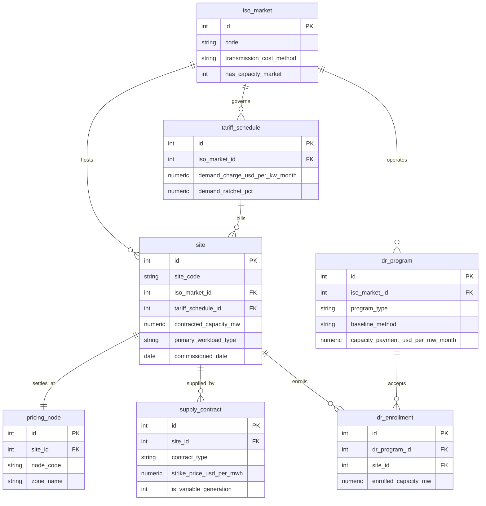
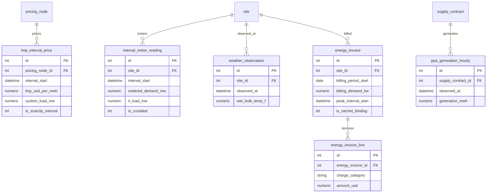
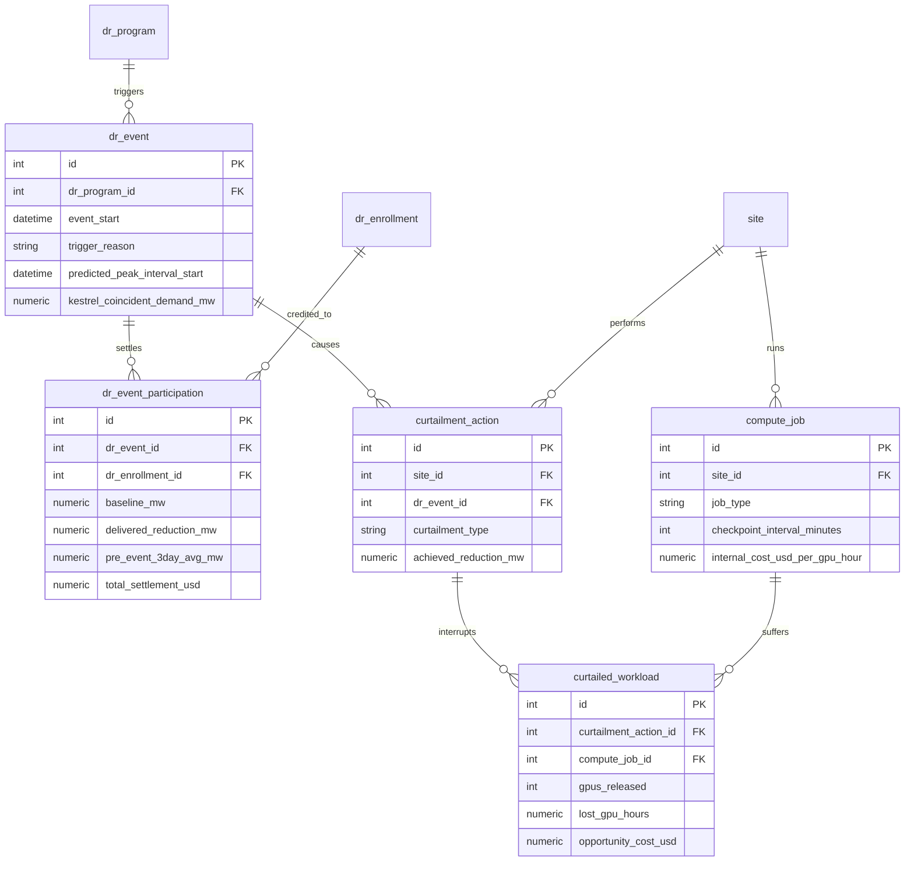

# Kestrel Compute 电力数据集 ER 文档

业务背景, 行业科普, 术语表请见 `01-utilities_datacenter_power_procurement_demand_response_high_business_context-cn.md`. 本文档只描述数据.

---

## 1. 数据集元信息

| 项目 | 值 |
| :--- | :--- |
| 复杂度层级 | High |
| 表数量 | 18 |
| 总行数 | 503,542 |
| 外键关系 | 23 条, 另有 3 条 DDL 无法强制的作用域规则 |
| `REFERENCE_DATE` | `2026-06-30` |
| 数据窗口 | 2025-07-01 至 2026-06-30, 共 365 天 |
| 时序粒度 | 电价与计量 15 分钟, 天气与 PPA 出力 1 小时 |
| 数据库文件 | `utilities_datacenter_power_procurement_demand_response_high.sqlite` |

三条 DDL 管不了的作用域规则, 分析时必须自己遵守:

> 第一, `curtailment_action.dr_event_id` 允许为 NULL. 为 NULL 表示这是一次纯经济性削减, 与任何需求响应项目无关, 不产生结算收入. 把这类记录混进需求响应的收益计算会同时高估成本和低估收益.
>
> 第二, `dr_event` 里 `trigger_reason = 'FORECAST_4CP_PEAK'` 的 5 条记录属于 4CP 躲避, 它们不产生容量补偿, 收益体现在下一年的输电费上. 只有这 5 条记录会填写 `predicted_peak_interval_start`, `iso_actual_peak_interval_start` 和 `kestrel_coincident_demand_mw` 三个字段, 其余事件这三列全为 NULL.
>
> 第三, `ERCOT-4CP-AVOID-2025-06` 这条事件的时间早于计量数据窗口, 所以它没有对应的 `dr_event_participation`, `curtailment_action` 与 `interval_meter_reading` 记录, 只保留 ISO 结算口径的重合需量. 做 4CP 分析时必须用它, 做削减成本分析时必须排除它.

---

## 2. 实体关系图

表比较多, 按业务域拆成三张图.

### 主数据与合约



### 时序事实与账单



### 需求响应与算力



---

## 3. iso_market

一行是一个独立系统运营商. 只有三行, 但它是整套数据的规则来源: 一座园区落在哪个 ISO, 决定了它的电价怎么波动, 输电费怎么算, 有没有容量费, 以及能参加什么样的需求响应项目. 分析里凡是出现 "为什么得州和俄亥俄差这么多", 答案基本都在这张表里.

| 列 | 类型 | 约束 | 说明 |
| :--- | :--- | :--- | :--- |
| `id` | INTEGER | PK | |
| `code` | VARCHAR(10) | UNIQUE, NOT NULL | ERCOT, PJM, MISO |
| `name` | VARCHAR(120) | NOT NULL | 机构全称 |
| `settlement_interval_minutes` | INTEGER | NOT NULL | 该市场实时市场的真实出清间隔. ERCOT 是 15, PJM 与 MISO 是 5. 注意这不是本数据集的存储粒度, 本数据集统一按 15 分钟区间存储 |
| `transmission_cost_method` | VARCHAR(20) | NOT NULL | `4CP` 或 `PLC` 或 `PEAK_DEMAND`, 决定输电费按什么口径分摊 |
| `has_capacity_market` | INTEGER | NOT NULL | 1 表示有容量市场. ERCOT 是 0, 这是它价格剧烈波动的根本原因 |
| `region_description` | VARCHAR(400) | NOT NULL | 一句话市场画像, 英文 |

外键: 无.

样例:

| id | code | settlement_interval_minutes | transmission_cost_method | has_capacity_market |
| :-- | :-- | :-- | :-- | :-- |
| 1 | ERCOT | 15 | 4CP | 0 |
| 2 | PJM | 5 | PLC | 1 |
| 3 | MISO | 5 | PEAK_DEMAND | 1 |

---

## 4. tariff_schedule

一行是当地配电公司给某座园区适用的工业大用户费率表. 这张表回答的是 "除了电量本身, 还要按什么规则收哪些钱". 需量电价, 输电电价和棘轮比例都写在这里, 是账单金额的定价依据.

> 作用域提醒: 两座得州园区的 `demand_charge_usd_per_kw_month` 与 `transmission_charge_usd_per_kw_month` 都是 0, 这不是缺数据. ERCOT 的工业输电费走 4CP, 不按月度需量收, 所以这两列在得州费率下天然为 0. 任何跨市场比较需量电费的查询都要先意识到这一点, 否则会得出 "得州不收需量费所以更便宜" 这种既对又完全没抓住重点的结论.

| 列 | 类型 | 约束 | 说明 |
| :--- | :--- | :--- | :--- |
| `id` | INTEGER | PK | |
| `tariff_code` | VARCHAR(40) | UNIQUE, NOT NULL | 费率代号, 如 `AEP-OH-GS4` |
| `utility_name` | VARCHAR(120) | NOT NULL | 配电公司名 |
| `iso_market_id` | INTEGER | FK, NOT NULL | 所属 ISO |
| `energy_charge_usd_per_kwh` | NUMERIC(10,5) | NOT NULL | 配电公司侧的电量费, 本数据集的园区都自己去市场买电, 所以恒为 0 |
| `demand_charge_usd_per_kw_month` | NUMERIC(10,4) | NOT NULL | 需量电价, PJM 最高 (17.85 到 18.20), MISO 居中, ERCOT 为 0 |
| `transmission_charge_usd_per_kw_month` | NUMERIC(10,4) | NOT NULL | 输电电价, PJM 按 PLC 口径收, MISO 按重合峰值需量 (PEAK_DEMAND) 口径收, ERCOT 走 4CP 故为 0 |
| `rider_charge_usd_per_kwh` | NUMERIC(10,5) | NOT NULL | 监管附加费率 |
| `demand_ratchet_pct` | NUMERIC(6,2) | NOT NULL | 需量棘轮比例. PJM 是 85, MISO 是 75, ERCOT 是 0 表示无棘轮 |
| `billing_demand_basis` | VARCHAR(30) | NOT NULL | `MAX_15MIN_INTERVAL` 或 `4CP_AVERAGE` |
| `effective_from` | DATE | NOT NULL | 费率生效日 |

外键: `iso_market_id` 指向 `iso_market.id`, 多对一.

样例:

| tariff_code | utility_name | demand_charge | ratchet_pct | billing_demand_basis |
| :--- | :--- | :-- | :-- | :--- |
| AEP-OH-GS4 | AEP Ohio | 18.2000 | 85.00 | MAX_15MIN_INTERVAL |
| ONCOR-TX-IND | Oncor Electric Delivery | 0.0000 | 0.00 | 4CP_AVERAGE |
| XCEL-ND-LGS | Xcel Energy North Dakota | 11.4500 | 75.00 | MAX_15MIN_INTERVAL |

---

## 5. site

一行是一座 AI 算力园区. 这是整个数据集的中心实体, 电力合约, 计量读数, 电费账单, 需求响应注册和 GPU 任务全都挂在它身上. `primary_workload_type` 这一列比它看起来重要得多: 它决定了园区的负载曲线形状, 更决定了被削减时的代价, 因为跑预训练的园区和跑在线推理的园区在这件事上差着数倍.

> 作用域提醒: `ALB1` 的 `commissioned_date` 是 2025-09-15, 落在数据窗口内部. 它只有九个半月的计量数据, 而且投产后 60 天是线性爬坡期. 任何按 12 个月求平均的口径都会低估 ALB1, 涉及它的同比或跨园区比较都应该显式处理这个边界.

| 列 | 类型 | 约束 | 说明 |
| :--- | :--- | :--- | :--- |
| `id` | INTEGER | PK | |
| `site_code` | VARCHAR(10) | UNIQUE, NOT NULL | 四字代号, 如 `ABI1` |
| `site_name` | VARCHAR(80) | NOT NULL | 园区名 |
| `city` | VARCHAR(60) | NOT NULL | 所在城市 |
| `state_province` | VARCHAR(4) | NOT NULL | 州代码, OH / TX / IA / ND |
| `country` | VARCHAR(4) | NOT NULL | 恒为 US |
| `iso_market_id` | INTEGER | FK, NOT NULL | 所属电力市场 |
| `tariff_schedule_id` | INTEGER | FK, NOT NULL | 适用费率表 |
| `contracted_capacity_mw` | NUMERIC(10,2) | NOT NULL | 与配电公司签约的电力容量, 是 `metered_demand_mw` 的物理上限 |
| `gpu_count` | INTEGER | NOT NULL | 部署的 GPU 数量, 与容量的比值约 2.3 kW 每张 (含冷却与配电损耗) |
| `primary_workload_type` | VARCHAR(20) | NOT NULL | `TRAINING` / `MIXED` / `INFERENCE` |
| `cooling_type` | VARCHAR(20) | NOT NULL | `AIR_COOLED` / `LIQUID_COOLED`, 决定冷却负载对湿球温度的敏感度 |
| `commissioned_date` | DATE | NOT NULL | 投产日 |
| `is_active` | INTEGER | NOT NULL | 全部为 1 |

外键: `iso_market_id` 与 `tariff_schedule_id` 均为多对一.

全部 6 行:

| site_code | site_name | state | ISO | capacity_mw | gpu_count | workload | cooling | commissioned |
| :--- | :--- | :-- | :-- | :-- | :-- | :--- | :--- | :--- |
| CMH1 | Columbus Campus | OH | PJM | 95.00 | 40000 | INFERENCE | AIR_COOLED | 2021-04-01 |
| ALB1 | New Albany East | OH | PJM | 60.00 | 26000 | MIXED | LIQUID_COOLED | 2025-09-15 |
| ABI1 | Abilene Campus | TX | ERCOT | 110.00 | 48000 | TRAINING | LIQUID_COOLED | 2023-08-01 |
| TPL1 | Temple Campus | TX | ERCOT | 75.00 | 32000 | MIXED | AIR_COOLED | 2024-02-01 |
| CID1 | Cedar Rapids Campus | IA | MISO | 50.00 | 22000 | TRAINING | LIQUID_COOLED | 2024-06-01 |
| FAR1 | Fargo Campus | ND | MISO | 30.00 | 12000 | MIXED | AIR_COOLED | 2022-10-01 |

---

## 6. pricing_node

一行是一个 ISO 结算点. 你的用电不是按 "全市场平均电价" 结算的, 而是按你接入位置那个具体节点的价格结算, 因为输电线路有容量限制, 便宜的电送不到的地方价格就高. 每座园区对应一个节点, 是一对一关系.

| 列 | 类型 | 约束 | 说明 |
| :--- | :--- | :--- | :--- |
| `id` | INTEGER | PK | |
| `node_code` | VARCHAR(40) | UNIQUE, NOT NULL | 节点代号, 如 `HB_WEST_ABI` |
| `node_name` | VARCHAR(120) | NOT NULL | 节点全名 |
| `iso_market_id` | INTEGER | FK, NOT NULL | 所属市场 |
| `site_id` | INTEGER | FK, UNIQUE, NOT NULL | 对应园区, 一对一 |
| `zone_name` | VARCHAR(30) | NOT NULL | 负荷区, 如 `LZ_WEST` |
| `node_type` | VARCHAR(30) | NOT NULL | 恒为 `SETTLEMENT_POINT` |

外键: `site_id` 一对一 (有 UNIQUE 约束), `iso_market_id` 多对一.

样例:

| node_code | node_name | site | zone_name |
| :--- | :--- | :-- | :--- |
| HB_WEST_ABI | ERCOT West Hub - Abilene Load Zone | ABI1 | LZ_WEST |
| AEP_OHIO_CMH | PJM AEP Ohio - Columbus Bus | CMH1 | AEP |
| MISO_NORTH_FAR | MISO North - Fargo Bus | FAR1 | MISO_Z1 |

---

## 7. dr_program

一行是一个需求响应项目. 六个项目分属三个市场, 补偿方式和规则各不相同. 这张表里最关键的一列是 `baseline_method`, 它决定了削减量怎么算, 也就决定了这个项目能不能被基线灌水.

| 列 | 类型 | 约束 | 说明 |
| :--- | :--- | :--- | :--- |
| `id` | INTEGER | PK | |
| `program_code` | VARCHAR(30) | UNIQUE, NOT NULL | 项目代号 |
| `program_name` | VARCHAR(120) | NOT NULL | 项目全名 |
| `iso_market_id` | INTEGER | FK, NOT NULL | 所属市场 |
| `program_type` | VARCHAR(30) | NOT NULL | `EMERGENCY` / `ECONOMIC` / `CAPACITY` / `TRANSMISSION_AVOIDANCE` |
| `baseline_method` | VARCHAR(30) | NOT NULL | `AVG_10_BUSINESS_DAYS` / `METER_BEFORE_AFTER` / `FIRM_SERVICE_LEVEL` |
| `capacity_payment_usd_per_mw_month` | NUMERIC(12,2) | NOT NULL | 容量补偿单价. 4CP 项目为 0, 它的收益不在这里 |
| `energy_payment_usd_per_mwh` | NUMERIC(10,2) | NOT NULL | 按实际削减电量额外支付的单价, 部分项目为 0 |
| `max_events_per_year` | INTEGER | NOT NULL | 年度事件次数上限 |
| `max_event_duration_hours` | INTEGER | NOT NULL | 单次事件时长上限 |
| `notification_lead_time_minutes` | INTEGER | NOT NULL | 提前通知时间. ERCOT CLR 是 0, 意味着自动响应, 人来不及介入 |
| `penalty_usd_per_mw_shortfall` | NUMERIC(12,2) | NOT NULL | 欠交罚款单价 |

外键: `iso_market_id` 多对一.

全部 6 行:

| program_code | ISO | program_type | baseline_method | cap_payment | lead_time_min |
| :--- | :-- | :--- | :--- | :-- | :-- |
| ERCOT-ERS-10 | ERCOT | EMERGENCY | AVG_10_BUSINESS_DAYS | 5600.00 | 10 |
| ERCOT-CLR-RRS | ERCOT | ECONOMIC | METER_BEFORE_AFTER | 4000.00 | 0 |
| ERCOT-4CP-AVOID | ERCOT | TRANSMISSION_AVOIDANCE | FIRM_SERVICE_LEVEL | 0.00 | 240 |
| PJM-ELRP | PJM | EMERGENCY | AVG_10_BUSINESS_DAYS | 3850.00 | 120 |
| PJM-CP | PJM | CAPACITY | FIRM_SERVICE_LEVEL | 5600.00 | 60 |
| MISO-LMR | MISO | CAPACITY | METER_BEFORE_AFTER | 5400.00 | 30 |

---

## 8. supply_contract

一行是一份电力供应合约. Kestrel 用三种方式买电: PPA 长约锁定一个固定价格但只能拿到电站实际发出来的电, 零售固定价合约锁定一个包含输配的到户价, 批发指数敞口则是直接按实时电价结算剩余部分. 判断电力组合好坏, 起点是这张表.

> 作用域提醒: `is_variable_generation = 1` 的三份合约 (一份风电两份光伏) 在 `ppa_generation_hourly` 里有逐小时出力记录, 另外八份没有. 做形状风险分析只能用这三份.

| 列 | 类型 | 约束 | 说明 |
| :--- | :--- | :--- | :--- |
| `id` | INTEGER | PK | |
| `contract_code` | VARCHAR(30) | UNIQUE, NOT NULL | 合约代号 |
| `contract_type` | VARCHAR(20) | NOT NULL | `WIND_PPA` / `SOLAR_PPA` / `RETAIL_FIXED` / `WHOLESALE_INDEX` |
| `site_id` | INTEGER | FK, NOT NULL | 归属园区 |
| `counterparty_name` | VARCHAR(120) | NOT NULL | 交易对手 |
| `start_date` | DATE | NOT NULL | 合约起始日 |
| `end_date` | DATE | NOT NULL | 合约到期日 |
| `contracted_volume_mw` | NUMERIC(10,2) | NOT NULL | 合约规模. 批发指数敞口没有固定量, 为 0 |
| `strike_price_usd_per_mwh` | NUMERIC(10,2) | NOT NULL | 约定价格. 批发指数敞口为 0, 表示随行就市 |
| `settlement_method` | VARCHAR(25) | NOT NULL | `AS_GENERATED` / `FIXED_BLOCK` / `INDEX_PASSTHROUGH` |
| `is_variable_generation` | INTEGER | NOT NULL | 1 表示出力随天气波动, 有逐小时发电记录 |
| `is_active` | INTEGER | NOT NULL | 全部为 1 |

外键: `site_id` 多对一.

样例:

| contract_code | contract_type | site | volume_mw | strike | settlement_method | variable |
| :--- | :--- | :-- | :-- | :-- | :--- | :-- |
| PPA-LHR-WIND-01 | WIND_PPA | ABI1 | 150.00 | 28.50 | AS_GENERATED | 1 |
| PPA-BUC-SOLAR-01 | SOLAR_PPA | CMH1 | 40.00 | 38.90 | AS_GENERATED | 1 |
| RTL-AEP-CMH-26 | RETAIL_FIXED | CMH1 | 60.00 | 62.40 | FIXED_BLOCK | 0 |
| IDX-ERCOT-ABI | WHOLESALE_INDEX | ABI1 | 0.00 | 0.00 | INDEX_PASSTHROUGH | 0 |

---

## 9. dr_enrollment

一行是某座园区在某个需求响应项目下的注册. 它是 `dr_program` 与 `site` 之间的多对多关联表, 但带了自己的业务属性: 承诺可削减的容量. 这个承诺量既决定了每月能拿多少容量补偿, 也决定了事件发生时必须真的削下去多少, 削不够要罚款.

> 作用域提醒: 有一条记录 (`CID1` 在 `ERCOT-ERS-10` 下) 的 `enrolled_capacity_mw` 为 0 且 `is_active = 0`. 这是一条历史遗留注册, Cedar Rapids 园区其实在 MISO 而不是 ERCOT, 当年是登记错误, FY2026 中途已注销. 它不会产生任何事件参与记录, 但会污染 "我们一共注册了几个项目" 这类计数查询, 除非显式过滤 `is_active = 1`.

| 列 | 类型 | 约束 | 说明 |
| :--- | :--- | :--- | :--- |
| `id` | INTEGER | PK | |
| `dr_program_id` | INTEGER | FK, NOT NULL | 项目 |
| `site_id` | INTEGER | FK, NOT NULL | 园区 |
| `enrolled_capacity_mw` | NUMERIC(10,2) | NOT NULL | 承诺可削减容量 |
| `enrollment_start_date` | DATE | NOT NULL | 注册起始日, 不早于园区投产日 |
| `enrollment_end_date` | DATE | NOT NULL | 注册到期日 |
| `capacity_payment_usd_per_mw_month` | NUMERIC(12,2) | NOT NULL | 冗余自项目表, 便于结算时直接取用 |
| `is_active` | INTEGER | NOT NULL | 1 表示 FY2026 内有效 |

外键: `dr_program_id` 与 `site_id` 均为多对一, 两者组合唯一.

承诺容量一览 (13 行):

| program_code | ABI1 | TPL1 | CMH1 | ALB1 | CID1 | FAR1 |
| :--- | :-- | :-- | :-- | :-- | :-- | :-- |
| ERCOT-ERS-10 | 12.0 | 5.0 | | | 0.0 (已注销) | |
| ERCOT-CLR-RRS | 9.0 | 3.5 | | | | |
| ERCOT-4CP-AVOID | 62.0 | 38.0 | | | | |
| PJM-ELRP | | | 9.0 | 6.0 | | |
| PJM-CP | | | 6.0 | 5.0 | | |
| MISO-LMR | | | | | 4.5 | 3.0 |

注意 4CP 的承诺量比其他项目大一个数量级. 它一年只做四次, 每次两小时, 但削得极深, 因为躲过一次就能省下下一年输电费的四分之一.

---

## 10. compute_job

一行是一个 GPU 算力任务. 这张表本身不属于电力域, 它出现在这里只有一个原因: 需求响应削减掉的是这些任务, 而它们的机会成本才是削减的真实代价. `checkpoint_interval_minutes` 和 `internal_cost_usd_per_gpu_hour` 这两列是整个 Q1 分析的支点.

| 列 | 类型 | 约束 | 说明 |
| :--- | :--- | :--- | :--- |
| `id` | INTEGER | PK | |
| `job_code` | VARCHAR(24) | UNIQUE, NOT NULL | 任务代号, 形如 `JOB-ABI1-000123` |
| `site_id` | INTEGER | FK, NOT NULL | 运行园区 |
| `customer_name` | VARCHAR(80) | NOT NULL | 客户名, 12 家虚构公司之一 |
| `job_type` | VARCHAR(20) | NOT NULL | `PRETRAINING` / `FINETUNING` / `INFERENCE_SERVING` / `INFERENCE_BATCH` / `RESEARCH` |
| `contract_tier` | VARCHAR(12) | NOT NULL | `RESERVED` / `ON_DEMAND` / `SPOT`, 决定被中断时赔不赔 SLA credit |
| `gpu_count` | INTEGER | NOT NULL | 占用 GPU 数. 预训练 512 到 4096, 研究类 8 到 64 |
| `submitted_at` | DATETIME | NOT NULL | 提交时间, 早于 `started_at` |
| `started_at` | DATETIME | NOT NULL | 开始时间 |
| `planned_end_at` | DATETIME | NOT NULL | 计划结束时间, 晚于 `started_at` |
| `actual_end_at` | DATETIME | NULL | 实际结束时间. 状态为 `RUNNING` 时为空 |
| `planned_gpu_hours` | NUMERIC(14,2) | NOT NULL | `gpu_count` 乘以计划时长 |
| `checkpoint_interval_minutes` | INTEGER | NOT NULL | 预训练 300, 微调 90, 批量推理 20, 研究 120, 在线推理 0 |
| `is_interruptible` | INTEGER | NOT NULL | 1 表示合同允许抢占. SPOT 档位或研究类, 批量推理类任务为 1 |
| `internal_cost_usd_per_gpu_hour` | NUMERIC(8,4) | NOT NULL | 机会成本单价, 按任务类型固定. 预训练 3.15, 研究 1.20 |
| `status` | VARCHAR(15) | NOT NULL | `COMPLETED` / `RUNNING` / `FAILED` |

外键: `site_id` 多对一.

样例 (一个被削减代价极高的预训练任务, 和一个几乎无代价的在线推理任务):

| job_code | site | job_type | tier | gpu_count | checkpoint_min | interruptible | cost_per_gpu_h |
| :--- | :-- | :--- | :--- | :-- | :-- | :-- | :-- |
| JOB-ABI1-000959 | ABI1 | PRETRAINING | SPOT | 3072 | 300 | 1 | 3.1500 |
| JOB-CMH1-000005 | CMH1 | INFERENCE_SERVING | RESERVED | 256 | 0 | 0 | 2.4000 |
| JOB-TPL1-001721 | TPL1 | RESEARCH | SPOT | 16 | 120 | 1 | 1.2000 |

---

## 11. weather_observation

一行是某座园区某个整点的气象观测. 它存在的理由是冷却负载: 数据中心的电耗里有一成到三成花在冷却上, 而冷却效率的真正驱动变量是湿球温度而不是干球温度. 分析电价尖峰, 负载高峰和季节性成本时, 这张表是解释变量.

| 列 | 类型 | 约束 | 说明 |
| :--- | :--- | :--- | :--- |
| `id` | INTEGER | PK | |
| `site_id` | INTEGER | FK, NOT NULL | 园区 |
| `observed_at` | DATETIME | NOT NULL | 整点时刻, 每园区 8,760 行 |
| `dry_bulb_temp_f` | NUMERIC(6,2) | NOT NULL | 干球温度, 就是普通意义上的气温 |
| `wet_bulb_temp_f` | NUMERIC(6,2) | NOT NULL | 湿球温度, 综合温度与湿度, 冷却负载的驱动变量 |
| `relative_humidity_pct` | NUMERIC(5,2) | NOT NULL | 相对湿度 |
| `wind_speed_mph` | NUMERIC(6,2) | NOT NULL | 风速 |
| `cloud_cover_pct` | NUMERIC(5,2) | NOT NULL | 云量 |

外键: `site_id` 多对一.

样例:

| site | observed_at | dry_bulb_f | wet_bulb_f | humidity_pct |
| :-- | :--- | :-- | :-- | :-- |
| CMH1 | 2025-07-01 00:00:00 | 70.04 | 62.23 | 69.95 |
| ABI1 | 2026-01-15 05:00:00 | 38.34 | 28.11 | 60.65 |

---

## 12. lmp_interval_price

一行是某个节点某 15 分钟区间的实时电价. 这是数据集里最大的两张表之一, 6 个节点乘以 35,040 个区间. 所有批发电量结算, 经济性削减决策和 PPA 价值评估都从这里出发. `system_load_mw` 这一列存的是同一时刻整个 ISO 的系统总负荷, 4CP 判定完全依赖它.

> 作用域提醒: 同一个 ISO 下的两个节点, `system_load_mw` 的值是相同的, 因为它描述的是整张电网而不是单个节点. 这是刻意的反规范化, 目的是让 4CP 分析不用再多 join 一张表. 但做 ISO 级系统负荷统计时必须先去重, 否则每个时刻会被算两次.

| 列 | 类型 | 约束 | 说明 |
| :--- | :--- | :--- | :--- |
| `id` | INTEGER | PK | |
| `pricing_node_id` | INTEGER | FK, NOT NULL | 节点 |
| `interval_start` | DATETIME | NOT NULL | 区间起点 |
| `interval_end` | DATETIME | NOT NULL | 区间终点, 恒为起点加 15 分钟 |
| `lmp_usd_per_mwh` | NUMERIC(12,4) | NOT NULL | 节点边际电价, 三个分量之和. 可以为负 |
| `energy_component` | NUMERIC(12,4) | NOT NULL | 系统基准电能价格分量 |
| `congestion_component` | NUMERIC(12,4) | NOT NULL | 输电阻塞分量 |
| `loss_component` | NUMERIC(12,4) | NOT NULL | 线路损耗分量 |
| `system_load_mw` | NUMERIC(12,2) | NOT NULL | 该时刻整个 ISO 的系统总负荷 |
| `is_scarcity_interval` | INTEGER | NOT NULL | 1 表示 LMP 超过 500 美元每 MWh |

外键: `pricing_node_id` 多对一.

样例 (一个稀缺定价区间和一个负电价区间, 都在 ERCOT West):

| node | interval_start | lmp | energy_comp | congestion | system_load_mw | scarcity |
| :-- | :--- | :-- | :-- | :-- | :-- | :-- |
| HB_WEST_ABI | 2025-07-01 15:30 | 3287.9427 | 3295.6656 | -8.1181 | 91675.43 | 1 |
| HB_WEST_ABI | 2025-07-01 00:45 | -12.0594 | -9.7098 | -2.1252 | 73925.82 | 0 |

各节点全年价格特征:

| node_code | 年均 LMP | 最高 LMP | 稀缺区间数 | 负电价区间数 |
| :--- | :-- | :-- | :-- | :-- |
| HB_WEST_ABI | 35.47 | 4600 | 47 | 6303 |
| HB_NORTH_TPL | 39.37 | 4737 | 38 | 211 |
| AEP_OHIO_CMH | 45.09 | 4628 | 33 | 0 |
| AEP_OHIO_ALB | 46.15 | 4627 | 26 | 0 |
| MISO_CENTRAL_CID | 37.79 | 4789 | 43 | 48 |
| MISO_NORTH_FAR | 32.32 | 4564 | 36 | 227 |

ERCOT West 有 6,303 个负电价区间, 占全年的 18%. 这个数字本身就是 Longhorn Ridge 那份 PPA 出问题的先兆.

---

## 13. ppa_generation_hourly

一行是某份可变出力 PPA 在某个整点的实际发电情况. 只有三份合约有记录: 一份西德州风电, 两份光伏. 这张表和 `lmp_interval_price` 的关联方式决定了 PPA 形状风险能不能被看见.

> 作用域提醒: `generation_mwh` 是扣除 ISO 弃风之后的净发电量, 而 `capacity_factor_pct` 是弃风之前的原始容量因子. 两者的关系是 `contracted_volume_mw * capacity_factor_pct / 100 = generation_mwh + curtailed_by_iso_mwh`. 结算按 `generation_mwh` 走, 分析出力形态则应该用 `capacity_factor_pct`.

| 列 | 类型 | 约束 | 说明 |
| :--- | :--- | :--- | :--- |
| `id` | INTEGER | PK | |
| `supply_contract_id` | INTEGER | FK, NOT NULL | 对应 PPA 合约 |
| `observed_at` | DATETIME | NOT NULL | 整点时刻 |
| `generation_mwh` | NUMERIC(12,4) | NOT NULL | 该小时净发电量, 已扣除弃风 |
| `capacity_factor_pct` | NUMERIC(6,2) | NOT NULL | 原始容量因子百分比 |
| `curtailed_by_iso_mwh` | NUMERIC(12,4) | NOT NULL | 被 ISO 要求减出力的电量, 只在负电价时段发生 |

外键: `supply_contract_id` 多对一.

样例:

| contract | observed_at | generation_mwh | capacity_factor_pct | curtailed_by_iso_mwh |
| :--- | :--- | :-- | :-- | :-- |
| PPA-LHR-WIND-01 | 2025-07-01 01:00 | 37.6700 | 36.74 | 17.4373 |
| PPA-BUC-SOLAR-01 | 2025-07-01 13:00 | 33.7341 | 84.34 | 0.0000 |

---

## 14. interval_meter_reading

一行是某座园区某 15 分钟区间的计量读数. 数据集里最大的表之一, 6 座园区乘以 35,040 个区间. 电费账单的计费需量, 需求响应的基线与实测负载, 4CP 的重合需量, 全都从这张表推导. 之所以坚持 15 分钟粒度, 是因为需量电费和 4CP 都按 15 分钟区间判定, 聚合到小时就再也看不出来了.

> 作用域提醒: `metered_demand_mw` 恒等于 `it_load_mw + cooling_load_mw`, 且不会超过所属园区的 `contracted_capacity_mw`. `ALB1` 在 2025-09-15 之前的所有区间读数都是 0, 因为园区尚未投产, 这些零值不应被计入任何平均值.

| 列 | 类型 | 约束 | 说明 |
| :--- | :--- | :--- | :--- |
| `id` | INTEGER | PK | |
| `site_id` | INTEGER | FK, NOT NULL | 园区 |
| `interval_start` | DATETIME | NOT NULL | 区间起点 |
| `interval_end` | DATETIME | NOT NULL | 区间终点 |
| `metered_demand_mw` | NUMERIC(10,3) | NOT NULL | 园区总功率, 计费需量就是它在一个月内的最大值 |
| `it_load_mw` | NUMERIC(10,3) | NOT NULL | GPU 与配套 IT 设备的功率 |
| `cooling_load_mw` | NUMERIC(10,3) | NOT NULL | 冷却系统功率, 随湿球温度上升 |
| `energy_mwh` | NUMERIC(10,4) | NOT NULL | 该区间用电量, 等于功率乘以 0.25 小时 |
| `is_curtailed` | INTEGER | NOT NULL | 1 表示该区间处于削减状态 |

外键: `site_id` 多对一.

样例:

| site | interval_start | metered_mw | it_mw | cooling_mw | energy_mwh | curtailed |
| :-- | :--- | :-- | :-- | :-- | :-- | :-- |
| CMH1 | 2025-07-04 18:00 | 54.683 | 44.348 | 10.335 | 13.6707 | 1 |
| CMH1 | 2025-08-14 15:45 | 88.638 | 74.141 | 14.497 | 22.1594 | 0 |
| ALB1 | 2025-08-01 12:00 | 0.000 | 0.000 | 0.000 | 0.0000 | 0 |

第二行就是那次 30 分钟 burn-in 测试的峰值区间, 也是 CMH1 全年的最高读数.

---

## 15. energy_invoice

一行是某座园区某个月的电费账单头. 70 行, 因为 ALB1 只有 10 个月. 这张表最值得注意的是 `metered_peak_demand_kw` 与 `billing_demand_kw` 的区别: 前者是当月实际测到的最高功率, 后者是真正拿去乘以需量电价的数字, 两者在棘轮条款生效时并不相等.

| 列 | 类型 | 约束 | 说明 |
| :--- | :--- | :--- | :--- |
| `id` | INTEGER | PK | |
| `invoice_number` | VARCHAR(30) | UNIQUE, NOT NULL | 账单号, 形如 `INV-CMH1-202508` |
| `site_id` | INTEGER | FK, NOT NULL | 园区 |
| `billing_period_start` | DATE | NOT NULL | 计费期起 |
| `billing_period_end` | DATE | NOT NULL | 计费期止 |
| `total_energy_mwh` | NUMERIC(14,3) | NOT NULL | 当月总用电量 |
| `metered_peak_demand_kw` | NUMERIC(14,2) | NOT NULL | 当月实测最高 15 分钟功率 |
| `billing_demand_kw` | NUMERIC(14,2) | NOT NULL | 计费需量, 取实测峰值与棘轮下限的较大者 |
| `peak_interval_start` | DATETIME | NULL | 实测峰值出现在哪个 15 分钟区间 |
| `is_ratchet_binding` | INTEGER | NOT NULL | 1 表示这个月的计费需量是被历史峰值垫高的 |
| `total_amount_usd` | NUMERIC(14,2) | NOT NULL | 账单总额, 等于所有分项之和 |
| `blended_rate_usd_per_kwh` | NUMERIC(10,5) | NOT NULL | 混合单价, 总额除以总用电量 |
| `due_date` | DATE | NOT NULL | 到期日, 计费期止后 30 天 |
| `paid_date` | DATE | NULL | 实际付款日 |

外键: `site_id` 多对一.

样例 (一个棘轮生效月和一个正常月):

| invoice_number | total_mwh | metered_peak_kw | billing_kw | peak_interval | ratchet | total_usd | blended |
| :--- | :-- | :-- | :-- | :--- | :-- | :-- | :-- |
| INV-CMH1-202508 | 40934.431 | 88637.67 | 88637.67 | 2025-08-14 15:45 | 0 | 5819446.86 | 0.14217 |
| INV-CMH1-202509 | 37143.836 | 71833.51 | 75342.02 | 2025-09-11 15:00 | 1 | 5139777.13 | 0.13837 |

九月那一行是关键: 实测峰值只有 71,834 kW, 但账单按 75,342 kW 收, 差出来的 3,509 kW 是八月那次 burn-in 测试留下的.

---

## 16. energy_invoice_line

一行是账单里的一个收费分项. 每张账单 5 到 7 行, 取决于所在市场. 这张表存在的唯一理由是把混合单价拆开: 只看 `blended_rate_usd_per_kwh` 永远搞不清一张账单里到底哪一块最贵, 也就无从下手去压.

| 列 | 类型 | 约束 | 说明 |
| :--- | :--- | :--- | :--- |
| `id` | INTEGER | PK | |
| `energy_invoice_id` | INTEGER | FK, NOT NULL | 所属账单 |
| `charge_category` | VARCHAR(20) | NOT NULL | `ENERGY` / `DEMAND` / `TRANSMISSION` / `CAPACITY` / `ANCILLARY` / `RIDER` / `TAX` |
| `description` | VARCHAR(160) | NOT NULL | 收费说明, 英文. DEMAND 行会写明计费需量取自哪个 15 分钟区间 |
| `quantity` | NUMERIC(14,3) | NOT NULL | 计费量 |
| `unit` | VARCHAR(12) | NOT NULL | `MWh` / `kW` / `kWh` / `USD` |
| `unit_rate_usd` | NUMERIC(12,5) | NOT NULL | 单价 |
| `amount_usd` | NUMERIC(14,2) | NOT NULL | 金额, 等于 `quantity * unit_rate_usd` |

外键: `energy_invoice_id` 多对一, ON DELETE 无级联 (SQLite 默认).

各市场的分项构成:

| 市场 | ENERGY | DEMAND | TRANSMISSION | CAPACITY | ANCILLARY | RIDER | TAX |
| :-- | :-- | :-- | :-- | :-- | :-- | :-- | :-- |
| PJM | 有 | 有 | 有 | 有 | 有 | 有 | 有 |
| ERCOT | 有 | 无 | 有 (4CP 口径) | 无 | 有 | 有 | 有 |
| MISO | 有 | 有 | 有 | 无 | 有 | 有 | 有 |

样例:

| invoice | charge_category | quantity | unit | unit_rate | amount_usd |
| :--- | :--- | :-- | :-- | :-- | :-- |
| INV-CMH1-202507 | ENERGY | 41695.563 | MWh | 62.40000 | 2601803.15 |
| INV-CMH1-202507 | DEMAND | 82568.851 | kW | 18.20000 | 1502753.08 |
| INV-CMH1-202507 | TRANSMISSION | 82568.851 | kW | 6.40000 | 528440.64 |
| INV-CMH1-202507 | CAPACITY | 82568.851 | kW | 4.85000 | 400458.93 |

---

## 17. dr_event

一行是一次需求响应事件. 58 行, 其中 53 次是常规的付费项目事件, 5 次是 4CP 躲避. 事件的时点不是随机的, 它们落在各自市场系统负荷最高或价格最高的时段上.

> 作用域提醒: 最后三列 (`predicted_peak_interval_start`, `iso_actual_peak_interval_start`, `kestrel_coincident_demand_mw`) 只有 4CP 事件才填写, 其余 53 行全为 NULL. 反过来, 4CP 事件不产生容量补偿, 它的 `dr_event_participation` 记录里 `capacity_payment_usd` 为 0.

| 列 | 类型 | 约束 | 说明 |
| :--- | :--- | :--- | :--- |
| `id` | INTEGER | PK | |
| `event_code` | VARCHAR(30) | UNIQUE, NOT NULL | 事件代号 |
| `dr_program_id` | INTEGER | FK, NOT NULL | 所属项目 |
| `event_start` | DATETIME | NOT NULL | 事件起始 |
| `event_end` | DATETIME | NOT NULL | 事件结束, 晚于起始 |
| `notification_sent_at` | DATETIME | NOT NULL | 通知发出时间, 等于起始时间减去项目的提前通知时长 |
| `trigger_reason` | VARCHAR(30) | NOT NULL | `SYSTEM_EMERGENCY` / `PRICE_SPIKE` / `CAPACITY_TEST` / `FORECAST_4CP_PEAK` |
| `iso_system_load_mw` | NUMERIC(12,2) | NOT NULL | 事件时刻的 ISO 系统负荷 |
| `max_lmp_usd_per_mwh` | NUMERIC(12,4) | NOT NULL | 事件期间相关节点的最高电价 |
| `is_mandatory` | INTEGER | NOT NULL | 1 表示强制响应, 不响应要罚款 |
| `is_test_event` | INTEGER | NOT NULL | 1 表示只是能力核验演练, 不是真的系统紧急 |
| `predicted_peak_interval_start` | DATETIME | NULL | 仅 4CP: 事前预测的系统峰值区间 |
| `iso_actual_peak_interval_start` | DATETIME | NULL | 仅 4CP: ISO 事后确认的实际峰值区间 |
| `kestrel_coincident_demand_mw` | NUMERIC(10,3) | NULL | 仅 4CP: 我们在实际峰值时刻的用电量 |

外键: `dr_program_id` 多对一.

全部 5 条 4CP 记录:

| event_code | predicted_peak | actual_peak | 偏差分钟 | coincident_mw |
| :--- | :--- | :--- | :-- | :-- |
| ERCOT-4CP-AVOID-2025-06 | 2025-06-24 16:45 | 2025-06-24 17:00 | 15 | 23.600 |
| ERCOT-4CP-AVOID-2025-07 | 2025-07-14 15:30 | 2025-07-14 16:00 | 30 | 24.700 |
| ERCOT-4CP-AVOID-2025-08 | 2025-08-01 16:45 | 2025-08-01 18:00 | 75 | 163.905 |
| ERCOT-4CP-AVOID-2025-09 | 2025-09-04 17:45 | 2025-09-04 18:00 | 15 | 19.600 |
| ERCOT-4CP-AVOID-2026-06 | 2026-06-26 18:00 | 2026-06-26 18:15 | 15 | 22.200 |

削减窗口是预测峰值前后各 60 分钟. 八月那次预测偏离 75 分钟, 实际峰值落在窗口之外, 所以两座得州园区在那一刻还在满载, 重合需量 163.9 MW, 是其他三次的七倍.

---

## 18. dr_event_participation

一行是某座园区在某次事件里的结算记录. 104 行. 这是需求响应的钱账所在, 也是基线灌水的检验现场. `baseline_mw` 减去 `actual_metered_mw` 就是 `delivered_reduction_mw`, 而补偿完全按这个差值算, 所以基线定得越高, 拿到的钱越多.

> 作用域提醒: `pre_event_3day_avg_mw` 与 `pre_event_30day_avg_mw` 这两列不参与结算, 它们是留给审计用的诊断字段. 正常运行下两者的比值应该在 1.0 附近, 明显大于 1 意味着事件前负载被抬高过, 这正是陷阱 2 的检验入口 (见 Q7 与 Q8).
>
> 有一个口径细节需要说明: 这两列存的是"针对每条参与记录预先算好的干净参照诊断值". 只有确实被灌水的 `AVG_10_BUSINESS_DAYS` 记录才会在这里显示出抬高, 同园区其它基线算法 (`FIRM_SERVICE_LEVEL` / `METER_BEFORE_AFTER`) 的记录读的是灌水前的负载快照. 因此它们不保证等于从 `interval_meter_reading` 逐区间重算的 3 天 / 30 天均值 —— 灌水在物理电表层是真实发生的 (被抬高的 `metered_demand_mw` 会照实入库), 而这两列有意收敛到干净参照, 好让"哪条记录的基线被人为抬高"这个信号干净地落在用 AVG_10 基线的项目上, 不外溢到另外两种天然免疫的基线. 复现陷阱 2 时直接用这两列的比值即可 (Q7 就是这么做的), 不要回到电表逐区间重算, 否则会把物理层真实存在的负载抬高误当成另外两种基线的诊断信号.

| 列 | 类型 | 约束 | 说明 |
| :--- | :--- | :--- | :--- |
| `id` | INTEGER | PK | |
| `dr_event_id` | INTEGER | FK, NOT NULL | 事件 |
| `dr_enrollment_id` | INTEGER | FK, NOT NULL | 注册记录, 由它间接确定园区与项目 |
| `baseline_mw` | NUMERIC(10,3) | NOT NULL | 按项目 `baseline_method` 算出的基线负载 |
| `actual_metered_mw` | NUMERIC(10,3) | NOT NULL | 事件期间的实测平均负载 |
| `committed_reduction_mw` | NUMERIC(10,3) | NOT NULL | 承诺削减量, 冗余自注册记录 |
| `delivered_reduction_mw` | NUMERIC(10,3) | NOT NULL | 实际认定削减量, 等于基线减实测, 不小于 0 |
| `performance_ratio` | NUMERIC(8,4) | NOT NULL | 实际除以承诺, 封顶在 2.0 (ISO 对超额交付的认定上限) |
| `pre_event_3day_avg_mw` | NUMERIC(10,3) | NOT NULL | 事件前 3 天平均负载, 审计诊断用 |
| `pre_event_30day_avg_mw` | NUMERIC(10,3) | NOT NULL | 事件前 30 天平均负载, 审计诊断用 |
| `capacity_payment_usd` | NUMERIC(12,2) | NOT NULL | 容量补偿 |
| `energy_payment_usd` | NUMERIC(12,2) | NOT NULL | 能量补偿 |
| `penalty_usd` | NUMERIC(12,2) | NOT NULL | 欠交罚款, 达成率低于 0.85 时产生 |
| `total_settlement_usd` | NUMERIC(12,2) | NOT NULL | 净结算额, 等于两项补偿减罚款 |

外键: `dr_event_id` 与 `dr_enrollment_id` 均为多对一.

样例 (一条正常记录和一条基线明显被抬高的记录):

| event | site | baseline_mw | actual_mw | delivered_mw | 3day/30day | settlement_usd |
| :--- | :-- | :-- | :-- | :-- | :-- | :-- |
| ERCOT-ERS-10-FY26-01 | ABI1 | 99.487 | 83.008 | 16.480 | 1.0000 | 57600.00 |
| PJM-ELRP-FY26-11 | CMH1 | 63.115 | 53.112 | 10.003 | 1.1463 | 40520.69 |

---

## 19. curtailment_action

一行是一次实际的负载削减动作. 137 行. 它和 `dr_event_participation` 是两件不同的事: 参与记录讲的是钱怎么结算, 削减动作讲的是电网侧真的发生了什么. 更重要的是, 有 33 次削减根本不属于任何需求响应项目, 它们是纯粹因为实时电价高到不值得跑任务而主动停机的.

> 作用域提醒: `dr_event_id` 为 NULL 的记录是纯经济性削减, `curtailment_type` 为 `ECONOMIC`, 它们不产生任何结算收入, 收益体现在 `energy_cost_avoided_usd` 上. 计算需求响应净收益时必须用 `curtailment_type = 'DR_EVENT'` 过滤, 把 `ECONOMIC` 和 `4CP_AVOIDANCE` 排除掉, 否则会把不相干的成本算进去.

| 列 | 类型 | 约束 | 说明 |
| :--- | :--- | :--- | :--- |
| `id` | INTEGER | PK | |
| `action_code` | VARCHAR(30) | UNIQUE, NOT NULL | 动作代号 |
| `site_id` | INTEGER | FK, NOT NULL | 园区 |
| `dr_event_id` | INTEGER | FK, NULL | 触发事件. 为 NULL 表示经济性削减 |
| `curtailment_type` | VARCHAR(25) | NOT NULL | `DR_EVENT` / `4CP_AVOIDANCE` / `ECONOMIC` |
| `action_start` | DATETIME | NOT NULL | 削减开始 |
| `action_end` | DATETIME | NOT NULL | 削减结束 |
| `duration_minutes` | INTEGER | NOT NULL | 持续分钟数 |
| `target_reduction_mw` | NUMERIC(10,3) | NOT NULL | 目标削减量 |
| `achieved_reduction_mw` | NUMERIC(10,3) | NOT NULL | 实际削减量 |
| `energy_avoided_mwh` | NUMERIC(12,4) | NOT NULL | 少用的电量 |
| `market_price_at_action_usd_per_mwh` | NUMERIC(12,4) | NOT NULL | 削减期间该节点的平均电价 |
| `energy_cost_avoided_usd` | NUMERIC(12,2) | NOT NULL | 省下的电费, 等于电量乘以电价 |
| `decision_made_by` | VARCHAR(40) | NOT NULL | 决策来源, 四种角色之一 |

外键: `site_id` 多对一, `dr_event_id` 多对一且可空.

三种削减类型的分布:

| curtailment_type | 记录数 | 说明 |
| :--- | :-- | :--- |
| DR_EVENT | 96 | 由付费需求响应项目触发 |
| 4CP_AVOIDANCE | 8 | 4 次在窗口内的 4CP 事件, 每次两座得州园区各一条 |
| ECONOMIC | 33 | 纯经济性, 只发生在 ERCOT, 电价超过 240 美元每 MWh 时触发 |

样例:

| action_code | site | type | duration_min | achieved_mw | price | cost_avoided | decided_by |
| :--- | :-- | :--- | :-- | :-- | :-- | :-- | :--- |
| CUR-TPL1-00105 | TPL1 | ECONOMIC | 30 | 8.293 | 2398.2638 | 9944.41 | Automated Scheduler |
| CUR-ABI1-00005 | ABI1 | DR_EVENT | 240 | 10.917 | 267.3042 | 11672.14 | Demand Response Manager |

---

## 20. curtailed_workload

一行是一次削减动作打断的一个具体 GPU 任务. 784 行. 这是整个数据集里最重要的一张表, 因为它是唯一一个把 "电力侧的决策" 和 "算力侧的代价" 放在同一行上的地方. 没有它, 需求响应看起来永远是净收入.

| 列 | 类型 | 约束 | 说明 |
| :--- | :--- | :--- | :--- |
| `id` | INTEGER | PK | |
| `curtailment_action_id` | INTEGER | FK, NOT NULL | 削减动作 |
| `compute_job_id` | INTEGER | FK, NOT NULL | 被打断的任务 |
| `gpus_released` | INTEGER | NOT NULL | 从这个任务上释放的 GPU 数, 不超过任务的 `gpu_count` |
| `interrupted_at` | DATETIME | NOT NULL | 中断时刻, 等于削减动作的开始时间 |
| `resumed_at` | DATETIME | NOT NULL | 恢复时刻, 等于削减动作的结束时间 |
| `interruption_minutes` | INTEGER | NOT NULL | 中断时长 |
| `checkpoint_rollback_minutes` | INTEGER | NOT NULL | 回滚损失的分钟数. 在线推理任务为 0, 预训练任务是 checkpoint 间隔的 25% 到 85% |
| `lost_gpu_hours` | NUMERIC(14,3) | NOT NULL | 损失的 GPU 小时, 等于 `gpus_released * (interruption_minutes + checkpoint_rollback_minutes) / 60` |
| `opportunity_cost_usd` | NUMERIC(14,2) | NOT NULL | 机会成本, 等于 `lost_gpu_hours * internal_cost_usd_per_gpu_hour` |
| `sla_credit_usd` | NUMERIC(14,2) | NOT NULL | SLA 赔付. RESERVED 档位每损失 1 GPU 小时赔 0.95 美元, ON_DEMAND 赔 0.35, SPOT 不赔 |

外键: `curtailment_action_id` 与 `compute_job_id` 均为多对一.

样例 (代价最高的一条和几乎无代价的一条):

| action | job_type | gpus_released | interruption_min | rollback_min | lost_gpu_hours | opportunity_cost | sla_credit |
| :--- | :--- | :-- | :-- | :-- | :-- | :-- | :-- |
| CUR-ABI1-00017 | PRETRAINING | 3072 | 240 | 212 | 23142.400 | 72898.56 | 0.00 |
| CUR-CMH1-00056 | INFERENCE_SERVING | 512 | 360 | 0 | 3072.000 | 7372.80 | 2918.40 |

第一行说明了整件事: 中断了 4 小时, 但因为 checkpoint 间隔是 300 分钟, 又白白回滚了 3.5 小时, 实际损失接近中断时长的两倍.

---

## 21. 数据生成规则

### 时间顺序约束

`compute_job.submitted_at` 早于 `started_at`, `started_at` 早于 `planned_end_at`. 状态为 `RUNNING` 的任务 `actual_end_at` 为空, 其余任务的 `actual_end_at` 在计划结束时间前后 30 分钟到 240 分钟之间.

`dr_event.notification_sent_at` 等于 `event_start` 减去项目的 `notification_lead_time_minutes`. ERCOT CLR 项目的提前量是 0, 所以这两个时刻相同, 表示自动响应.

`curtailment_action.action_start` 与 `action_end` 对齐到所属事件的起止时刻 (经济性削减除外, 它们对齐到触发的那个价格区间). `curtailed_workload.interrupted_at` 与 `resumed_at` 直接继承自削减动作.

`energy_invoice.due_date` 是计费期结束后 30 天, `paid_date` 在计费期结束后 24 到 38 天之间.

被削减的任务必须在削减时段内真的在运行, 也就是 `compute_job.started_at <= action_start` 且 `planned_end_at >= action_end`.

### 引用完整性

23 条外键全部由 DDL 强制. 除此之外有三条 DDL 管不了的规则, 已在第 1 节列出.

另有一条组合唯一性: `dr_enrollment` 里 `(dr_program_id, site_id)` 组合不重复, 但 DDL 没有加这个约束.

### 取值范围

| 字段 | 范围 | 依据 |
| :--- | :--- | :--- |
| `lmp_usd_per_mwh` | -100 到 4800 | ERCOT 下限设 -100, PJM 设 -15, MISO 设 -40; 上限对应各市场的系统上限 |
| `metered_demand_mw` | 0 到园区容量的 97% (实测 ABI1 全年峰值约为容量的 96.9%; CMH1 全年峰值来自 8 月 burn-in 测试, 约为容量的 93.3%) | 配电侧保护与功率封顶 |
| `capacity_factor_pct` | 风电 0 到 98, 光伏 0 到 97 且夜间为 0 | 行业常规 |
| `checkpoint_interval_minutes` | {0, 20, 90, 120, 300} | 按任务类型固定取值 |
| `gpu_count` (任务) | 8 到 4096, 按 2 的幂取值 | 分布式训练的常见规模 |
| `performance_ratio` | 0 到 2.0 | ISO 对超额交付的认定上限 |
| `wet_bulb_temp_f` | 约 -10 到 85 | 四个州的气候范围 |

### 计算字段

以下字段由其他字段算出, 不是独立随机数:

```
interval_meter_reading.metered_demand_mw = it_load_mw + cooling_load_mw
interval_meter_reading.energy_mwh       = metered_demand_mw * 0.25

lmp_interval_price.lmp_usd_per_mwh = energy_component + congestion_component + loss_component

energy_invoice_line.amount_usd     = quantity * unit_rate_usd
energy_invoice.total_amount_usd    = SUM(energy_invoice_line.amount_usd)
energy_invoice.blended_rate_usd_per_kwh = total_amount_usd / (total_energy_mwh * 1000)
energy_invoice.billing_demand_kw   = MAX(metered_peak_demand_kw, ratchet_floor_kw)
其中 ratchet_floor_kw = MAX(过去 11 个月 metered_peak_demand_kw) * demand_ratchet_pct / 100

dr_event_participation.delivered_reduction_mw = MAX(0, baseline_mw - actual_metered_mw)
dr_event_participation.performance_ratio      = MIN(2.0, delivered_reduction_mw / committed_reduction_mw)
dr_event_participation.total_settlement_usd   = capacity_payment_usd + energy_payment_usd - penalty_usd

curtailment_action.energy_avoided_mwh      = achieved_reduction_mw * duration_minutes / 60
curtailment_action.energy_cost_avoided_usd = energy_avoided_mwh * market_price_at_action_usd_per_mwh

curtailed_workload.lost_gpu_hours       = gpus_released * (interruption_minutes + checkpoint_rollback_minutes) / 60
curtailed_workload.opportunity_cost_usd = lost_gpu_hours * compute_job.internal_cost_usd_per_gpu_hour
curtailed_workload.sla_credit_usd       = lost_gpu_hours * (RESERVED 0.95 / ON_DEMAND 0.35 / SPOT 0)

ppa_generation_hourly:
contracted_volume_mw * capacity_factor_pct / 100 = generation_mwh + curtailed_by_iso_mwh
```

### 分布特征

| 指标 | 实际产出值 |
| :--- | :--- |
| FY2026 全公司电费 | 204,945,268 美元 |
| FY2026 全公司用电量 | 2,548,313 MWh |
| 全公司混合单价 | 0.08042 美元每 kWh |
| 单价最高园区 | CMH1, 0.13871 美元每 kWh |
| 单价最低园区 | ABI1, 0.04844 美元每 kWh |
| 任务类型分布 | PRETRAINING 922, INFERENCE_SERVING 527, FINETUNING 519, INFERENCE_BATCH 464, RESEARCH 168 |
| 事件参与记录 | 104 条 (其中 8 条为 4CP, 不参与净收益核算; 非 4CP 的 96 条里净收益为负 57 条) |
| 削减类型分布 | DR_EVENT 96, ECONOMIC 33, 4CP_AVOIDANCE 8 |
| ERCOT West 负电价占比 | 18.0% (6,303 / 35,040) |

### 内嵌业务陷阱

以下五个陷阱是这套数据集的存在理由. 每一个都有明确的量级, SQL 查询文档里有对应的查询把它挖出来.

**陷阱 1: 需求响应净收益倒挂.** 付费需求响应项目 FY2026 结算收入合计 3,281,943 美元, 团队记分卡按这个数字把 DR 当利润中心汇报. 把 `curtailed_workload` 里 `curtailment_type = 'DR_EVENT'` 的机会成本与 SLA 赔付 (合计 3,390,592 美元) 算进来之后, 真实净收益是 -108,649 美元. 更关键的是分布: ABI1 净亏 416,419 美元, CID1 净亏 203,319 美元, FAR1 净亏 59,835 美元, 而 CMH1 净赚 376,442 美元, TPL1 净赚 101,639 美元, ALB1 净赚 92,844 美元. 亏损全部集中在跑长周期预训练的园区, 盈利全部来自跑在线推理的园区. 净收益核算只覆盖非 4CP 的 96 条参与记录 (8 条 4CP 不产生结算收入, 由 `program_type <> 'TRANSMISSION_AVOIDANCE'` 排除在外), 其中 57 条净收益为负. 对应查询 Q4 到 Q6.

**陷阱 2: DR 基线灌水.** 使用 `AVG_10_BUSINESS_DAYS` 基线的项目里, 有 10 条参与记录的 `pre_event_3day_avg_mw / pre_event_30day_avg_mw` 达到或超过 1.06, 平均比值 1.0922. 这些记录合计认定削减量 117.1 MW, 对应结算金额 337,283 美元. 使用 `METER_BEFORE_AFTER` 与 `FIRM_SERVICE_LEVEL` 基线的项目比值全部在 1.03 以内, 因为这两种算法的参照窗口对事件前三天的行为不敏感. 对应查询 Q7 与 Q8.

**陷阱 3: PPA 形状风险.** Longhorn Ridge 风电 PPA 的 strike price 是 28.50 美元每 MWh, 而 `HB_WEST_ABI` 节点全年简单平均 LMP 是 35.47 美元每 MWh. 按这个口径, 合约全年 367,498 MWh 的发电量帮公司省了 2,560,062 美元. 但按发电量加权的市场价只有 25.54 美元每 MWh, 意味着这份合约实际上比直接在市场买电多花了 1,088,973 美元. 两种口径相差 365 万美元, 而且符号相反. 作为对照, 两份光伏 PPA 的形状价值是正的: Blackland 省了 2,343,603 美元, Buckeye 省了 791,768 美元. 对应查询 Q9 到 Q11.

**陷阱 4: 需量电费被平均电价掩盖.** CMH1 全年账单里 DEMAND 分项占 27.0%, 但 `blended_rate_usd_per_kwh` 这个字段完全看不出这件事. 2025-08-14 15:45 那一个 15 分钟区间的 burn-in 满载测试把当月实测峰值推到 88,638 kW, 成为全财年最高值. 因为 AEP Ohio 费率里 85% 的需量棘轮条款, 这个峰值形成了 75,342 kW 的计费下限, 之后有 8 个月的账单是被它垫高的 (`is_ratchet_binding = 1`), 而不是由当月实际用电决定的. 对应查询 Q12 与 Q13.

**陷阱 5: 4CP 躲避失手.** 2025 年 4CP 季四个月的重合峰值需量分别是 23.6, 24.7, 163.9, 19.6 MW, 平均 57.97 MW. 按 58 美元每 kW 每年的费率, 下一年输电费 3,362,362 美元. 八月那次之所以是 163.9 MW, 是因为预测的峰值区间与 ISO 事后确认的实际峰值区间相差 75 分钟, 超出了前后各 60 分钟的削减窗口, 峰值时刻两座得州园区还在满载. 如果八月也命中 (按其余三次命中的均值 22.66 MW 估算), 四个月平均约 22.66 MW, 输电费约 1,314,319 美元. 一次 75 分钟的预测偏差, 代价约 204.8 万美元 (2,048,043 美元, 与 Q15 可复现口径一致). 对应查询 Q14 与 Q15.

---

## 22. Faker 与抽样策略

这套数据集里几乎没有需要 Faker 生成的自由文本, 绝大部分字段是按业务逻辑算出来或按加权分布抽出来的. 这是时序类数据集的常态.

| 字段模式 | 生成方式 | 说明 |
| :--- | :--- | :--- |
| 园区, 节点, 费率, 项目, 合约 | 手工固定常量表 | 只有几行, 且每一行都要承载特定业务含义, 随机生成没有意义 |
| `customer_name` | `random.choice(CUSTOMER_NAMES)` | 12 家虚构 AI 公司, 避免 `fake.company()` 生成出与真实公司重名的结果 |
| `job_type` | 按园区的 `JOB_TYPE_MIX_BY_SITE` 加权抽样 | ABI1 有 72% 是预训练, CMH1 有 62% 是在线推理, 这个混合是陷阱 1 的物理基础 |
| `contract_tier` | 加权抽样 (RESERVED 52%, ON_DEMAND 31%, SPOT 17%) | 决定 SLA 赔付率 |
| `gpu_count` (任务) | 按任务类型从 2 的幂列表里抽 | 分布式训练的实际规模都是 2 的幂 |
| 干球温度 | 年周期余弦 + 日周期余弦 + 高斯噪声 | 每座园区有自己的年均值与振幅 |
| 湿球温度 | 由干球温度与相对湿度推导 | 保证两者相关而不是各自独立随机 |
| 风电容量因子 | 季节项 + 夜间项 + 高斯噪声, 15 分钟粒度 | 春季与夜间最强, 是西德州的真实形态 |
| 节点电价 | 基准价 + 日周期 + 负荷压力项 - 风电压制项 + 噪声, 再叠加稀缺尖峰 | 风电压制项与 PPA 出力共用同一条序列, 这是陷阱 3 成立的根本 |
| 园区负载 | 容量 x IT 占比 x 形状系数 x 爬坡系数, 再加冷却负载, 最后功率封顶 | 形状系数按 workload 类型区分 |
| 事件时点 | 在指定月份里按系统负荷排序取前 N 个下午区间, 并保证彼此间隔 | 事件不是随机撒的, 它们落在电网真正紧张的时刻 |

有一条原则贯穿始终: 凡是业务上应该相关的两个量, 都由同一个驱动变量生成, 而不是各自独立随机. 风电出力与 ERCOT West 电价共用一条容量因子序列, 冷却负载与湿球温度共用一条气象序列, 事件时点与系统负荷共用一条负荷序列. 如果用独立随机数, 这些表看起来一样, 但所有分析都会得出 "无相关性" 的结论, 陷阱也就不存在了.

---

## 23. 文件清单

TSV 文件按拓扑顺序编号, 依赖在前.

| # | 文件名 | 表 | 行数 | 依赖 |
| :-- | :--- | :--- | :-- | :--- |
| 01 | 01_iso_market.tsv | iso_market | 3 | 无 |
| 02 | 02_tariff_schedule.tsv | tariff_schedule | 6 | iso_market |
| 03 | 03_site.tsv | site | 6 | iso_market, tariff_schedule |
| 04 | 04_pricing_node.tsv | pricing_node | 6 | iso_market, site |
| 05 | 05_dr_program.tsv | dr_program | 6 | iso_market |
| 06 | 06_supply_contract.tsv | supply_contract | 11 | site |
| 07 | 07_dr_enrollment.tsv | dr_enrollment | 13 | dr_program, site |
| 08 | 08_compute_job.tsv | compute_job | 2,600 | site |
| 09 | 09_weather_observation.tsv | weather_observation | 52,560 | site |
| 10 | 10_lmp_interval_price.tsv | lmp_interval_price | 210,240 | pricing_node |
| 11 | 11_ppa_generation_hourly.tsv | ppa_generation_hourly | 26,280 | supply_contract |
| 12 | 12_interval_meter_reading.tsv | interval_meter_reading | 210,240 | site |
| 13 | 13_energy_invoice.tsv | energy_invoice | 70 | site |
| 14 | 14_energy_invoice_line.tsv | energy_invoice_line | 418 | energy_invoice |
| 15 | 15_dr_event.tsv | dr_event | 58 | dr_program |
| 16 | 16_dr_event_participation.tsv | dr_event_participation | 104 | dr_event, dr_enrollment |
| 17 | 17_curtailment_action.tsv | curtailment_action | 137 | site, dr_event |
| 18 | 18_curtailed_workload.tsv | curtailed_workload | 784 | curtailment_action, compute_job |

合计 503,542 行.

---

## 24. 索引

除主键与唯一约束外, 生成器还建了 10 个复合索引. 时序表动辄二十万行, 没有这些索引的话, 任何 "先按园区或节点切片, 再按时间过滤" 的查询都会退化成全表扫描, SQL 查询文档里的多数分析会慢到不可用.

| 索引名 | 表 | 列 | 服务于 |
| :--- | :--- | :--- | :--- |
| `ix_lmp_node_interval` | lmp_interval_price | (pricing_node_id, interval_start) | 按节点取时间窗电价, Q9 到 Q11, Q16 |
| `ix_meter_site_interval` | interval_meter_reading | (site_id, interval_start) | 按园区取时间窗计量, Q12, Q13, Q16 |
| `ix_weather_site_observed` | weather_observation | (site_id, observed_at) | 气象与计量按小时对齐, Q17 |
| `ix_ppagen_contract_observed` | ppa_generation_hourly | (supply_contract_id, observed_at) | PPA 出力与电价对齐, Q10, Q11 |
| `ix_workload_action` | curtailed_workload | (curtailment_action_id) | 机会成本按削减动作汇总, Q5, Q6, Q20 |
| `ix_curtail_event_site` | curtailment_action | (dr_event_id, site_id) | 事件加园区粒度的成本归集, Q6 |
| `ix_participation_event_enrollment` | dr_event_participation | (dr_event_id, dr_enrollment_id) | 结算记录回溯到事件与注册, Q4 到 Q8 |
| `ix_invoice_site_period` | energy_invoice | (site_id, billing_period_start) | 按园区取月度账单, Q1, Q12, Q13 |
| `ix_invoice_line_invoice` | energy_invoice_line | (energy_invoice_id) | 账单分项汇总, Q2 |
| `ix_job_site_started` | compute_job | (site_id, started_at) | 查某时刻园区在跑哪些任务, Q19 |

---

## 25. SQLite DDL

```sql
CREATE TABLE iso_market (
    id INTEGER NOT NULL,
    code VARCHAR(10) NOT NULL,
    name VARCHAR(120) NOT NULL,
    settlement_interval_minutes INTEGER NOT NULL,
    transmission_cost_method VARCHAR(20) NOT NULL,
    has_capacity_market INTEGER NOT NULL,
    region_description VARCHAR(400) NOT NULL,
    PRIMARY KEY (id),
    UNIQUE (code)
);

CREATE TABLE tariff_schedule (
    id INTEGER NOT NULL,
    tariff_code VARCHAR(40) NOT NULL,
    utility_name VARCHAR(120) NOT NULL,
    iso_market_id INTEGER NOT NULL,
    energy_charge_usd_per_kwh NUMERIC(10, 5) NOT NULL,
    demand_charge_usd_per_kw_month NUMERIC(10, 4) NOT NULL,
    transmission_charge_usd_per_kw_month NUMERIC(10, 4) NOT NULL,
    rider_charge_usd_per_kwh NUMERIC(10, 5) NOT NULL,
    demand_ratchet_pct NUMERIC(6, 2) NOT NULL,
    billing_demand_basis VARCHAR(30) NOT NULL,
    effective_from DATE NOT NULL,
    PRIMARY KEY (id),
    UNIQUE (tariff_code),
    FOREIGN KEY(iso_market_id) REFERENCES iso_market (id)
);

CREATE TABLE dr_program (
    id INTEGER NOT NULL,
    program_code VARCHAR(30) NOT NULL,
    program_name VARCHAR(120) NOT NULL,
    iso_market_id INTEGER NOT NULL,
    program_type VARCHAR(30) NOT NULL,
    baseline_method VARCHAR(30) NOT NULL,
    capacity_payment_usd_per_mw_month NUMERIC(12, 2) NOT NULL,
    energy_payment_usd_per_mwh NUMERIC(10, 2) NOT NULL,
    max_events_per_year INTEGER NOT NULL,
    max_event_duration_hours INTEGER NOT NULL,
    notification_lead_time_minutes INTEGER NOT NULL,
    penalty_usd_per_mw_shortfall NUMERIC(12, 2) NOT NULL,
    PRIMARY KEY (id),
    UNIQUE (program_code),
    FOREIGN KEY(iso_market_id) REFERENCES iso_market (id)
);

CREATE TABLE site (
    id INTEGER NOT NULL,
    site_code VARCHAR(10) NOT NULL,
    site_name VARCHAR(80) NOT NULL,
    city VARCHAR(60) NOT NULL,
    state_province VARCHAR(4) NOT NULL,
    country VARCHAR(4) NOT NULL,
    iso_market_id INTEGER NOT NULL,
    tariff_schedule_id INTEGER NOT NULL,
    contracted_capacity_mw NUMERIC(10, 2) NOT NULL,
    gpu_count INTEGER NOT NULL,
    primary_workload_type VARCHAR(20) NOT NULL,
    cooling_type VARCHAR(20) NOT NULL,
    commissioned_date DATE NOT NULL,
    is_active INTEGER NOT NULL,
    PRIMARY KEY (id),
    UNIQUE (site_code),
    FOREIGN KEY(iso_market_id) REFERENCES iso_market (id),
    FOREIGN KEY(tariff_schedule_id) REFERENCES tariff_schedule (id)
);

CREATE TABLE dr_event (
    id INTEGER NOT NULL,
    event_code VARCHAR(30) NOT NULL,
    dr_program_id INTEGER NOT NULL,
    event_start DATETIME NOT NULL,
    event_end DATETIME NOT NULL,
    notification_sent_at DATETIME NOT NULL,
    trigger_reason VARCHAR(30) NOT NULL,
    iso_system_load_mw NUMERIC(12, 2) NOT NULL,
    max_lmp_usd_per_mwh NUMERIC(12, 4) NOT NULL,
    is_mandatory INTEGER NOT NULL,
    is_test_event INTEGER NOT NULL,
    predicted_peak_interval_start DATETIME,
    iso_actual_peak_interval_start DATETIME,
    kestrel_coincident_demand_mw NUMERIC(10, 3),
    PRIMARY KEY (id),
    UNIQUE (event_code),
    FOREIGN KEY(dr_program_id) REFERENCES dr_program (id)
);

CREATE TABLE pricing_node (
    id INTEGER NOT NULL,
    node_code VARCHAR(40) NOT NULL,
    node_name VARCHAR(120) NOT NULL,
    iso_market_id INTEGER NOT NULL,
    site_id INTEGER NOT NULL,
    zone_name VARCHAR(30) NOT NULL,
    node_type VARCHAR(30) NOT NULL,
    PRIMARY KEY (id),
    UNIQUE (node_code),
    FOREIGN KEY(iso_market_id) REFERENCES iso_market (id),
    UNIQUE (site_id),
    FOREIGN KEY(site_id) REFERENCES site (id)
);

CREATE TABLE supply_contract (
    id INTEGER NOT NULL,
    contract_code VARCHAR(30) NOT NULL,
    contract_type VARCHAR(20) NOT NULL,
    site_id INTEGER NOT NULL,
    counterparty_name VARCHAR(120) NOT NULL,
    start_date DATE NOT NULL,
    end_date DATE NOT NULL,
    contracted_volume_mw NUMERIC(10, 2) NOT NULL,
    strike_price_usd_per_mwh NUMERIC(10, 2) NOT NULL,
    settlement_method VARCHAR(25) NOT NULL,
    is_variable_generation INTEGER NOT NULL,
    is_active INTEGER NOT NULL,
    PRIMARY KEY (id),
    UNIQUE (contract_code),
    FOREIGN KEY(site_id) REFERENCES site (id)
);

CREATE TABLE dr_enrollment (
    id INTEGER NOT NULL,
    dr_program_id INTEGER NOT NULL,
    site_id INTEGER NOT NULL,
    enrolled_capacity_mw NUMERIC(10, 2) NOT NULL,
    enrollment_start_date DATE NOT NULL,
    enrollment_end_date DATE NOT NULL,
    capacity_payment_usd_per_mw_month NUMERIC(12, 2) NOT NULL,
    is_active INTEGER NOT NULL,
    PRIMARY KEY (id),
    FOREIGN KEY(dr_program_id) REFERENCES dr_program (id),
    FOREIGN KEY(site_id) REFERENCES site (id)
);

CREATE TABLE compute_job (
    id INTEGER NOT NULL,
    job_code VARCHAR(24) NOT NULL,
    site_id INTEGER NOT NULL,
    customer_name VARCHAR(80) NOT NULL,
    job_type VARCHAR(20) NOT NULL,
    contract_tier VARCHAR(12) NOT NULL,
    gpu_count INTEGER NOT NULL,
    submitted_at DATETIME NOT NULL,
    started_at DATETIME NOT NULL,
    planned_end_at DATETIME NOT NULL,
    actual_end_at DATETIME,
    planned_gpu_hours NUMERIC(14, 2) NOT NULL,
    checkpoint_interval_minutes INTEGER NOT NULL,
    is_interruptible INTEGER NOT NULL,
    internal_cost_usd_per_gpu_hour NUMERIC(8, 4) NOT NULL,
    status VARCHAR(15) NOT NULL,
    PRIMARY KEY (id),
    UNIQUE (job_code),
    FOREIGN KEY(site_id) REFERENCES site (id)
);

CREATE INDEX ix_job_site_started ON compute_job (site_id, started_at);

CREATE TABLE weather_observation (
    id INTEGER NOT NULL,
    site_id INTEGER NOT NULL,
    observed_at DATETIME NOT NULL,
    dry_bulb_temp_f NUMERIC(6, 2) NOT NULL,
    wet_bulb_temp_f NUMERIC(6, 2) NOT NULL,
    relative_humidity_pct NUMERIC(5, 2) NOT NULL,
    wind_speed_mph NUMERIC(6, 2) NOT NULL,
    cloud_cover_pct NUMERIC(5, 2) NOT NULL,
    PRIMARY KEY (id),
    FOREIGN KEY(site_id) REFERENCES site (id)
);

CREATE INDEX ix_weather_site_observed ON weather_observation (site_id, observed_at);

CREATE TABLE interval_meter_reading (
    id INTEGER NOT NULL,
    site_id INTEGER NOT NULL,
    interval_start DATETIME NOT NULL,
    interval_end DATETIME NOT NULL,
    metered_demand_mw NUMERIC(10, 3) NOT NULL,
    it_load_mw NUMERIC(10, 3) NOT NULL,
    cooling_load_mw NUMERIC(10, 3) NOT NULL,
    energy_mwh NUMERIC(10, 4) NOT NULL,
    is_curtailed INTEGER NOT NULL,
    PRIMARY KEY (id),
    FOREIGN KEY(site_id) REFERENCES site (id)
);

CREATE INDEX ix_meter_site_interval ON interval_meter_reading (site_id, interval_start);

CREATE TABLE energy_invoice (
    id INTEGER NOT NULL,
    invoice_number VARCHAR(30) NOT NULL,
    site_id INTEGER NOT NULL,
    billing_period_start DATE NOT NULL,
    billing_period_end DATE NOT NULL,
    total_energy_mwh NUMERIC(14, 3) NOT NULL,
    metered_peak_demand_kw NUMERIC(14, 2) NOT NULL,
    billing_demand_kw NUMERIC(14, 2) NOT NULL,
    peak_interval_start DATETIME,
    is_ratchet_binding INTEGER NOT NULL,
    total_amount_usd NUMERIC(14, 2) NOT NULL,
    blended_rate_usd_per_kwh NUMERIC(10, 5) NOT NULL,
    due_date DATE NOT NULL,
    paid_date DATE,
    PRIMARY KEY (id),
    UNIQUE (invoice_number),
    FOREIGN KEY(site_id) REFERENCES site (id)
);

CREATE INDEX ix_invoice_site_period ON energy_invoice (site_id, billing_period_start);

CREATE TABLE curtailment_action (
    id INTEGER NOT NULL,
    action_code VARCHAR(30) NOT NULL,
    site_id INTEGER NOT NULL,
    dr_event_id INTEGER,
    curtailment_type VARCHAR(25) NOT NULL,
    action_start DATETIME NOT NULL,
    action_end DATETIME NOT NULL,
    duration_minutes INTEGER NOT NULL,
    target_reduction_mw NUMERIC(10, 3) NOT NULL,
    achieved_reduction_mw NUMERIC(10, 3) NOT NULL,
    energy_avoided_mwh NUMERIC(12, 4) NOT NULL,
    market_price_at_action_usd_per_mwh NUMERIC(12, 4) NOT NULL,
    energy_cost_avoided_usd NUMERIC(12, 2) NOT NULL,
    decision_made_by VARCHAR(40) NOT NULL,
    PRIMARY KEY (id),
    UNIQUE (action_code),
    FOREIGN KEY(site_id) REFERENCES site (id),
    FOREIGN KEY(dr_event_id) REFERENCES dr_event (id)
);

CREATE INDEX ix_curtail_event_site ON curtailment_action (dr_event_id, site_id);

CREATE TABLE lmp_interval_price (
    id INTEGER NOT NULL,
    pricing_node_id INTEGER NOT NULL,
    interval_start DATETIME NOT NULL,
    interval_end DATETIME NOT NULL,
    lmp_usd_per_mwh NUMERIC(12, 4) NOT NULL,
    energy_component NUMERIC(12, 4) NOT NULL,
    congestion_component NUMERIC(12, 4) NOT NULL,
    loss_component NUMERIC(12, 4) NOT NULL,
    system_load_mw NUMERIC(12, 2) NOT NULL,
    is_scarcity_interval INTEGER NOT NULL,
    PRIMARY KEY (id),
    FOREIGN KEY(pricing_node_id) REFERENCES pricing_node (id)
);

CREATE INDEX ix_lmp_node_interval ON lmp_interval_price (pricing_node_id, interval_start);

CREATE TABLE ppa_generation_hourly (
    id INTEGER NOT NULL,
    supply_contract_id INTEGER NOT NULL,
    observed_at DATETIME NOT NULL,
    generation_mwh NUMERIC(12, 4) NOT NULL,
    capacity_factor_pct NUMERIC(6, 2) NOT NULL,
    curtailed_by_iso_mwh NUMERIC(12, 4) NOT NULL,
    PRIMARY KEY (id),
    FOREIGN KEY(supply_contract_id) REFERENCES supply_contract (id)
);

CREATE INDEX ix_ppagen_contract_observed ON ppa_generation_hourly (supply_contract_id, observed_at);

CREATE TABLE energy_invoice_line (
    id INTEGER NOT NULL,
    energy_invoice_id INTEGER NOT NULL,
    charge_category VARCHAR(20) NOT NULL,
    description VARCHAR(160) NOT NULL,
    quantity NUMERIC(14, 3) NOT NULL,
    unit VARCHAR(12) NOT NULL,
    unit_rate_usd NUMERIC(12, 5) NOT NULL,
    amount_usd NUMERIC(14, 2) NOT NULL,
    PRIMARY KEY (id),
    FOREIGN KEY(energy_invoice_id) REFERENCES energy_invoice (id)
);

CREATE INDEX ix_invoice_line_invoice ON energy_invoice_line (energy_invoice_id);

CREATE TABLE dr_event_participation (
    id INTEGER NOT NULL,
    dr_event_id INTEGER NOT NULL,
    dr_enrollment_id INTEGER NOT NULL,
    baseline_mw NUMERIC(10, 3) NOT NULL,
    actual_metered_mw NUMERIC(10, 3) NOT NULL,
    committed_reduction_mw NUMERIC(10, 3) NOT NULL,
    delivered_reduction_mw NUMERIC(10, 3) NOT NULL,
    performance_ratio NUMERIC(8, 4) NOT NULL,
    pre_event_3day_avg_mw NUMERIC(10, 3) NOT NULL,
    pre_event_30day_avg_mw NUMERIC(10, 3) NOT NULL,
    capacity_payment_usd NUMERIC(12, 2) NOT NULL,
    energy_payment_usd NUMERIC(12, 2) NOT NULL,
    penalty_usd NUMERIC(12, 2) NOT NULL,
    total_settlement_usd NUMERIC(12, 2) NOT NULL,
    PRIMARY KEY (id),
    FOREIGN KEY(dr_event_id) REFERENCES dr_event (id),
    FOREIGN KEY(dr_enrollment_id) REFERENCES dr_enrollment (id)
);

CREATE INDEX ix_participation_event_enrollment ON dr_event_participation (dr_event_id, dr_enrollment_id);

CREATE TABLE curtailed_workload (
    id INTEGER NOT NULL,
    curtailment_action_id INTEGER NOT NULL,
    compute_job_id INTEGER NOT NULL,
    gpus_released INTEGER NOT NULL,
    interrupted_at DATETIME NOT NULL,
    resumed_at DATETIME NOT NULL,
    interruption_minutes INTEGER NOT NULL,
    checkpoint_rollback_minutes INTEGER NOT NULL,
    lost_gpu_hours NUMERIC(14, 3) NOT NULL,
    opportunity_cost_usd NUMERIC(14, 2) NOT NULL,
    sla_credit_usd NUMERIC(14, 2) NOT NULL,
    PRIMARY KEY (id),
    FOREIGN KEY(curtailment_action_id) REFERENCES curtailment_action (id),
    FOREIGN KEY(compute_job_id) REFERENCES compute_job (id)
);

CREATE INDEX ix_workload_action ON curtailed_workload (curtailment_action_id);
```
