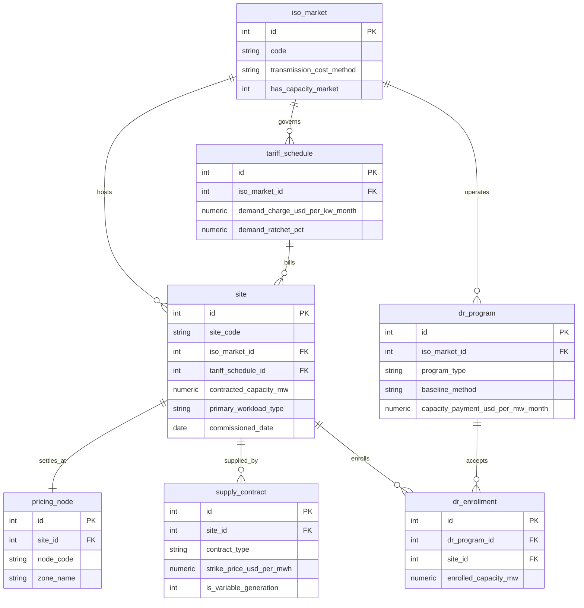
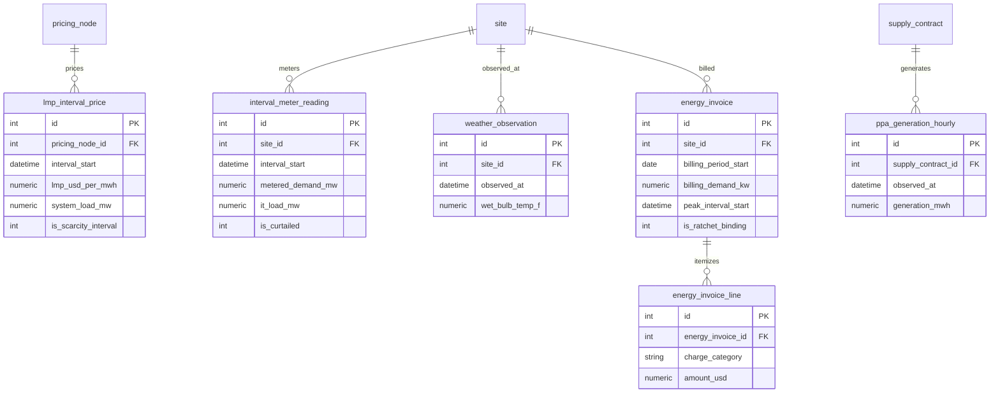
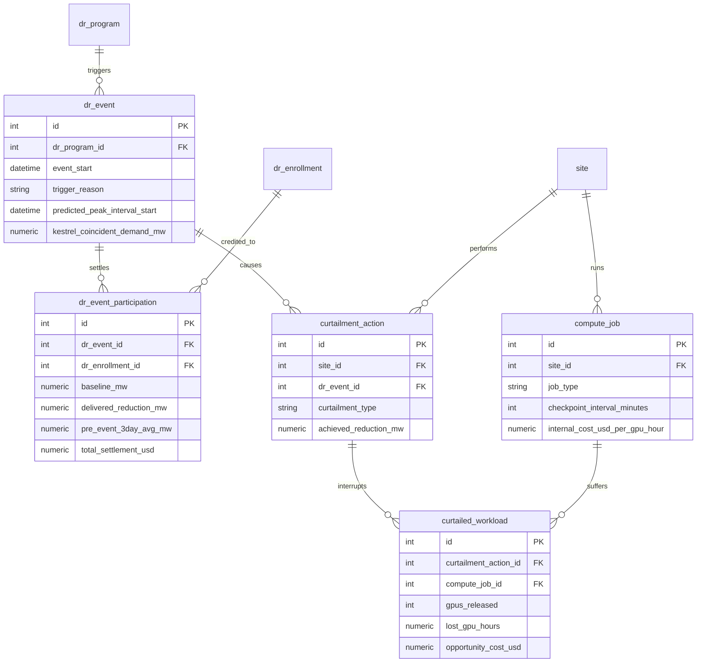

# Kestrel Compute Power Dataset ER Document

For business background, industry primer, and glossary, see `01-utilities_datacenter_power_procurement_demand_response_high_business_context.md`. This document describes the data only.

---

## 1. Dataset Metadata

| Item | Value |
| :--- | :--- |
| Complexity tier | High |
| Number of tables | 18 |
| Total rows | 503,542 |
| Foreign key relationships | 23, plus 3 scope rules the DDL cannot enforce |
| `REFERENCE_DATE` | `2026-06-30` |
| Data window | 2025-07-01 to 2026-06-30, 365 days |
| Time-series granularity | 15 minutes for pricing and metering, 1 hour for weather and PPA generation |
| Database file | `utilities_datacenter_power_procurement_demand_response_high.sqlite` |

Three scope rules the DDL cannot enforce, which must be respected manually during analysis:

> First, `curtailment_action.dr_event_id` may be NULL. NULL means the record is a purely economic curtailment, unrelated to any demand response program, and it does not generate settlement revenue. Mixing these records into demand response revenue calculations simultaneously overstates cost and understates revenue.
>
> Second, the 5 records in `dr_event` with `trigger_reason = 'FORECAST_4CP_PEAK'` belong to 4CP avoidance. They do not generate a capacity payment; their value shows up in next year's transmission bill instead. Only these 5 records populate the three fields `predicted_peak_interval_start`, `iso_actual_peak_interval_start`, and `kestrel_coincident_demand_mw` — for all other events, these three columns are NULL.
>
> Third, the event `ERCOT-4CP-AVOID-2025-06` occurred before the metering data window begins, so it has no corresponding `dr_event_participation`, `curtailment_action`, or `interval_meter_reading` records — only the ISO-settlement-basis coincident demand is retained. It must be included in any 4CP analysis, and must be excluded from any curtailment-cost analysis.

---

## 2. Entity Relationship Diagrams

There are quite a few tables, so they are split into three diagrams by business domain.

### Master Data and Contracts



### Time-Series Facts and Billing



### Demand Response and Compute



---

## 3. iso_market

One row is one independent system operator. There are only three rows, but this table is the source of rules for the entire dataset: which ISO a campus sits in determines how its power price fluctuates, how transmission costs are calculated, whether there's a capacity charge, and which demand response programs it can join. Whenever an analysis asks "why is Texas so different from Ohio," the answer is almost always found in this table.

| Column | Type | Constraint | Description |
| :--- | :--- | :--- | :--- |
| `id` | INTEGER | PK | |
| `code` | VARCHAR(10) | UNIQUE, NOT NULL | ERCOT, PJM, MISO |
| `name` | VARCHAR(120) | NOT NULL | Full name of the operator |
| `settlement_interval_minutes` | INTEGER | NOT NULL | This market's real-time settlement interval. ERCOT is 15, PJM and MISO are 5. Note this is not the dataset's storage granularity — this dataset stores everything on a uniform 15-minute interval |
| `transmission_cost_method` | VARCHAR(20) | NOT NULL | `4CP`, `PLC`, or `PEAK_DEMAND` — determines how transmission cost is allocated |
| `has_capacity_market` | INTEGER | NOT NULL | 1 means it has a capacity market. ERCOT is 0, which is the root cause of its sharp price swings |
| `region_description` | VARCHAR(400) | NOT NULL | One-sentence market profile, in English |

Foreign keys: none.

Sample:

| id | code | settlement_interval_minutes | transmission_cost_method | has_capacity_market |
| :-- | :-- | :-- | :-- | :-- |
| 1 | ERCOT | 15 | 4CP | 0 |
| 2 | PJM | 5 | PLC | 1 |
| 3 | MISO | 5 | PEAK_DEMAND | 1 |

---

## 4. tariff_schedule

One row is the industrial large-user rate schedule the local utility applies to a given campus. This table answers "beyond the energy itself, what other rules and charges apply." Demand charges, transmission rates, and the ratchet percentage are all defined here — the pricing basis for invoice amounts.

> Scope note: for both Texas campuses, `demand_charge_usd_per_kw_month` and `transmission_charge_usd_per_kw_month` are 0. This is not missing data. ERCOT's industrial transmission cost runs through 4CP rather than a monthly demand charge, so under Texas tariffs these two columns are naturally 0. Any cross-market comparison of demand charges must account for this first, or it will produce the technically-correct-but-completely-missing-the-point conclusion that "Texas doesn't charge for demand, so it's cheaper."

| Column | Type | Constraint | Description |
| :--- | :--- | :--- | :--- |
| `id` | INTEGER | PK | |
| `tariff_code` | VARCHAR(40) | UNIQUE, NOT NULL | Tariff code, e.g. `AEP-OH-GS4` |
| `utility_name` | VARCHAR(120) | NOT NULL | Utility company name |
| `iso_market_id` | INTEGER | FK, NOT NULL | Owning ISO |
| `energy_charge_usd_per_kwh` | NUMERIC(10,5) | NOT NULL | Utility-side energy charge; every campus in this dataset buys power directly from the market, so this is always 0 |
| `demand_charge_usd_per_kw_month` | NUMERIC(10,4) | NOT NULL | Demand charge rate. PJM is highest (17.85 to 18.20), MISO is in the middle, ERCOT is 0 |
| `transmission_charge_usd_per_kw_month` | NUMERIC(10,4) | NOT NULL | Transmission charge rate. PJM charges on a PLC basis, MISO on a coincident peak demand (PEAK_DEMAND) basis, ERCOT runs through 4CP so it is 0 |
| `rider_charge_usd_per_kwh` | NUMERIC(10,5) | NOT NULL | Regulatory rider rate |
| `demand_ratchet_pct` | NUMERIC(6,2) | NOT NULL | Demand ratchet percentage. PJM is 85, MISO is 75, ERCOT is 0 meaning no ratchet |
| `billing_demand_basis` | VARCHAR(30) | NOT NULL | `MAX_15MIN_INTERVAL` or `4CP_AVERAGE` |
| `effective_from` | DATE | NOT NULL | Tariff effective date |

Foreign keys: `iso_market_id` references `iso_market.id`, many-to-one.

Sample:

| tariff_code | utility_name | demand_charge | ratchet_pct | billing_demand_basis |
| :--- | :--- | :-- | :-- | :--- |
| AEP-OH-GS4 | AEP Ohio | 18.2000 | 85.00 | MAX_15MIN_INTERVAL |
| ONCOR-TX-IND | Oncor Electric Delivery | 0.0000 | 0.00 | 4CP_AVERAGE |
| XCEL-ND-LGS | Xcel Energy North Dakota | 11.4500 | 75.00 | MAX_15MIN_INTERVAL |

---

## 5. site

One row is one AI compute campus. This is the central entity in the entire dataset — power contracts, meter readings, energy invoices, demand response enrollments, and GPU jobs all hang off it. The `primary_workload_type` column matters far more than it appears to: it shapes the campus's load curve, and more importantly it determines the cost of being curtailed, since a pretraining campus and an inference-serving campus differ by multiples on this dimension.

> Scope note: `ALB1`'s `commissioned_date` is 2025-09-15, inside the data window. It only has nine and a half months of metering data, and the first 60 days after commissioning are a linear ramp-up period. Any calculation that averages across 12 months will understate ALB1; any year-over-year or cross-campus comparison involving it should explicitly handle this boundary.

| Column | Type | Constraint | Description |
| :--- | :--- | :--- | :--- |
| `id` | INTEGER | PK | |
| `site_code` | VARCHAR(10) | UNIQUE, NOT NULL | Four-letter code, e.g. `ABI1` |
| `site_name` | VARCHAR(80) | NOT NULL | Campus name |
| `city` | VARCHAR(60) | NOT NULL | City |
| `state_province` | VARCHAR(4) | NOT NULL | State code: OH / TX / IA / ND |
| `country` | VARCHAR(4) | NOT NULL | Always US |
| `iso_market_id` | INTEGER | FK, NOT NULL | Owning power market |
| `tariff_schedule_id` | INTEGER | FK, NOT NULL | Applicable tariff schedule |
| `contracted_capacity_mw` | NUMERIC(10,2) | NOT NULL | Power capacity contracted with the utility; the physical ceiling for `metered_demand_mw` |
| `gpu_count` | INTEGER | NOT NULL | Number of GPUs deployed; the ratio to capacity is roughly 2.3 kW per GPU (including cooling and distribution losses) |
| `primary_workload_type` | VARCHAR(20) | NOT NULL | `TRAINING` / `MIXED` / `INFERENCE` |
| `cooling_type` | VARCHAR(20) | NOT NULL | `AIR_COOLED` / `LIQUID_COOLED`, determines how sensitive the cooling load is to wet bulb temperature |
| `commissioned_date` | DATE | NOT NULL | Commissioning date |
| `is_active` | INTEGER | NOT NULL | Always 1 |

Foreign keys: `iso_market_id` and `tariff_schedule_id` are both many-to-one.

All 6 rows:

| site_code | site_name | state | ISO | capacity_mw | gpu_count | workload | cooling | commissioned |
| :--- | :--- | :-- | :-- | :-- | :-- | :--- | :--- | :--- |
| CMH1 | Columbus Campus | OH | PJM | 95.00 | 40000 | INFERENCE | AIR_COOLED | 2021-04-01 |
| ALB1 | New Albany East | OH | PJM | 60.00 | 26000 | MIXED | LIQUID_COOLED | 2025-09-15 |
| ABI1 | Abilene Campus | TX | ERCOT | 110.00 | 48000 | TRAINING | LIQUID_COOLED | 2023-08-01 |
| TPL1 | Temple Campus | TX | ERCOT | 75.00 | 32000 | MIXED | AIR_COOLED | 2024-02-01 |
| CID1 | Cedar Rapids Campus | IA | MISO | 50.00 | 22000 | TRAINING | LIQUID_COOLED | 2024-06-01 |
| FAR1 | Fargo Campus | ND | MISO | 30.00 | 12000 | MIXED | AIR_COOLED | 2022-10-01 |

---

## 6. pricing_node

One row is one ISO settlement point. Your power isn't settled at "the market-wide average price" — it's settled at the price of the specific node you connect to, because transmission lines have capacity limits, and cheap power that can't physically reach a location will be priced higher there. Each campus maps to exactly one node, a one-to-one relationship.

| Column | Type | Constraint | Description |
| :--- | :--- | :--- | :--- |
| `id` | INTEGER | PK | |
| `node_code` | VARCHAR(40) | UNIQUE, NOT NULL | Node code, e.g. `HB_WEST_ABI` |
| `node_name` | VARCHAR(120) | NOT NULL | Full node name |
| `iso_market_id` | INTEGER | FK, NOT NULL | Owning market |
| `site_id` | INTEGER | FK, UNIQUE, NOT NULL | Corresponding campus, one-to-one |
| `zone_name` | VARCHAR(30) | NOT NULL | Load zone, e.g. `LZ_WEST` |
| `node_type` | VARCHAR(30) | NOT NULL | Always `SETTLEMENT_POINT` |

Foreign keys: `site_id` is one-to-one (has a UNIQUE constraint), `iso_market_id` is many-to-one.

Sample:

| node_code | node_name | site | zone_name |
| :--- | :--- | :-- | :--- |
| HB_WEST_ABI | ERCOT West Hub - Abilene Load Zone | ABI1 | LZ_WEST |
| AEP_OHIO_CMH | PJM AEP Ohio - Columbus Bus | CMH1 | AEP |
| MISO_NORTH_FAR | MISO North - Fargo Bus | FAR1 | MISO_Z1 |

---

## 7. dr_program

One row is one demand response program. The six programs belong to three markets and each has its own compensation structure and rules. The most important column in this table is `baseline_method`, because it determines how curtailment is calculated — and therefore whether the program can be gamed via baseline inflation.

| Column | Type | Constraint | Description |
| :--- | :--- | :--- | :--- |
| `id` | INTEGER | PK | |
| `program_code` | VARCHAR(30) | UNIQUE, NOT NULL | Program code |
| `program_name` | VARCHAR(120) | NOT NULL | Full program name |
| `iso_market_id` | INTEGER | FK, NOT NULL | Owning market |
| `program_type` | VARCHAR(30) | NOT NULL | `EMERGENCY` / `ECONOMIC` / `CAPACITY` / `TRANSMISSION_AVOIDANCE` |
| `baseline_method` | VARCHAR(30) | NOT NULL | `AVG_10_BUSINESS_DAYS` / `METER_BEFORE_AFTER` / `FIRM_SERVICE_LEVEL` |
| `capacity_payment_usd_per_mw_month` | NUMERIC(12,2) | NOT NULL | Capacity payment rate. 4CP programs are 0 — their payoff isn't captured here |
| `energy_payment_usd_per_mwh` | NUMERIC(10,2) | NOT NULL | Additional per-unit payment for actual curtailed energy; 0 for some programs |
| `max_events_per_year` | INTEGER | NOT NULL | Cap on annual event count |
| `max_event_duration_hours` | INTEGER | NOT NULL | Cap on single-event duration |
| `notification_lead_time_minutes` | INTEGER | NOT NULL | Advance notice time. ERCOT CLR is 0, meaning automated response with no time for human intervention |
| `penalty_usd_per_mw_shortfall` | NUMERIC(12,2) | NOT NULL | Shortfall penalty rate |

Foreign keys: `iso_market_id` many-to-one.

All 6 rows:

| program_code | ISO | program_type | baseline_method | cap_payment | lead_time_min |
| :--- | :-- | :--- | :--- | :-- | :-- |
| ERCOT-ERS-10 | ERCOT | EMERGENCY | AVG_10_BUSINESS_DAYS | 5600.00 | 10 |
| ERCOT-CLR-RRS | ERCOT | ECONOMIC | METER_BEFORE_AFTER | 4000.00 | 0 |
| ERCOT-4CP-AVOID | ERCOT | TRANSMISSION_AVOIDANCE | FIRM_SERVICE_LEVEL | 0.00 | 240 |
| PJM-ELRP | PJM | EMERGENCY | AVG_10_BUSINESS_DAYS | 3850.00 | 120 |
| PJM-CP | PJM | CAPACITY | FIRM_SERVICE_LEVEL | 5600.00 | 60 |
| MISO-LMR | MISO | CAPACITY | METER_BEFORE_AFTER | 5400.00 | 30 |

---

## 8. supply_contract

One row is one power supply contract. Kestrel buys power three ways: PPAs lock in a fixed price but only deliver whatever the plant actually generates, retail fixed-price contracts lock in an all-in delivered price, and wholesale index exposure settles the remainder directly against the real-time price. Any assessment of the power portfolio's quality starts with this table.

> Scope note: the three contracts with `is_variable_generation = 1` (one wind, two solar) have hourly generation records in `ppa_generation_hourly`; the other eight do not. Shape risk analysis can only be done on those three.

| Column | Type | Constraint | Description |
| :--- | :--- | :--- | :--- |
| `id` | INTEGER | PK | |
| `contract_code` | VARCHAR(30) | UNIQUE, NOT NULL | Contract code |
| `contract_type` | VARCHAR(20) | NOT NULL | `WIND_PPA` / `SOLAR_PPA` / `RETAIL_FIXED` / `WHOLESALE_INDEX` |
| `site_id` | INTEGER | FK, NOT NULL | Owning campus |
| `counterparty_name` | VARCHAR(120) | NOT NULL | Counterparty |
| `start_date` | DATE | NOT NULL | Contract start date |
| `end_date` | DATE | NOT NULL | Contract expiration date |
| `contracted_volume_mw` | NUMERIC(10,2) | NOT NULL | Contracted volume. Wholesale index exposure has no fixed volume, so it is 0 |
| `strike_price_usd_per_mwh` | NUMERIC(10,2) | NOT NULL | Contracted price. Wholesale index exposure is 0, meaning it floats with the market |
| `settlement_method` | VARCHAR(25) | NOT NULL | `AS_GENERATED` / `FIXED_BLOCK` / `INDEX_PASSTHROUGH` |
| `is_variable_generation` | INTEGER | NOT NULL | 1 means output varies with weather, with hourly generation records |
| `is_active` | INTEGER | NOT NULL | Always 1 |

Foreign keys: `site_id` many-to-one.

Sample:

| contract_code | contract_type | site | volume_mw | strike | settlement_method | variable |
| :--- | :--- | :-- | :-- | :-- | :--- | :-- |
| PPA-LHR-WIND-01 | WIND_PPA | ABI1 | 150.00 | 28.50 | AS_GENERATED | 1 |
| PPA-BUC-SOLAR-01 | SOLAR_PPA | CMH1 | 40.00 | 38.90 | AS_GENERATED | 1 |
| RTL-AEP-CMH-26 | RETAIL_FIXED | CMH1 | 60.00 | 62.40 | FIXED_BLOCK | 0 |
| IDX-ERCOT-ABI | WHOLESALE_INDEX | ABI1 | 0.00 | 0.00 | INDEX_PASSTHROUGH | 0 |

---

## 9. dr_enrollment

One row is one campus's enrollment in one demand response program. It's a many-to-many association table between `dr_program` and `site`, but it carries its own business attribute: the committed curtailable capacity. This committed amount determines both the monthly capacity payment received and how much must actually be curtailed when an event occurs — falling short means a penalty.

> Scope note: one record (`CID1` under `ERCOT-ERS-10`) has `enrolled_capacity_mw` of 0 and `is_active = 0`. This is a legacy registration — Cedar Rapids campus is actually in MISO, not ERCOT; it was a registration error at the time and was deactivated partway through FY2026. It produces no event participation records, but it will pollute counting queries like "how many programs are we enrolled in" unless you explicitly filter on `is_active = 1`.

| Column | Type | Constraint | Description |
| :--- | :--- | :--- | :--- |
| `id` | INTEGER | PK | |
| `dr_program_id` | INTEGER | FK, NOT NULL | Program |
| `site_id` | INTEGER | FK, NOT NULL | Campus |
| `enrolled_capacity_mw` | NUMERIC(10,2) | NOT NULL | Committed curtailable capacity |
| `enrollment_start_date` | DATE | NOT NULL | Enrollment start date, not earlier than the campus's commissioning date |
| `enrollment_end_date` | DATE | NOT NULL | Enrollment expiration date |
| `capacity_payment_usd_per_mw_month` | NUMERIC(12,2) | NOT NULL | Redundant copy from the program table, for convenient settlement lookups |
| `is_active` | INTEGER | NOT NULL | 1 means valid within FY2026 |

Foreign keys: `dr_program_id` and `site_id` are both many-to-one; the combination is unique.

Committed capacity overview (13 rows):

| program_code | ABI1 | TPL1 | CMH1 | ALB1 | CID1 | FAR1 |
| :--- | :-- | :-- | :-- | :-- | :-- | :-- |
| ERCOT-ERS-10 | 12.0 | 5.0 | | | 0.0 (deactivated) | |
| ERCOT-CLR-RRS | 9.0 | 3.5 | | | | |
| ERCOT-4CP-AVOID | 62.0 | 38.0 | | | | |
| PJM-ELRP | | | 9.0 | 6.0 | | |
| PJM-CP | | | 6.0 | 5.0 | | |
| MISO-LMR | | | | | 4.5 | 3.0 |

Note that the 4CP commitment is an order of magnitude larger than the other programs. It only fires four times a year, two hours each time, but it curtails extremely deep, because avoiding one coincident peak saves a quarter of next year's transmission bill.

---

## 10. compute_job

One row is one GPU compute job. This table isn't itself part of the power domain — it appears here for exactly one reason: demand response curtails these jobs, and their opportunity cost is the true price of curtailment. `checkpoint_interval_minutes` and `internal_cost_usd_per_gpu_hour` are the fulcrum for the entire Q1 analysis.

| Column | Type | Constraint | Description |
| :--- | :--- | :--- | :--- |
| `id` | INTEGER | PK | |
| `job_code` | VARCHAR(24) | UNIQUE, NOT NULL | Job code, formatted like `JOB-ABI1-000123` |
| `site_id` | INTEGER | FK, NOT NULL | Campus where the job runs |
| `customer_name` | VARCHAR(80) | NOT NULL | Customer name, one of 12 fictional companies |
| `job_type` | VARCHAR(20) | NOT NULL | `PRETRAINING` / `FINETUNING` / `INFERENCE_SERVING` / `INFERENCE_BATCH` / `RESEARCH` |
| `contract_tier` | VARCHAR(12) | NOT NULL | `RESERVED` / `ON_DEMAND` / `SPOT`, determines whether an interruption triggers an SLA credit |
| `gpu_count` | INTEGER | NOT NULL | GPUs occupied. Pretraining ranges 512 to 4096; research ranges 8 to 64 |
| `submitted_at` | DATETIME | NOT NULL | Submission time, earlier than `started_at` |
| `started_at` | DATETIME | NOT NULL | Start time |
| `planned_end_at` | DATETIME | NOT NULL | Planned end time, later than `started_at` |
| `actual_end_at` | DATETIME | NULL | Actual end time. Empty while status is `RUNNING` |
| `planned_gpu_hours` | NUMERIC(14,2) | NOT NULL | `gpu_count` times planned duration |
| `checkpoint_interval_minutes` | INTEGER | NOT NULL | Pretraining 300, finetuning 90, batch inference 20, research 120, online inference 0 |
| `is_interruptible` | INTEGER | NOT NULL | 1 means the contract allows preemption. True for SPOT tier, research, and batch inference jobs |
| `internal_cost_usd_per_gpu_hour` | NUMERIC(8,4) | NOT NULL | Opportunity cost rate, fixed by job type. Pretraining 3.15, research 1.20 |
| `status` | VARCHAR(15) | NOT NULL | `COMPLETED` / `RUNNING` / `FAILED` |

Foreign keys: `site_id` many-to-one.

Sample (one pretraining job with a very high curtailment cost, and one online inference job with almost none):

| job_code | site | job_type | tier | gpu_count | checkpoint_min | interruptible | cost_per_gpu_h |
| :--- | :-- | :--- | :--- | :-- | :-- | :-- | :-- |
| JOB-ABI1-000959 | ABI1 | PRETRAINING | SPOT | 3072 | 300 | 1 | 3.1500 |
| JOB-CMH1-000005 | CMH1 | INFERENCE_SERVING | RESERVED | 256 | 0 | 0 | 2.4000 |
| JOB-TPL1-001721 | TPL1 | RESEARCH | SPOT | 16 | 120 | 1 | 1.2000 |

---

## 11. weather_observation

One row is one hourly weather observation at one campus. It exists because of cooling load: 10 to 30 percent of a data center's power draw goes to cooling, and the true driver of cooling efficiency is wet bulb temperature, not dry bulb temperature. This table is the explanatory variable when analyzing price spikes, load peaks, and seasonal cost patterns.

| Column | Type | Constraint | Description |
| :--- | :--- | :--- | :--- |
| `id` | INTEGER | PK | |
| `site_id` | INTEGER | FK, NOT NULL | Campus |
| `observed_at` | DATETIME | NOT NULL | Top-of-hour timestamp, 8,760 rows per campus |
| `dry_bulb_temp_f` | NUMERIC(6,2) | NOT NULL | Dry bulb temperature, i.e. ordinary air temperature |
| `wet_bulb_temp_f` | NUMERIC(6,2) | NOT NULL | Wet bulb temperature, combining temperature and humidity — the driver of cooling load |
| `relative_humidity_pct` | NUMERIC(5,2) | NOT NULL | Relative humidity |
| `wind_speed_mph` | NUMERIC(6,2) | NOT NULL | Wind speed |
| `cloud_cover_pct` | NUMERIC(5,2) | NOT NULL | Cloud cover |

Foreign keys: `site_id` many-to-one.

Sample:

| site | observed_at | dry_bulb_f | wet_bulb_f | humidity_pct |
| :-- | :--- | :-- | :-- | :-- |
| CMH1 | 2025-07-01 00:00:00 | 70.04 | 62.23 | 69.95 |
| ABI1 | 2026-01-15 05:00:00 | 38.34 | 28.11 | 60.65 |

---

## 12. lmp_interval_price

One row is the real-time price at one node for one 15-minute interval. This is one of the two largest tables in the dataset: 6 nodes times 35,040 intervals. All wholesale energy settlement, economic curtailment decisions, and PPA value assessments start here. The `system_load_mw` column holds the entire ISO's total system load at that same moment, and 4CP determination depends entirely on it.

> Scope note: for two nodes in the same ISO, the `system_load_mw` values are identical, because it describes the whole grid rather than an individual node. This is intentional denormalization, meant to spare 4CP analysis an extra join. But when computing ISO-level system load statistics, you must deduplicate first, or each moment gets counted twice.

| Column | Type | Constraint | Description |
| :--- | :--- | :--- | :--- |
| `id` | INTEGER | PK | |
| `pricing_node_id` | INTEGER | FK, NOT NULL | Node |
| `interval_start` | DATETIME | NOT NULL | Interval start |
| `interval_end` | DATETIME | NOT NULL | Interval end, always start plus 15 minutes |
| `lmp_usd_per_mwh` | NUMERIC(12,4) | NOT NULL | Locational marginal price, the sum of three components. Can be negative |
| `energy_component` | NUMERIC(12,4) | NOT NULL | System reference energy price component |
| `congestion_component` | NUMERIC(12,4) | NOT NULL | Transmission congestion component |
| `loss_component` | NUMERIC(12,4) | NOT NULL | Line loss component |
| `system_load_mw` | NUMERIC(12,2) | NOT NULL | The entire ISO's total system load at that moment |
| `is_scarcity_interval` | INTEGER | NOT NULL | 1 means LMP exceeded $500 per MWh |

Foreign keys: `pricing_node_id` many-to-one.

Sample (one scarcity-pricing interval and one negative-price interval, both at ERCOT West):

| node | interval_start | lmp | energy_comp | congestion | system_load_mw | scarcity |
| :-- | :--- | :-- | :-- | :-- | :-- | :-- |
| HB_WEST_ABI | 2025-07-01 15:30 | 3287.9427 | 3295.6656 | -8.1181 | 91675.43 | 1 |
| HB_WEST_ABI | 2025-07-01 00:45 | -12.0594 | -9.7098 | -2.1252 | 73925.82 | 0 |

Annual price characteristics by node:

| node_code | avg LMP | max LMP | scarcity intervals | negative-price intervals |
| :--- | :-- | :-- | :-- | :-- |
| HB_WEST_ABI | 35.47 | 4600 | 47 | 6303 |
| HB_NORTH_TPL | 39.37 | 4737 | 38 | 211 |
| AEP_OHIO_CMH | 45.09 | 4628 | 33 | 0 |
| AEP_OHIO_ALB | 46.15 | 4627 | 26 | 0 |
| MISO_CENTRAL_CID | 37.79 | 4789 | 43 | 48 |
| MISO_NORTH_FAR | 32.32 | 4564 | 36 | 227 |

ERCOT West has 6,303 negative-price intervals, 18% of the year. That number alone is a preview of the trouble with the Longhorn Ridge PPA.

---

## 13. ppa_generation_hourly

One row is the actual generation output of one variable-generation PPA for one hour. Only three contracts have records: one West Texas wind contract and two solar contracts. How this table relates to `lmp_interval_price` determines whether PPA shape risk can be seen at all.

> Scope note: `generation_mwh` is net generation after ISO curtailment, while `capacity_factor_pct` is the raw capacity factor before curtailment. The relationship between the two is `contracted_volume_mw * capacity_factor_pct / 100 = generation_mwh + curtailed_by_iso_mwh`. Settlement runs on `generation_mwh`; analyzing generation shape should use `capacity_factor_pct`.

| Column | Type | Constraint | Description |
| :--- | :--- | :--- | :--- |
| `id` | INTEGER | PK | |
| `supply_contract_id` | INTEGER | FK, NOT NULL | Corresponding PPA contract |
| `observed_at` | DATETIME | NOT NULL | Top-of-hour timestamp |
| `generation_mwh` | NUMERIC(12,4) | NOT NULL | Net generation for the hour, after curtailment |
| `capacity_factor_pct` | NUMERIC(6,2) | NOT NULL | Raw capacity factor percentage |
| `curtailed_by_iso_mwh` | NUMERIC(12,4) | NOT NULL | Energy curtailed at the ISO's request, occurring only during negative-price periods |

Foreign keys: `supply_contract_id` many-to-one.

Sample:

| contract | observed_at | generation_mwh | capacity_factor_pct | curtailed_by_iso_mwh |
| :--- | :--- | :-- | :-- | :-- |
| PPA-LHR-WIND-01 | 2025-07-01 01:00 | 37.6700 | 36.74 | 17.4373 |
| PPA-BUC-SOLAR-01 | 2025-07-01 13:00 | 33.7341 | 84.34 | 0.0000 |

---

## 14. interval_meter_reading

One row is one meter reading at one campus for one 15-minute interval. One of the largest tables in the dataset: 6 campuses times 35,040 intervals. Billing demand, demand response baselines and measured load, and 4CP coincident demand are all derived from this table. The reason for insisting on 15-minute granularity is that both demand charges and 4CP are determined at 15-minute resolution — aggregating to hourly would erase the signal entirely.

> Scope note: `metered_demand_mw` always equals `it_load_mw + cooling_load_mw`, and never exceeds the campus's `contracted_capacity_mw`. Every interval reading for `ALB1` before 2025-09-15 is 0, because the campus was not yet commissioned; these zero values should not be included in any average.

| Column | Type | Constraint | Description |
| :--- | :--- | :--- | :--- |
| `id` | INTEGER | PK | |
| `site_id` | INTEGER | FK, NOT NULL | Campus |
| `interval_start` | DATETIME | NOT NULL | Interval start |
| `interval_end` | DATETIME | NOT NULL | Interval end |
| `metered_demand_mw` | NUMERIC(10,3) | NOT NULL | Total campus power draw; billing demand is its maximum over a month |
| `it_load_mw` | NUMERIC(10,3) | NOT NULL | Power draw from GPUs and supporting IT equipment |
| `cooling_load_mw` | NUMERIC(10,3) | NOT NULL | Cooling system power draw, rising with wet bulb temperature |
| `energy_mwh` | NUMERIC(10,4) | NOT NULL | Energy consumed in the interval, equal to power times 0.25 hours |
| `is_curtailed` | INTEGER | NOT NULL | 1 means the interval was under curtailment |

Foreign keys: `site_id` many-to-one.

Sample:

| site | interval_start | metered_mw | it_mw | cooling_mw | energy_mwh | curtailed |
| :-- | :--- | :-- | :-- | :-- | :-- | :-- |
| CMH1 | 2025-07-04 18:00 | 54.683 | 44.348 | 10.335 | 13.6707 | 1 |
| CMH1 | 2025-08-14 15:45 | 88.638 | 74.141 | 14.497 | 22.1594 | 0 |
| ALB1 | 2025-08-01 12:00 | 0.000 | 0.000 | 0.000 | 0.0000 | 0 |

The second row is the peak interval from that 30-minute burn-in test — and also CMH1's highest reading for the entire year.

---

## 15. energy_invoice

One row is the invoice header for one campus for one month. 70 rows, since ALB1 only has 10 months. The most notable thing about this table is the difference between `metered_peak_demand_kw` and `billing_demand_kw`: the former is the actual highest power measured that month, while the latter is the number actually multiplied by the demand charge rate — and the two are not equal once a ratchet clause is in effect.

| Column | Type | Constraint | Description |
| :--- | :--- | :--- | :--- |
| `id` | INTEGER | PK | |
| `invoice_number` | VARCHAR(30) | UNIQUE, NOT NULL | Invoice number, formatted like `INV-CMH1-202508` |
| `site_id` | INTEGER | FK, NOT NULL | Campus |
| `billing_period_start` | DATE | NOT NULL | Billing period start |
| `billing_period_end` | DATE | NOT NULL | Billing period end |
| `total_energy_mwh` | NUMERIC(14,3) | NOT NULL | Total energy consumed that month |
| `metered_peak_demand_kw` | NUMERIC(14,2) | NOT NULL | Highest measured 15-minute power that month |
| `billing_demand_kw` | NUMERIC(14,2) | NOT NULL | Billing demand, the greater of the measured peak and the ratchet floor |
| `peak_interval_start` | DATETIME | NULL | Which 15-minute interval the measured peak occurred in |
| `is_ratchet_binding` | INTEGER | NOT NULL | 1 means that month's billing demand was propped up by a historical peak |
| `total_amount_usd` | NUMERIC(14,2) | NOT NULL | Total invoice amount, equal to the sum of all line items |
| `blended_rate_usd_per_kwh` | NUMERIC(10,5) | NOT NULL | Blended rate, total amount divided by total energy |
| `due_date` | DATE | NOT NULL | Due date, 30 days after the billing period ends |
| `paid_date` | DATE | NULL | Actual payment date |

Foreign keys: `site_id` many-to-one.

Sample (one month with an active ratchet and one normal month):

| invoice_number | total_mwh | metered_peak_kw | billing_kw | peak_interval | ratchet | total_usd | blended |
| :--- | :-- | :-- | :-- | :--- | :-- | :-- | :-- |
| INV-CMH1-202508 | 40934.431 | 88637.67 | 88637.67 | 2025-08-14 15:45 | 0 | 5819446.86 | 0.14217 |
| INV-CMH1-202509 | 37143.836 | 71833.51 | 75342.02 | 2025-09-11 15:00 | 1 | 5139777.13 | 0.13837 |

The September row is the key one: the measured peak was only 71,834 kW, but the invoice bills 75,342 kW — the 3,509 kW gap is a holdover from the August burn-in test.

---

## 16. energy_invoice_line

One row is one line item on an invoice. 5 to 7 rows per invoice, depending on the market. This table exists for one reason: to break apart the blended rate. Looking only at `blended_rate_usd_per_kwh` will never tell you which component of a bill is actually the most expensive — and without that, there's no lever to pull.

| Column | Type | Constraint | Description |
| :--- | :--- | :--- | :--- |
| `id` | INTEGER | PK | |
| `energy_invoice_id` | INTEGER | FK, NOT NULL | Owning invoice |
| `charge_category` | VARCHAR(20) | NOT NULL | `ENERGY` / `DEMAND` / `TRANSMISSION` / `CAPACITY` / `ANCILLARY` / `RIDER` / `TAX` |
| `description` | VARCHAR(160) | NOT NULL | Charge description, in English. DEMAND rows note which 15-minute interval the billing demand was drawn from |
| `quantity` | NUMERIC(14,3) | NOT NULL | Billed quantity |
| `unit` | VARCHAR(12) | NOT NULL | `MWh` / `kW` / `kWh` / `USD` |
| `unit_rate_usd` | NUMERIC(12,5) | NOT NULL | Unit rate |
| `amount_usd` | NUMERIC(14,2) | NOT NULL | Amount, equal to `quantity * unit_rate_usd` |

Foreign keys: `energy_invoice_id` many-to-one, no cascade on delete (SQLite default).

Line item composition by market:

| Market | ENERGY | DEMAND | TRANSMISSION | CAPACITY | ANCILLARY | RIDER | TAX |
| :-- | :-- | :-- | :-- | :-- | :-- | :-- | :-- |
| PJM | yes | yes | yes | yes | yes | yes | yes |
| ERCOT | yes | no | yes (4CP basis) | no | yes | yes | yes |
| MISO | yes | yes | yes | no | yes | yes | yes |

Sample:

| invoice | charge_category | quantity | unit | unit_rate | amount_usd |
| :--- | :--- | :-- | :-- | :-- | :-- |
| INV-CMH1-202507 | ENERGY | 41695.563 | MWh | 62.40000 | 2601803.15 |
| INV-CMH1-202507 | DEMAND | 82568.851 | kW | 18.20000 | 1502753.08 |
| INV-CMH1-202507 | TRANSMISSION | 82568.851 | kW | 6.40000 | 528440.64 |
| INV-CMH1-202507 | CAPACITY | 82568.851 | kW | 4.85000 | 400458.93 |

---

## 17. dr_event

One row is one demand response event. 58 rows, of which 53 are routine paid-program events and 5 are 4CP avoidance events. Event timing isn't random — events land at the moments when each market's system load or price is at its highest.

> Scope note: the last three columns (`predicted_peak_interval_start`, `iso_actual_peak_interval_start`, `kestrel_coincident_demand_mw`) are populated only for 4CP events; the other 53 rows are entirely NULL. Conversely, 4CP events do not generate a capacity payment — their `dr_event_participation` record has `capacity_payment_usd` equal to 0.

| Column | Type | Constraint | Description |
| :--- | :--- | :--- | :--- |
| `id` | INTEGER | PK | |
| `event_code` | VARCHAR(30) | UNIQUE, NOT NULL | Event code |
| `dr_program_id` | INTEGER | FK, NOT NULL | Owning program |
| `event_start` | DATETIME | NOT NULL | Event start |
| `event_end` | DATETIME | NOT NULL | Event end, later than start |
| `notification_sent_at` | DATETIME | NOT NULL | Notification time, equal to start time minus the program's lead time |
| `trigger_reason` | VARCHAR(30) | NOT NULL | `SYSTEM_EMERGENCY` / `PRICE_SPIKE` / `CAPACITY_TEST` / `FORECAST_4CP_PEAK` |
| `iso_system_load_mw` | NUMERIC(12,2) | NOT NULL | ISO system load at the moment of the event |
| `max_lmp_usd_per_mwh` | NUMERIC(12,4) | NOT NULL | Highest price at the relevant node during the event |
| `is_mandatory` | INTEGER | NOT NULL | 1 means mandatory response, with a penalty for non-response |
| `is_test_event` | INTEGER | NOT NULL | 1 means it was only a capability-verification drill, not a real system emergency |
| `predicted_peak_interval_start` | DATETIME | NULL | 4CP only: the predicted system peak interval, forecast in advance |
| `iso_actual_peak_interval_start` | DATETIME | NULL | 4CP only: the ISO-confirmed actual peak interval, determined after the fact |
| `kestrel_coincident_demand_mw` | NUMERIC(10,3) | NULL | 4CP only: Kestrel's power draw at the actual peak moment |

Foreign keys: `dr_program_id` many-to-one.

All 5 4CP records:

| event_code | predicted_peak | actual_peak | deviation (min) | coincident_mw |
| :--- | :--- | :--- | :-- | :-- |
| ERCOT-4CP-AVOID-2025-06 | 2025-06-24 16:45 | 2025-06-24 17:00 | 15 | 23.600 |
| ERCOT-4CP-AVOID-2025-07 | 2025-07-14 15:30 | 2025-07-14 16:00 | 30 | 24.700 |
| ERCOT-4CP-AVOID-2025-08 | 2025-08-01 16:45 | 2025-08-01 18:00 | 75 | 163.905 |
| ERCOT-4CP-AVOID-2025-09 | 2025-09-04 17:45 | 2025-09-04 18:00 | 15 | 19.600 |
| ERCOT-4CP-AVOID-2026-06 | 2026-06-26 18:00 | 2026-06-26 18:15 | 15 | 22.200 |

The curtailment window spans 60 minutes on either side of the predicted peak. In August the forecast was off by 75 minutes, so the actual peak fell outside the window — both Texas campuses were still running at full load at that moment, producing a coincident demand of 163.9 MW, seven times the other three events.

---

## 18. dr_event_participation

One row is one campus's settlement record for one event. 104 rows. This is where demand response money changes hands, and also where baseline inflation gets tested. `baseline_mw` minus `actual_metered_mw` equals `delivered_reduction_mw`, and payment is computed entirely from this difference — so the higher the baseline is set, the more money is paid out.

> Scope note: the columns `pre_event_3day_avg_mw` and `pre_event_30day_avg_mw` do not enter settlement — they are diagnostic fields reserved for audit use. Under normal operation, the ratio between the two should sit near 1.0; a ratio noticeably above 1 means load was artificially inflated before the event, which is exactly the entry point for testing trap 2 (see Q7 and Q8).
>
> One methodological detail is worth spelling out: these two columns store "a pre-computed clean reference diagnostic value for each participation record." Only records that use the `AVG_10_BUSINESS_DAYS` baseline and were actually inflated will show elevation here; records at the same campus using the other baseline methods (`FIRM_SERVICE_LEVEL` / `METER_BEFORE_AFTER`) read from the pre-inflation load snapshot. So these two columns are not guaranteed to equal a 3-day / 30-day average recomputed interval-by-interval from `interval_meter_reading` — the inflation genuinely happened at the physical meter level (the inflated `metered_demand_mw` is recorded faithfully), while these two columns are deliberately anchored to the clean reference, so that the signal "which record had its baseline artificially inflated" lands cleanly on the programs using the AVG_10 baseline and doesn't leak into the two baseline methods that are naturally immune to it. To reproduce trap 2, use the ratio of these two columns directly (this is exactly what Q7 does) — don't fall back to recomputing from the meter interval-by-interval, or you'll mistake the genuine physical-layer load elevation for a diagnostic signal on the other two baseline methods.

| Column | Type | Constraint | Description |
| :--- | :--- | :--- | :--- |
| `id` | INTEGER | PK | |
| `dr_event_id` | INTEGER | FK, NOT NULL | Event |
| `dr_enrollment_id` | INTEGER | FK, NOT NULL | Enrollment record, which indirectly identifies the campus and program |
| `baseline_mw` | NUMERIC(10,3) | NOT NULL | Baseline load computed per the program's `baseline_method` |
| `actual_metered_mw` | NUMERIC(10,3) | NOT NULL | Actual average metered load during the event |
| `committed_reduction_mw` | NUMERIC(10,3) | NOT NULL | Committed reduction, redundant from the enrollment record |
| `delivered_reduction_mw` | NUMERIC(10,3) | NOT NULL | Recognized actual reduction, equal to baseline minus actual, not below 0 |
| `performance_ratio` | NUMERIC(8,4) | NOT NULL | Actual divided by committed, capped at 2.0 (the ISO's recognition ceiling for over-delivery) |
| `pre_event_3day_avg_mw` | NUMERIC(10,3) | NOT NULL | Average load in the 3 days before the event, for audit diagnostics |
| `pre_event_30day_avg_mw` | NUMERIC(10,3) | NOT NULL | Average load in the 30 days before the event, for audit diagnostics |
| `capacity_payment_usd` | NUMERIC(12,2) | NOT NULL | Capacity payment |
| `energy_payment_usd` | NUMERIC(12,2) | NOT NULL | Energy payment |
| `penalty_usd` | NUMERIC(12,2) | NOT NULL | Shortfall penalty, applies when the delivery ratio is below 0.85 |
| `total_settlement_usd` | NUMERIC(12,2) | NOT NULL | Net settlement amount, equal to the two payments minus the penalty |

Foreign keys: `dr_event_id` and `dr_enrollment_id` are both many-to-one.

Sample (one normal record and one record with a clearly inflated baseline):

| event | site | baseline_mw | actual_mw | delivered_mw | 3day/30day | settlement_usd |
| :--- | :-- | :-- | :-- | :-- | :-- | :-- |
| ERCOT-ERS-10-FY26-01 | ABI1 | 99.487 | 83.008 | 16.480 | 1.0000 | 57600.00 |
| PJM-ELRP-FY26-11 | CMH1 | 63.115 | 53.112 | 10.003 | 1.1463 | 40520.69 |

---

## 19. curtailment_action

One row is one actual load-curtailment action. 137 rows. It is distinct from `dr_event_participation`: the participation record describes how money gets settled, while the curtailment action describes what actually happened on the grid side. More importantly, 33 of these curtailments belong to no demand response program at all — they are shutdowns triggered purely because the real-time price got too high to justify running the job.

> Scope note: records with `dr_event_id` equal to NULL are purely economic curtailments, with `curtailment_type` set to `ECONOMIC`; they generate no settlement revenue at all, and their value shows up in `energy_cost_avoided_usd` instead. Any calculation of net demand response revenue must filter on `curtailment_type = 'DR_EVENT'`, excluding both `ECONOMIC` and `4CP_AVOIDANCE`, or unrelated costs will get pulled into the calculation.

| Column | Type | Constraint | Description |
| :--- | :--- | :--- | :--- |
| `id` | INTEGER | PK | |
| `action_code` | VARCHAR(30) | UNIQUE, NOT NULL | Action code |
| `site_id` | INTEGER | FK, NOT NULL | Campus |
| `dr_event_id` | INTEGER | FK, NULL | Triggering event. NULL means economic curtailment |
| `curtailment_type` | VARCHAR(25) | NOT NULL | `DR_EVENT` / `4CP_AVOIDANCE` / `ECONOMIC` |
| `action_start` | DATETIME | NOT NULL | Curtailment start |
| `action_end` | DATETIME | NOT NULL | Curtailment end |
| `duration_minutes` | INTEGER | NOT NULL | Duration in minutes |
| `target_reduction_mw` | NUMERIC(10,3) | NOT NULL | Target reduction |
| `achieved_reduction_mw` | NUMERIC(10,3) | NOT NULL | Actual reduction achieved |
| `energy_avoided_mwh` | NUMERIC(12,4) | NOT NULL | Energy avoided |
| `market_price_at_action_usd_per_mwh` | NUMERIC(12,4) | NOT NULL | Average price at that node during the curtailment |
| `energy_cost_avoided_usd` | NUMERIC(12,2) | NOT NULL | Cost avoided, equal to energy times price |
| `decision_made_by` | VARCHAR(40) | NOT NULL | Who made the decision, one of four roles |

Foreign keys: `site_id` many-to-one, `dr_event_id` many-to-one and nullable.

Distribution of the three curtailment types:

| curtailment_type | Record count | Description |
| :--- | :-- | :--- |
| DR_EVENT | 96 | Triggered by paid demand response programs |
| 4CP_AVOIDANCE | 8 | 4 in-window 4CP events, each with one record from each of the two Texas campuses |
| ECONOMIC | 33 | Purely economic, occurring only in ERCOT, triggered when price exceeds $240 per MWh |

Sample:

| action_code | site | type | duration_min | achieved_mw | price | cost_avoided | decided_by |
| :--- | :-- | :--- | :-- | :-- | :-- | :-- | :--- |
| CUR-TPL1-00105 | TPL1 | ECONOMIC | 30 | 8.293 | 2398.2638 | 9944.41 | Automated Scheduler |
| CUR-ABI1-00005 | ABI1 | DR_EVENT | 240 | 10.917 | 267.3042 | 11672.14 | Demand Response Manager |

---

## 20. curtailed_workload

One row is one specific GPU job interrupted by one curtailment action. 784 rows. This is the single most important table in the dataset, because it's the only place where "the power-side decision" and "the compute-side cost" appear on the same row. Without it, demand response would look like pure net income forever.

| Column | Type | Constraint | Description |
| :--- | :--- | :--- | :--- |
| `id` | INTEGER | PK | |
| `curtailment_action_id` | INTEGER | FK, NOT NULL | Curtailment action |
| `compute_job_id` | INTEGER | FK, NOT NULL | Interrupted job |
| `gpus_released` | INTEGER | NOT NULL | GPUs released from this job, not exceeding the job's `gpu_count` |
| `interrupted_at` | DATETIME | NOT NULL | Interruption time, equal to the curtailment action's start time |
| `resumed_at` | DATETIME | NOT NULL | Resume time, equal to the curtailment action's end time |
| `interruption_minutes` | INTEGER | NOT NULL | Interruption duration |
| `checkpoint_rollback_minutes` | INTEGER | NOT NULL | Minutes lost to checkpoint rollback. 0 for online inference jobs; 25% to 85% of the checkpoint interval for pretraining jobs |
| `lost_gpu_hours` | NUMERIC(14,3) | NOT NULL | GPU hours lost, equal to `gpus_released * (interruption_minutes + checkpoint_rollback_minutes) / 60` |
| `opportunity_cost_usd` | NUMERIC(14,2) | NOT NULL | Opportunity cost, equal to `lost_gpu_hours * internal_cost_usd_per_gpu_hour` |
| `sla_credit_usd` | NUMERIC(14,2) | NOT NULL | SLA credit paid. RESERVED tier pays $0.95 per GPU hour lost, ON_DEMAND pays $0.35, SPOT pays nothing |

Foreign keys: `curtailment_action_id` and `compute_job_id` are both many-to-one.

Sample (the most expensive record and one with almost no cost):

| action | job_type | gpus_released | interruption_min | rollback_min | lost_gpu_hours | opportunity_cost | sla_credit |
| :--- | :--- | :-- | :-- | :-- | :-- | :-- | :-- |
| CUR-ABI1-00017 | PRETRAINING | 3072 | 240 | 212 | 23142.400 | 72898.56 | 0.00 |
| CUR-CMH1-00056 | INFERENCE_SERVING | 512 | 360 | 0 | 3072.000 | 7372.80 | 2918.40 |

The first row tells the whole story: the interruption lasted 4 hours, but because the checkpoint interval was 300 minutes, an additional 3.5 hours were lost to rollback — the real loss was nearly double the interruption time itself.

---

## 21. Data Generation Rules

### Temporal Ordering Constraints

`compute_job.submitted_at` precedes `started_at`, and `started_at` precedes `planned_end_at`. Jobs with status `RUNNING` have an empty `actual_end_at`; for all other jobs, `actual_end_at` falls between 30 and 240 minutes before or after the planned end time.

`dr_event.notification_sent_at` equals `event_start` minus the program's `notification_lead_time_minutes`. The ERCOT CLR program's lead time is 0, so these two timestamps coincide, representing an automated response.

`curtailment_action.action_start` and `action_end` align to the start and end of the owning event (except for economic curtailments, which align to the price interval that triggered them). `curtailed_workload.interrupted_at` and `resumed_at` are inherited directly from the curtailment action.

`energy_invoice.due_date` is 30 days after the billing period ends; `paid_date` falls between 24 and 38 days after the billing period ends.

A curtailed job must actually be running during the curtailment window, i.e. `compute_job.started_at <= action_start` and `planned_end_at >= action_end`.

### Referential Integrity

All 23 foreign keys are enforced by the DDL. Beyond that, there are three scope rules the DDL cannot enforce, listed in Section 1.

There is also one composite uniqueness rule: the combination `(dr_program_id, site_id)` in `dr_enrollment` is never duplicated, though the DDL does not add this constraint.

### Value Ranges

| Field | Range | Basis |
| :--- | :--- | :--- |
| `lmp_usd_per_mwh` | -100 to 4800 | ERCOT floor set at -100, PJM at -15, MISO at -40; the ceiling matches each market's system cap |
| `metered_demand_mw` | 0 to 97% of campus capacity (ABI1's observed annual peak is about 96.9% of capacity; CMH1's annual peak, from the August burn-in test, is about 93.3% of capacity) | Distribution-side protection and power ceiling |
| `capacity_factor_pct` | Wind 0 to 98, solar 0 to 97 and 0 at night | Industry norms |
| `checkpoint_interval_minutes` | {0, 20, 90, 120, 300} | Fixed by job type |
| `gpu_count` (jobs) | 8 to 4096, powers of 2 | Common scale for distributed training |
| `performance_ratio` | 0 to 2.0 | ISO's recognition ceiling for over-delivery |
| `wet_bulb_temp_f` | roughly -10 to 85 | Climate range across the four states |

### Computed Fields

The following fields are derived from other fields rather than independently randomized:

```
interval_meter_reading.metered_demand_mw = it_load_mw + cooling_load_mw
interval_meter_reading.energy_mwh       = metered_demand_mw * 0.25

lmp_interval_price.lmp_usd_per_mwh = energy_component + congestion_component + loss_component

energy_invoice_line.amount_usd     = quantity * unit_rate_usd
energy_invoice.total_amount_usd    = SUM(energy_invoice_line.amount_usd)
energy_invoice.blended_rate_usd_per_kwh = total_amount_usd / (total_energy_mwh * 1000)
energy_invoice.billing_demand_kw   = MAX(metered_peak_demand_kw, ratchet_floor_kw)
where ratchet_floor_kw = MAX(metered_peak_demand_kw over the trailing 11 months) * demand_ratchet_pct / 100

dr_event_participation.delivered_reduction_mw = MAX(0, baseline_mw - actual_metered_mw)
dr_event_participation.performance_ratio      = MIN(2.0, delivered_reduction_mw / committed_reduction_mw)
dr_event_participation.total_settlement_usd   = capacity_payment_usd + energy_payment_usd - penalty_usd

curtailment_action.energy_avoided_mwh      = achieved_reduction_mw * duration_minutes / 60
curtailment_action.energy_cost_avoided_usd = energy_avoided_mwh * market_price_at_action_usd_per_mwh

curtailed_workload.lost_gpu_hours       = gpus_released * (interruption_minutes + checkpoint_rollback_minutes) / 60
curtailed_workload.opportunity_cost_usd = lost_gpu_hours * compute_job.internal_cost_usd_per_gpu_hour
curtailed_workload.sla_credit_usd       = lost_gpu_hours * (RESERVED 0.95 / ON_DEMAND 0.35 / SPOT 0)

ppa_generation_hourly:
contracted_volume_mw * capacity_factor_pct / 100 = generation_mwh + curtailed_by_iso_mwh
```

### Distribution Characteristics

| Metric | Actual value |
| :--- | :--- |
| FY2026 company-wide electricity spend | $204,945,268 |
| FY2026 company-wide energy consumption | 2,548,313 MWh |
| Company-wide blended rate | $0.08042 per kWh |
| Highest-rate campus | CMH1, $0.13871 per kWh |
| Lowest-rate campus | ABI1, $0.04844 per kWh |
| Job type distribution | PRETRAINING 922, INFERENCE_SERVING 527, FINETUNING 519, INFERENCE_BATCH 464, RESEARCH 168 |
| Event participation records | 104 (8 are 4CP and excluded from net revenue accounting; of the remaining 96 non-4CP records, 57 have negative net revenue) |
| Curtailment type distribution | DR_EVENT 96, ECONOMIC 33, 4CP_AVOIDANCE 8 |
| ERCOT West negative-price share | 18.0% (6,303 / 35,040) |

### Embedded Business Traps

The following five traps are the reason this dataset exists. Each has a clearly defined magnitude, and the SQL query document has a corresponding query that surfaces it.

**Trap 1: Demand response net revenue is inverted.** Paid demand response programs generated $3,281,943 in FY2026 settlement revenue, and the team's scorecard reports DR as a profit center based on that number. Once you factor in the opportunity cost and SLA credits from `curtailed_workload` for `curtailment_type = 'DR_EVENT'` (totaling $3,390,592), the true net revenue is -$108,649. What matters even more is the distribution: ABI1 lost $416,419 net, CID1 lost $203,319 net, and FAR1 lost $59,835 net, while CMH1 earned $376,442 net, TPL1 earned $101,639 net, and ALB1 earned $92,844 net. The losses are entirely concentrated at campuses running long-duration pretraining, while the gains come entirely from campuses running online inference. Net revenue accounting covers only the 96 non-4CP participation records (the 8 4CP records generate no settlement revenue and are excluded via `program_type <> 'TRANSMISSION_AVOIDANCE'`); 57 of those 96 have negative net revenue. Corresponds to queries Q4 through Q6.

**Trap 2: DR baseline inflation.** Among participation records using the `AVG_10_BUSINESS_DAYS` baseline, 10 records show `pre_event_3day_avg_mw / pre_event_30day_avg_mw` at or above 1.06, averaging 1.0922. Together, these records recognize 117.1 MW of curtailment, corresponding to $337,283 in settlement payments. Records under the `METER_BEFORE_AFTER` and `FIRM_SERVICE_LEVEL` baselines all stay within 1.03, because those two methods use reference windows that are insensitive to behavior in the three days before an event. Corresponds to queries Q7 and Q8.

**Trap 3: PPA shape risk.** The Longhorn Ridge wind PPA has a strike price of $28.50 per MWh, while the simple annual average LMP at the `HB_WEST_ABI` node is $35.47 per MWh. On that basis, the contract's 367,498 MWh of annual generation appears to have saved the company $2,560,062. But the generation-weighted market price is only $25.54 per MWh, which means this contract actually cost $1,088,973 more than buying directly from the market would have. The two methodologies differ by $3.65 million — and the sign flips. By contrast, the two solar PPAs show positive shape value: Blackland saved $2,343,603 and Buckeye saved $791,768. Corresponds to queries Q9 through Q11.

**Trap 4: The demand charge is hidden by the blended rate.** DEMAND line items make up 27.0% of CMH1's annual invoice total, but the `blended_rate_usd_per_kwh` field reveals none of this. A single 15-minute burn-in full-load test at 2025-08-14 15:45 pushed that month's measured peak to 88,638 kW, the highest reading of the entire fiscal year. Because AEP Ohio's tariff carries an 85% demand ratchet clause, that one peak set a 75,342 kW billing floor that then propped up 8 subsequent months of invoices (`is_ratchet_binding = 1`), regardless of what those months actually consumed. Corresponds to queries Q12 and Q13.

**Trap 5: A missed 4CP avoidance.** The four coincident peak demands across the 2025 4CP season were 23.6, 24.7, 163.9, and 19.6 MW, averaging 57.97 MW. At $58 per kW-year, that produces a $3,362,362 transmission bill for the following year. The August reading of 163.9 MW happened because the predicted peak interval missed the ISO-confirmed actual peak interval by 75 minutes, outside the 60-minute curtailment window on either side — so both Texas campuses were still at full load at the actual peak moment. Had August also hit its mark (estimated at the 22.66 MW average of the other three successful hits), the four-month average would have been about 22.66 MW, producing a transmission bill of roughly $1,314,319. A single 75-minute forecast miss cost roughly $2.048 million ($2,048,043, consistent with the reproducible figure in Q15). Corresponds to queries Q14 and Q15.

---

## 22. Faker and Sampling Strategy

This dataset has almost no free text that needs Faker-style generation — nearly every field is either computed from business logic or drawn from a weighted distribution. That's typical for a time-series dataset.

| Field pattern | Generation method | Notes |
| :--- | :--- | :--- |
| Campuses, nodes, tariffs, programs, contracts | Hand-authored fixed lookup tables | Only a handful of rows, each carrying specific business meaning — randomizing them would serve no purpose |
| `customer_name` | `random.choice(CUSTOMER_NAMES)` | 12 fictional AI companies, avoiding the risk of `fake.company()` colliding with a real company name |
| `job_type` | Weighted sampling per campus from `JOB_TYPE_MIX_BY_SITE` | ABI1 is 72% pretraining, CMH1 is 62% online inference — this mix is the physical basis for trap 1 |
| `contract_tier` | Weighted sampling (RESERVED 52%, ON_DEMAND 31%, SPOT 17%) | Determines the SLA credit rate |
| `gpu_count` (jobs) | Drawn from a list of powers of 2, by job type | Real distributed training deployments are sized in powers of 2 |
| Dry bulb temperature | Annual cosine cycle + daily cosine cycle + Gaussian noise | Each campus has its own annual mean and amplitude |
| Wet bulb temperature | Derived from dry bulb temperature and relative humidity | Ensures the two are correlated rather than independently random |
| Wind capacity factor | Seasonal term + nighttime term + Gaussian noise, at 15-minute granularity | Strongest in spring and at night — the real shape for West Texas |
| Node price | Base price + daily cycle + load-pressure term - wind-suppression term + noise, plus scarcity spikes on top | The wind-suppression term and PPA output share the same underlying series, which is the foundation for trap 3 |
| Campus load | Capacity x IT share x shape factor x ramp-up factor, plus cooling load, then capped at capacity | Shape factor varies by workload type |
| Event timing | Within a given month, the top N afternoon intervals by system load are selected, spaced apart | Events aren't scattered randomly — they land at moments of genuine grid stress |

One principle runs throughout: any two quantities that should be correlated in the real business are driven by the same underlying variable rather than randomized independently. Wind output and ERCOT West prices share one capacity-factor series; cooling load and wet bulb temperature share one weather series; event timing and system load share one load series. If independent random numbers were used instead, these tables would look the same on the surface, but every analysis would conclude "no correlation" — and the traps would cease to exist.

---

## 23. File Manifest

TSV files are numbered in topological order, with dependencies coming first.

| # | Filename | Table | Rows | Dependencies |
| :-- | :--- | :--- | :-- | :--- |
| 01 | 01_iso_market.tsv | iso_market | 3 | none |
| 02 | 02_tariff_schedule.tsv | tariff_schedule | 6 | iso_market |
| 03 | 03_site.tsv | site | 6 | iso_market, tariff_schedule |
| 04 | 04_pricing_node.tsv | pricing_node | 6 | iso_market, site |
| 05 | 05_dr_program.tsv | dr_program | 6 | iso_market |
| 06 | 06_supply_contract.tsv | supply_contract | 11 | site |
| 07 | 07_dr_enrollment.tsv | dr_enrollment | 13 | dr_program, site |
| 08 | 08_compute_job.tsv | compute_job | 2,600 | site |
| 09 | 09_weather_observation.tsv | weather_observation | 52,560 | site |
| 10 | 10_lmp_interval_price.tsv | lmp_interval_price | 210,240 | pricing_node |
| 11 | 11_ppa_generation_hourly.tsv | ppa_generation_hourly | 26,280 | supply_contract |
| 12 | 12_interval_meter_reading.tsv | interval_meter_reading | 210,240 | site |
| 13 | 13_energy_invoice.tsv | energy_invoice | 70 | site |
| 14 | 14_energy_invoice_line.tsv | energy_invoice_line | 418 | energy_invoice |
| 15 | 15_dr_event.tsv | dr_event | 58 | dr_program |
| 16 | 16_dr_event_participation.tsv | dr_event_participation | 104 | dr_event, dr_enrollment |
| 17 | 17_curtailment_action.tsv | curtailment_action | 137 | site, dr_event |
| 18 | 18_curtailed_workload.tsv | curtailed_workload | 784 | curtailment_action, compute_job |

Total: 503,542 rows.

---

## 24. Indexes

Beyond primary keys and unique constraints, the generator also builds 10 composite indexes. The time-series tables run into the hundreds of thousands of rows; without these indexes, any query of the form "slice by campus or node, then filter by time" would degrade into a full table scan, and most of the analyses in the SQL query document would become unusably slow.

| Index name | Table | Columns | Serves |
| :--- | :--- | :--- | :--- |
| `ix_lmp_node_interval` | lmp_interval_price | (pricing_node_id, interval_start) | Pull price by node over a time window, Q9 through Q11, Q16 |
| `ix_meter_site_interval` | interval_meter_reading | (site_id, interval_start) | Pull metering by campus over a time window, Q12, Q13, Q16 |
| `ix_weather_site_observed` | weather_observation | (site_id, observed_at) | Align weather with metering by hour, Q17 |
| `ix_ppagen_contract_observed` | ppa_generation_hourly | (supply_contract_id, observed_at) | Align PPA output with price, Q10, Q11 |
| `ix_workload_action` | curtailed_workload | (curtailment_action_id) | Roll up opportunity cost by curtailment action, Q5, Q6, Q20 |
| `ix_curtail_event_site` | curtailment_action | (dr_event_id, site_id) | Cost aggregation at event-plus-campus granularity, Q6 |
| `ix_participation_event_enrollment` | dr_event_participation | (dr_event_id, dr_enrollment_id) | Trace settlement records back to events and enrollments, Q4 through Q8 |
| `ix_invoice_site_period` | energy_invoice | (site_id, billing_period_start) | Pull monthly invoices by campus, Q1, Q12, Q13 |
| `ix_invoice_line_invoice` | energy_invoice_line | (energy_invoice_id) | Roll up invoice line items, Q2 |
| `ix_job_site_started` | compute_job | (site_id, started_at) | Look up which jobs a campus was running at a given moment, Q19 |

---

## 25. SQLite DDL

```sql
CREATE TABLE iso_market (
    id INTEGER NOT NULL,
    code VARCHAR(10) NOT NULL,
    name VARCHAR(120) NOT NULL,
    settlement_interval_minutes INTEGER NOT NULL,
    transmission_cost_method VARCHAR(20) NOT NULL,
    has_capacity_market INTEGER NOT NULL,
    region_description VARCHAR(400) NOT NULL,
    PRIMARY KEY (id),
    UNIQUE (code)
);

CREATE TABLE tariff_schedule (
    id INTEGER NOT NULL,
    tariff_code VARCHAR(40) NOT NULL,
    utility_name VARCHAR(120) NOT NULL,
    iso_market_id INTEGER NOT NULL,
    energy_charge_usd_per_kwh NUMERIC(10, 5) NOT NULL,
    demand_charge_usd_per_kw_month NUMERIC(10, 4) NOT NULL,
    transmission_charge_usd_per_kw_month NUMERIC(10, 4) NOT NULL,
    rider_charge_usd_per_kwh NUMERIC(10, 5) NOT NULL,
    demand_ratchet_pct NUMERIC(6, 2) NOT NULL,
    billing_demand_basis VARCHAR(30) NOT NULL,
    effective_from DATE NOT NULL,
    PRIMARY KEY (id),
    UNIQUE (tariff_code),
    FOREIGN KEY(iso_market_id) REFERENCES iso_market (id)
);

CREATE TABLE dr_program (
    id INTEGER NOT NULL,
    program_code VARCHAR(30) NOT NULL,
    program_name VARCHAR(120) NOT NULL,
    iso_market_id INTEGER NOT NULL,
    program_type VARCHAR(30) NOT NULL,
    baseline_method VARCHAR(30) NOT NULL,
    capacity_payment_usd_per_mw_month NUMERIC(12, 2) NOT NULL,
    energy_payment_usd_per_mwh NUMERIC(10, 2) NOT NULL,
    max_events_per_year INTEGER NOT NULL,
    max_event_duration_hours INTEGER NOT NULL,
    notification_lead_time_minutes INTEGER NOT NULL,
    penalty_usd_per_mw_shortfall NUMERIC(12, 2) NOT NULL,
    PRIMARY KEY (id),
    UNIQUE (program_code),
    FOREIGN KEY(iso_market_id) REFERENCES iso_market (id)
);

CREATE TABLE site (
    id INTEGER NOT NULL,
    site_code VARCHAR(10) NOT NULL,
    site_name VARCHAR(80) NOT NULL,
    city VARCHAR(60) NOT NULL,
    state_province VARCHAR(4) NOT NULL,
    country VARCHAR(4) NOT NULL,
    iso_market_id INTEGER NOT NULL,
    tariff_schedule_id INTEGER NOT NULL,
    contracted_capacity_mw NUMERIC(10, 2) NOT NULL,
    gpu_count INTEGER NOT NULL,
    primary_workload_type VARCHAR(20) NOT NULL,
    cooling_type VARCHAR(20) NOT NULL,
    commissioned_date DATE NOT NULL,
    is_active INTEGER NOT NULL,
    PRIMARY KEY (id),
    UNIQUE (site_code),
    FOREIGN KEY(iso_market_id) REFERENCES iso_market (id),
    FOREIGN KEY(tariff_schedule_id) REFERENCES tariff_schedule (id)
);

CREATE TABLE dr_event (
    id INTEGER NOT NULL,
    event_code VARCHAR(30) NOT NULL,
    dr_program_id INTEGER NOT NULL,
    event_start DATETIME NOT NULL,
    event_end DATETIME NOT NULL,
    notification_sent_at DATETIME NOT NULL,
    trigger_reason VARCHAR(30) NOT NULL,
    iso_system_load_mw NUMERIC(12, 2) NOT NULL,
    max_lmp_usd_per_mwh NUMERIC(12, 4) NOT NULL,
    is_mandatory INTEGER NOT NULL,
    is_test_event INTEGER NOT NULL,
    predicted_peak_interval_start DATETIME,
    iso_actual_peak_interval_start DATETIME,
    kestrel_coincident_demand_mw NUMERIC(10, 3),
    PRIMARY KEY (id),
    UNIQUE (event_code),
    FOREIGN KEY(dr_program_id) REFERENCES dr_program (id)
);

CREATE TABLE pricing_node (
    id INTEGER NOT NULL,
    node_code VARCHAR(40) NOT NULL,
    node_name VARCHAR(120) NOT NULL,
    iso_market_id INTEGER NOT NULL,
    site_id INTEGER NOT NULL,
    zone_name VARCHAR(30) NOT NULL,
    node_type VARCHAR(30) NOT NULL,
    PRIMARY KEY (id),
    UNIQUE (node_code),
    FOREIGN KEY(iso_market_id) REFERENCES iso_market (id),
    UNIQUE (site_id),
    FOREIGN KEY(site_id) REFERENCES site (id)
);

CREATE TABLE supply_contract (
    id INTEGER NOT NULL,
    contract_code VARCHAR(30) NOT NULL,
    contract_type VARCHAR(20) NOT NULL,
    site_id INTEGER NOT NULL,
    counterparty_name VARCHAR(120) NOT NULL,
    start_date DATE NOT NULL,
    end_date DATE NOT NULL,
    contracted_volume_mw NUMERIC(10, 2) NOT NULL,
    strike_price_usd_per_mwh NUMERIC(10, 2) NOT NULL,
    settlement_method VARCHAR(25) NOT NULL,
    is_variable_generation INTEGER NOT NULL,
    is_active INTEGER NOT NULL,
    PRIMARY KEY (id),
    UNIQUE (contract_code),
    FOREIGN KEY(site_id) REFERENCES site (id)
);

CREATE TABLE dr_enrollment (
    id INTEGER NOT NULL,
    dr_program_id INTEGER NOT NULL,
    site_id INTEGER NOT NULL,
    enrolled_capacity_mw NUMERIC(10, 2) NOT NULL,
    enrollment_start_date DATE NOT NULL,
    enrollment_end_date DATE NOT NULL,
    capacity_payment_usd_per_mw_month NUMERIC(12, 2) NOT NULL,
    is_active INTEGER NOT NULL,
    PRIMARY KEY (id),
    FOREIGN KEY(dr_program_id) REFERENCES dr_program (id),
    FOREIGN KEY(site_id) REFERENCES site (id)
);

CREATE TABLE compute_job (
    id INTEGER NOT NULL,
    job_code VARCHAR(24) NOT NULL,
    site_id INTEGER NOT NULL,
    customer_name VARCHAR(80) NOT NULL,
    job_type VARCHAR(20) NOT NULL,
    contract_tier VARCHAR(12) NOT NULL,
    gpu_count INTEGER NOT NULL,
    submitted_at DATETIME NOT NULL,
    started_at DATETIME NOT NULL,
    planned_end_at DATETIME NOT NULL,
    actual_end_at DATETIME,
    planned_gpu_hours NUMERIC(14, 2) NOT NULL,
    checkpoint_interval_minutes INTEGER NOT NULL,
    is_interruptible INTEGER NOT NULL,
    internal_cost_usd_per_gpu_hour NUMERIC(8, 4) NOT NULL,
    status VARCHAR(15) NOT NULL,
    PRIMARY KEY (id),
    UNIQUE (job_code),
    FOREIGN KEY(site_id) REFERENCES site (id)
);

CREATE INDEX ix_job_site_started ON compute_job (site_id, started_at);

CREATE TABLE weather_observation (
    id INTEGER NOT NULL,
    site_id INTEGER NOT NULL,
    observed_at DATETIME NOT NULL,
    dry_bulb_temp_f NUMERIC(6, 2) NOT NULL,
    wet_bulb_temp_f NUMERIC(6, 2) NOT NULL,
    relative_humidity_pct NUMERIC(5, 2) NOT NULL,
    wind_speed_mph NUMERIC(6, 2) NOT NULL,
    cloud_cover_pct NUMERIC(5, 2) NOT NULL,
    PRIMARY KEY (id),
    FOREIGN KEY(site_id) REFERENCES site (id)
);

CREATE INDEX ix_weather_site_observed ON weather_observation (site_id, observed_at);

CREATE TABLE interval_meter_reading (
    id INTEGER NOT NULL,
    site_id INTEGER NOT NULL,
    interval_start DATETIME NOT NULL,
    interval_end DATETIME NOT NULL,
    metered_demand_mw NUMERIC(10, 3) NOT NULL,
    it_load_mw NUMERIC(10, 3) NOT NULL,
    cooling_load_mw NUMERIC(10, 3) NOT NULL,
    energy_mwh NUMERIC(10, 4) NOT NULL,
    is_curtailed INTEGER NOT NULL,
    PRIMARY KEY (id),
    FOREIGN KEY(site_id) REFERENCES site (id)
);

CREATE INDEX ix_meter_site_interval ON interval_meter_reading (site_id, interval_start);

CREATE TABLE energy_invoice (
    id INTEGER NOT NULL,
    invoice_number VARCHAR(30) NOT NULL,
    site_id INTEGER NOT NULL,
    billing_period_start DATE NOT NULL,
    billing_period_end DATE NOT NULL,
    total_energy_mwh NUMERIC(14, 3) NOT NULL,
    metered_peak_demand_kw NUMERIC(14, 2) NOT NULL,
    billing_demand_kw NUMERIC(14, 2) NOT NULL,
    peak_interval_start DATETIME,
    is_ratchet_binding INTEGER NOT NULL,
    total_amount_usd NUMERIC(14, 2) NOT NULL,
    blended_rate_usd_per_kwh NUMERIC(10, 5) NOT NULL,
    due_date DATE NOT NULL,
    paid_date DATE,
    PRIMARY KEY (id),
    UNIQUE (invoice_number),
    FOREIGN KEY(site_id) REFERENCES site (id)
);

CREATE INDEX ix_invoice_site_period ON energy_invoice (site_id, billing_period_start);

CREATE TABLE curtailment_action (
    id INTEGER NOT NULL,
    action_code VARCHAR(30) NOT NULL,
    site_id INTEGER NOT NULL,
    dr_event_id INTEGER,
    curtailment_type VARCHAR(25) NOT NULL,
    action_start DATETIME NOT NULL,
    action_end DATETIME NOT NULL,
    duration_minutes INTEGER NOT NULL,
    target_reduction_mw NUMERIC(10, 3) NOT NULL,
    achieved_reduction_mw NUMERIC(10, 3) NOT NULL,
    energy_avoided_mwh NUMERIC(12, 4) NOT NULL,
    market_price_at_action_usd_per_mwh NUMERIC(12, 4) NOT NULL,
    energy_cost_avoided_usd NUMERIC(12, 2) NOT NULL,
    decision_made_by VARCHAR(40) NOT NULL,
    PRIMARY KEY (id),
    UNIQUE (action_code),
    FOREIGN KEY(site_id) REFERENCES site (id),
    FOREIGN KEY(dr_event_id) REFERENCES dr_event (id)
);

CREATE INDEX ix_curtail_event_site ON curtailment_action (dr_event_id, site_id);

CREATE TABLE lmp_interval_price (
    id INTEGER NOT NULL,
    pricing_node_id INTEGER NOT NULL,
    interval_start DATETIME NOT NULL,
    interval_end DATETIME NOT NULL,
    lmp_usd_per_mwh NUMERIC(12, 4) NOT NULL,
    energy_component NUMERIC(12, 4) NOT NULL,
    congestion_component NUMERIC(12, 4) NOT NULL,
    loss_component NUMERIC(12, 4) NOT NULL,
    system_load_mw NUMERIC(12, 2) NOT NULL,
    is_scarcity_interval INTEGER NOT NULL,
    PRIMARY KEY (id),
    FOREIGN KEY(pricing_node_id) REFERENCES pricing_node (id)
);

CREATE INDEX ix_lmp_node_interval ON lmp_interval_price (pricing_node_id, interval_start);

CREATE TABLE ppa_generation_hourly (
    id INTEGER NOT NULL,
    supply_contract_id INTEGER NOT NULL,
    observed_at DATETIME NOT NULL,
    generation_mwh NUMERIC(12, 4) NOT NULL,
    capacity_factor_pct NUMERIC(6, 2) NOT NULL,
    curtailed_by_iso_mwh NUMERIC(12, 4) NOT NULL,
    PRIMARY KEY (id),
    FOREIGN KEY(supply_contract_id) REFERENCES supply_contract (id)
);

CREATE INDEX ix_ppagen_contract_observed ON ppa_generation_hourly (supply_contract_id, observed_at);

CREATE TABLE energy_invoice_line (
    id INTEGER NOT NULL,
    energy_invoice_id INTEGER NOT NULL,
    charge_category VARCHAR(20) NOT NULL,
    description VARCHAR(160) NOT NULL,
    quantity NUMERIC(14, 3) NOT NULL,
    unit VARCHAR(12) NOT NULL,
    unit_rate_usd NUMERIC(12, 5) NOT NULL,
    amount_usd NUMERIC(14, 2) NOT NULL,
    PRIMARY KEY (id),
    FOREIGN KEY(energy_invoice_id) REFERENCES energy_invoice (id)
);

CREATE INDEX ix_invoice_line_invoice ON energy_invoice_line (energy_invoice_id);

CREATE TABLE dr_event_participation (
    id INTEGER NOT NULL,
    dr_event_id INTEGER NOT NULL,
    dr_enrollment_id INTEGER NOT NULL,
    baseline_mw NUMERIC(10, 3) NOT NULL,
    actual_metered_mw NUMERIC(10, 3) NOT NULL,
    committed_reduction_mw NUMERIC(10, 3) NOT NULL,
    delivered_reduction_mw NUMERIC(10, 3) NOT NULL,
    performance_ratio NUMERIC(8, 4) NOT NULL,
    pre_event_3day_avg_mw NUMERIC(10, 3) NOT NULL,
    pre_event_30day_avg_mw NUMERIC(10, 3) NOT NULL,
    capacity_payment_usd NUMERIC(12, 2) NOT NULL,
    energy_payment_usd NUMERIC(12, 2) NOT NULL,
    penalty_usd NUMERIC(12, 2) NOT NULL,
    total_settlement_usd NUMERIC(12, 2) NOT NULL,
    PRIMARY KEY (id),
    FOREIGN KEY(dr_event_id) REFERENCES dr_event (id),
    FOREIGN KEY(dr_enrollment_id) REFERENCES dr_enrollment (id)
);

CREATE INDEX ix_participation_event_enrollment ON dr_event_participation (dr_event_id, dr_enrollment_id);

CREATE TABLE curtailed_workload (
    id INTEGER NOT NULL,
    curtailment_action_id INTEGER NOT NULL,
    compute_job_id INTEGER NOT NULL,
    gpus_released INTEGER NOT NULL,
    interrupted_at DATETIME NOT NULL,
    resumed_at DATETIME NOT NULL,
    interruption_minutes INTEGER NOT NULL,
    checkpoint_rollback_minutes INTEGER NOT NULL,
    lost_gpu_hours NUMERIC(14, 3) NOT NULL,
    opportunity_cost_usd NUMERIC(14, 2) NOT NULL,
    sla_credit_usd NUMERIC(14, 2) NOT NULL,
    PRIMARY KEY (id),
    FOREIGN KEY(curtailment_action_id) REFERENCES curtailment_action (id),
    FOREIGN KEY(compute_job_id) REFERENCES compute_job (id)
);

CREATE INDEX ix_workload_action ON curtailed_workload (curtailment_action_id);
```
