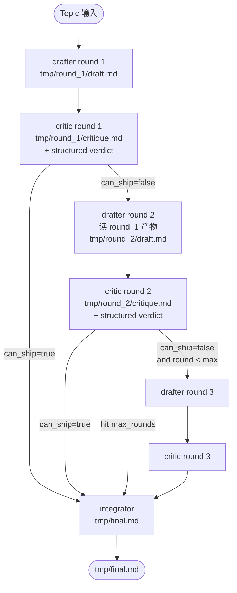

# 用 Claude Agent SDK 构建多 session 协作工作流

这篇文档独立成文, 目标是: 看完这一篇就能动手写出多 session 协作, 文件级通信, 多轮迭代的 Agent 工作流, 而不需要再去查任何其它资料. 适用场景是任务信息基本完整, 不需要人类频繁介入, 由若干 "角色" 协作把一件事推到最终交付的自动化流水线. 典型例子有: 多轮起草加批评再合并出最终稿, 从原始材料抽取结构化数据并交叉校验, 把一份长报告拆给多个专家视角再汇总. 不适用于交互密集, 需要随时确认或纠偏的场景, 那种场景应该用 `ClaudeSDKClient` 的 streaming input 模式加 `AskUserQuestion`, 这里不展开.

## 1. 适用场景与局限

多 session 多轮工作流的核心动机来自三个单 session 解决不了的问题.

第一, **上下文窗口压力**. 一个 session 越长, 系统 prompt, 工具定义, 对话历史, 工具输出都会累积在 context 里. 累到一定程度 SDK 会自动 compact, compact 会丢细节. 把工作拆成多个 session, 每个 session 只看自己需要的输入, context 始终保持轻量.

第二, **角色混合污染**. 一个 session 只有一个 system prompt. 想让 Claude 在同一个 session 里既当 "起草者" 又当 "批评者", 它的回答会被同时拉向两个方向. 拆成不同 session, 每个 session 独立 system prompt 或独立 skill, 角色就清晰了.

第三, **可观测和可回放**. 工作流的中间产物如果都落到文件里, 每一步都可以单独看, 单独重跑, 单独 diff. 全靠对话上下文串起来的话, 出问题只能重来.

代价也很明确. 每个 query 调用都 spawn 一个新的 `claude` subprocess, 启动开销不可忽略. system prompt 和工具定义在新 session 里不复用 prompt cache, 第一次请求会贵一点. 总的来说, 任务足够复杂, 拆 session 才划算. 一次性能搞定的小任务别为了形式拆.

---

## 2. 核心概念速通

在动手写工作流之前, 把 SDK 的几个核心概念用一段话说清楚, 后面就不再展开.

**`query()` 是一次性的执行单元**. 在 Python 里 `from claude_agent_sdk import query`, 调用 `query(prompt=..., options=...)` 会启动一个全新的 `claude` subprocess, 让 Claude 跑 agent loop (评估 prompt, 调工具, 收结果, 重复) 直到产出一个最终回答. `query()` 返回的是一个 async iterator, 一边跑一边 yield 消息.

**`ClaudeSDKClient` 是持久连接的执行单元**. 同样在一个 subprocess 里, 但允许同一 session 内反复发 turn, 适合需要 streaming input 或长会话的场景. 多 session 工作流通常用 `query()`, 每个 session 一次 `query()` 调用.

**消息流由几种类型组成**:

- `SystemMessage` (subtype `init` / `compact_boundary` / `informational` 等): session 生命周期事件, init 里有 session_id.
- `AssistantMessage`: 模型某一 turn 的输出, `.content` 是 block 列表, 包含 text block 和 tool_use block.
- `UserMessage`: 工具执行结果反喂给模型, 也包含调用方在 streaming 模式下塞进来的内容.
- `ResultMessage`: 整个 loop 结束, 包含 `.result` (最终文本), `.subtype` (`success` / `error_max_turns` / `error_max_budget_usd` 等), `.structured_output` (启用了 output_format 时), `.session_id`, cost 数据.

**消息是结构化对象**, 不是要靠正则解析的自由文本. 这是后面所有 "提取信息" 模式的基础.

**`ClaudeAgentOptions`** 是控制 session 行为的容器. 关键字段:

- `cwd`: 决定 "project" 这一层配置和工具的相对路径基准, 强烈推荐显式传, 不要靠进程 cwd.
- `system_prompt`: 替换或附加 system prompt. 取 `None` 表示用 SDK 默认; 取 dict `{"type": "preset", "preset": "claude_code", "append": "..."}` 表示在 Claude Code 默认 prompt 上追加; 取字符串表示完全自定义.
- `model`: 模型别名 (`"sonnet"`, `"opus"`, `"haiku"`, `"fable"`, `"opusplan"`, `"best"`) 或完整 ID (`"claude-sonnet-4-6"`, `"claude-opus-4-8"` 等). 不传走账户默认. 后面 Section 12 详谈.
- `effort`: `"low"` / `"medium"` / `"high"` / `"xhigh"` / `"max"`, 控制单步推理深度. 不传走当前模型默认.
- `allowed_tools`: 列在这里的工具自动批准, 不弹权限提示.
- `permission_mode`: `"default"` / `"acceptEdits"` / `"plan"` / `"bypassPermissions"`. 全自动场景常用 `"acceptEdits"`.
- `max_turns`, `max_budget_usd`: 防止失控的两道闸.
- `setting_sources`: list, 控制从哪些层级加载 `.claude/` 配置. 取 `["project"]` 表示只读项目级, 取 `[]` 表示一律不读, 不传默认 `["user", "project", "local"]`.
- `skills`: list 或 `"all"` 或 `[]`, 控制 session 里哪些 skill 可被 Claude 调用.
- `hooks`: 注册回调函数, 在 tool 调用前后等关键节点拦截.
- `output_format`: 启用 structured output, 让模型最终交一份符合 schema 的 JSON.
- `extra_args`: 透传给底层 CLI 的额外参数.

理解了这套, 后面的多 session 编排就只是组合这些组件了.

---

## 3. 通信媒介: 文件而不是对话上下文

多 session 协作的第一条原则: **session 之间通过文件交流, 不通过 prompt 字符串塞上下文**.

具体来说, 不要把上一个 session 的输出文本拼到下一个 session 的 prompt 里. 那样做会有四个问题. 一是 prompt 越拼越长, 第一次请求就要重新装载所有历史, 失去 prompt cache 的便宜. 二是 LLM 之间传话, 信息会失真和压缩. 三是无法在外部看到中间产物到底是什么. 四是无法单独重跑某一步.

正确做法是让上一个 session 把产物写进一个明确路径的文件, 下一个 session 拿到 prompt 时只携带文件路径, 由 Claude 用 `Read` 工具自己去读. 这样的好处:

- 中间产物全部落盘, 调试时直接看文件
- prompt 极简, 只是 "读 X 文件, 然后 Y", token 成本小
- 单独重跑某一步只需要 prompt 里指向同样的输入文件
- 后续 session 用 `Grep`, `Glob` 也能搜历史产物

文件命名建议沿用 round 的概念, 配合角色名:

```
tmp/
  round_1/
    draft.md
    critique.md
    critique_verdict.json
  round_2/
    draft.md
    critique.md
    critique_verdict.json
  final.md
```

这样从目录就能一眼看出工作流跑了几轮, 每轮谁产出什么. 用 Python 写时把这个布局封装成一个 `WorkflowContext` 类, 给出 helper 方法返回各个 artifact 路径, 避免在多个步骤里散落字符串拼接.

配合这个原则, prompt 里可以再加一句轻量的约束: 要求模型在聊天区只回一句话摘要, 完整内容全部写进文件. 例如 "在聊天中简短回复摘要即可, 详细内容写入 [路径]". 这样做倒不是为了强制 (模型本来就会把长内容写进 Write 工具调用), 而是减少最终 `AssistantMessage` 里堆砌大段正文的倾向, 日志和 transcript 都更干净, 编排层如果打印 `ResultMessage.result` 也不会被灌一屏文字.

---

## 4. session 隔离的四种粒度

需要分清四种 "隔离" 的层级, 各自代价和效果不同.

**完全隔离: 不同 query 调用**. 每次调用 `query()` 都开一个新的 `claude` subprocess, 新的 session_id, 全新的 context. 这是最强的隔离. 缺点是 spawn 进程的开销和首请求 cache miss 成本. 角色数量不固定, 或者每个角色只跑一两轮就收尾的多角色协作工作流主用这一档.

**进程内同 session 不同子任务: subagent**. 在一个 session 里通过 `Agent` tool 调用 subagent, subagent 跑在同一个 subprocess 内的独立子上下文里, 不看父对话历史, 但能加载自己的 `system_prompt`, `tools`, `CLAUDE.md`. 完成后只把 final answer 反喂给父 session, 不污染父 context. 优点是不用重复 spawn 进程, 适合扇出大量相似子任务. 缺点是 subagent 的可见性和 hook 行为不如 query 直接.

**最弱隔离: 同 session 多 turn**. 同一个 query 里跑很多 turn, 没有隔离, 完整对话历史一直在 context 里. 单角色长任务用这种, 多角色协作不用.

**折中: 每角色一个持久 session**. 角色数量固定且少 (通常两三个), 但每个角色要跑很多轮, 并且希望这个角色记得自己上一轮说过什么时, 给每个角色开一个持久的 `ClaudeSDKClient`, 让它在自己的 subprocess 里反复发 turn, 角色之间只通过文件通信. 这既不是反模式 B (一个 session 兼两个角色), 因为每个 client 自始至终只扮演一个角色; 也不是完全隔离, 因为同一个角色的多轮之间故意保留对话历史.

```python
async with ClaudeSDKClient(options=reviewer_options) as reviewer:
    async with ClaudeSDKClient(options=fixer_options) as fixer:
        for round_no in range(1, max_rounds + 1):
            await reviewer.query(review_prompt(round_no))
            async for _ in reviewer.receive_response():
                ...
            await fixer.query(fix_prompt(round_no))
            async for _ in fixer.receive_response():
                ...
```

好处是角色内部的 "记忆" 不需要靠文件回填, reviewer 天然记得自己上一轮提过什么意见, R2 之后的 prompt 可以写得很短, 不用重新触发 skill (`/role-name` 只在第一轮需要, 之后这个 client 已经"是"那个角色了); 成本上也划算, 因为同一 client 内的后续 turn 复用同一份 prompt cache, 不像每轮都开新 `query()` 那样每次都吃一次 cache miss (第 13 节详谈). 代价是两个 subprocess 要一直开着, 生命周期管理比"一次性 query"复杂, 出错时也要单独探查每个 client 的健康状态 (见第 14 节).

这个模式适合角色数量固定且少, 每个角色要跑数十轮, 角色内部的历史比角色间的历史更重要的场景. 如果角色是动态数量或者一次性的 (比如给 20 个文件分别做 review), 还是应该用完全隔离或者 subagent.

工作流的主线骨架通常是 "几个串起来的 query 调用", 角色固定且需要跨轮记忆时换成上面的持久 client 模式. 内部某个步骤需要并行扇出 (例如同一份草稿让三位不同视角的批评者各看一遍), 在那个步骤里再用 subagent.

Python 里启动 subagent 的方式是把 agent 定义写进 `agents` 字段:

```python
from claude_agent_sdk import ClaudeAgentOptions, AgentDefinition

options = ClaudeAgentOptions(
    allowed_tools=["Read", "Glob", "Grep", "Agent"],
    agents={
        "security-reviewer": AgentDefinition(
            description="Reviews code for security issues.",
            prompt="You are a security reviewer. Focus on injection, auth, secrets.",
            tools=["Read", "Glob", "Grep"],
        ),
    },
)
```

然后在 prompt 里说 "用 security-reviewer agent 看一下 src/auth/", Claude 会调用 `Agent` tool spawn 它. 子流程结束后, 主流程拿到的是子流程的最终文本, 期间的 turn 不进入主 context.

---

## 5. Skill: 把角色固化下来

多角色工作流里, "角色" 是反复使用的. 用 Skill 把角色固化, 比每次 query 重新写一段 system prompt 更可维护.

Skill 是文件系统里的产物, 路径 `.claude/skills/<name>/SKILL.md`. SKILL.md 有 YAML frontmatter 和 markdown 正文:

```markdown
---
name: drafter
description: 起草技术文章. 当输入是一个主题描述和目标文件路径时, 调用本 skill.
---

You are a technical writer ...

(具体角色指令)
```

`description` 字段决定了 Claude 什么时候自动调用这个 skill, 写得越具体, 触发越准.

启用 skill 的方式有三种, 容易混:

第一种, **不指定**. 不在 `ClaudeAgentOptions` 里传 `skills` 参数, 默认行为是 "所有发现的 skill 都可用", 由 Claude 看 description 自己决定是否触发. 配合自然语言 prompt 用.

第二种, **限定可见集合**. 传 `skills=["drafter", "critic"]`, 表示只暴露这两个 skill 给模型, 其它 skill 即使物理上存在也对模型不可见. 适合工作流里每一步只允许特定角色出场的情况.

第三种, **显式调用**. prompt 字符串以 `/drafter ...` 开头, 强制走 drafter 这个 skill, 不让模型自由选. 适合工作流编排里需要确定性的步骤.

工作流推荐的组合是: `setting_sources=["project"]` 限定只读项目级 skill, `skills=["expected-name"]` 收窄可见集合, prompt 用 `/expected-name ...` 显式调用. 三道保险都用上, 行为最可预测.

注意 `setting_sources=[]` 会彻底关掉 skill 加载, 这是常见踩坑.

---

## 6. round 的抽象

"round" 是工作流里一次完整的迭代, 通常包含若干个角色调用. 把 round 抽象成一个可参数化的概念, 是让代码不依赖具体步数的关键.

一个 round 需要描述四件事:

1. **轮次编号**: 决定产物落到哪个目录, 决定哪些前序产物可用.
2. **输入产物**: 上一轮 (或更早) 的哪些文件作为输入.
3. **步骤列表**: 这一轮里要按顺序跑哪些 session, 每个 session 走哪个角色, 写哪个产物.
4. **退出判定**: 这轮跑完之后, 是继续下一轮还是收敛进 final 步骤.

用 Python 表达就是把每一步封装成异步函数, round 调度器调它们, 通过 `WorkflowContext` 共享路径计算和历史记录. round 之间的传递只通过两样东西: `WorkflowContext.history` 字典里的文件路径, 以及由 `output_format` 拿回的结构化判定 (比如 critic 给出的 `can_ship`).

避免的反模式: 用全局变量在 round 之间传状态; round 内部用上一轮的 result 文本字符串拼到下一轮的 prompt 里; round 步骤之间不落盘只在内存里传 string.

---

## 7. 项目目录结构与文件命名

推荐如下结构, 后面的模板和示例都以此为基础:

```
my-workflow/
  workflow.py              # orchestrator, 主入口
  .claude/
    settings.json          # 可选, 例如限制 permissions
    skills/
      drafter/
        SKILL.md
      critic/
        SKILL.md
      integrator/
        SKILL.md
  tmp/                     # 中间产物和最终产物
    round_1/
      draft.md
      critique.md
      critique_verdict.json
    round_2/
      draft.md
      critique.md
      critique_verdict.json
    final.md
  CLAUDE.md                # 可选, 项目级 Claude 指令
```

几条不显眼但重要的约定:

- `tmp/` 加进 `.gitignore`. 中间产物是过程性的, 不进版本控制.
- `workflow.py` 永远用 `Path(__file__).resolve().parent` 推导 project root, 不依赖进程 cwd.
- skill 名字用 kebab-case, 一目了然描述角色 (`drafter`, `code-critic`, `release-notes-writer`).
- 每个 round 子目录里, 产物文件名固定, 跨 round 同名 (`draft.md` 在 `round_1` 和 `round_2` 里都叫 `draft.md`). 这让 helper 函数好写, 也让用户一眼看出 "这是同一种产物的不同 round 版本".

---

## 8. orchestrator 的最小可用模板

这一节给出一个可以直接复制粘贴, 改改参数就能跑起来的最小骨架. 后面的完整示例 (Section 15) 在此基础上扩展.

```python
import asyncio
from dataclasses import dataclass, field
from pathlib import Path
from typing import Any

from claude_agent_sdk import (
    AssistantMessage,
    ClaudeAgentOptions,
    ResultMessage,
    SystemMessage,
    query,
)


@dataclass
class WorkflowContext:
    """跨 round 共享路径计算, 历史记录, 全局配置."""

    project_root: Path
    max_rounds: int = 3
    history: dict[int, dict[str, Path]] = field(default_factory=dict)

    def round_dir(self, round_no: int) -> Path:
        d = self.project_root / "tmp" / f"round_{round_no}"
        d.mkdir(parents=True, exist_ok=True)
        return d

    def final_path(self, name: str = "final.md") -> Path:
        d = self.project_root / "tmp"
        d.mkdir(parents=True, exist_ok=True)
        return d / name

    def record(self, round_no: int, name: str, path: Path) -> None:
        self.history.setdefault(round_no, {})[name] = path


def base_options(
    ctx: WorkflowContext,
    *,
    model: str | None = None,
    effort: str | None = None,
    skills: list[str] | None = None,
    output_format: dict[str, Any] | None = None,
    max_turns: int = 20,
) -> ClaudeAgentOptions:
    """所有 session 共用的基础选项. cwd, setting_sources, permission_mode 在全局保持一致;
    model, effort, skills, output_format 由每个 step 按角色派生."""
    return ClaudeAgentOptions(
        cwd=str(ctx.project_root),
        permission_mode="acceptEdits",
        setting_sources=["project"],
        allowed_tools=["Read", "Write", "Edit", "Glob", "Grep", "Skill"],
        skills=skills,
        max_turns=max_turns,
        output_format=output_format,
        model=model,
        effort=effort,
    )


async def run_session(prompt: str, options: ClaudeAgentOptions) -> ResultMessage:
    """跑一个 session, 返回最终 ResultMessage. 中间消息可选地打日志."""
    last_result: ResultMessage | None = None
    async for message in query(prompt=prompt, options=options):
        if isinstance(message, SystemMessage) and message.subtype == "init":
            print(f"  [session start] session_id={message.data.get('session_id')}")
        if isinstance(message, AssistantMessage):
            for block in message.content:
                tool_name = getattr(block, "name", None)
                if tool_name in ("Write", "Edit", "MultiEdit"):
                    tool_input = getattr(block, "input", {}) or {}
                    file_path = tool_input.get("file_path", "?")
                    print(f"  [{tool_name}] {file_path}")
        if isinstance(message, ResultMessage):
            last_result = message
            print(f"  [session end] subtype={message.subtype} cost=${message.total_cost_usd}")

    if last_result is None:
        raise RuntimeError("session ended without ResultMessage")
    return last_result
```

骨架里几个值得说明的点:

`WorkflowContext` 不持有任何 SDK 对象, 只持有路径和历史记录. SDK 状态都在 subprocess 里, Python 主进程只管编排.

`base_options` 是工厂函数, 不是单例. 每个 session 用 `base_options(ctx, skills=[...])` 派生一份选项. 这样保证 `cwd`, `permission_mode`, `setting_sources` 这种 "全局一致" 的字段集中维护.

`run_session` 把消息流的核心信息打出来, 方便调试. 实际项目里可以扩展成写 JSONL 日志或者推 metrics.

---

## 9. 从 query 拿回关键信息的四条路径

session 跑完后, 编排代码需要知道发生了什么. 常用四条路径, 各自的适用场景不一样, 这里一次性讲清楚, 避免每次写工作流都重新思考.

第一条是 **`ResultMessage.result`**, 拿最终文本. session 的最后一条 `AssistantMessage` 通常就是模型给的 "结案陈述", `ResultMessage.result` 是它的副本, 同时还带 cost 和 session_id. 用 `subtype == "success"` 判断是否正常结束.

第二条是 **遍历消息流抓 `tool_use` block**. 想知道 Claude 在这个 session 里调用了哪些工具, 写了哪些文件, 不需要让模型 "总结自己干了啥", 直接看 `AssistantMessage.content` 里的 tool_use block 即可. 每个 tool_use 都带 `name` 和 `input`, 后者对于 `Write` / `Edit` / `MultiEdit` 来说必然有 `file_path` 字段. 这是事实记录, 不是模型回忆.

```python
files_touched: list[tuple[str, str]] = []

async for message in query(prompt=..., options=...):
    if isinstance(message, AssistantMessage):
        for block in message.content:
            tool_name = getattr(block, "name", None)
            if tool_name in ("Write", "Edit", "MultiEdit"):
                tool_input = getattr(block, "input", {}) or {}
                file_path = tool_input.get("file_path")
                if file_path:
                    files_touched.append((tool_name, file_path))
```

第三条是 **`PostToolUse` hook**. 想在每次工具调用结束后立刻做点什么 (写 audit log, 推 webhook, 触发同步任务), 注册 `PostToolUse` hook 并配 matcher. hook 跑在调用方进程里, 不占模型 context.

```python
from claude_agent_sdk import HookMatcher

writes: list[str] = []

async def on_write(input_data, tool_use_id, context):
    if input_data["hook_event_name"] != "PostToolUse":
        return {}
    if input_data["tool_name"] in ("Write", "Edit", "MultiEdit"):
        path = input_data["tool_input"].get("file_path")
        if path:
            writes.append(path)
    return {}

options = ClaudeAgentOptions(
    hooks={
        "PostToolUse": [HookMatcher(matcher="Write|Edit|MultiEdit", hooks=[on_write])],
    },
)
```

`PreToolUse` hook 还能直接拒绝某个工具调用, 在 hook 返回 `{"hookSpecificOutput": {"hookEventName": "PreToolUse", "permissionDecision": "deny", "permissionDecisionReason": "..."}}` 即可. 工作流里偶尔用它做硬约束 (例如禁止写到 `/etc`).

第四条是 **`output_format`**, 让模型最终交一份符合 schema 的 JSON. 配合 Pydantic 用最舒服. 适合需要语义判断的场景, 比如 critic 给 "can_ship" 的布尔判定. SDK 会自动校验 schema, 校验失败会重试若干次, 仍然失败时 `ResultMessage.subtype` 变成 `error_max_structured_output_retries`.

```python
from pydantic import BaseModel

class CriticVerdict(BaseModel):
    summary: str
    must_fix: list[str]
    can_ship: bool

options = ClaudeAgentOptions(
    output_format={
        "type": "json_schema",
        "schema": CriticVerdict.model_json_schema(),
    },
)

async for message in query(prompt=..., options=options):
    if isinstance(message, ResultMessage) and message.subtype == "success":
        verdict = CriticVerdict.model_validate(message.structured_output)
        print(verdict.can_ship, verdict.must_fix)
```

四条路径的搭配:

| 你要什么 | 用哪条 |
| :--- | :--- |
| session 的最终文本结论 | `ResultMessage.result` |
| 知道这个 session 写了哪些文件 | 遍历 tool_use 或 PostToolUse hook |
| 每次写文件后实时触发外部动作 | PostToolUse hook |
| 模型给一个有语义的结构化判断 | output_format + Pydantic |
| 能 undo 实验性改动 | `enable_file_checkpointing=True` 配合 `rewind_files()` |

工作流通常组合用. 比如本篇的示例里, drafter 用 `tool_use` 跟踪 + 文件断言来确认产物落地, critic 用 `output_format` 拿结构化 verdict 决定是否进入下一轮.

---

## 10. 自动化运行的必备开关

为了让工作流真的能无人值守跑起来, 有几个开关必须设对.

`permission_mode="acceptEdits"`. 默认模式下文件写入会弹权限确认, 在 SDK 自动化场景这就是死锁. `"acceptEdits"` 自动批准 `Write`, `Edit`, `MultiEdit` 以及常见的文件系统命令 (`mkdir`, `touch`, `mv`, `cp`). 其它 `Bash` 命令仍然受 allowlist 控制. 真要全开放, 用 `"bypassPermissions"`, 但仅限沙箱环境.

`allowed_tools=[...]`. 列出 session 允许使用的工具. 工作流通常给 `["Read", "Write", "Edit", "Glob", "Grep", "Skill"]`, 视需要加 `Bash` 或 `WebFetch`. 如果用了 subagent, 需要包含 `"Agent"`.

`max_turns=20` (举例数字). 兜底防止单 session 在一个糊涂思路里反复跳. 普通起草和点评 10 到 20 之间够用, 涉及多工具大跨度的步骤可以到 50. 命中限制时 `ResultMessage.subtype == "error_max_turns"`, 编排层捕获后选择重试或推进.

`max_budget_usd=...` (可选). 按花费兜底. 命中限制时 `ResultMessage.subtype == "error_max_budget_usd"`. 多轮工作流容易跑出大账单, 在 `WorkflowContext` 里维护一个全局预算, 每个 session 调用前算好剩余预算, 传进去.

`cwd=str(ctx.project_root)`. 始终显式传, 不依赖进程 cwd. 这条非常重要, 漏了会导致 skill 加载不上, `.claude/settings.json` 不生效等一连串怪问题.

**prompt 里传相对路径还是绝对路径**. `ctx.rel()` 式的相对路径省 token, 但前提是模型全程不会执行会改变相对路径基准的操作. 如果工作流给了 `Bash` 权限, 模型有可能在某个工具调用里 `cd` 到别的目录, 之后再解析相对路径就会错位; 如果还涉及多个不同 `cwd` 的 session 互相通过 prompt 传文件路径, 相对路径的"相对于谁"也容易搞混. 稳妥的判断标准是: 工具集里没有 `Bash`, 或者虽然有 `Bash` 但 prompt 里明确禁止 `cd`, 用相对路径省 token; 工具集里有 `Bash` 且流程本身会调用脚本, 切目录, 一律传绝对路径, 多花一点 token 换来的是不会出现"文件明明存在但 Read 说找不到"这种诡异故障.

**显式压制交互式工具**. 无人值守的工作流里, 如果 `AskUserQuestion` 或者其它需要人类实时确认的工具留在可用工具集里, 模型一旦调用就会挂起等待, 整个工作流卡死且不会报错. 稳妥做法有两层: 一是不把这类工具放进 `allowed_tools`; 二是即便工具在 allowlist 里 (比如它是某个 Agent 内建工具, 没法从 allowed_tools 精确摘除), 在 prompt 里显式写 "不要调用 AskUserQuestion, 任何不确定的细节自己拿主意", 把决策权收回给模型自己.

`setting_sources=["project"]`. 工作流通常只想读项目自带的 skill, 不想被开发者本地 `~/.claude/` 的配置干扰. 显式收窄到 project 最稳.

`skills=[...]`. 每一步明确列出需要的 skill 名字, 让模型不去找其它角色帮忙. 上一节讲过的 "三道保险" 用法.

把这一组写进 `base_options` 里, 后面的步骤只需要 override 其中几项, 不容易漏开关.

---

## 11. 错误处理与重试

`ResultMessage.subtype` 是分诊的第一指标. 工作流编排层针对每种 subtype 设计对应行为.

- `success`: 正常路径, 取产物继续.
- `error_max_turns`: 当前 session 思路打转, 通常用同样的 prompt 重试一次, 或者升级 `max_turns` 后重试; 多次失败则视作步骤失败.
- `error_max_budget_usd`: 直接停掉整个工作流, 不要继续烧钱.
- `error_max_structured_output_retries`: schema 太复杂或任务模糊, 简化 schema 后重试, 或者退回让模型先写自由文本再走第二个 session 提取结构化.
- `error_during_execution`: 通常是 API 故障或网络问题, 加退避重试.

除了 subtype, 工作流自己还要做 **产物级断言**. 每一步执行完应该 assert 期望文件确实存在并且非空:

```python
def assert_artifact(path: Path) -> None:
    if not path.exists():
        raise WorkflowError(f"expected artifact missing: {path}")
    if path.stat().st_size == 0:
        raise WorkflowError(f"artifact is empty: {path}")
```

如果断言失败, 通常表示 prompt 描述不够明确, 或者模型在不该结束的地方提前停了. 先看 transcript, 然后调 prompt.

**易中断操作之前先落检查点**. 如果一步里既要"写总结"又要"跑一个可能耗时几分钟甚至更久的验证" (跑 generator, 跑测试套件, 起一个耗时的 build), 在 prompt 里明确要求顺序: 先把这一步的总结/结论写到文件, 再去跑验证, 验证结果最后再追加回同一个文件. 这样即使验证过程中被打断 (Ctrl-C, 超时, OOM), 磁盘上已经有一份可用的总结, 下一轮不会因为找不到这一步的产物而直接失败或者从头重来. 反过来 "先验证再总结" 一旦验证跑到一半失败, 这一步就什么都没留下.

**重试策略** 建议指数退避 + 最大次数. 对于 `error_during_execution`, 退避 2s, 4s, 8s, 三次后放弃. 对于 `error_max_turns`, 升级 turn 数后重试一次. 对于产物断言失败, 同一 prompt 再跑一次, 还失败就报错给人.

工作流的整体可观测性可以靠把每个 session 的 `session_id`, `subtype`, `cost`, 关键文件路径写进一个 JSONL 日志:

```python
import json
from datetime import datetime, timezone

def log_step(ctx: WorkflowContext, name: str, result: ResultMessage, files: list[str]) -> None:
    log_path = ctx.project_root / "tmp" / "workflow.jsonl"
    record = {
        "timestamp": datetime.now(timezone.utc).isoformat(),
        "step": name,
        "session_id": result.session_id,
        "subtype": result.subtype,
        "cost_usd": result.total_cost_usd,
        "files": files,
    }
    with log_path.open("a") as f:
        f.write(json.dumps(record) + "\n")
```

跑完一遍翻一下这个文件就能复盘整个流程.

---

## 12. 选择模型和 effort

`ClaudeAgentOptions` 里有两个直接影响模型行为的旋钮: `model` 决定走哪个模型, `effort` 决定模型在每一步上分配多少推理预算. 它们对工作流的成本, 延迟, 质量影响最大, 必须有意识地配, 不要裸跑默认.

### 12.1 model 字段的取值

`model` 接受三种写法.

**模型别名**: 写起来短, 自动跟随官方推荐版本.

| 别名 | 含义 |
| :--- | :--- |
| `"opus"` | 最新 Opus, 强推理 |
| `"sonnet"` | 最新 Sonnet, 日常编程主力 |
| `"haiku"` | 最新 Haiku, 快和便宜 |
| `"fable"` | Claude Fable 5, 最强档, 长会话 |
| `"best"` | 优先 Fable 5, 没有就用最新 Opus |
| `"opusplan"` | Plan 模式用 Opus, 执行模式自动切到 Sonnet |
| `"default"` | 清空 override, 用账户类型推荐的模型 |
| `"sonnet[1m]"` / `"opus[1m]"` | 同上, 但启用 1M token 上下文窗口 |

**完整模型 ID**: 跨账户类型行为最一致, 适合生产钉死版本.

- `claude-opus-4-8`, `claude-opus-4-7`
- `claude-sonnet-4-6`, `claude-sonnet-4-5`
- `claude-haiku-4-5-20251001`
- `claude-fable-5`

**provider 专属 ID**: 跨云部署时用. Bedrock 走 inference profile ARN, Vertex 用版本名, Foundry 用 deployment name.

Python 写法:

```python
options = ClaudeAgentOptions(
    cwd=str(project_root),
    model="claude-sonnet-4-6",   # 或别名 "sonnet"
    # ...
)
```

不传 `model` 时 SDK 走账户默认: Anthropic API 上是 Opus 4.8, Pro / Team 订阅是 Sonnet 4.6, Bedrock / Vertex / Foundry 是 Sonnet 4.5.

### 12.2 怎么按角色选模型

多 session 工作流里不同角色对模型的需求差距很大. 经验起步配置:

| 角色性质 | 推荐 |
| :--- | :--- |
| 生成密集型: 起草, 摘要, 文本扩写 | Sonnet |
| 判断密集型: 评审, 决策, 找问题 | Opus |
| 合并整理型: 润色, 格式化, 合并 | Sonnet |
| 简单分类, 抽取, 路由 | Haiku |
| 跨多文件多步骤的根因调查 | Fable 5 或 `"best"` |
| 一次扫整个大代码库 | 模型后加 `[1m]` 后缀 |

按这套原则, 一个 drafter, critic, integrator 工作流的合理配置是: drafter Sonnet, critic Opus, integrator Sonnet. 把贵的 Opus 留给最需要判断深度的批评环节, 其它步骤用更便宜的 Sonnet.

这套 "按角色名分类" 只是起点, 真正要看的是这一步里**判断密度**有多高, 不是角色的名字. 一个表面上是 "fix" / "生成" 的角色, 如果它的工作是"拿到一堆修改意见, 自己判断哪些接受哪些拒绝, 拒绝的要给理由", 判断密度其实接近 critic, 不是纯生成, 该配 Opus 而不是机械地因为它叫 fixer 就配 Sonnet. 反过来一个叫 "critic" 的角色如果只是照着 checklist 打钩, 判断密度低, Sonnet 也够. 选模型时先问"这一步要不要对模糊情况做取舍", 再套用角色分类表.

如果整体任务都偏简单 (例如批量抽取结构化字段), 全部 Haiku 也合理. 反过来, 全程都是跨多文件大范围思考, 全部 Opus 或 Fable 5 也合理.

### 12.3 effort 控制单步推理深度

`effort` 控制 adaptive reasoning, 决定模型在单步上花多少 token 在 thinking 上. 当前层级:

| 层级 | 行为 |
| :--- | :--- |
| `"low"` | 最少推理, 路径明确的简单任务 |
| `"medium"` | 平衡, 常规编辑 |
| `"high"` | 深度推理. Sonnet 4.6, Opus 4.8, Fable 5 的默认 |
| `"xhigh"` | 更深一层. Opus 4.7 的默认 |
| `"max"` | 最大深度. 适合多步复杂问题, 只对当前 session 生效 |

不设 `effort` 就走当前模型的默认. 工作流里通常这样配:

- 起草, 整理: `"medium"` 或 `"high"`
- 评审, 决策: `"high"` 或 `"xhigh"`
- 简单抽取: `"low"`

Python 写法:

```python
options = ClaudeAgentOptions(
    model="opus",
    effort="xhigh",
    # ...
)
```

`effort` 设置高于模型支持的层级会自动降到该模型最高支持层. 例如对 Sonnet 4.6 设 `"xhigh"` 会被降为 `"high"`.

### 12.4 subagent 可以独立指定模型

工作流主线用 Sonnet, 但某一步内部 spawn 一个 subagent 做重度推理, 在 `AgentDefinition` 里单独指定:

```python
from claude_agent_sdk import AgentDefinition, ClaudeAgentOptions

options = ClaudeAgentOptions(
    model="sonnet",
    agents={
        "deep-reviewer": AgentDefinition(
            description="深度代码审查, 关注架构和安全",
            prompt="你是资深 reviewer ...",
            tools=["Read", "Glob", "Grep"],
            model="opus",     # 这段子流程独立用 Opus
            effort="xhigh",
        ),
    },
)
```

主流程的 Sonnet 调用 `Agent` tool spawn `deep-reviewer`, 子流程内部用 Opus 跑深度推理, 子流程结束后只把 summary 反喂给主流程, 主流程继续用 Sonnet. 既省 token 又保质量.

### 12.5 把模型选择封装进 base_options

把 `model` 和 `effort` 加进 Section 8 那个 `base_options` 工厂, 每一步派生时按角色传:

```python
def base_options(
    ctx: WorkflowContext,
    *,
    model: str | None = None,
    effort: str | None = None,
    skills: list[str] | None = None,
    output_format: dict[str, Any] | None = None,
    max_turns: int = 30,
) -> ClaudeAgentOptions:
    return ClaudeAgentOptions(
        cwd=str(ctx.project_root),
        permission_mode="acceptEdits",
        setting_sources=["project"],
        allowed_tools=["Read", "Write", "Edit", "Glob", "Grep", "Skill"],
        skills=skills,
        max_turns=max_turns,
        output_format=output_format,
        model=model,
        effort=effort,
    )
```

调用点:

```python
draft_opts = base_options(ctx, skills=["drafter"], model="sonnet", effort="medium")
critic_opts = base_options(
    ctx,
    skills=["critic"],
    model="opus",
    effort="xhigh",
    output_format={"type": "json_schema", "schema": CriticVerdict.model_json_schema()},
)
integrate_opts = base_options(ctx, skills=["integrator"], model="sonnet", effort="high")
```

这样模型选择和 prompt 编排彻底分离. 后期想做实验 (例如 critic 改 Sonnet 是否够用, 或 drafter 换 Haiku 看质量是否能接受), 只改 step 调用点的一行参数即可, 工作流主干代码不动.

---

## 13. 成本与性能取舍

每次 `query()` 调用对应一个独立的 subprocess 和一个独立的 prompt cache. 这带来三类成本:

**进程启动成本**. 每次 spawn `claude` subprocess 大约几十到几百毫秒. 单个工作流里跑 10 个 session, 进程启动可能就占了几秒. 不是大问题, 但批量并行时要心里有数.

**Prompt cache miss**. 每个新 session 的第一个请求会重新装载 system prompt, 工具定义, CLAUDE.md. 这部分 token 按 input 计费, 不享受 cache 折扣. CLAUDE.md 越长, 这一刀越深. 把项目通用约定放进 `~/.claude/CLAUDE.md` 比放在每个工作流根的 `CLAUDE.md` 节省 (前者是 user 级别, 仍然每次新 session 加载, 但内容更稳定容易维护).

**Skill 的 description 全部计入 context**. session 启动时所有 enable 的 skill description 都注入 system prompt. 收窄 `skills=[...]` 列表能直接降这部分成本.

什么时候用 subagent 而不是 `query()` 调用:

- 同一逻辑流里需要扇出大量并行子任务 (例如对 20 个文件分别做相似 review), 用 subagent 共享父 session 的 cache, 启动开销小.
- 子任务的 system prompt 和工具集相对接近父任务, subagent 顺势继承.
- 子任务的结果只需要一段总结性回报, 不需要保留 transcript.

什么时候用独立 `query()`:

- 角色之间 system prompt 差异很大, 想要完全独立的判断.
- 想要 session 级别的独立 transcript, 方便 debug 和回放.
- 想要每个 session 走独立的 hook 集合, 或者独立的 output_format.

什么时候用第 4 节的持久 client (每角色一个 `ClaudeSDKClient`): 角色数量固定且需要跨轮记忆, 同时想省 cache miss 的钱. 这种拓扑只在 client 建立时 spawn 一次 subprocess, 承担一次首请求 cache miss; 之后每一轮都是同一 session 内的新 turn, 完整复用 prompt cache. 跑 N 轮的总成本比 "每轮都开一个新 `query()`" 更低, 代价是 subprocess 要一直占着, 中途挂掉也不容易被发现, 需要配合第 14 节的探针技巧.

工作流主干推荐用独立 `query()` 串起来, 每一步独立可观测; 步骤内部需要并行扇出时, 在那一步里用 subagent; 角色固定且需要跨轮记忆时, 换成持久 client.

---

## 14. 调试套路

工作流跑炸了, 怎么排查? 几个套路按代价排序.

**先看 `tmp/` 目录**. 落盘的产物比任何日志都直接. 缺哪个文件, 哪一步出问题, 一目了然. 这就是为什么坚持文件级通信.

**看 workflow.jsonl 日志**. 每个 step 的 subtype, cost, 工具调用情况. 通常足以定位是哪一步, 什么类型的失败.

**看完整 transcript**. SDK 默认把每个 session 的 JSONL transcript 写到 `~/.claude/projects/<encoded_cwd>/<session_id>.jsonl`. 把出问题的 session_id 找出来, 直接 cat 这个 JSONL, 能看到每一个消息和工具调用的原始 payload.

**开启 file checkpointing**. 调试阶段在 base_options 里加 `enable_file_checkpointing=True`, 每次 user message 都生成一个 checkpoint UUID. 跑炸了之后可以 rewind 到任意中间点, 不用从头重跑.

**开启 partial messages**. 想看模型实时输出 (例如怀疑某一步 stuck 在某个 turn), 在 options 里加 `include_partial_messages=True`, 然后处理 `StreamEvent` 消息.

**临时缩 max_turns**. 怀疑某一步思路混乱, 把 `max_turns` 临时调到 3, 让它快速失败, 再看 transcript 里前 3 个 turn 模型在想什么, 一般就能定位问题在 prompt 还是在 skill 描述.

**用持久 client 时主动探查底层状态**. 如果工作流用的是第 4 节 "每角色一个持久 session" 那一档, 一个 session 挂了不会报错, 只会在下一次发 turn 时卡住不动. 在每个 turn 的发送前后打印 client 内部状态能第一时间暴露这个问题:

```python
def probe_client(client: ClaudeSDKClient, label: str) -> None:
    q = getattr(client, "_query", None)
    transport = getattr(client, "_transport", None)
    proc = getattr(transport, "_process", None) if transport else None
    print(
        f"[diag {label}] closed={getattr(q, '_closed', '?')} "
        f"returncode={proc.returncode if proc else '?'} "
        f"ready={getattr(transport, '_ready', '?')}"
    )
```

这几个属性 (`_query._closed`, `subprocess.returncode`, `transport._ready`) 是 SDK 私有实现细节, 版本升级可能改名或消失, 只在调试阶段临时加, 不要当成公开 API 依赖. 但对付"跑了两小时突然卡住不动"这种问题, 比干等超时有效得多.

---

## 15. 完整可运行示例: drafter, critic, integrator 三角工作流

下面给一个端到端可跑的例子. 任务是: 给定一个技术主题, 自动产出一篇技术博客. 三个角色:

- **drafter**: 起草一版.
- **critic**: 读草稿, 写一份点评, 同时给出 `can_ship` 的结构化判定.
- **integrator**: 在 critic 说 `can_ship=true` 或者达到 max_rounds 时, 把最近一版草稿 + 最近一版点评融合成最终稿.

工作流: drafter -> critic -> (continue or integrate) 循环.

### 15.1 项目布局

```
my-blog-workflow/
  workflow.py
  .claude/
    skills/
      drafter/SKILL.md
      critic/SKILL.md
      integrator/SKILL.md
  tmp/                  # 自动生成
```

### 15.2 三个 SKILL.md

`.claude/skills/drafter/SKILL.md`:

```markdown
---
name: drafter
description: Drafts a Chinese technical blog post given a topic and a target file path. Triggered when the user prompt starts with /drafter or asks to produce a draft.
---

You are a senior technical writer. Your job is to produce a polished draft of a technical blog post.

Rules:

1. Write in Chinese narrative with English technical terms (subprocess, agent loop, stdio, MCP, etc.). Use ASCII punctuation only (`,` `.` `:` `;` `(` `)`), no full-width punctuation.
2. Open with a one-paragraph framing of the topic and the audience.
3. Use H2 sections numbered `## 1. xxx`, `## 2. xxx`, with `---` between them.
4. For diagrams, use mermaid fenced blocks. Do not use ASCII art.
5. For code, use fenced blocks tagged with a language (```python, ```bash, etc.).
6. Don't include placeholder text. Write complete content.

You will be told the topic, the round number, the output file path, and optionally a previous draft and a critique to address. If those are provided, read them with the Read tool and address every concrete suggestion in the critique.

When you are done, write your full draft to the specified path with the Write tool. Do not include any commentary outside the file.
```

`.claude/skills/critic/SKILL.md`:

```markdown
---
name: critic
description: Critiques a Chinese technical blog draft. Triggered when the user prompt starts with /critic or asks to review a draft.
---

You are a senior technical reviewer. You will be given the path to a draft and the path where your critique should be written. You will also be asked to return a structured verdict matching this shape:

```
{
  "summary": "one-paragraph overall verdict",
  "must_fix": ["specific issue 1", "specific issue 2", ...],
  "can_ship": true | false
}
```

Process:

1. Read the draft with the Read tool.
2. Identify problems in these dimensions: accuracy of claims, clarity of reasoning, completeness vs the implicit promise of the title, structure and flow, tone consistency, citations and quotes.
3. Write your full critique to the specified path. Use sections: Overall, Accuracy, Clarity, Structure, Specific suggestions. In Specific suggestions, quote the offending phrase and propose a concrete rewrite.
4. After writing, return the structured verdict. Set `can_ship = true` only if `must_fix` is empty or contains only minor stylistic nits.

Be specific. Vague feedback like "improve clarity" is not useful. Quote phrases and propose concrete rewrites.
```

`.claude/skills/integrator/SKILL.md`:

```markdown
---
name: integrator
description: Merges a draft and a critique into a final polished version. Triggered when the user prompt starts with /integrator.
---

You are the integration step. You will be given the path to the latest draft, the path to the latest critique, and the path where the final version should be written.

Process:

1. Read both the draft and the critique with the Read tool.
2. Produce the final version that addresses every concrete suggestion in the critique while preserving the draft's authorial voice, structure, and tone.
3. Do not introduce material that is not present in either the draft or the critique. If the critique asks for something the draft cannot back up, drop that section rather than fabricate.
4. Write the final result to the specified path with the Write tool. No commentary outside the file.
```

### 15.3 workflow.py

```python
"""Multi-session blog workflow.

Roles:
- drafter: write a draft
- critic: review a draft, return verdict
- integrator: merge final

Each role runs in its own query() session. Sessions communicate via files in tmp/.
"""
import asyncio
import json
from dataclasses import dataclass, field
from datetime import datetime, timezone
from pathlib import Path
from typing import Any

from pydantic import BaseModel
from claude_agent_sdk import (
    AssistantMessage,
    ClaudeAgentOptions,
    ResultMessage,
    SystemMessage,
    query,
)


# ---------- Schemas ----------

class CriticVerdict(BaseModel):
    summary: str
    must_fix: list[str]
    can_ship: bool


# ---------- Workflow context ----------

@dataclass
class WorkflowContext:
    project_root: Path
    topic: str
    max_rounds: int = 3
    history: dict[int, dict[str, Path]] = field(default_factory=dict)
    total_cost_usd: float = 0.0

    def round_dir(self, round_no: int) -> Path:
        d = self.project_root / "tmp" / f"round_{round_no}"
        d.mkdir(parents=True, exist_ok=True)
        return d

    def final_path(self) -> Path:
        d = self.project_root / "tmp"
        d.mkdir(parents=True, exist_ok=True)
        return d / "final.md"

    def rel(self, path: Path) -> str:
        return str(path.relative_to(self.project_root))


class WorkflowError(RuntimeError):
    pass


# ---------- Logging ----------

def log_step(ctx: WorkflowContext, name: str, result: ResultMessage, files: list[Path]) -> None:
    log_path = ctx.project_root / "tmp" / "workflow.jsonl"
    log_path.parent.mkdir(parents=True, exist_ok=True)
    record = {
        "timestamp": datetime.now(timezone.utc).isoformat(),
        "step": name,
        "session_id": result.session_id,
        "subtype": result.subtype,
        "cost_usd": result.total_cost_usd,
        "files": [ctx.rel(p) for p in files],
    }
    with log_path.open("a") as f:
        f.write(json.dumps(record, ensure_ascii=False) + "\n")


# ---------- Session helpers ----------

def base_options(
    ctx: WorkflowContext,
    *,
    model: str | None = None,
    effort: str | None = None,
    skills: list[str] | None = None,
    output_format: dict[str, Any] | None = None,
    max_turns: int = 30,
) -> ClaudeAgentOptions:
    return ClaudeAgentOptions(
        cwd=str(ctx.project_root),
        permission_mode="acceptEdits",
        setting_sources=["project"],
        allowed_tools=["Read", "Write", "Edit", "Glob", "Grep", "Skill"],
        skills=skills,
        max_turns=max_turns,
        output_format=output_format,
        model=model,
        effort=effort,
    )


async def run_session(name: str, prompt: str, options: ClaudeAgentOptions) -> tuple[ResultMessage, list[Path]]:
    """Run one session. Return the ResultMessage and the list of files Write/Edit touched."""
    last: ResultMessage | None = None
    files: list[Path] = []

    print(f"\n=== {name} ===")
    async for message in query(prompt=prompt, options=options):
        if isinstance(message, SystemMessage) and message.subtype == "init":
            session_id = message.data.get("session_id")
            print(f"  session_id={session_id}")
        if isinstance(message, AssistantMessage):
            for block in message.content:
                tool_name = getattr(block, "name", None)
                if tool_name in ("Write", "Edit", "MultiEdit"):
                    tool_input = getattr(block, "input", {}) or {}
                    file_path = tool_input.get("file_path")
                    if file_path:
                        print(f"  [{tool_name}] {file_path}")
                        files.append(Path(file_path))
        if isinstance(message, ResultMessage):
            last = message
            print(f"  subtype={message.subtype} cost=${message.total_cost_usd:.4f}")

    if last is None:
        raise WorkflowError(f"{name}: session ended without ResultMessage")
    return last, files


def assert_artifact(path: Path) -> None:
    if not path.exists():
        raise WorkflowError(f"expected artifact missing: {path}")
    if path.stat().st_size == 0:
        raise WorkflowError(f"artifact is empty: {path}")


# ---------- Steps ----------

async def step_draft(ctx: WorkflowContext, round_no: int) -> Path:
    out = ctx.round_dir(round_no) / "draft.md"

    if round_no == 1:
        prompt = f"""/drafter

Topic: {ctx.topic}
Round: 1

Write the first draft to: {ctx.rel(out)}
"""
    else:
        prev = ctx.history[round_no - 1]
        prompt = f"""/drafter

Topic: {ctx.topic}
Round: {round_no}

Previous draft: {ctx.rel(prev['draft'])}
Critique to address: {ctx.rel(prev['critique'])}

Read both files. Address every concrete suggestion in the critique. Write the revised draft to:
{ctx.rel(out)}
"""

    options = base_options(
        ctx,
        skills=["drafter"],
        model="sonnet",
        effort="medium",
        max_turns=20,
    )
    result, _ = await run_session(f"drafter (round {round_no})", prompt, options)
    log_step(ctx, f"drafter:round_{round_no}", result, [out])

    if result.subtype != "success":
        raise WorkflowError(f"drafter failed: {result.subtype}")
    assert_artifact(out)
    return out


async def step_critique(ctx: WorkflowContext, round_no: int, draft_path: Path) -> tuple[Path, CriticVerdict]:
    out_md = ctx.round_dir(round_no) / "critique.md"
    out_json = ctx.round_dir(round_no) / "critique_verdict.json"

    prompt = f"""/critic

Draft to review: {ctx.rel(draft_path)}
Write your full critique to: {ctx.rel(out_md)}

After writing the critique file, return the structured verdict.
"""

    options = base_options(
        ctx,
        skills=["critic"],
        model="opus",
        effort="xhigh",
        max_turns=15,
        output_format={
            "type": "json_schema",
            "schema": CriticVerdict.model_json_schema(),
        },
    )
    result, _ = await run_session(f"critic (round {round_no})", prompt, options)
    log_step(ctx, f"critic:round_{round_no}", result, [out_md])

    if result.subtype != "success":
        raise WorkflowError(f"critic failed: {result.subtype}")
    if not result.structured_output:
        raise WorkflowError("critic returned no structured_output")
    assert_artifact(out_md)

    verdict = CriticVerdict.model_validate(result.structured_output)

    # Persist verdict alongside the critique for inspection
    out_json.write_text(json.dumps(result.structured_output, ensure_ascii=False, indent=2))

    return out_md, verdict


async def step_integrate(ctx: WorkflowContext, draft_path: Path, critique_path: Path) -> Path:
    out = ctx.final_path()

    prompt = f"""/integrator

Latest draft: {ctx.rel(draft_path)}
Latest critique: {ctx.rel(critique_path)}

Produce the final polished version at: {ctx.rel(out)}
"""

    options = base_options(
        ctx,
        skills=["integrator"],
        model="sonnet",
        effort="high",
        max_turns=15,
    )
    result, _ = await run_session("integrator", prompt, options)
    log_step(ctx, "integrator", result, [out])

    if result.subtype != "success":
        raise WorkflowError(f"integrator failed: {result.subtype}")
    assert_artifact(out)
    return out


# ---------- Orchestrator ----------

async def run_workflow(topic: str, project_root: Path, max_rounds: int = 3) -> Path:
    ctx = WorkflowContext(project_root=project_root, topic=topic, max_rounds=max_rounds)

    for round_no in range(1, ctx.max_rounds + 1):
        draft = await step_draft(ctx, round_no)
        critique, verdict = await step_critique(ctx, round_no, draft)
        ctx.history[round_no] = {"draft": draft, "critique": critique}

        print(f"\n--- Round {round_no} verdict ---")
        print(f"  can_ship: {verdict.can_ship}")
        print(f"  must_fix: {len(verdict.must_fix)} items")
        for item in verdict.must_fix[:3]:
            print(f"    - {item}")

        if verdict.can_ship:
            print("  critic approved, integrating")
            return await step_integrate(ctx, draft, critique)

    # Hit max rounds without approval, integrate the last available pair
    print(f"\nHit max_rounds={ctx.max_rounds} without ship approval, integrating last pair")
    last = ctx.history[ctx.max_rounds]
    return await step_integrate(ctx, last["draft"], last["critique"])


# ---------- Entry point ----------

if __name__ == "__main__":
    project = Path(__file__).resolve().parent
    topic = "为什么 Claude Agent SDK 选择 subprocess 架构而不是把 agent loop 重写进 Python"
    final = asyncio.run(run_workflow(topic=topic, project_root=project, max_rounds=3))
    print(f"\nFinal: {final}")
```

### 15.4 跑起来时发生了什么

启动后, orchestrator 进入 round 1:

1. **drafter (round 1)** session 启动. system prompt 是 SDK 默认的 Claude Code preset, 但 `/drafter` 在 prompt 里强制走 drafter skill. Claude 读 SKILL.md 全文, 按指令写一份草稿到 `tmp/round_1/draft.md`. session 结束.
2. **critic (round 1)** session 启动. `/critic` 触发 critic skill. Claude Read `tmp/round_1/draft.md`, 思考, 用 Write 工具产出 `tmp/round_1/critique.md`. 然后按 `output_format` 要求, 最终回答必须是 schema 化的 JSON, SDK 校验通过后写入 `ResultMessage.structured_output`.
3. orchestrator 检查 `verdict.can_ship`. 假设是 False, 进入 round 2.
4. **drafter (round 2)** session 启动. prompt 里这次指向 `tmp/round_1/draft.md` 和 `tmp/round_1/critique.md`, drafter Read 两份文件, 按 critique 改稿, Write 到 `tmp/round_2/draft.md`.
5. 重复 critic 步骤, 写出 `tmp/round_2/critique.md` 和 verdict.
6. 假设 round 2 的 `can_ship=true`, orchestrator 进入 **integrator** session, 读 `tmp/round_2/draft.md` 和 `tmp/round_2/critique.md`, 写出 `tmp/final.md`.

每一步的 session_id, subtype, cost, files 都进 `tmp/workflow.jsonl`. 出问题翻这个文件加翻 `tmp/round_*/` 里的产物足以定位.

### 15.5 流程示意



---

## 16. 反模式速查

下面列举几个工作流里反复出现的反模式, 配上为什么不对.

**反模式 A: 把上一步的产物文本拼到下一步的 prompt 里**.
反例: `prompt = f"上一版草稿是: {draft_text}\n请改进它"`.
问题: token 浪费, 信息会失真, prompt 越来越长. 改成传文件路径让模型自己 Read.

**反模式 B: 一个 session 兼任多角色**.
反例: 在同一个 `query()` 里既让 Claude 起草又让它批评自己.
问题: 模型 system prompt 一份, 角色定位混乱, 批评会软化. 拆 session.

**反模式 C: 用 `setting_sources=[]` 然后想用 skill**.
反例: 想做隔离, 把 setting_sources 关到空, 又传 `skills=["drafter"]`.
问题: skill 是通过 setting_sources 的 `user` 或 `project` 加载的, 关空了之后 drafter 根本不存在. 多租户隔离请单独读多租户文档.

**反模式 D: 不显式传 cwd**.
反例: 依赖进程 cwd, 通过 `python -m` 或者 entry point 启动.
问题: 进程 cwd 不可控, 找不到 skill 找不到 settings. 永远 `cwd=str(Path(__file__).resolve().parent)`.

**反模式 E: 不设 max_turns 和 max_budget_usd**.
反例: "我相信模型, 让它自由发挥".
问题: 模型偶尔会陷入死循环, 一晚上烧几十美元. 永远兜底.

**反模式 F: 试图用 prompt 字符串描述 schema 而不是用 output_format**.
反例: `prompt = "请返回 JSON, 格式是 {summary: str, files: list[str]}"`.
问题: 没有校验, 模型可能返回 markdown 包裹的 JSON, 可能漏字段, 可能拼写错. 用 `output_format` + Pydantic, SDK 帮你校验和重试.

**反模式 G: 把工作流状态放全局变量**.
反例: 用 module-level list / dict 跨 step 传产物路径.
问题: 单元测试和并发跑不友好. 把状态收进 `WorkflowContext`.

**反模式 H: 中间产物不落盘只在内存**.
反例: drafter session 返回字符串, orchestrator 把字符串塞给 critic.
问题: 失去断点重跑能力, 失去调试可视性. 每步都落文件, 用文件名传递.

**反模式 I: skill description 写得太笼统**.
反例: `description: writes documents.`
问题: model-invoked 触发不准, 而且占 context. 写具体: "Drafts a Chinese technical blog post given a topic and a target file path. Triggered when the user prompt starts with /drafter."

**反模式 J: 用 ASCII art 画流程图**.
反例: 在 markdown 里用 `+----+ | | +----+` 画框.
问题: 不同字体宽度下排版会塌, 渲染到非等宽场景下惨不忍睹. 用 mermaid.

---

## 17. 进一步阅读

这篇文档已经覆盖了实操所需的全部要点, 下面的资料仅在想深挖时再翻.

- 工作流主干用 `query()`, 想用 streaming input 或 channels 接外部事件时再看 SDK 的 `ClaudeSDKClient` 和 channel 相关文档.
- subagent 在 SDK 里的完整 API (例如 `AgentDefinition` 字段, 父子 hook 传播规则) 在 subagent 专题文档里.
- 多租户场景的硬隔离 (env 隔离, 配置目录隔离, 网络出口策略) 在 hosting 专题文档里. 本指南的 single-tenant 自动化流水线不涉及.
- 想把 workflow 部署到生产, 关心进程模型, 持久化, observability 时再翻 hosting 文档. 单机跑用不到.

到这里就够了. 拿这篇 + 一个 Python 解释器 + 一个 Anthropic API key, 任意复杂度的多 session 协作工作流都能写出来.
